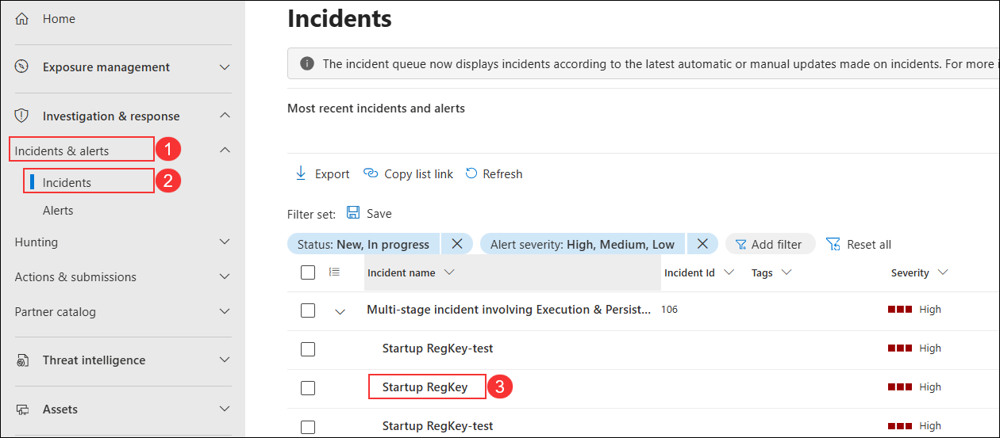
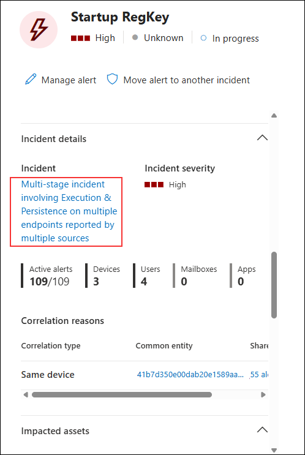
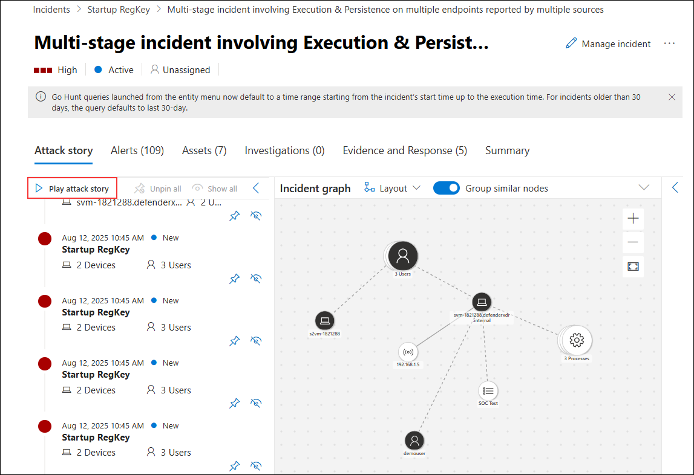
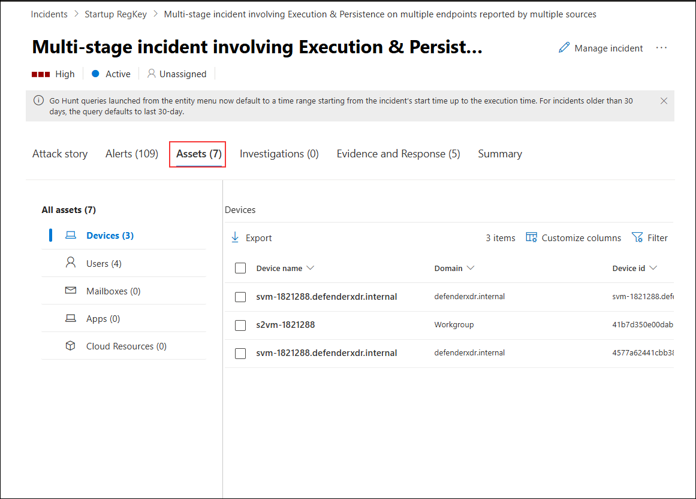
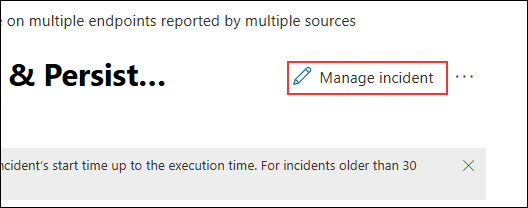

# Task 6: Investigate an incident

## Overview

In this lab, you will investigate a security incident in the Microsoft Defender portal. You will review incident details, explore the attack story, analyze associated assets and evidence, and update incident properties to reflect your findings. This process will help you understand the sequence of events, impacted resources, and appropriate response actions.

> **⚠ Important Usage Guidance:** Microsoft Defender for Office 365 may take some time to load certain results or complete specific labs from the backend. This is expected behavior. If the data does not appear after a couple of refresh attempts, proceed with the next lab and return later to check the results.

1. On the **Microsoft Defender portal**, under **Investigation & response**, select **Incidents & alerts (1)**, then select **Incidents (2)**, and from the list click the incident named **Startup RegKey (3)** to open its details.

   

1. Under the **Incident details** section, select the linked incident name **Multi-stage incident involving Execution & Persistence on multiple endpoints reported by multiple sources (1)** to view full incident details.

   

    >**Note:** The Analytics rules are generating alerts and incidents on the same specific log entry. Remember that this was done in the *Query scheduling* configuration to generate more alerts and incidents to be utilized in the lab.
  
1. On the incident details page, under the **Attack story** tab, select **Play attack story (1)** to visualize the sequence of events in the incident graph.

   

1. On the incident details page, select the **Assets (1)** tab to view all associated assets, including devices, users, and other resources involved in the incident.

   

1. On the incident details page, select the **Evidence and Response (1)** tab to view all related evidence, including processes, IP addresses, and registry values identified during the investigation.

   

1. On the incident details page, click **Manage incident (1)** to modify the incident’s properties or take remediation actions.

   

1. In the **Manage incident** pane, update the incident details as follows:  
    - Set **Severity (1)** to **High**.  
    - In **Incident tags (2)**, enter `RegKey`.  
    - In **Assign to (3)**, select your account.  
    - Set **Status (4)** to **Resolved**.  
    - Set **Classification (5)** to **True positive - Multi staged attack**.  
    - Click **Save (6)**.

        

## Review

In this lab, you have completed the following:

- Reviewed the incident attack story to understand the event sequence.
- Analyzed related assets, evidence, and response actions.
- Updated incident severity, tags, assignment, status, and classification.

## You have successfully completed the lab. Click on Next to Continue

  
