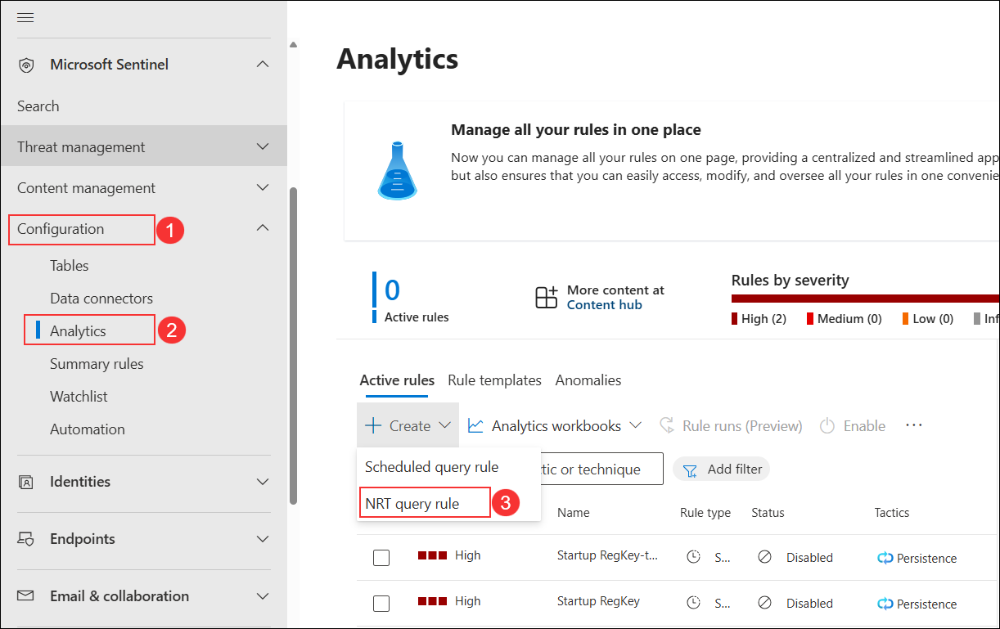
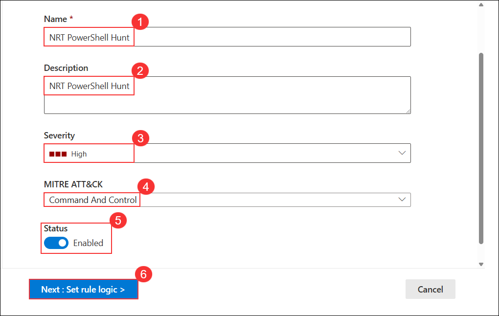
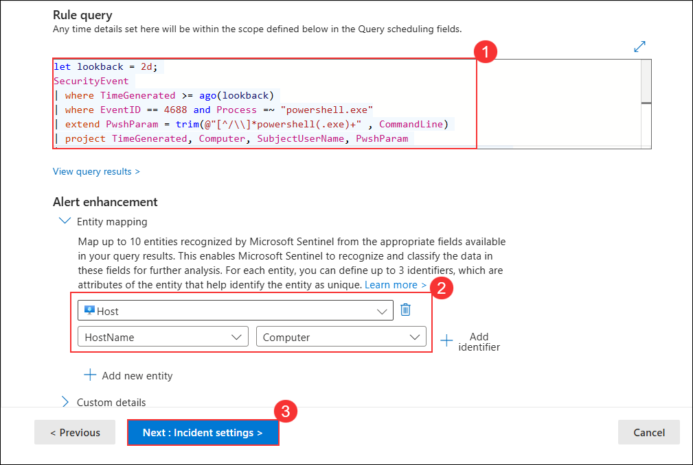
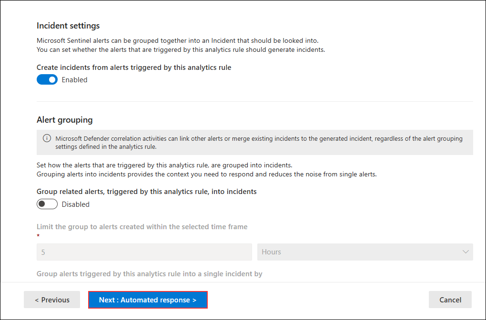
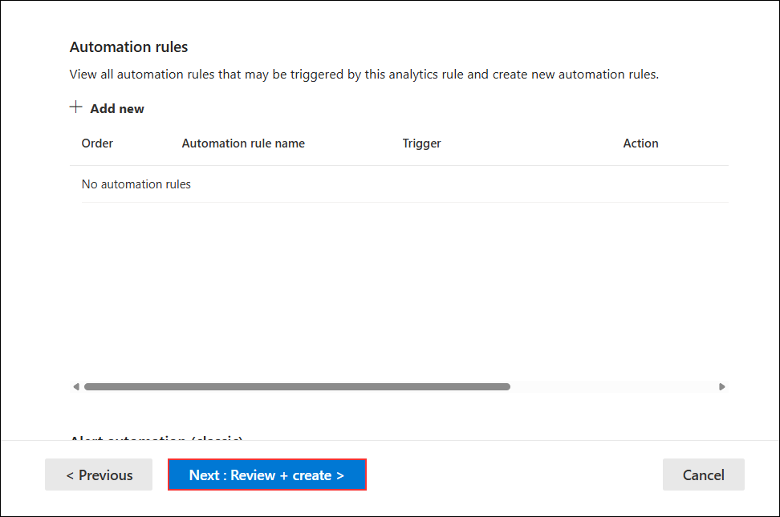
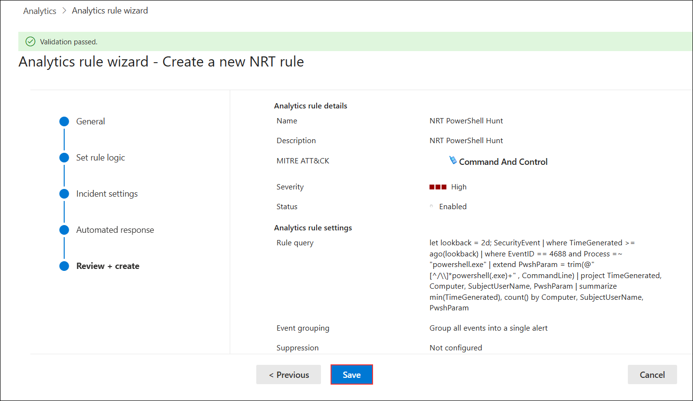

# Task 2: Create a NRT query rule

## Overview

In this lab, you will create a Near Real-Time (NRT) analytics query rule in Microsoft Sentinel to detect suspicious PowerShell activity. NRT rules run every minute and look back one minute, enabling near real-time detection and automated incident creation. You will configure the rule’s logic, map entities, and enable incident creation for faster threat response.

> **⚠ Important Usage Guidance:** Microsoft Defender for Office 365 may take some time to load certain results or complete specific labs from the backend. This is expected behavior. If the data does not appear after a couple of refresh attempts, proceed with the next lab and return later to check the results.

1. In **Microsoft Sentinel**, under **Configuration (1)** select **Analytics (2)**, then click **+ Create** and choose **NRT query rule (3)**.

   

1. On the **General** tab:  
    - Enter **NRT PowerShell Hunt (1)** in the **Name** field.  
    - Enter **NRT PowerShell Hunt (2)** in the **Description** field.  
    - Set **Severity** to **High (3)**.  
    - Set **MITRE ATT&CK** to **Command And Control (4)**.  
    - Ensure **Status** is set to **Enabled (5)**.  
    - Click **Next: Set rule logic > (6)**. 

    

1. For the *Rule query* enter the following KQL statement:

    ```KQL
    let lookback = 2d; 
    SecurityEvent 
    | where TimeGenerated >= ago(lookback) 
    | where EventID == 4688 and Process =~ "powershell.exe"
    | extend PwshParam = trim(@"[^/\\]*powershell(.exe)+" , CommandLine) 
    | project TimeGenerated, Computer, SubjectUserName, PwshParam 
    | summarize min(TimeGenerated), count() by Computer, SubjectUserName, PwshParam
    ```

1. Under Entity mapping select:
     
    - Select **+ Add new entity** under Entity mapping.
    - For the Entity type drop-down list select **Host**.
    - For the Identifier drop-down list select **HostName**.
    - For the Value drop-down list select **Computer**.

   

1. On the **Incident settings** page, keep incident creation **Enabled**, leave alert grouping **Disabled**, and click **Next: Automated response >**.

   

1. Click **Next: Review + create >**.  

   

1. On the Review and Create tab, select the **Save** button to create and save the new Scheduled Analytics rule.

   

## Review

In this lab, you:
- Created an NRT analytics query rule in Microsoft Sentinel.
- Configured the rule’s name, severity, MITRE ATT&CK mapping, and status.
- Added a KQL query to detect suspicious PowerShell executions.
- Mapped host entity information for improved investigation context.
- Enabled incident creation for automated detection and response.

## You have successfully completed the lab. Click on Next to Continue
