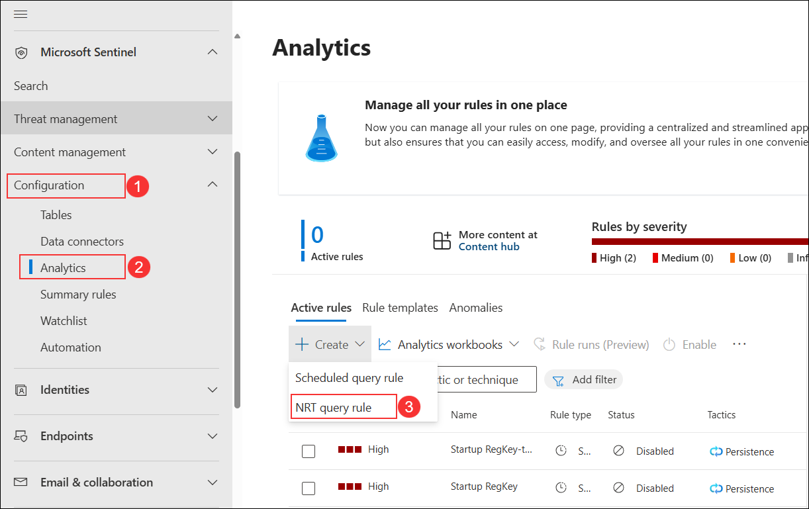
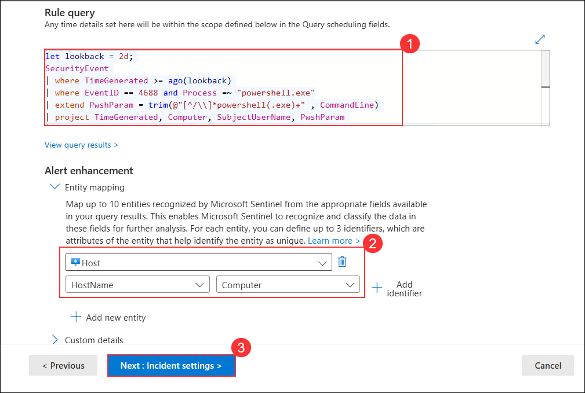
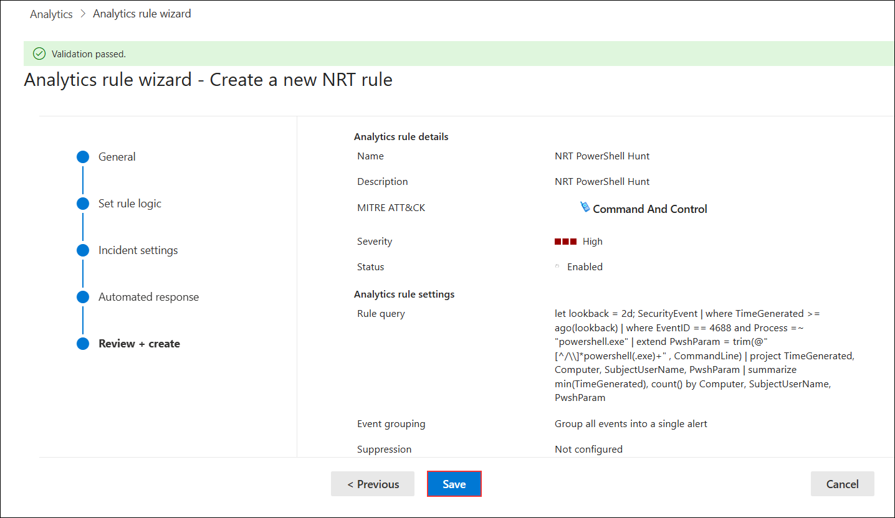

# Task 2: Create a NRT query rule

In this task, instead of using a LiveStream, you will create a NRT analytics query rule. NRT rules run every minute and look back one minute. The benefit of NRT rules is they can use the alert and incident creation logic.

1. In **Microsoft Sentinel**, under **Configuration (1)** select **Analytics (2)**, then click **+ Create** and choose **NRT query rule (3)**.

   

1. On the **General** tab:  
    - Enter **NRT PowerShell Hunt (1)** in the **Name** field.  
    - Enter **NRT PowerShell Hunt (2)** in the **Description** field.  
    - Set **Severity** to **High (3)**.  
    - Set **MITRE ATT&CK** to **Command And Control (4)**.  
    - Ensure **Status** is set to **Enabled (5)**.  
    - Click **Next: Set rule logic > (6)**. 

    

1. For the *Rule query* enter the following KQL statement:

    ```KQL
    let lookback = 2d; 
    SecurityEvent 
    | where TimeGenerated >= ago(lookback) 
    | where EventID == 4688 and Process =~ "powershell.exe"
    | extend PwshParam = trim(@"[^/\\]*powershell(.exe)+" , CommandLine) 
    | project TimeGenerated, Computer, SubjectUserName, PwshParam 
    | summarize min(TimeGenerated), count() by Computer, SubjectUserName, PwshParam
    ```

1. Under Entity mapping select:
     
    - Select **+ Add new entity** under Entity mapping.
    - For the Entity type drop-down list select **Host**.
    - For the Identifier drop-down list select **HostName**.
    - For the Value drop-down list select **Computer**.

   

1. On the **Incident settings** page, keep incident creation **Enabled**, leave alert grouping **Disabled**, and click **Next: Automated response >**.

   

1. Click **Next: Review + create >**.  

   

1. On the Review and Create tab, select the **Save** button to create and save the new Scheduled Analytics rule.

   
