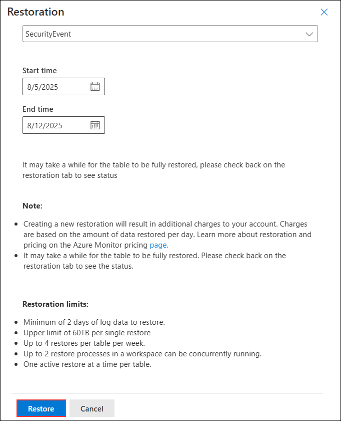

# Task 3: Create a Search job

## Overview

In this lab, you will use Microsoft Defender’s Search job capability to look for Command and Control (C2) activity. You will run a search query, create a search job for a specified time range, review the results, and explore the restoration process for retrieving historical data.

> **⚠ Important Usage Guidance:** Microsoft Defender for Office 365 may take some time to load certain results or complete specific labs from the backend. This is expected behavior. If the data does not appear after a couple of refresh attempts, proceed with the next lab and return later to check the results.

1. In Microsoft Defender Portal, on the **Search** page, select **Search (1)** from the left menu, enter **reg.exe (2)** in the search box, and click **Start**.

   

1. In the **Logs** window, click the ellipsis icon **(1)** at the top right and select **Search job (2)**.

   

1. On the **Run a search job** window, select **Last 24 Hours (1)**, enter **Newtable (2)** as the name, and click **Run search job (3)**.

   

1. The query results display in the **Logs** window showing the retrieved event details.

   

1. Close the *Logs* window by selecting the **X** in the top-right of the window and select **OK** to discard the changes. 

1. On the **Newtable_SRCH** panel, click **Restore** to investigate the retrieved data.

   
 
1. On the **Restoration** window, review the settings and click **Restore** to begin the process.

   

1. Review the options available and then select the **Cancel** button.

    >**Note:** If you were running the job, the restore would run for a couple of minutes and your data would be available in a new table.

## Review

In this lab, you:

- Ran a search in Microsoft Defender for specific process activity.
- Created a search job for the last 24 hours to retrieve C2-related data.
- Viewed and reviewed event details from the search job results.
- Explored the restoration process for historical data retrieval.

## You have successfully completed the lab. Click on Next to Continue
