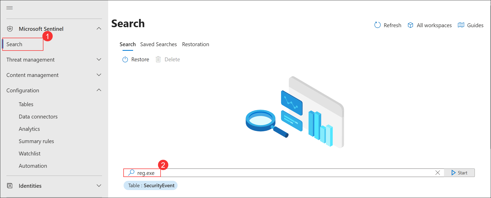
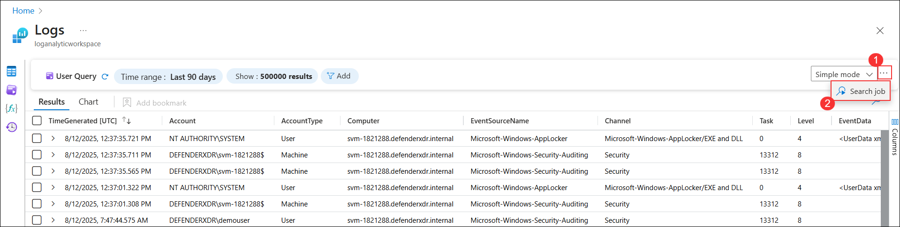
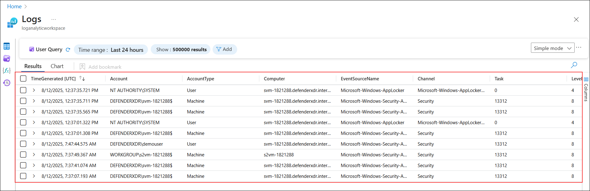
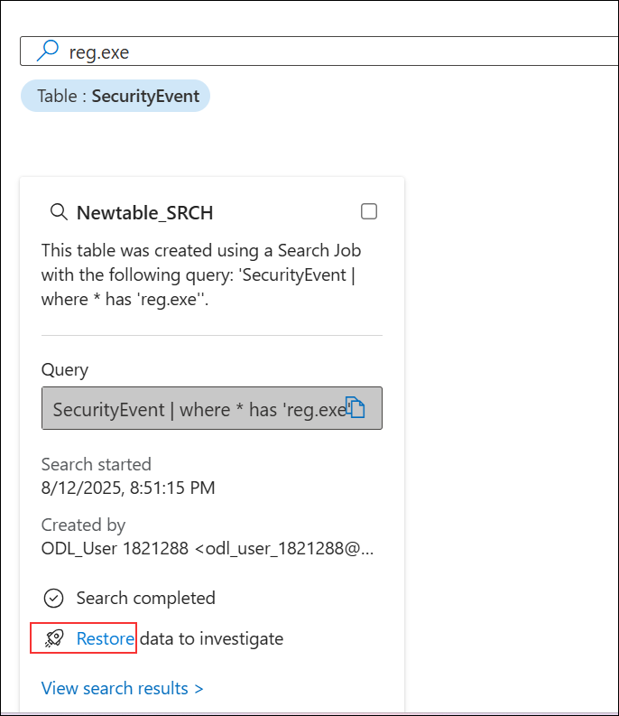

# Task 3: Create a Search job

In this task, you will use a Search job to look for a C2.

1. In Microsoft Defender Portal, on the **Search** page, select **Search (1)** from the left menu, enter **reg.exe (2)** in the search box, and click **Start**.

   

1. In the **Logs** window, click the ellipsis icon **(1)** at the top right and select **Search job (2)**.

   

1. On the **Run a search job** window, select **Last 24 Hours (1)**, enter **Newtable (2)** as the name, and click **Run search job (3)**.

   

1. The query results display in the **Logs** window showing the retrieved event details.

   

1. Close the *Logs* window by selecting the **X** in the top-right of the window and select **OK** to discard the changes. 

1. On the **Newtable_SRCH** panel, click **Restore** to investigate the retrieved data.

   
 
1. On the **Restoration** window, review the settings and click **Restore** to begin the process.

   

1. Review the options available and then select the **Cancel** button.

    >**Note:** If you were running the job, the restore would run for a couple of minutes and your data would be available in a new table.

## Review
