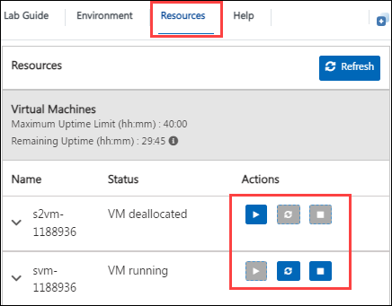
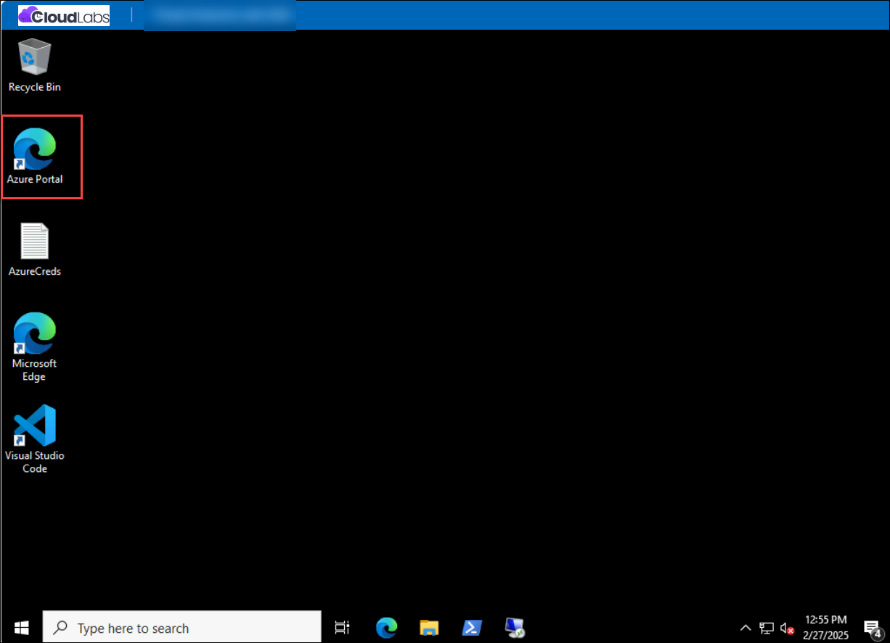
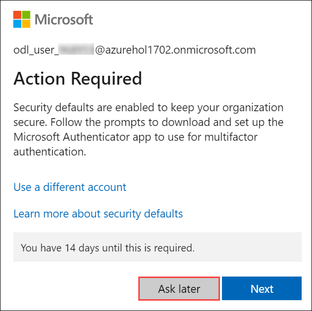

# Implement Threat Protection with Microsoft Defender XDR solutions

### Overall Estimated Duration: 12 Hours

## Overview
This hands-on workshop provides practical experience in Microsoft Defender XDR, Defender for Office 365, and Defender for Cloud Apps. Participants will configure multi-layered threat protection policies, simulate phishing and malware attacks, analyze real-time threats, onboard and secure Microsoft 365 SaaS applications, and implement app governance for OAuth-based third-party apps. The labs also guide you through investigating and remediating security incidents, creating custom detection policies, and setting up proactive monitoring to strengthen security posture and maintain compliance.

## Objectives
- Configure and manage threat protection policies in Microsoft Defender XDR and Defender for Office 365.
- Simulate phishing and malware attacks and analyze threats using Threat Explorer and real-time detections.
- Investigate and remediate security incidents, configure anti-phishing and Safe Links policies, and manage security posture settings.
- Detect and analyze Shadow IT using Cloud Discovery in Defender for Cloud Apps.
- Onboard and protect Microsoft 365 SaaS applications, configure session and activity policies, and implement app governance for OAuth-based third-party apps.
- Enable and configure App Governance to monitor risky OAuth apps and create custom detection policies.
- Strengthen skills in incident response, policy management, and compliance using Microsoft’s integrated security solutions.

## Day-by-Day Breakdown:

### **Day 1**
In this hands-on lab, you will configure threat protection policies in Microsoft Defender XDR and Defender for Office 365, simulate phishing and malware attacks, and analyze threats using Threat Explorer. Investigate and remediate security incidents, configure anti-phishing and Safe Links policies, and manage security posture settings.

### **Day 2**
In this hands-on lab, you will detect and analyze Shadow IT using Cloud Discovery in Defender for Cloud Apps. Onboard and protect Microsoft 365 SaaS applications, configure session and activity policies, and implement app governance for OAuth-based third-party apps. Enable and configure App Governance to monitor risky OAuth apps and create custom detection policies.

### **Day 3**
In this hands-on lab, you will onboard devices and deploy Defender for Identity sensors, simulate and detect lateral movement attacks, integrate Defender for Identity with Microsoft 365 Defender Portal, and run advanced hunting queries. Integrate Microsoft Sentinel with Defender for Cloud, conduct persistence and command-and-control attack simulations, create hunting queries and analytics rules, and manage incidents and alerts.

## Getting Started with the Lab
 
Welcome to your Implement Threat Protection with Microsoft Defender XDR solutions workshop! We've prepared a seamless environment for you to familiarize yourself with the Microsoft security operations analyst, you monitor, identify, investigate, and respond to threats in multi-cloud environments and related Microsoft services. Let's begin by making the most of this experience:
 
## Accessing Your Lab Environment
 
Once you're ready to dive in, your virtual machine and lab guide will be right at your fingertips within your web browser.
 

## Virtual Machine & Lab Guide
 
Your virtual machine is your workhorse throughout the workshop. The lab guide is your roadmap to success.
 
## Exploring Your Lab Resources
 
To get a better understanding of your lab resources and credentials, navigate to the **Environment Details** tab.
 

 
## Utilizing the Split Window Feature
 
For convenience, you can open the lab guide in a separate window by selecting the **Split Window** button from the Top right corner.
 

 
## Managing Your Virtual Machine
 
Feel free to start, stop, or restart your virtual machine as needed from the **Resources** tab. Your experience is in your hands!
 

## Let's Get Started with Azure Portal
 
1. On your virtual machine, click on the Azure Portal icon as shown below:
 
    

2. You'll see the **Sign into Microsoft Azure** tab. Here, enter your credentials:
 
   - **Email/Username:** <inject key="AzureAdUserEmail"></inject>
 
     
 
3. Next, provide your password:
 
   - **Password:** <inject key="AzureAdUserPassword"></inject>
 
     

1. If you see the pop-up **Action Required**, click **Ask Later**.

     
 
4. If prompted to stay signed in, you can click **No**.

5. If a **Welcome to Microsoft Azure** pop-up window appears, simply click **Cancel** to skip the tour.

## Steps to Proceed with MFA Setup if "Ask Later" Option is Not Visible

1. At the **"More information required"** prompt, select **Next**.

1. On the **"Keep your account secure"** page, select **Next** twice.

1. **Note:** If you don’t have the Microsoft Authenticator app installed on your mobile device:

   - Open **Google Play Store** (Android) or **App Store** (iOS).
   - Search for **Microsoft Authenticator** and tap **Install**.
   - Open the **Microsoft Authenticator** app, select **Add account**, then choose **Work or school account**.

1. A **QR code** will be displayed on your computer screen.

1. In the Authenticator app, select **Scan a QR code** and scan the code displayed on your screen.

1. After scanning, click **Next** to proceed.

1. On your phone, enter the number shown on your computer screen in the Authenticator app and select **Next**.

1. If prompted to stay signed in, you can click "No."

1. If a **Welcome to Microsoft Azure** pop-up window appears, simply click "Maybe Later" to skip the tour.

1. If a **Welcome to Microsoft Azure** pop-up window appears, simply click **Cancel** to skip the tour.
 
1. Click **Next** from the bottom right corner to embark on your Lab journey!
 
     

Now you're all set to explore the powerful world of technology. Feel free to reach out if you have any questions along the way. Enjoy your workshop!
