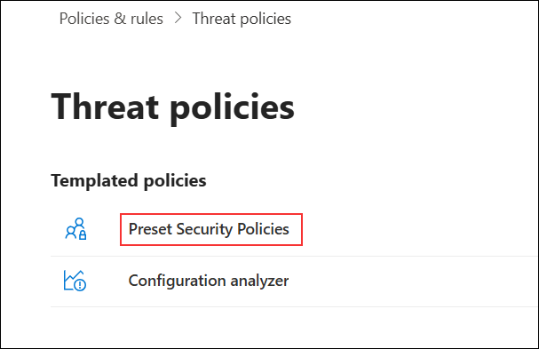
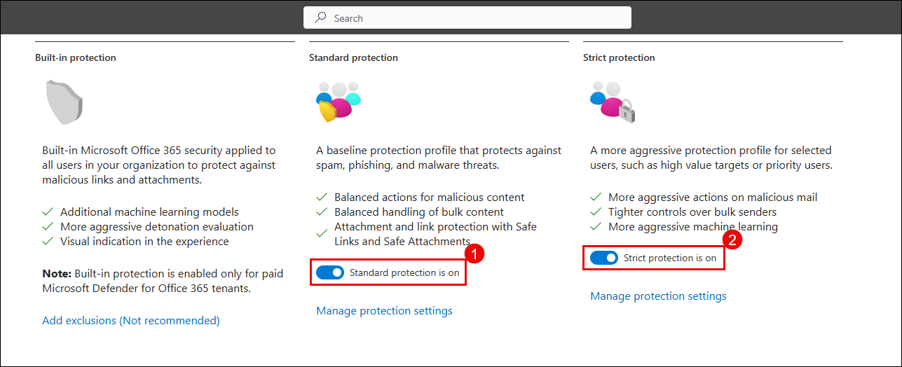
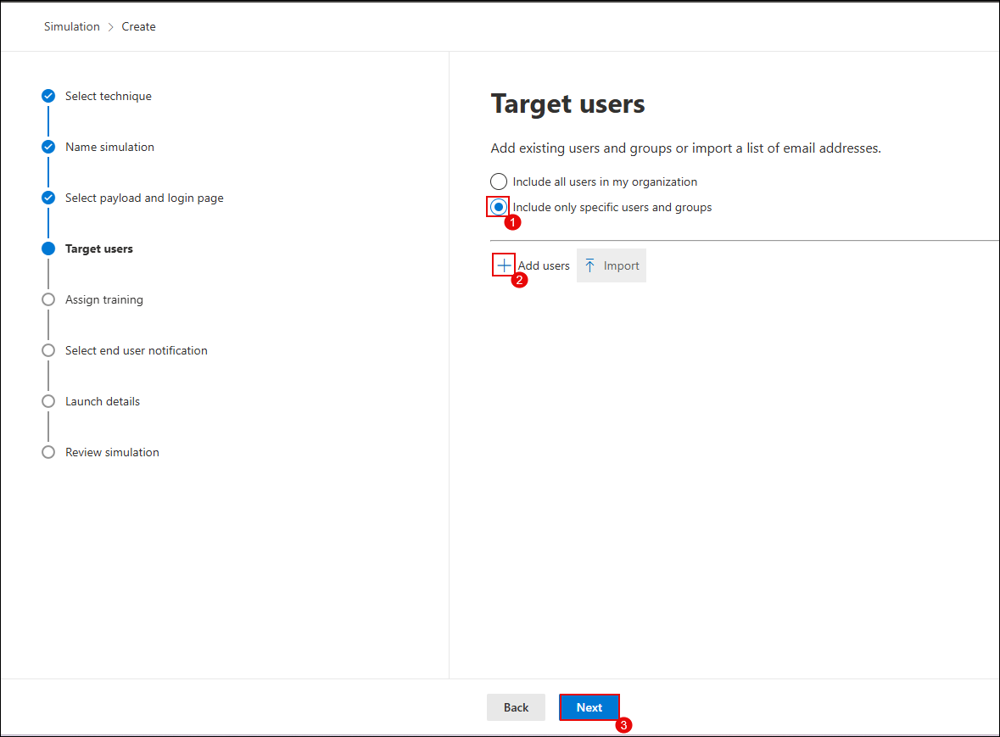
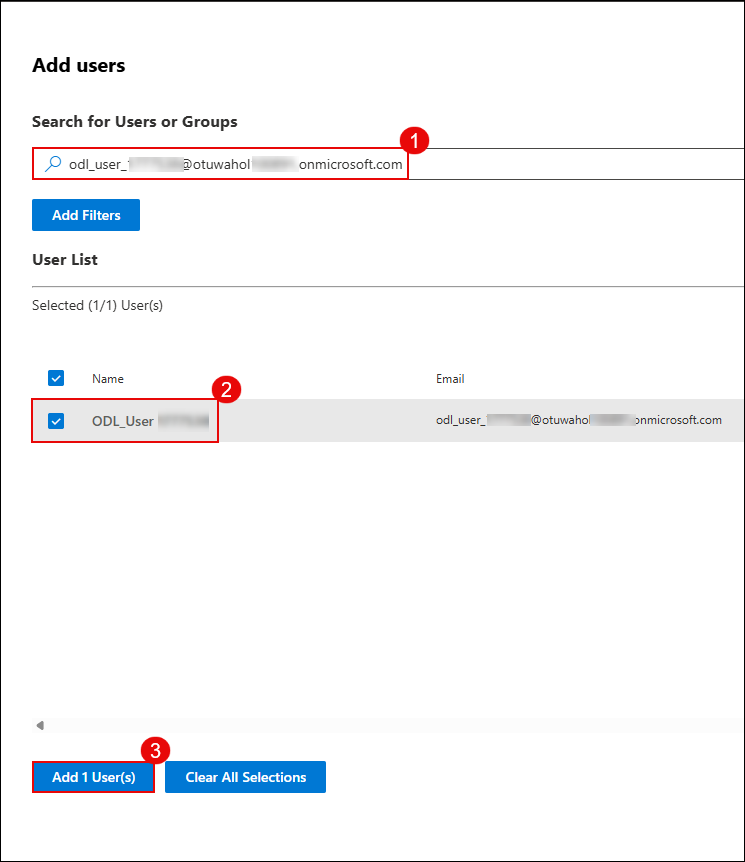
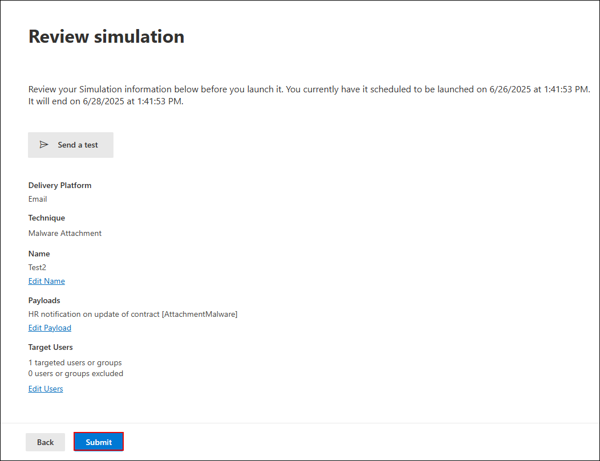
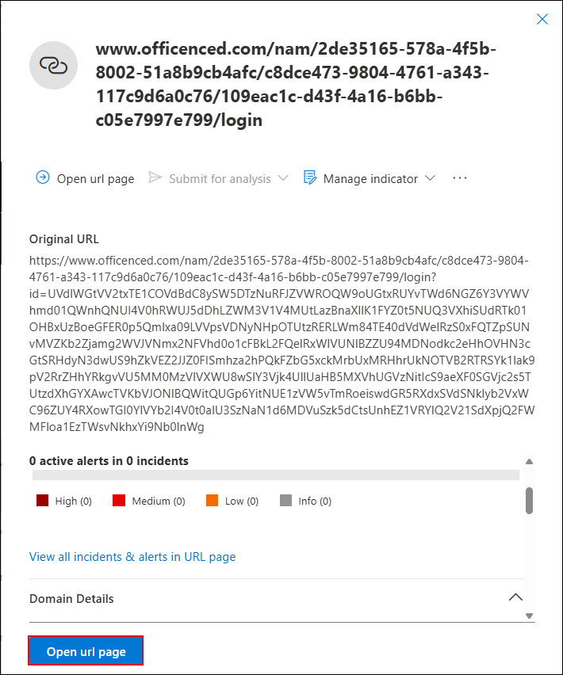

# **Day-01**

## Lab 01: Configuring Threat Policies and Simulating Attacks in Microsoft Defender for Office 365

### Estimated Duration: 60 Minutes

## Overview

In this lab, you will configure threat protection policies in Microsoft Defender for Office 365 and use the Attack Simulator to mimic phishing and malware attacks. You will then explore how to analyze these simulated threats using Threat Explorer and real-time detections, gaining insights into how Defender identifies, tracks, and helps mitigate threats within your Office 365 environment.

> **⚠ Important Usage Guidance**

> Microsoft Defender for Office 365 may take some time to load certain results or complete specific tasks from the backend. This is expected behavior. If the data does not appear after a couple of refresh attempts, proceed with the next task in the lab and return later to check the results.

## Objectives

- Task 1: Configure Threat Policies in Microsoft Defender for Office 365 
- Task 2: Simulate Phishing and Malware Attacks Using Attack Simulator 
- Task 3: Analyze Threats with Threat Explorer and Real-Time Detections 

## Task 1: Configure Threat Policies in Microsoft Defender for Office 365

In this task, you will enable Microsoft Defender CSPM for your environment and configure both standard and strict protection policies using Microsoft Defender XDR.

1. Go to the Azure Portal and search for **Microsoft Defender for Cloud (1)**, select it from the **results (2)**.

   

1. When prompted, click **Enable** to activate Defender CSPM.

   

   > **Note:** If you don’t see the pop-up prompt, continue with the lab steps below.

   > **Note:** Enabling Defender CSPM unlocks advanced posture management features such as attack path analysis and permission visibility.

1. Go to **Environment settings (2)** under **Management (1)**, expand **Azure (3)** → **Tenant Root Group (4)**, and select your **subscription (5)**.

   

1. Under **Defender plans (1)**, turn on the following options and click **Save (5)**:
   - **Foundational CSPM (2)**
   - **Defender CSPM (3)**
   - **Servers under Cloud Workload Protection (4)**

        

1. On a new tab in the **Microsoft Edge** browser and go to the following URL in the address bar: [https://security.microsoft.com](https://security.microsoft.com).

1. On the **Microsoft Defender portal**, go to **System (1)** > **Settings (2)** and click **Cloud Apps (3)**.

   

1. Under **App governance**, select **Service status (1)** and click **Turn on app governance (2)**.

   

   > App Governance is now activated. It will begin evaluating connected OAuth apps and generating insights into their behavior and risk posture.

1. On the OAuth apps page, click **Go to app governance**.

   

   > You may be redirected to the new App Governance interface.

   > **Note:** It may take 3–4 hours for the Microsoft Defender portal to enable OAuth apps in App Governance.

1. In the **Microsoft Defender** portal, select **Settings (1)** from the left navigation pane, and then click **Cloud Apps (2)** from the list on the **Settings** page.  

   

1. On the **Cloud apps** settings page, expand **Information Protection (1)**, select **Files (2)**, check **Enable file monitoring (3)**, and then click **Save (4)**.

   

1. On the **Cloud apps** settings page, expand **Connected apps (1)**, select **App Connectors (2)**, click **Connect an app (3)**, and then choose **Microsoft 365** from the list.  

   

1. On the **Select Microsoft 365 components** page, ensure all components are checked, and then click **Connect Microsoft 365**.  

   

1. On the confirmation page, once the connection is established, click **Done** to complete the Microsoft 365 connector setup. 

   

1. Under the **Connected apps** section, click on **App Connectors**. On the **App connectors** page, select the checkbox beside **Microsoft 365**, then click on **+ Connect Microsoft Azure instance**.
  
    

1. Click **Connect Microsoft 365** and complete the authentication.

1. After successful connection, you will see the confirmation message: **“Great, Microsoft 365 is connected.”**, Click **Done**
 
    

1. On the **App Connectors** page, verify that Microsoft 365 and Microsoft Azure shows **Connected** status.
  
    

   > **Note:** It may take **2–4 hours** for the SaaS app to fully connect and display data. Kindly proceed with the next step in the lab and return later to verify the connection status.

1. In the left pane, go to **Email & collaboration (1)** → **Policies & rules (2)** → **Threat policies (3)**.

   

1. On the **Threat policies** page, under **Templated policies**, select **Preset Security Policies**.

   

   > **Note:** If the **Learn about preset security policies** pop-up appears, click **Cancel** to close it and proceed with the lab.

1. Under **Standard Protection**, click on **Manage protection settings**.

   

1. On the **Apply Exchange Online Protection** screen, select **Specific recipients (1)**, enter the user email in the **Users** field (2), and click **Next (3)**.

    

1. On the **Apply Defender for Office 365 protection** screen, select **Specific recipients (1)**, enter the user email in the **Users (2)** field, and click **Next (3)**.

    

1. On the **Impersonation protection** and **Policy mode** screens, keep all settings at their default values and click **Next** until you reach the **Review** section.

1. On the **Review** screen, verify that **Exchange Online Protection (1)** and **Defender for Office 365 (2)** apply to the correct user, then click **Confirm (3)**.

    

1. On the **Apply standard protection** confirmation screen, verify that the policy update is successful, then click **Done**.

    

    > **Note:** Standard protection includes Safe Attachments, Safe Links, and anti-phishing policies.

1. Under **Strict Protection**, click **Manage protection settings**.

    

1. On the **Apply Exchange Online Protection** screen, select **Specific recipients (1)**, enter the user email in the **Users** field (2), and click **Next (3)**.

    

1. On the **Apply Defender for Office 365 protection** screen, select **Specific recipients (1)**, enter the user email in the **Users** field (2), and click **Next (3)**.

    

1. On the **Impersonation protection** and **Policy mode** screens, keep all settings at their default values and click **Next** until you reach the **Review** section.

1. On the **Review** screen, verify that **Exchange Online Protection (1)** and **Defender for Office 365 (2)** apply to the correct user, then click **Confirm (3)**.

    

1. Once completed, confirm that:
    - **Standard protection is on (1)**  
    - **Strict protection is on (2)**

        

      > **Note:** You have now successfully configured multi-layered threat policies for both general and high-risk users.

## Task 2: Simulate Phishing and Malware Attacks Using Attack Simulator

In this task, you'll simulate phishing and malware attacks using Microsoft Defender's built-in **Attack Simulation Training**. These simulations help you evaluate user vulnerability and response to social engineering techniques.

1. On the left navigation menu, expand **Email & collaboration (1)** and select **Attack simulation training (2)**. On the **Attack simulation training** page, select the **Simulations (3)** tab and click **Launch a simulation (4)**.

   

1. Under **Select technique**, choose **Credential Harvest (1)** and click **Next (2)**.

   

1. In the **Name simulation** step, enter a simulation name as `Test1` in the **Simulation name (1)** field, and click **Next (2)**.

   

1. Under **Select payload and login page**, choose **Global payloads**, select a phishing payload from the **list (1)**, and click **Next (3)**.

   

1. On the **Target users** screen, select **Include only specific users and groups (1)**, click **Add users (2)**, and then click **Next (3)**.

   

1. On the **Add users** screen, search for the **user email (1)**, select the **user (2)** from the list, and click **Add User(s) (3)**.

   

1. On the **Target users** screen, confirm the **User** has been added and click **Next**.

1. On the **Exclude users** screen, leave the option unchecked to skip excluding any users, and click **Next**.

   

1. On the **Assign training** screen, select **Microsoft training experience (1)**, choose **Assign training for me (2)**, set the due date to **7 days after Simulation ends (3)**, and click **Next (4)**.

   

1. Under **Select landing page**, choose a **login page template (1)** and click **Next (2)**.

    

1. In the **End user notification** section, select **Microsoft default notification (1)** and configure:
    - Positive reinforcement: **Deliver during simulation (2**)
    - Training reminder: **Weekly (3)**
    Click **Next (4)**.

        

1. In the **Launch details** step, select **Launch this simulation as soon as I'm done (1)**, set **duration to 2 days (2)**, and click **Next (3)**.

    

1. Review the configuration summary and click **Submit** to start the simulation.

    

1. On completion, click **Done**.

    

    > **Note:** You’ve successfully launched a phishing simulation. It will monitor how users interact with suspicious emails.

1. Verify the simulation appears in the dashboard as **In progress**.

    

1. On the **Attack simulation training** page, select the **Simulations (1)** tab and click **Launch a simulation (2)**.

    

1. To simulate a **Malware Attack**, choose **Launch your own simulation**, select **Malware Attachment (1)**, and click **Next (2)**.

    

1. Enter a new simulation name **`Test2`** and click **Next (2)**.

    

1. Under **Select payload and login page**, select **Global payloads (1)**, choose a malware attachment from the list and set the preferred language (2), then click **Next (3)**.

    

1. On the **Target users** screen, select **Include only specific users and groups (1)**, click **Add users (2)**, and then click **Next (3)**.

   

1. On the **Add users** screen, search for the **user email (1)**, select the **user (2)** from the list, and click **Add User(s) (3)**.

   

1. On the **Target users** screen, confirm the **User** has been added and click **Next**.

1. On the **Exclude users** screen, leave the option unchecked to skip excluding any users, and click **Next**.

   

1. On the **Assign training** screen, select **Microsoft training experience (1)**, choose **Assign training for me (2)**, set the due date to **7 days after Simulation ends (3)**, and click **Next (4)**.

   

1. On the **Assign training** page, select a landing page template from the list (1) and click **Next (2)**.

   

1. In the **End user notification** screen, select **Microsoft default notification (1)**, ensure **Deliver during simulation (2)** and **Weekly reminder (3)** are selected, and click **Next (4)**.

    

1. Set the **Launch configuration (1)** to launch immediately, set duration to **2 days (2)**, and click **Next (3)**.

    

1. On the **Select end user notification** screen, choose **Microsoft default notification (1)**, set **Deliver during simulation (2)** and **Weekly (3)** as delivery preferences, then click **Next (4)**.

    

1. Review the details and click **Submit** to complete the malware simulation setup.

    

   > **Note:** This simulation mimics a malicious file being sent via email, testing how users respond to attachment-based threats.

> **Congratulations** on completing the task! Now, it's time to validate it. Here are the steps:  
> - Hit the Validate button for the corresponding task. If you receive a success message, you can proceed to the next task.  
> - If not, carefully read the error message and retry the step, following the instructions in the lab guide.  
> - If you need any assistance, please contact us at cloudlabs-support@spektrasystems.com. We are available 24/7 to help you out.  
<validation step="064a226a-790e-4e5f-b789-d84483110e38" />

## Task 3: Analyze Threats with Threat Explorer and Real-Time Detections

In this task, you'll create a custom role in Microsoft Defender to manage access and permissions, simulate a phishing interaction, and investigate user activity using Threat Explorer.

1. On a new tab in the **Microsoft Edge browser** and go to the following URL in the address bar: https://security.microsoft.com.

1. Open a new tab, navigate to https://outlook.office.com, sign in with the lab user’s credentials, and access the mailbox.

   > **Note:** If the **Your privacy matters** pop-up appears, click **Continue** to proceed.

      

1. In the mailbox, select the **phishing simulation email (1)** and click the **link (2)** provided in the message body to proceed.

   

1. On the **Sign in** page, type any random email address (1) and click **Next (2)**.

   

1. On the **Enter password** page, type any random password (1) and click **Sign in (2)**.

   

1. After submitting the fake credentials, the phishing simulation results page will appear indicating that you were phished. Review the message and proceed as instructed in the lab.

   

      > Note: This activity simulates a phishing attack and trigger credential submission logs.

1. A training assignment email is also generated for users who fall for the phishing simulation. In the mailbox, open the **Training assignment notification** email and review the details.

   

1. In the mailbox, select the malware attachment simulation email to view its contents.

   

1. With the malware attachment simulation email open, click the **More actions (1)** menu, select **Report (2)**, and then click **Report phishing (3)**.

   

1. In the **Report phishing** confirmation dialog, click **Report** to submit the phishing report.

   

1. After reporting the phishing email, a confirmation message will be sent to your mailbox. Open the **Thank you for reporting a phish!** email to review the acknowledgment.

   

1. In the **Microsoft Defender portal**, do the following:

   - Select **Email & collaboration (1)** from the left navigation pane.
   - Click **Explorer (2)** under the Email section.
   - In the **URL clicks** tab, select the entry for the clicked timestamp.
   - Review the **URL (4)** that was clicked to investigate further.

      

   > **Note:** Sometimes the Microsoft Defender portal can take 1–2 hours for initial backend data to load. If refreshing the page doesn’t display results, check back later.

      
   
   > **Note:** If no data appears after waiting and refreshing, skip ahead to step 14 to continue with the lab.

1. Click on the **Open url page** to open the full event details.

   

   > Note: This shows the clicked URL, click metadata, and incident correlation.

1. In the **Microsoft Defender portal**, do the following:

   - Select **Email & collaboration (1)** from the left navigation pane.  
   - Click **Attack simulation training (2)**.  
   - Navigate to the **Simulations (3)** tab.  
   - Locate and select the simulation named **Test1 (4)** from the list.

      

1. View the simulation report to observe the results.  
   In this example, 100% of users were compromised and 0% reported the phishing attempt.

   

1. Click the **Affected user** to view detailed actions taken during the simulation such as reading the email, clicking the link, and submitting credentials.

   

   > Note: This data helps evaluate user behavior and identify high-risk individuals.

1. Navigate back to the **Simulations** tab, select the simulation named **Test2**, and view the report details for the malware attachment simulation.

## Review

1. In this exercise, you learnt how to configure threat policies and simulate phishing and malware attacks using Microsoft Defender for Office 365.

1. You also learnt to analyze threats in real time using Threat Explorer, helping understand how Defender detects and responds to email-based threats.

## Click Next to Continue
