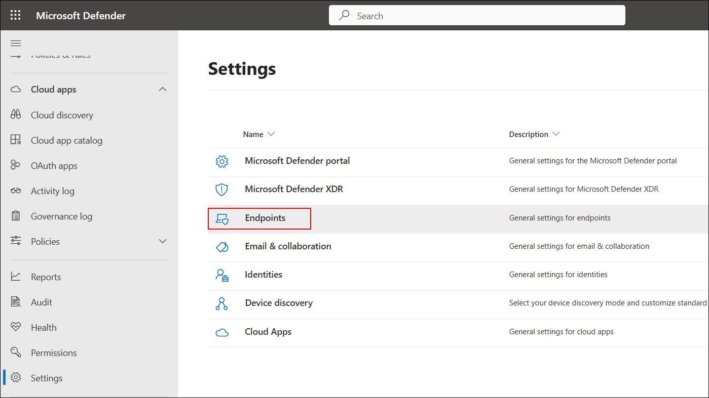
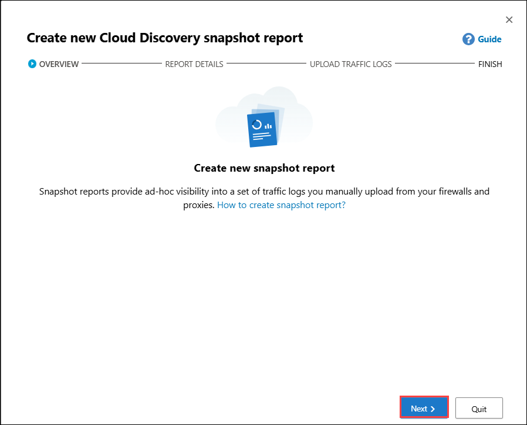
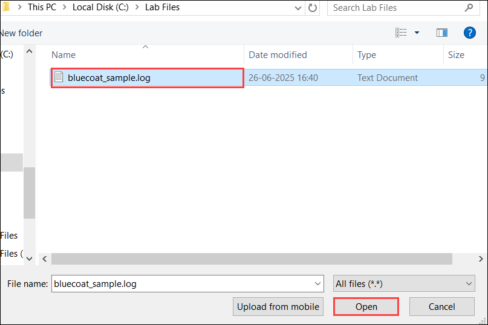
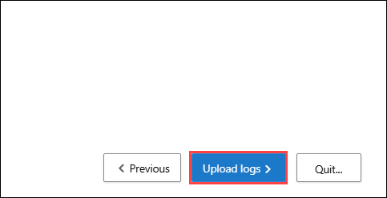
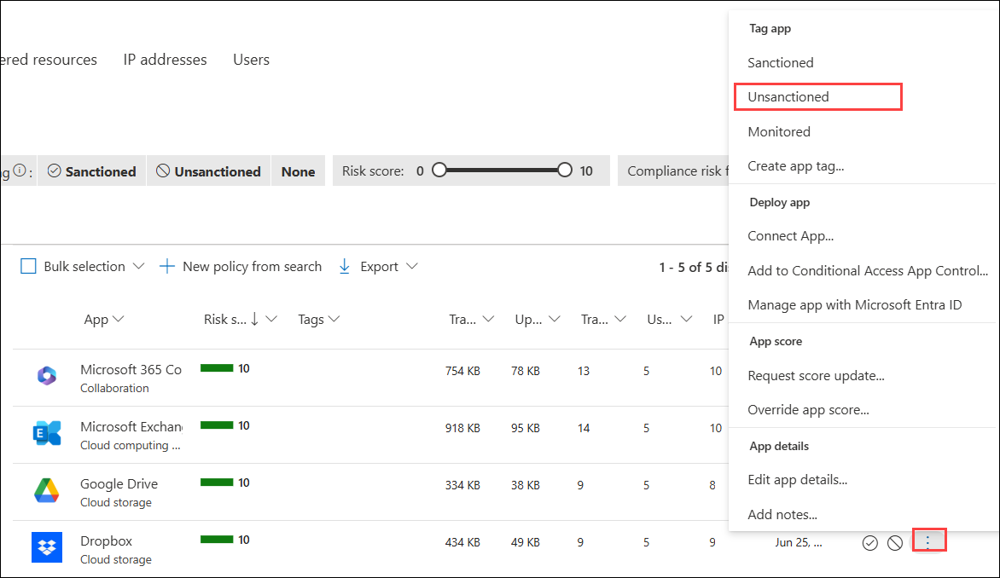

# Exercise 3: Configuring Cloud Discovery in Microsoft Defender for Cloud Apps to Detect Shadow IT

### Estimated Duration: 60 Minutes

## Overview

In this lab, you’ll enable Cloud Discovery in Microsoft Defender for Cloud Apps and upload a sample log to generate a Snapshot Report. You'll then analyze the dashboard to identify app usage, assess risks, and detect Shadow IT within the organization.

## Objectives

- Task 1: Microsoft Defender for Cloud Apps-Configuring Cloud Discovery
- Task 2: Discover and Analyze Shadow IT Using Cloud Discovery 

## Task 1: Microsoft Defender for Cloud Apps-Configuring Cloud Discovery 

1. In the Edge browser, log-in to Microsoft Defender portal using the following link: https://security.microsoft.com/ with the below username and password if prompted to sign in.

    - **Email/Username:** <inject key="AzureAdUserEmail"></inject>
 
       
 
   - **Password:** <inject key="AzureAdUserPassword"></inject>

       

1.  In the Microsoft Defender portal, navigate and click on **System**, then click on **Settings**.

     

1.  On the **Settings** page, click on **Endpoints**.

     

    > **Note:** In case you do not see **Defender for Endpoint**, then open a new tab in Edge browser and enter the following URL and wait for the configuration to be completed:
 
    > [https://security.microsoft.com/securitysettings/endpoints/integration?tid=](https://security.microsoft.com/securitysettings/endpoints/integration?tid=)

     

1.  On the **Endpoints** page, under the **General** section, click on **Advanced features**.

1.  Turn on the toggle for **Microsoft Defender for Cloud Apps**, then click on the **Save preferences** button.

    

1. Navigate back to **Settings** and choose **Cloud Apps**

   

    > **Note:** It may take a few minutes for the **Cloud Apps** section to appear. If you don’t see it immediately, wait and refresh the page.

1. Under Cloud Discovery, choose **Microsoft Defender for Endpoint** and enable **Enforce App Access**

   

1. Scroll down and under Cloud Discovery, select **Snapshot reports** .

   

1. Click on **Create Snapshot Report**

   

1. In the window that appears, click **Next**.

   

1. For the **Report Name** give the name as **Test Report** (1), for source click on the dropdown and select **Blue Coat ProxySG- Access log (W3C)** and click **Next** (3)

   

1. In the Upload section, click on **Browse** and browse to C:/Lab Files and select the  **bluecoat_sample.log** file.

   

   

1. Once you have uploaded, click on **Upload Logs**. You will get a prompt stating that the snapshot report is being generated. Click on **CLose**.
   
   
   
1. You will be navigated to the **Snapshot Reports** page and notice that your report is being processed.

1. Wait until the status turns to **Ready**. This can take upto 10 minutes.

   

1. Once it is ready, click on the Test Report and you will be able to see the detailed Dashboard in the Cloud Discovery.

   

## Task 2: Discover and Analyze Shadow IT Using Cloud Discovery

1. Analyze the report for the following options:

    - **Check the Summary Metrics:** Look at the total number of apps, users, IP addresses, and traffic volume to understand the overall cloud usage.
    
    - **Review App Categories**: Identify which categories (e.g., Cloud Computing, Storage, Collaboration) are using the most bandwidth and check if any unsanctioned apps are involved.
    
    - **Analyze Risk Levels**: Use the risk level chart to see how much traffic is coming from low, medium, or high-risk apps—focus on medium/high risk.
    
    - **Identify Top Users**: Check the “Top entities” section to see which users are generating the most traffic, especially to risky or unsanctioned apps.
    
    - **Inspect Discovered Apps**: Review the list of apps in use, their traffic volume, and verify if they are approved or need to be blocked or reviewed further.

1. In the dashboard, navigate to **Discovered Apps** section.

   

1. This section lists all discovered apps, showing their risk score, traffic volume, number of users, and last activity.

   

1. Click on the elipsis next to any of the applications to mark the app as **Unsactioned**. This action labels the app as not approved for use, helping you monitor and report on its usage in the dashboard.

   

## Review

1. In this exercise, you learnt how to set up Cloud Discovery and generate a snapshot report using sample logs.

1. You also learnt to analyze app usage, risk levels, and detect unsanctioned apps from the dashboard.

## Click Next to continue
