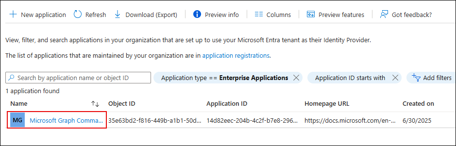
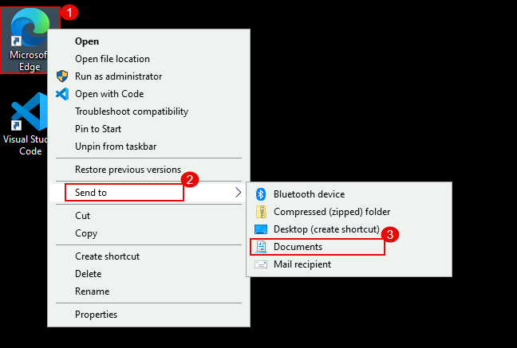
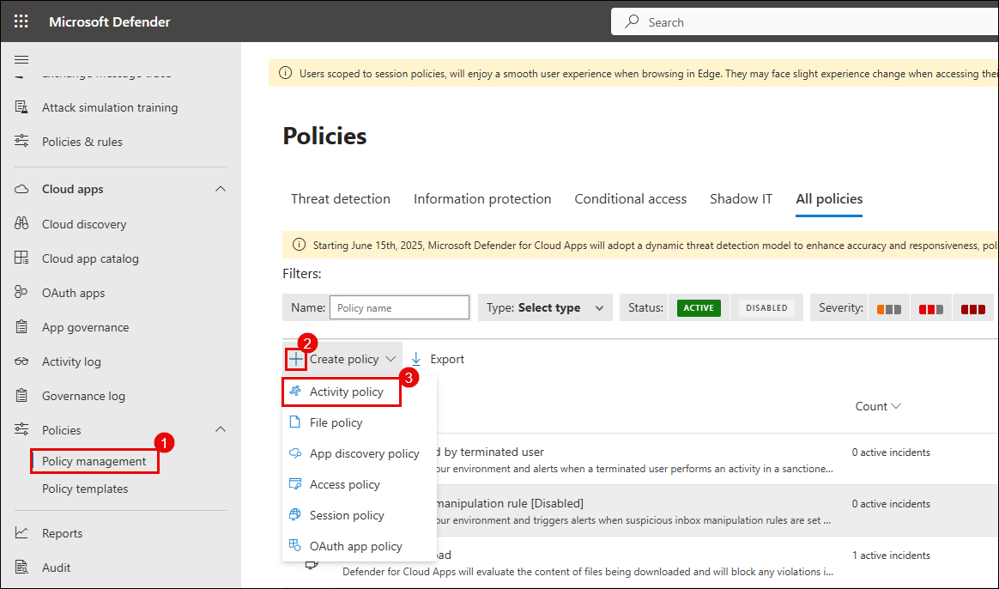

# Exercise 4: Protecting Microsoft 365 SaaS Apps with Microsoft Defender for Cloud Apps

### Estimated Duration: 60 Minutes

## Overview

In this exercise, you will explore how to secure Microsoft 365 cloud services like SharePoint, OneDrive, and Exchange using Microsoft Defender for Cloud Apps. You'll connect Microsoft 365 as a cloud app, configure real-time session policies, and create custom activity detection rules to detect and block risky behavior.

> **Important Usage Guidance**

> Some changes or configurations made during this lab may take a few minutes to reflect in the Microsoft Defender for Office 365 portal. This includes security recommendations, alerts, and resource status updates. If updates are not visible immediately, please allow some time and refresh the portal before proceeding.

> Microsoft Defender for Office 365 may take some time to load certain results or complete specific tasks from the backend. This is expected behavior. If the data does not appear after a couple of refresh attempts, proceed with the next task in the lab and return later to check the results.

## Objectives

- Task 1: Connect and Onboard a SaaS App to Microsoft Defender for Cloud Apps  
- Task 2: Configure Session Policies to Monitor and Block Risky Behavior  
- Task 3: Investigate Alerts and Create Custom Detection Policies  

## Task 1: Connect and Onboard a SaaS App to Microsoft Defender for Cloud Apps

1. Open the **Microsoft Edge** browser and go to the following URL in the address bar: 

   [https://portal.azure.com](https://portal.azure.com)

1. In the search bar, type **Microsoft Entra ID** and select it.

   

1. In the **Overview** pane, select **Users** under the **Manage** section.
  
   

1. From the list of users, click on your assigned user (`ODL_User******`).
  
   

1. In the user blade, click on **Licenses** and ensure **Microsoft 365 E5 (no Teams)** or an equivalent license is assigned and active.
  
   

1. Go back to the **Azure portal** tab. In the search bar at the top, enter **Windows Azure Active Directory**, and then select it from the search results.
  
    

1. On the **Windows Azure Active Directory** page, click on **Security**, then select **Conditional Access**, and on the Conditional Access page, click on **+ New policy**.
  
    

1. Name the policy: `MCAS – M365 Session Control`

1. Under the **Assignments** section, click on **Users**, then select the **Select users and groups** radio button.

1. Check the box beside **Users and groups**, then click on **0 users and groups selected**.
  
    

1. In the **Select users and groups** window, search for your lab user (`ODL_User`), check the box beside the user, and click **Select**.
  
    

1. You’ll now see your selected user listed under **Users**.
  
    

1. Under **Assignments > Target resources**, click on the **0 resource included** link and ensure the radio button beside **Select resources** is selected.

1. Click on **Windows Azure Active Directory**, then in the **Select** pane, check the box for **Office 365**, and click **Select**.
  
    

1. Under **Access controls > Session**, click on the **0 controls selected** link.

1. In the Session pane, check the box for **Use Conditional Access App Control**, ensure **Use custom policy** is selected from the dropdown, then click **Select**.
  
    

1. Scroll down, toggle **Enable policy** to **On**, and click **Create**.
  
    

1. Go back to the **Microsoft Defender portal** tab and select **Settings** from the left-sided menu and select **Cloud apps**.

1. Navigate to the **Information Protection** section and select **Files**.

1. Select the checkbox beside **Enable file monitoring**, then click on the **Save** button.
  
    

    

1. Under the **Connected apps** section, click on **App Connectors**. On the **App connectors** page, select the checkbox beside **Microsoft 365**, then click on **+ Connect Microsoft Azure instance**.
  
    

1. Click **Connect Microsoft 365** and complete the authentication.

1. After successful connection, you will see the confirmation message: **“Great, Microsoft 365 is connected.”**, Click **Done**
 
    

1. On the **App Connectors** page, verify that Microsoft 365 and Microsoft Azure shows **Connected** status.
  
    

1. Under **Connected apps**, select **Conditional Access App Control apps**.

1. Locate and click the ellipsis (**⋮**) next to **Microsoft SharePoint Online – General**, then choose **View settings in Microsoft Entra ID**.

   

   > **Note:** If you're unable to view **SharePoint Online**, open an incognito browser window and navigate to [https://www.office.com](https://www.office.com).
   
   > **Note:** Sign in using your lab credentials. From the left pane, go to **Apps** → **SharePoint**.
   
   >**Note:** Then, return to the Conditional Access page and refresh it to load the app properly.

1. In the **Enterprise applications** blade, click **Microsoft Graph Command Line Tools**.

   

1. On the overview page, under **3. Conditional Access**, click **Create a policy**.

   

1. Click **+ New policy** to define a custom access rule for the application.

   

> **Note:** After completing this configuration, go back and repeat steps **17–24** from Task 1 to ensure your Conditional Access App Control policy is correctly applied to **Microsoft Graph Command Line Tools** as well.

> **Congratulations** on completing the task! Now, it's time to validate it. Here are the steps:
> - Hit the Validate button for the corresponding task. If you receive a success message, you can proceed to the next task. 
> - If not, carefully read the error message and retry the step, following the instructions in the lab guide.
> - If you need any assistance, please contact us at cloudlabs-support@spektrasystems.com. We are available 24/7 to help you out.
<validation step="1bbaab69-9291-4c6b-bd0c-7c019d729d2f" />

## Task 2: Configure Session Policies to Monitor and Block Risky Behavior

1. In Microsoft Defender portal go to **Cloud Apps** → **Policy management**.

1. On the **Policy management** page, in the **All policies** section click on **+ Create policy**, then select **Session policy**.
  
   

1. Configure the policy settings:
   - **Policy template**: `No template`
   - **Policy name**: `Block-All-Download`
   - **Policy severity**: Choose high (red)
   - **Category**: `Threat detection`
   - **Session control type**: `Control file download (with inspection)`
   - **Filters**:  
   - Device tag `does not equal` → `Intune compliant, Microsoft Entra Hybrid joined`  
   - App `equals` → `Microsoft SharePoint Online`

     
   > **Note**: On the **Apply template?** dialog box, click on the **Cancel** button.

1. Scroll to **Files matching all of the following** and configure the following:
   - Filter by **Extension** → `exe` OR `apk`
   - Under **Actions**, select **Block**

      

1. Click **Create** to save and activate the policy.

   

   > Note: Ensure your Conditional Access policy is routing sessions through Microsoft Defender for Cloud.

1. Right-click the **Microsoft Edge** shortcut on the **Desktop**, select **Send to (2)** → **Documents (3)** to send a copy of the shortcut to the Documents folder.

   

1. Open an incognito browser and go to https://www.office.com.

1. Sign in using your lab credentials and from the left pane, go to **Apps** → **SharePoint**.

1. Click on **+ Create site**.

   

1. Then select **Communication site**.

   

1. Click **Standard communication (template)** and then select **Use template**.

1. Enter the **Site name** as `Demo` or any name of your choice, then click on the **Next** button.

   

1. Under the **Select a language** field, ensure that **English** is selected, then click on the **Create site** button.

   

1. On the **Demo** site, click on the **three horizontal bars** (☰) on the top-left corner.

   

1. Navigate the left-hand menu and click on **Documents**.

   

1. Click on **Upload**, then select **Files**.

   

1. Navigate and click on **Documents**, then select **Microsoft Edge** application. Now, click on the **Open** button.

   
   
   > **Note**: If `msedge.exe` is not available in the **Documents** folder, navigate to `C:\Program Files (x86)\Microsoft\Edge\Application`, locate `msedge` (the executable file), and upload it from there.

1. `msedge.exe` is successfully uploaded. Now, click on it.

   

1. Click on the **Download** button.
  
   

1. The download should be blocked with a message:  
    **"Download blocked – Downloading msedge.exe is blocked by your organization’s security policy."**
  
    

## Task 3: Investigate Alerts and Create Custom Detection Policies

1. In the Microsoft Defender Portal, go to **Cloud Apps** → **Activity log**.

1. Under the **App** filter, click on **Select apps** (3), select **Microsoft SharePoint Online**
  
   

   > **Note:** Once selected, all user activities performed in SharePoint—such as file uploads, downloads, edits, and access attempts—will be visible in the activity log.

1. 1. In the **Microsoft Defender portal**, navigate to **Incidents & alerts (1)**, select **Email & collaboration alerts (2)**, and locate the alert named **Block-All-Download (3)**.

   

1. Click the alert, then select **Open alert page**.
   
   

1. Click **Investigate in activity log**.
 
   

   

1. Go to **Cloud Apps** → **Policy management**, and click **Create policy** → **Activity policy**.

   

1. Configure the following:

   - **Policy template:** `No template`
   - **Policy name:** `Detect Suspicious File Download – msedge.exe`  
   - **Severity:** `High`  
   - **Category:** `Threat detection`  
   - **Act on:** `Single activity`  
   - **Activity type:** `Download file`  
   - **Files and folders:** `msedge.exe`  
   - **App:** `Microsoft SharePoint Online`
   
     

1. Click **Edit and preview results**, review matches, then click **Save filters**.

   

1. Under **Alerts**, enable **Send alert as email**, add a valid address, set daily alert limit to `5`.

1. Click **Create** to save and activate the policy.

    

1. Simulate a download again in SharePoint, and downloading `msedge.exe`.
    
    

    

    

1. Open your Outlook email inbox and locate the alert email titled `Alert - Detect Suspicious File Download – msedge.exe`.
   
    
    > **Note:** If you do not see the alert email, wait for 5–10 minutes and refresh your inbox.

1. In the portal, go to **Incidents & alerts** → **Alerts**, and open the alert.
   
    

1. Click **Open alert page** → **view incident page**.

    

1. Carefully review the event details:

    - User name  
    - File name  
    - App used  
    - IP address  
    - Device info  
    - Triggered policy
   
      

## Review

- You connected and onboarded Microsoft 365 into Microsoft Defender for Cloud Apps.  
- You configured session policies to monitor user activity and block downloads from unmanaged devices.  
- You created a custom detection policy to alert on suspicious activity and verified it through simulated actions.

## Click Next to continue