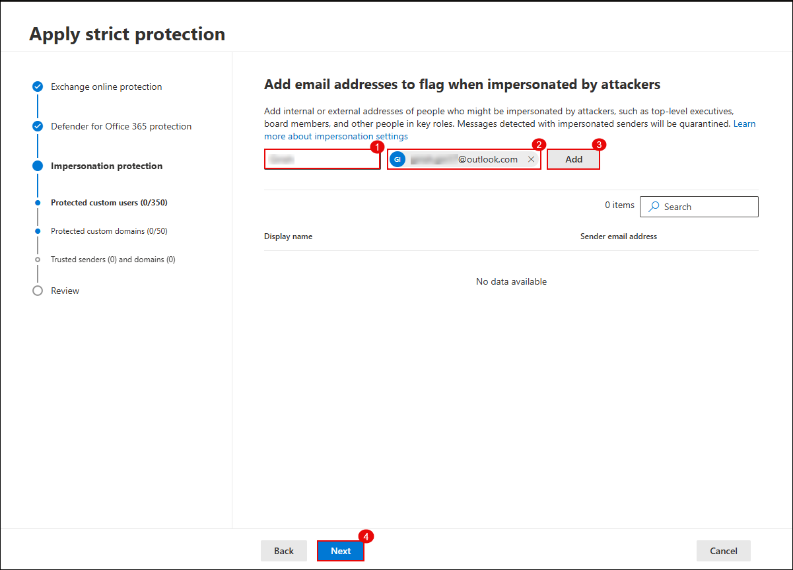
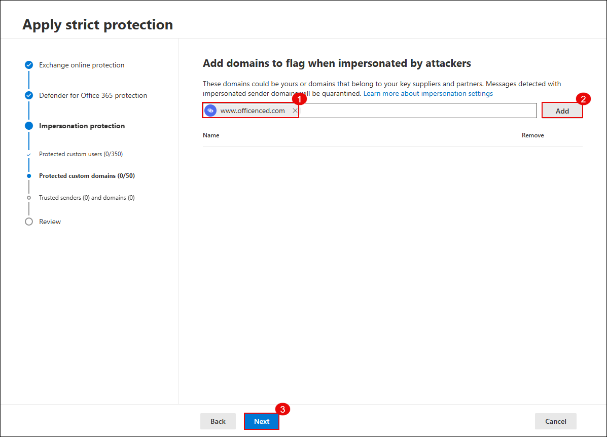
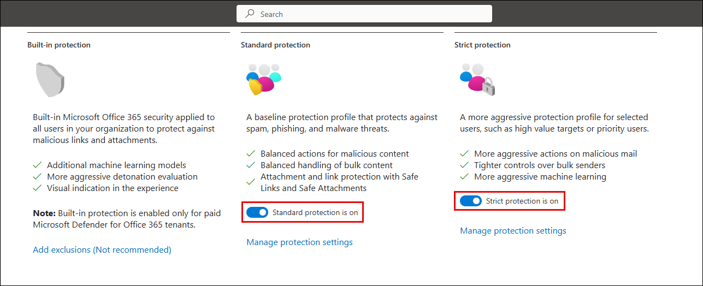

## Exercise 1: Configure Threat Policies in Microsoft Defender for Office 365

### Task 1: Enable Defender CSPM and Configure Threat Policies

In this task, you will enable Microsoft Defender CSPM for your environment and configure standard and strict threat protection policies using Microsoft Defender XDR.

1. On the **Azure Portal** home page, search for **Microsoft Defender for Cloud (1)** and select it from the **results (2)**.

   

3. In the **Enhance your security posture by enabling Defender CSPM** dialog, click **Enable** to activate the Defender CSPM plan.

   

5. On the **Microsoft Defender for Cloud | Inventory** blade, select **Inventory (2)** under **General (1)** and confirm the Defender status is **Off (3)** for listed resources.
 
   

7. In the **Management (1)** section, select **Environment settings (2)**. Expand **Azure (3)** > **Tenant Root Group (4)** and select the **subscription (5)**.

   

9. Under **Settings**, select **Defender plans (1)**. Turn on **Foundational CSPM (2)**, **Defender CSPM (3)**, and **Servers under Cloud Workload Protection (4)**. Click **Save (5)**.
 
   

11. In the Microsoft Defender portal, expand **Email & collaboration (1)**, then go to **Policies & rules (2)**, and click **Threat policies (3)**.
  
   

13. In the **Apply standard protection** wizard, select **Specific recipients (1)** and enter the user email (2). Click **Next (3)**.
  
   

15. On the **Defender for Office 365 protection** tab, again select **Specific recipients (1)**, provide the user (2), and click **Next (3)**.
  
   

17. On the **Review** screen, verify Exchange Online and Defender for Office 365 policies are applied to the correct user. Click **Confirm (3)**.
  
   

19. On the protection profiles page, click **Manage protection settings** under **Standard protection**.
  
    

21. In the **Apply strict protection** wizard, select **Specific recipients (1)**, enter the user (2), and click **Next (3)**.
  
    

23. Under **Defender for Office 365 protection**, confirm **Specific recipients (1)** is selected, user is added (2), and click **Next (3)**.
  
    

25. On the **Impersonation protection** screen, add an external email address (1)(2), click **Add (3)**, and then click **Next (4)**.
  
    

27. Add a domain to be flagged for impersonation detection (1), click **Add (2)**, and proceed by clicking **Next (3)**.

    

29. Confirm that **Standard protection is on** and **Strict protection is on** as shown.
 
    
