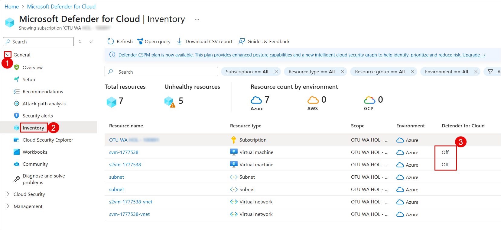
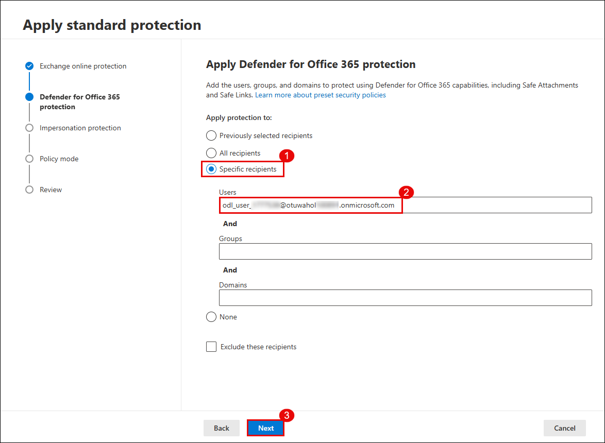

## Task 1: Configure Threat Policies in Microsoft Defender for Office 365

In this task, you will enable Microsoft Defender CSPM for your environment and configure both standard and strict protection policies using Microsoft Defender XDR.

1. Go to the [Azure Portal](https://portal.azure.com), and search for **Microsoft Defender for Cloud (1)**, Select it from the **results (2)**.

   

1. When prompted, click **Enable** to activate Defender CSPM.

   

   > **Note:** If you don’t see the pop-up prompt, continue with the lab steps below.

   > **Note:** Enabling Defender CSPM unlocks advanced posture management features such as attack path analysis and permission visibility.

1. In **Microsoft Defender for Cloud**, navigate to **Inventory (2)** under **General (1)** and verify that the **Defender for Cloud** status is **Off (3)** for the listed resources.

   

1. Go to **Environment settings (2)** under **Management (1)**, expand **Azure (3)** → **Tenant Root Group (4)**, and select your **subscription (5)**.

   

1. Under **Defender plans (1)**, turn on the following options and click **Save (5)**:
   - **Foundational CSPM (2)**
   - **Defender CSPM (3)**
   - **Servers under Cloud Workload Protection (4)**

   

1. Return to **Inventory** and confirm the **Defender for Cloud** status now shows as **On**.

   > **Note:** Your Defender protection is now active for all supported workloads.

1. Open the [Microsoft 365 Defender Portal](https://security.microsoft.com)

1. In the left pane, go to **Email & collaboration (1)** → **Policies & rules (2)** → **Threat policies (3)**.

   

1. Select **Standard Protection**, then click **Manage protection settings**.

   

1. In the protection wizard:
    - Choose **Specific recipients (1)**  
    - Add your **lab user (2)**  
    - Click **Next (3)**

    
    

1. On the **Review** screen, verify the policy applies to the correct user and click **Confirm (3)**.

    

    > **Note:** Standard protection includes Safe Attachments, Safe Links, and anti-phishing policies.

1. Under **Strict Protection**, click **Manage protection settings**.

    

1. Like before:
    - Select **Specific recipients (1)**  
    - Add your **lab user (2)**  
    - Click **Next (3)**

    
    

1. Configure **Impersonation Protection** by adding:
    - Key email addresses (1)(2), then click **Add (3)**  
    - Click **Next (4)**

    

1. Add a domain to the flag for impersonation detection:
    - Enter the **domain (1)**, click **Add (2)**, and click **Next (3)**

    

1. Once completed, confirm that:
    - **Standard protection is on**  
    - **Strict protection is on** for selected users

    

    > **Note:** You have now successfully configured multi-layered threat policies for both general and high-risk users.
