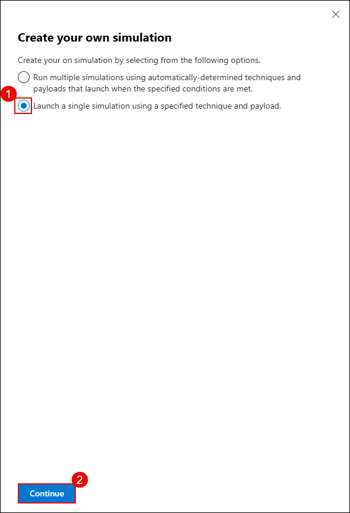
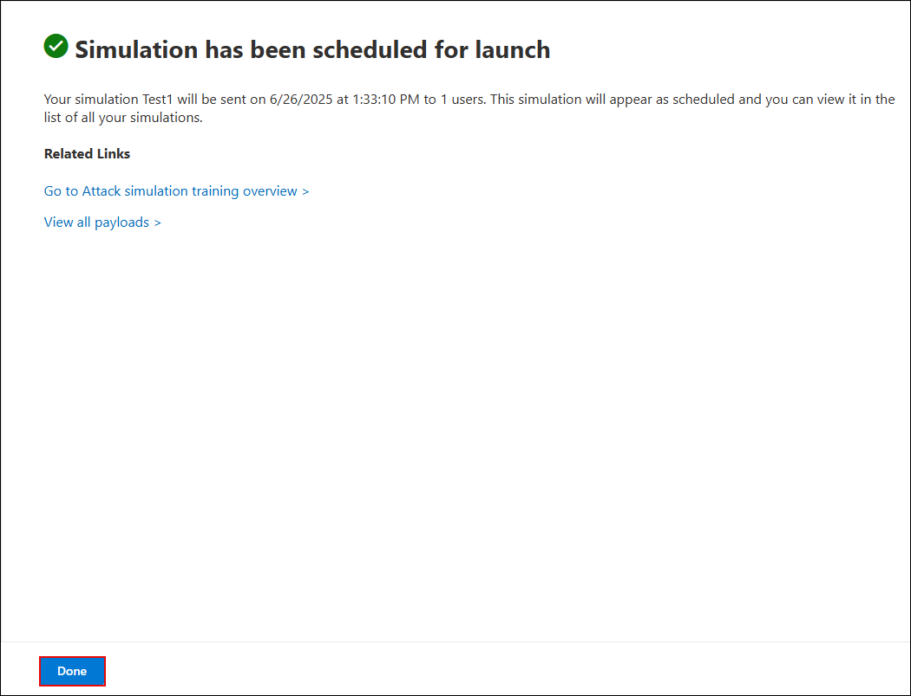

# Exercise 1: Configuring Threat Policies and Simulating Attacks in Microsoft Defender for Office 365

## Overview

In this exercise, you will configure advanced threat protection policies and simulate real-world phishing and malware attacks using Microsoft Defender for Office 365. You will start by enabling Microsoft Defender CSPM and setting up both standard and strict protection policies to secure your environment. Then, using Attack Simulation Training, you’ll launch simulated phishing and malware campaigns to evaluate user susceptibility and test how well the configured policies mitigate threats. This hands-on exercise helps strengthen your organization’s security posture through layered protection and proactive user assessment.

## Objectives

- Task 1: Configure Threat Policies in Microsoft Defender for Office 365 
- Task 2: Simulate Phishing and Malware Attacks Using Attack Simulator 

## Task 1: Configure Threat Policies in Microsoft Defender for Office 365

In this task, you will enable Microsoft Defender CSPM for your environment and configure both standard and strict protection policies using Microsoft Defender XDR.

1. Go to the Azure Portal and search for **Microsoft Defender for Cloud (1)**, select it from the **results (2)**.

   

1. When prompted, click **Enable** to activate Defender CSPM.

   

   > **Note:** If you don’t see the pop-up prompt, continue with the lab steps below.

   > **Note:** Enabling Defender CSPM unlocks advanced posture management features such as attack path analysis and permission visibility.

1. In **Microsoft Defender for Cloud**, navigate to **Inventory (2)** under **General (1)** and view the **Defender for Cloud** status is **Off/On (3)** for the Virtual Machines.

   

1. Go to **Environment settings (2)** under **Management (1)**, expand **Azure (3)** → **Tenant Root Group (4)**, and select your **subscription (5)**.

   

1. Under **Defender plans (1)**, turn on the following options and click **Save (5)**:
   - **Foundational CSPM (2)**
   - **Defender CSPM (3)**
   - **Servers under Cloud Workload Protection (4)**

        

1. Return to **Inventory (2)** under the **Genral (2)** section and confirm the **Defender for Cloud** status now shows as **On (3)**.
   
    > **Note:** Your Defender protection is now active for all supported workloads.

1. On a new tab in the **Microsoft Edge** browser and go to the following URL in the address bar: [https://security.microsoft.com](https://security.microsoft.com).

1. In the left pane, go to **Email & collaboration (1)** → **Policies & rules (2)** → **Threat policies (3)**.

   

1. Under **Standard Protection**, click on **Manage protection settings**.

   

1. On the **Apply Exchange Online Protection** screen, select **Specific recipients (1)**, enter the user email in the **Users** field (2), and click **Next (3)**.

    

1. On the **Apply Defender for Office 365 protection** screen, select **Specific recipients (1)**, enter the user email in the **Users** field (2), and click **Next (3)**.

    

1. Click **Next** on the **Impersonation protection** and **Policy mode** screens until you reach the **Review** section.

1. On the **Review** screen, verify that **Exchange Online Protection (1)** and **Defender for Office 365 (2)** apply to the correct user, then click **Confirm (3)**.

    

    > **Note:** Standard protection includes Safe Attachments, Safe Links, and anti-phishing policies.

1. Under **Strict Protection**, click **Manage protection settings**.

    

1. On the **Apply Exchange Online Protection** screen, select **Specific recipients (1)**, enter the user email in the **Users** field (2), and click **Next (3)**.

    

1. On the **Apply Defender for Office 365 protection** screen, select **Specific recipients (1)**, enter the user email in the **Users** field (2), and click **Next (3)**.

    

1. Click **Next** on the **Impersonation protection** and **Policy mode** screens until you reach the **Review** section.

1. On the **Review** screen, verify that **Exchange Online Protection (1)** and **Defender for Office 365 (2)** apply to the correct user, then click **Confirm (3)**.

1. Once completed, confirm that:
    - **Standard protection is on (1)**  
    - **Strict protection is on (2)** for selected users

        

    > **Note:** You have now successfully configured multi-layered threat policies for both general and high-risk users.

## Task 2: Simulate Phishing and Malware Attacks Using Attack Simulator

In this task, you'll simulate phishing and malware attacks using Microsoft Defender's built-in **Attack Simulation Training**. These simulations help you evaluate user vulnerability and response to social engineering techniques.

1. In the **Microsoft Defender portal**, select **Email & collaboration (1)**, click **Attack simulation training (2)**, and then click **Launch your own simulation (3)**.

   

2. On the **Create your own simulation** screen, select **Launch a single simulation (1)** and click **Continue (2)**.

   

4. Under **Select technique**, choose **Credential Harvest (1)** and click **Next (2)**.

   

4. In the **Name simulation** step, enter a simulation name as `Test1` in the **Simulation name (1)** field, and click **Next (2)**.

   

5. Under **Select payload and login page**, choose **Global payloads (1)** and select a phishing payload such as **Expense report sharing - English (2)**. Click **Next (3)**.

   

6. On the **Target users** screen, select **Include only specific users and groups (1)**, click **Add users (2)**, and then click **Next (3)**.

   

7. On the **Add users** screen, search for the **user email (1)**, select the **user (2)** from the list, and click **Add User(s) (3)**.

   

8. On the **Target users** screen, confirm the **User** has been added and click **Next**.

9. On the **Assign training** screen, select **Microsoft training experience (1)**, choose **Assign training for me (2)**, set the due date to **7 days after Simulation ends (3)**, and click **Next (4)**.

   

10. Under **Select landing page**, choose a **login page template (1)** and click **Next (2)**.

    

11. In the **End user notification** section, select **Microsoft default notification (1)** and configure:
    - Positive reinforcement: **Deliver during simulation (2**)
    - Training reminder: **Weekly (3)**
    Click **Next (4)**.

        

12. In the **Launch details** step, select **Launch this simulation as soon as I'm done (1)**, set **duration to 2 days (2)**, and click **Next (3)**.

    

13. Review the configuration summary and click **Submit** to start the simulation.

    

14. On completion, click **Done**.

    

15. 16. Verify the simulation appears in the dashboard as **In progress**.

    

16. To simulate a **Malware Attack**, go back to **Attack simulation training**, click **Launch your own simulation**, and choose **Malware Attachment (1)**. Click **Next (2)**.

    

    > **Note:** You’ve successfully launched a phishing simulation. It will monitor how users interact with suspicious emails.

17. Enter a new simulation name **`Test2`** and click **Next (2)**.

    

18. Under **Payload selection**, choose a malware attachment like **HR notification on update of contract - English (2)** and click **Next (3)**.

    

19. In the **End user notification** screen, select **Microsoft default notification (1)**, ensure **Deliver during simulation (2)** and **Weekly reminder (3)** are selected, and click **Next (4)**.

    

20. Set the **Launch configuration (1)** to launch immediately, set duration to **2 days (2)**, and click **Next (3)**.

    

21. On the **Select end user notification** screen, choose **Microsoft default notification (1)**, set **Deliver during simulation (2)** and **Weekly (3)** as delivery preferences, then click **Next (4)**.

    

22. Review the details and click **Submit** to complete the malware simulation setup.

    

> **Note:** This simulation mimics a malicious file being sent via email, testing how users respond to attachment-based threats.

> **Congratulations** on completing the task! Now, it's time to validate it. Here are the steps:  
> - Hit the Validate button for the corresponding task. If you receive a success message, you can proceed to the next task.  
> - If not, carefully read the error message and retry the step, following the instructions in the lab guide.  
> - If you need any assistance, please contact us at cloudlabs-support@spektrasystems.com. We are available 24/7 to help you out.  
<validation step="064a226a-790e-4e5f-b789-d84483110e38" />

## Review

In this lab, you have completed the following tasks:

- Configured standard and strict protection policies using Microsoft Defender for Office 365  
- Enabled Microsoft Defender CSPM and verified security posture settings  
- Simulated phishing and malware attacks using Attack Simulation Training  
- Assessed user vulnerability and policy effectiveness through simulation results

### You have successfully completed the lab. Click on **Next >>** to proceed with the next Lab.

