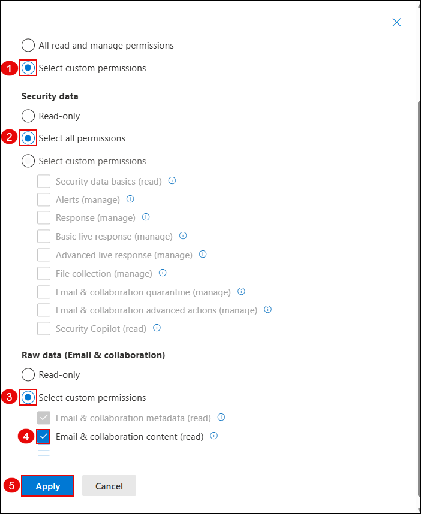

## Task 1: Analyze Threats with Threat Explorer and Real-Time Detections

In this task, you'll create a custom role in Microsoft Defender to manage access and permissions, simulate a phishing interaction, and investigate user activity using Threat Explorer.

1. On the **System > Permissions** blade in the Microsoft Defender portal, click **Create a custom role**.

   

1. Under the **Microsoft Defender XDR** section, click **Create custom role**.

   

1. On the **Set up the basics** page, enter a role name (e.g., `Test-role`) and click **Next**.

   

1. On the **Permissions** screen, select **Select custom permissions (1)**.  
   Then, under **Security data**, choose **Select all permissions (2)**.  
   Under **Raw data**, select **Select custom permissions (3)** and check **Email & collaboration content (read) (4)**.  
   Click **Apply (5)**.

   

1. On the **Security operations** screen, select **All read and manage permissions (1)** and click **Apply (2)**.

   

1. On the **Assignments** screen, provide assignment details:
   - Assignment name: `Test-assignment` (1)
   - Select the lab user (e.g., `ODL_User 1781683`) (2)
   - Choose data source: **Microsoft Defender for Office 365** (3)  
   Click **Add (4)**.

   

1. On the **Review and finish** page, verify the assigned permissions and users, then click **Submit (2)**.

   

1. Open the lab user’s mailbox and locate the phishing email titled **"File inloop Expenses Report.xlsx Has Been Shared with ODL_User"**.

   

1. Click **Open** in the email to simulate a phishing link click.

   

   > Note: This activity simulates a phishing attack and may trigger credential submission logs.

1. On the **Email & collaboration > Explorer** pane, go to the **URL clicks** tab.  
   Use time and recipient filters to locate the user’s phishing email activity.

   

1. Click on the URL entry to open the full click event details.

   

   > Note: This shows the clicked URL, click metadata, and incident correlation.

1. On the **Email & collaboration > Attack simulation training** blade, go to the **Simulations** tab.  
   Select the simulation named `Test1`.

   

1. View the simulation report to observe the results.  
   In this example, 100% of users were compromised and 0% reported the phishing attempt.

   

1. Click the affected user to view detailed actions taken during the simulation such as reading the email, clicking the link, and submitting credentials.

   

   > Note: This data helps evaluate user behavior and identify high-risk individuals.

