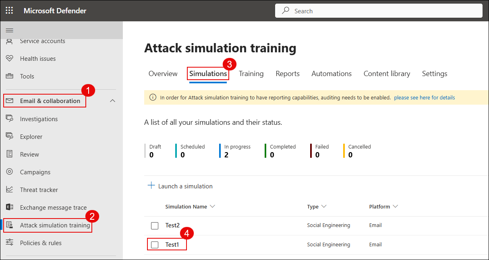

## Task 1: Analyze Threats with Threat Explorer and Real-Time Detections

In this task, you'll create a custom role in Microsoft Defender to manage access and permissions, simulate a phishing interaction, and investigate user activity using Threat Explorer.

1. On a new tab in the **Microsoft Edge browser** and go to the following URL in the address bar: https://security.microsoft.com.

1. On the **System > Permissions** blade in the Microsoft Defender portal, click **Create a custom role**.

   

1. Under the **Microsoft Defender XDR** section, click **Create custom role**.

   

1. On the **Set up the basics** page, enter a role name **`Test-role` (1)** and click **Next (2)**.

   

1. On the **Permissions** screen, do the following:

   - Select **Select custom permissions (1)** under the main section.
   - Under **Security data**, choose **Select all permissions (2)**.
   - Scroll to **Raw data (Email & collaboration)** and select **Select custom permissions (3)**.
   - Check **Email & collaboration content (read) (4)**.
   - Click **Apply (5)** to save your selections.

      

1. On the **Security operations** screen, select **All read and manage permissions (1)** and click **Apply (2)**.

   

1. On the **Assignments** screen, provide assignment details:
   - Assignment name: **`Test-assignment` (1)**.
   - Select the lab user , **`ODL_User ...` (2)**.
   - Choose data source: **Microsoft Defender for Office 365 (3)**. 
   Click **Add (4)**.

   

1. On the **Review and finish** page, verify the assigned permissions and users, then click **Submit (2)**.

   

1. Open the lab user’s mailbox and locate the phishing email titled **"File inloop Expenses Report.xlsx Has Been Shared with ODL_User"**.

   

1. Click **Open** in the email to simulate a phishing link click.

   

   > Note: This activity simulates a phishing attack and trigger credential submission logs.

1. In the **Microsoft Defender portal**, do the following:

   - Select **Email & collaboration (1)** from the left navigation pane.
   - Click **Explorer (2)** under the Email section.
   - In the **URL clicks** tab, select the entry for the clicked timestamp.
   - Review the **URL (4)** that was clicked to investigate further.

      

1. Click on the **Open url page** to open the full event details.

   

   > Note: This shows the clicked URL, click metadata, and incident correlation.

1. In the **Microsoft Defender portal**, do the following:

   - Select **Email & collaboration (1)** from the left navigation pane.  
   - Click **Attack simulation training (2)**.  
   - Navigate to the **Simulations (3)** tab.  
   - Locate and select the simulation named **Test1 (4)** from the list.

      

1. View the simulation report to observe the results.  
   In this example, 100% of users were compromised and 0% reported the phishing attempt.

   

1. Click the **Affected user** to view detailed actions taken during the simulation such as reading the email, clicking the link, and submitting credentials.

   

   > Note: This data helps evaluate user behavior and identify high-risk individuals.

## Task 2: Configure Anti-Phishing and Safe Links Policies

In this task, you’ll configure Microsoft Defender anti-phishing and Safe Links policies to detect and prevent malicious emails and URLs.

1. On the Microsoft Defender portal (https://security.microsoft.com), go to **Email & collaboration (1)** → **Policies & rules (2)** → click **Threat policies** → select **Anti-phishing**.

   

2. Click **+ Create (1)** to create a new anti-phishing policy.

   

3. Enter a name such as `Anti-Phish (1)` and click **Next (2)**.

   

4. Under **Users**, select your lab user (1), then click **Next (2)**.

   

5. Set the **Phishing email threshold** to `4 - Most aggressive (1)` and click **Next (2)**.

   

6. Enable all intelligence features:

   - **(1)** Enable mailbox intelligence  
   - **(2)** Enable impersonation protection  
   - **(3)** Enable spoof intelligence  
   - Click **Next (4)** to continue

   

7. Set spoof and impersonation actions:

   - **(1)** Impersonated user → Move to Junk  
   - **(2)** Spoof with DMARC quarantine → Move to Junk  
   - **(3)** Spoof with DMARC reject → Quarantine  
   - **(4)** Spoof intelligence → Move to Junk  
   - Click **Next (5)**

   

8. Back in **Threat policies**, click **Safe Links (3)** under Policies.

   

9. Click **+ Create**, enter a name such as `Anti-Safe (1)` and click **Next (2)**.

   

10. Add the lab user (1) under **Users**, then click **Next (2)**.

    

11. Enable all recommended URL protection settings:

    - Safe Links for email, Teams, and Office apps  
    - Real-time scanning  
    - Wait for scan before delivery  
    - Track user clicks  
    - Click **Next**

    

12. Go to **Email & collaboration (1)** → **Policies & rules (2)** → Click on **Alert policy (3)**.

    

13. Click **+ New Alert Policy**.

    

14. Fill the following details and click **Next (4)**:

    - **(1)** Name: Alert-Safe  
    - **(2)** Severity: High  
    - **(3)** Category: Threat Management

    

15. Define the alert rule logic:

    - **(1)** Activity: Detected malware in an email  
    - **(2)** Mail direction: Inbound  
    - **(3)** Trigger: Every time activity matches  
    - Click **Next (4)**

    

16. Add alert recipients (1) and click **Next (2)**.

    

17. Choose **Yes, turn it on right away (1)** and click **Submit (2)** to create the policy.

    

18. Send a test email to the lab user with links:

    - https://www.amtso.org/check-desktop-phishing-page/  
    - https://malware.wicar.org/data/eicar.com.txt  

    

    > **Note:** These are legitimate safe testing links for phishing and malware simulation.

19. Go to **Email & collaboration (1)** → **Explorer (2)** and open the test mail **Test-safe (3)**.

    

20. Click **Open email entity (1)** and review:

    - **Original location**: Quarantine  
    - **Detection technologies**: URL malicious reputation, mixed analysis  

    

21. Navigate to **Investigation & response (1)** → **Incidents (2)**, select incident **Alert-Link (3)** and click to view details (4).

    

