# Exercise 3: Implement and Monitor Secure Posture in Microsoft Defender for Office 365 and XDR

## Overview

In this exercise, you will implement and monitor the secure posture of your Microsoft 365 environment using built-in features in Microsoft Defender for Office 365 and Microsoft Defender XDR. You'll start by reviewing and validating preset security policies, analyzing configuration gaps using the Configuration Analyzer, enabling DKIM and tagging priority accounts. Then, you’ll simulate a phishing incident, investigate the email using Threat Explorer, take remediation actions, submit the message for analysis, and review the results of automated investigations—all from the Defender XDR portal.

## Objectives

- Task 1: Implement and Monitor Defender for Office 365 Secure Posture
- Task 2: Investigate and Remediate incidents in Microsoft Defender XDR

## Task 1: Implement and Monitor Defender for Office 365 Secure Posture

1. On the **Microsoft Defender portal**, select **Email & collaboration (1)** from the left navigation pane and then click on **Policies & rules (2)** under **Policies & rules**, click **Threat policies (3)**.

   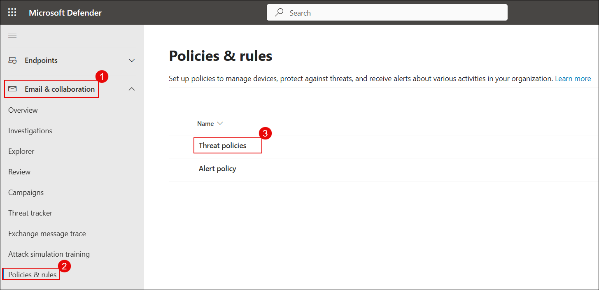

3. On the **Threat policies** page, under **Templated policies**, click on **Preset Security Policies**.
  
   

1. Confirm that **Standard protection (1)** and **Strict protection (2)** are enabled. These policies enforce Safe Links, Safe Attachments, and tighter anti-phishing controls based on user risk levels.

   

   > **Standard protection** applies to all users with a baseline of spam, phishing, and malware protection.

   > **Strict protection** targets VIP or high-risk users with more aggressive detection rules and enhanced ML-based scanning.

   > If either toggle is **Off**, enable it to strengthen your Defender posture.

1. On the **Threat policies** page, scroll to **Templated policies** and click **Configuration analyzer**.
  
   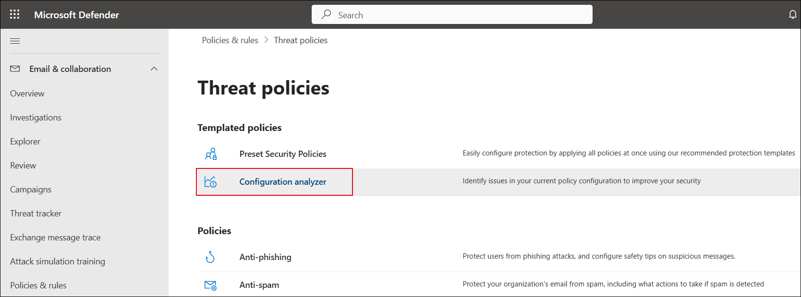

1. The **Configuration analyzer** provides recommendations under **Standard recommendations**. Note the counts for Anti-spam, Anti-phishing, DKIM, and Outlook misconfigurations.
  
   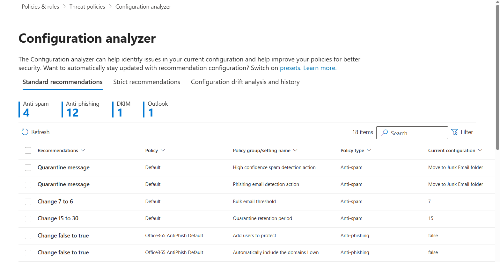

1. In the search box **(1)**, type `dkim` to filter results. Tick the checkbox for **Enable DKIM** **(2)**.
  
   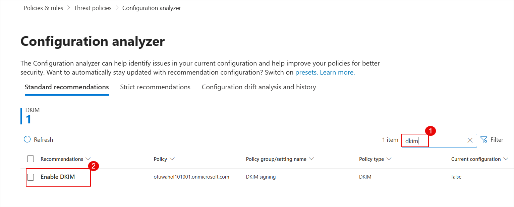

1. In the recommendation popup, click on **View policy** to jump to the DKIM settings page.
  
   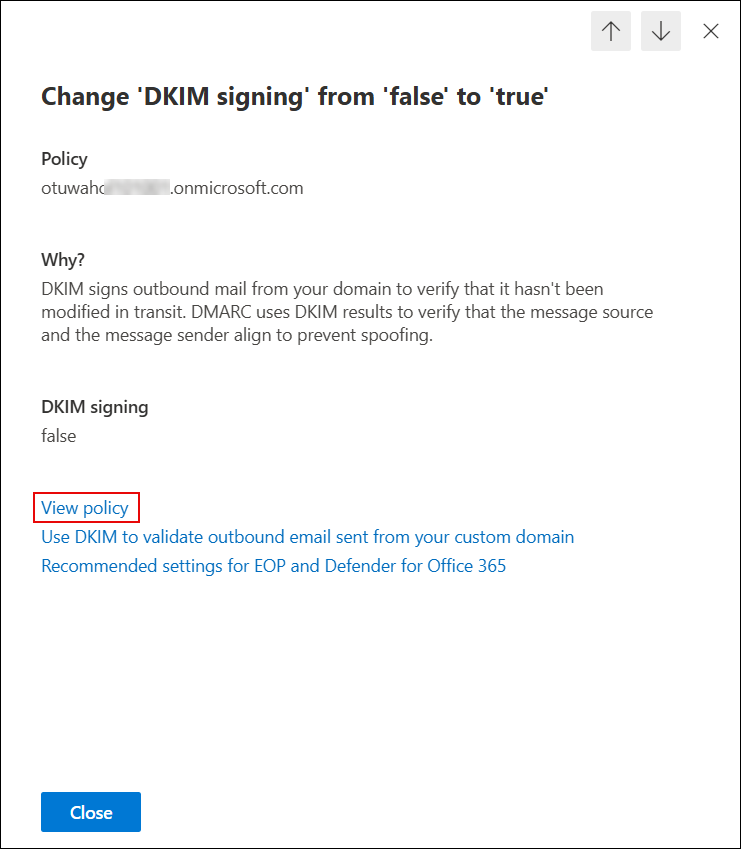

1. On the **Email authentication settings** page, ensure that DKIM signing is **Enabled** for your domain.
  
   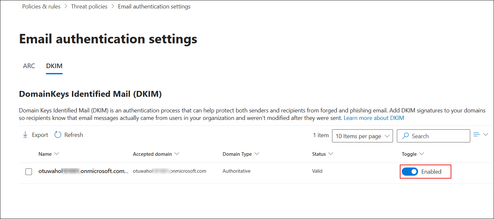

1. Open Outlook or any other client and compose a test email addressed to a Gmail ID to verify DKIM.
  
   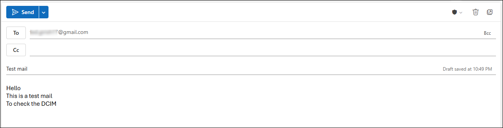

1. In Gmail, open the received test email, click the three dots in the top right corner, and select **Show original**.
  
   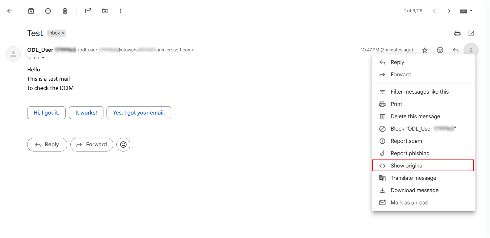

1. Under the **Original Message** view, confirm that **DKIM** shows as `'PASS'` for your domain.
  
    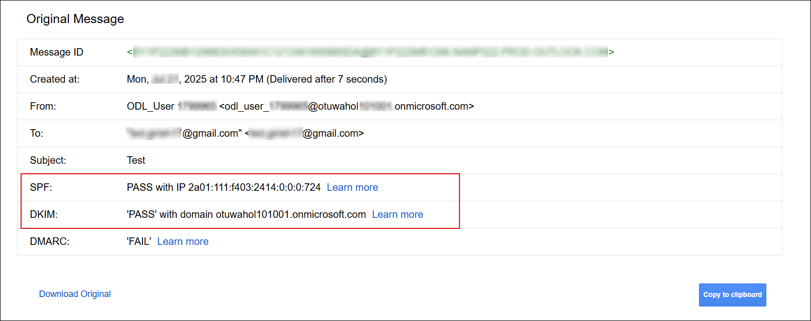

    > **Note**: DMARC validation may show as `'FAIL'` on `.onmicrosoft.com` domains. To enable full SPF, DKIM, and DMARC authentication, use a custom domain (e.g., `contoso.com`).

1. Back in the Defender portal, from the left menu, navigate to **System (1)** > **Settings (2)**, then select **Email & collaboration (3)**.
  
    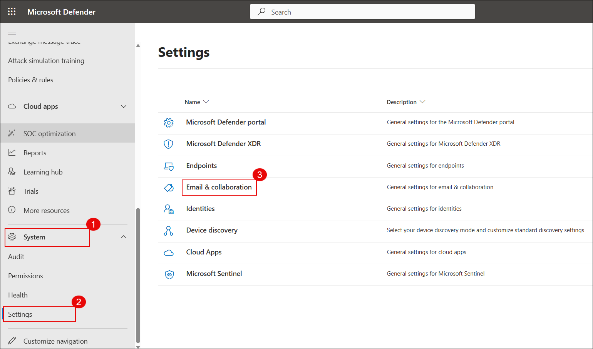

1. On the settings page, click **Priority account protection (1)** and turn the toggle to **On (2)**.
  
    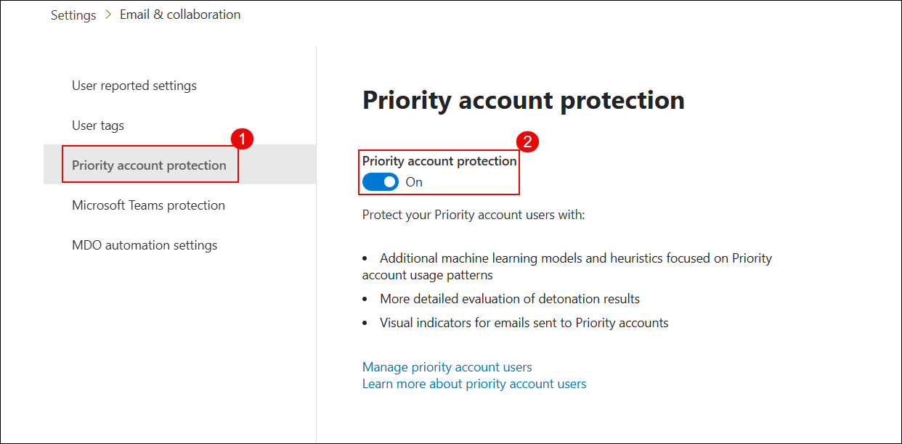

1. From the same settings pane, click **User tags (1)**, select the **PRIORITY ACCOUNT (2)** tag, and click **Edit (3)**.
  
    

1. On the **Edit tag Priority account** screen, click **+ Add members**.
  
    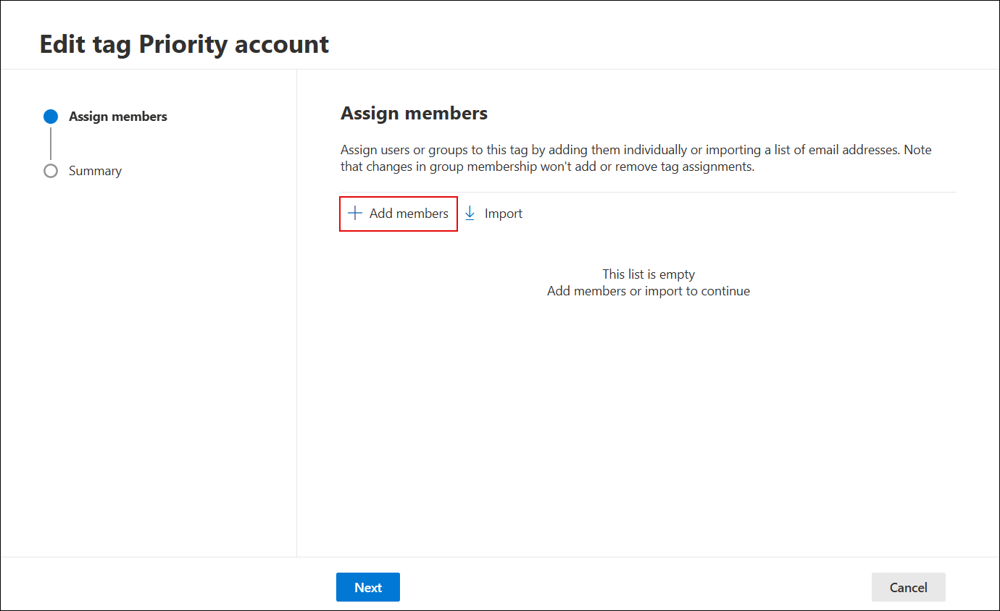

1. Search for the user you want to tag (e.g., `ODL_User`) **(1)** and click **Add (2)**.
  
    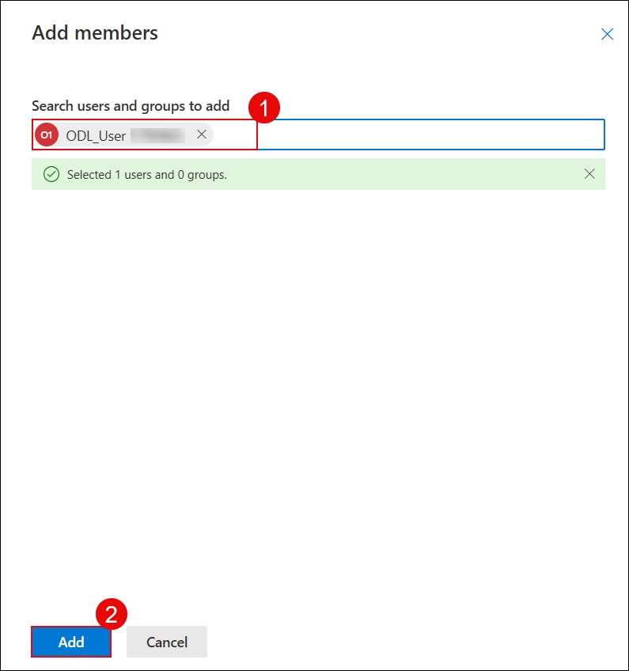

1. After the user is added, click **Next** to proceed.
  
    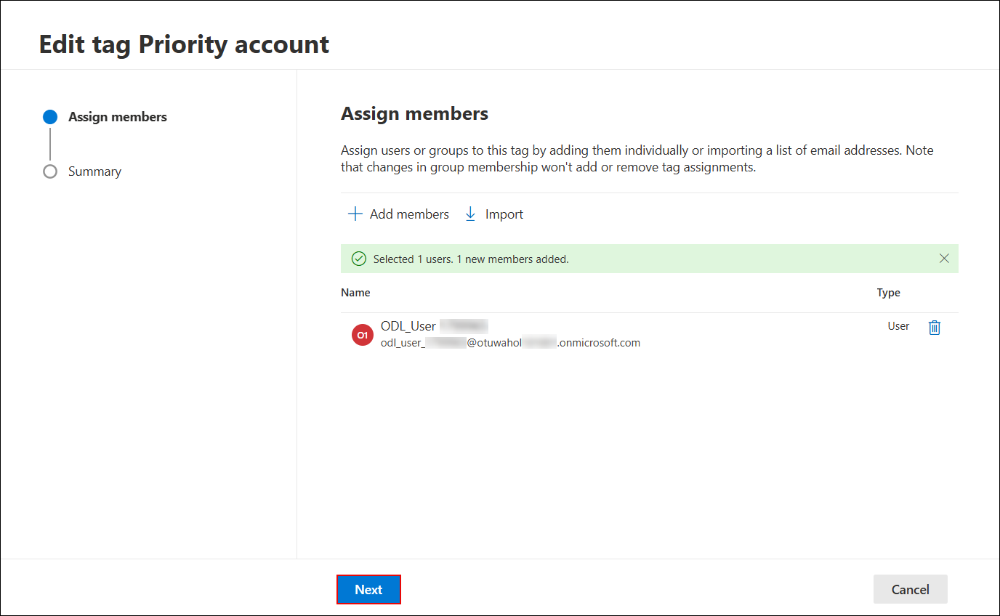

1. Review the tag summary and click **Submit**.
  
    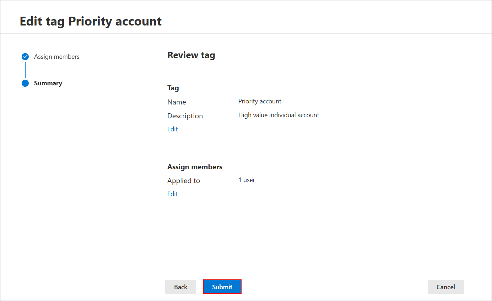

1. After successful submission, click **Done** to finish tagging the user as a Priority Account.
  
    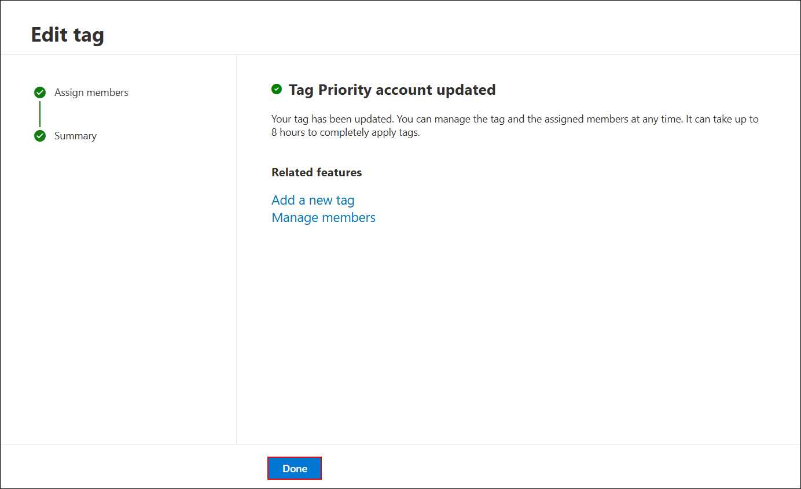

1. Finally, navigate to **Microsoft Secure Score** in the Defender portal. Review your organization’s **Secure Score**, top recommended actions, and breakdown by category.
  
    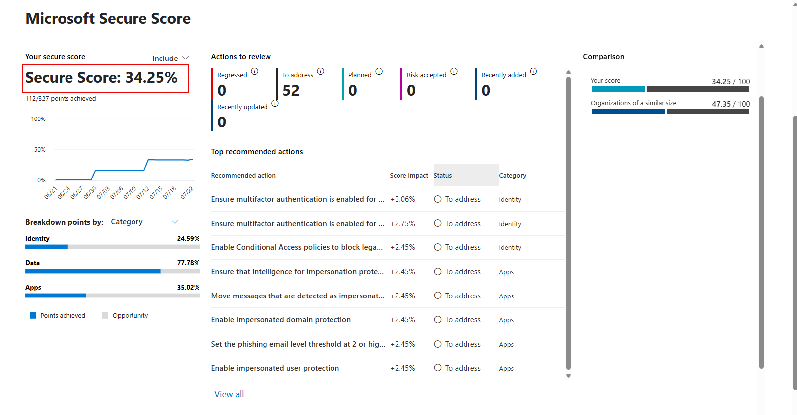

> 💡 This score helps monitor and improve your org’s security posture over time. Completing recommended actions here boosts your overall score and resilience.

## Task 2: Investigate and Remediate Incidents in Microsoft Defender XDR

In this task, you’ll simulate a phishing incident, investigate the suspicious message using Threat Explorer, take remediation actions, submit the message to Microsoft for analysis, and review the automated investigation results.

1. Send a test email to your lab user containing links such as:

   - https://youtube.com/  
   - https://openai.com/  

   

1. On the Microsoft Defender portal (https://security.microsoft.com), go to **Email & collaboration (1)** → **Explorer (2)**. Select the phishing email entry **Test Phishing (4)**.

   

   > **Note:** It may take 2–3 minutes for the email to appear in Explorer after delivery.

1. Click the message to open its details. Then click **Take action**.

   

1. On the **Choose response actions** page:

   - **(1)** Toggle on **Show all response actions**  
   - **(2)** Select **Move or delete**  
   - **(3)** Choose **Junk**  
   - **(4)** Select **Submit to Microsoft for review**  
   - **(5)** Choose **I've confirmed it’s a threat**  
   - **(6)** Select **Phish** as the category  
   - **(7)** Enable **Initiate automated investigation**  
   - Click **Next (8)**

   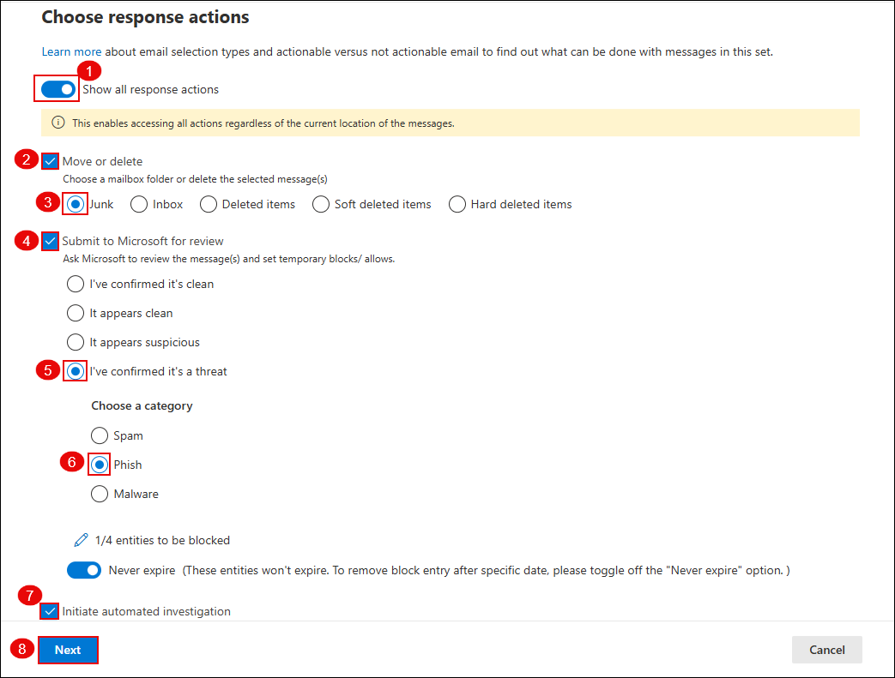

1. On the **Choose target entities** page, enter a name such as `report-phish (1)` and review the impacted users. Click **Next (2)**.

   

1. Navigate to **Incidents & alerts (1)** → **Alerts (2)**. Locate the alert titled **Administrative action submitted by an Administrator (3)**.

   

1. Click the alert to open details. Then click **Manage alert**.

   

1. In the **Manage alert** panel:

   - **(1)** Set **Status** to `In progress`  
   - **(2)** Assign to your lab user  
   - **(3)** Set **Classification** to `True positive – Phishing`  
   - Click **Save (4)**

   

1. Go to **Email & collaboration (1)** → **Investigations (2)**. Click on the latest investigation entry related to your phishing test **(3)**.

   

1. Review the investigation graph which shows:

    - **Alert received**  
    - **Entities analyzed**  
    - **Mailbox involved**  
    - **Result**: No threats found

    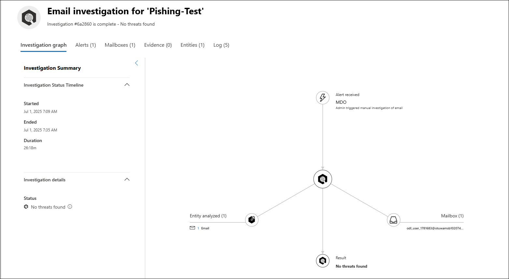

    > **Note:** It may take 10–15 minutes for the automated investigation to fully complete and show results.

## Review

In this lab, you have completed the following tasks:

- Verified preset security policies and enabled DKIM and Priority Account protection.
- Reviewed secure posture using Configuration Analyzer and Secure Score.
- Simulated a phishing email and performed investigation and remediation using Defender XDR.

### You have successfully completed the lab. Click on **Next >>** to proceed with the next Lab.

