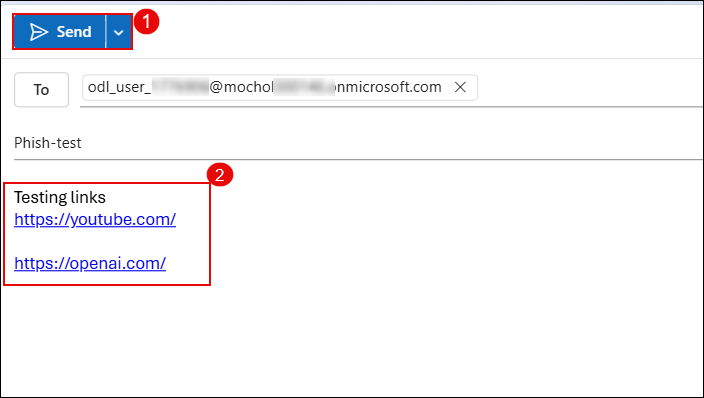

## Task 1: Implement and Monitor Defender for Office 365 Secure Posture

## Task 2: Investigate and Remediate Incidents in Microsoft Defender XDR

In this task, you’ll simulate a phishing incident, investigate the suspicious message using Threat Explorer, take remediation actions, submit the message to Microsoft for analysis, and review the automated investigation results.

1. Send a test email to your lab user containing links such as:

   - https://youtube.com/  
   - https://openai.com/  

   

2. On the Microsoft Defender portal (https://security.microsoft.com), go to **Email & collaboration (1)** → **Explorer (2)**. Select the phishing email entry **Test Phishing (4)**.

   

   > **Note:** It may take 2–3 minutes for the email to appear in Explorer after delivery.

3. Click the message to open its details. Then click **Take action**.

   

4. On the **Choose response actions** page:

   - **(1)** Toggle on **Show all response actions**  
   - **(2)** Select **Move or delete**  
   - **(3)** Choose **Junk**  
   - **(4)** Select **Submit to Microsoft for review**  
   - **(5)** Choose **I've confirmed it’s a threat**  
   - **(6)** Select **Phish** as the category  
   - **(7)** Enable **Initiate automated investigation**  
   - Click **Next (8)**

   

5. On the **Choose target entities** page, enter a name such as `report-phish (1)` and review the impacted users. Click **Next (2)**.

   

6. Navigate to **Incidents & alerts (1)** → **Alerts (2)**. Locate the alert titled **Administrative action submitted by an Administrator (3)**.

   

7. Click the alert to open details. Then click **Manage alert**.

   

8. In the **Manage alert** panel:

   - **(1)** Set **Status** to `In progress`  
   - **(2)** Assign to your lab user  
   - **(3)** Set **Classification** to `True positive – Phishing`  
   - Click **Save (4)**

   

9. Go to **Email & collaboration (1)** → **Investigations (2)**. Click on the latest investigation entry related to your phishing test **(3)**.

   

10. Review the investigation graph which shows:

    - **Alert received**  
    - **Entities analyzed**  
    - **Mailbox involved**  
    - **Result**: No threats found

    

    > **Note:** It may take 10–15 minutes for the automated investigation to fully complete and show results.

---

## Review

1. You successfully simulated a phishing attack and reviewed its delivery details.  
2. You took action using Threat Explorer, submitted the message for Microsoft analysis, and triggered an automated investigation.  
3. You reviewed the alert, updated its classification, and confirmed the response via the investigation timeline.

---

## Lab Complete

You’ve now explored the full remediation workflow for phishing incidents in Microsoft Defender XDR — from detection to resolution.

