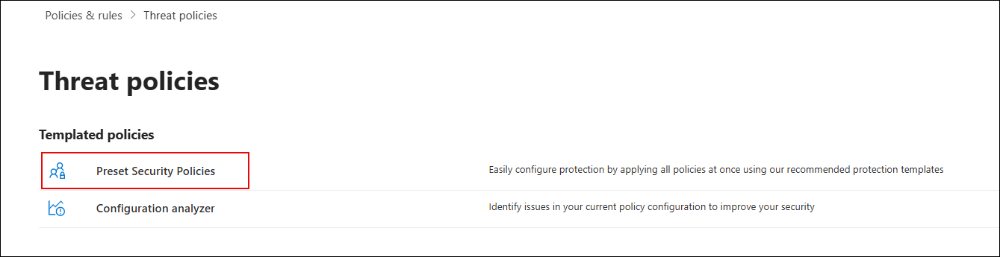
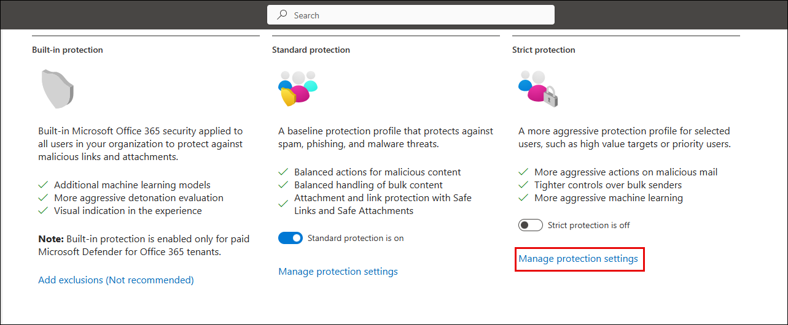

## Task 1: Configure Threat Policies in Microsoft Defender for Office 365

### Estimated Duration: 30 Minutes

## Overview

In this task, you will enable Microsoft Defender CSPM for your environment and configure both standard and strict protection policies using Microsoft Defender XDR.

1. Go to the Azure Portal and search for **Microsoft Defender for Cloud (1)**, select it from the **results (2)**.

   

1. When prompted, click **Enable** to activate Defender CSPM.

   

   > **Note:** If you don’t see the pop-up prompt, continue with the lab steps below.

   > **Note:** Enabling Defender CSPM unlocks advanced posture management features such as attack path analysis and permission visibility.

1. Go to **Environment settings (2)** under **Management (1)**, expand **Azure (3)** → **Tenant Root Group (4)**, and select your **subscription (5)**.

   

1. Under **Defender plans (1)**, turn on the following options and click **Save (5)**:
   - **Foundational CSPM (2)**
   - **Defender CSPM (3)**
   - **Servers under Cloud Workload Protection (4)**

        

1. On a new tab in the **Microsoft Edge** browser and go to the following URL in the address bar: [https://security.microsoft.com](https://security.microsoft.com).

1. In the left pane, go to **Email & collaboration (1)** → **Policies & rules (2)** → **Threat policies (3)**.

   

1. On the **Threat policies** page, under **Templated policies**, click on **Preset Security Policies**.
   
   

1. Under **Standard Protection**, click on **Manage protection settings**.

   

1. On the **Apply Exchange Online Protection** screen, select **Specific recipients (1)**, enter the user email in the **Users** field (2), and click **Next (3)**.

    

1. On the **Apply Defender for Office 365 protection** screen, select **Specific recipients (1)**, enter the user email in the **Users** field (2), and click **Next (3)**.

    

1. Click **Next** on the **Impersonation protection** and **Policy mode** screens until you reach the **Review** section.

1. On the **Review** screen, verify that **Exchange Online Protection (1)** and **Defender for Office 365 (2)** apply to the correct user, then click **Confirm (3)**.

    

    > **Note:** Standard protection includes Safe Attachments, Safe Links, and anti-phishing policies.

1. Under **Strict Protection**, click **Manage protection settings**.

    

1. On the **Apply Exchange Online Protection** screen, select **Specific recipients (1)**, enter the user email in the **Users** field (2), and click **Next (3)**.

    

1. On the **Apply Defender for Office 365 protection** screen, select **Specific recipients (1)**, enter the user email in the **Users** field (2), and click **Next (3)**.

    

1. Click **Next** on the **Impersonation protection** and **Policy mode** screens until you reach the **Review** section.

1. On the **Review** screen, verify that **Exchange Online Protection (1)** and **Defender for Office 365 (2)** apply to the correct user, then click **Confirm (3)**.

1. Once completed, confirm that:
    - **Standard protection is on (1)**  
    - **Strict protection is on (2)** for selected users

        

    > **Note:** You have now successfully configured multi-layered threat policies for both general and high-risk users.

## Review

In this lab, you have completed the following tasks:

- Enabled Microsoft Defender CSPM to activate advanced posture management capabilities.
- Configured both Standard and Strict preset security policies to protect users based on risk levels.

### You have successfully completed the lab. Click on **Next >>** to proceed with the next Lab.

