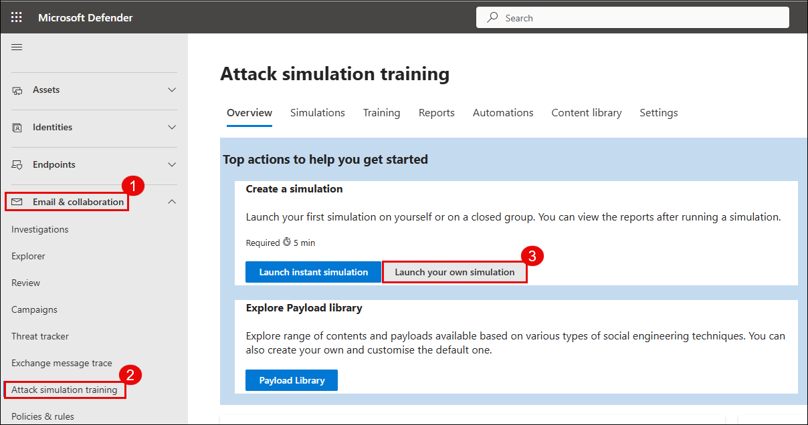
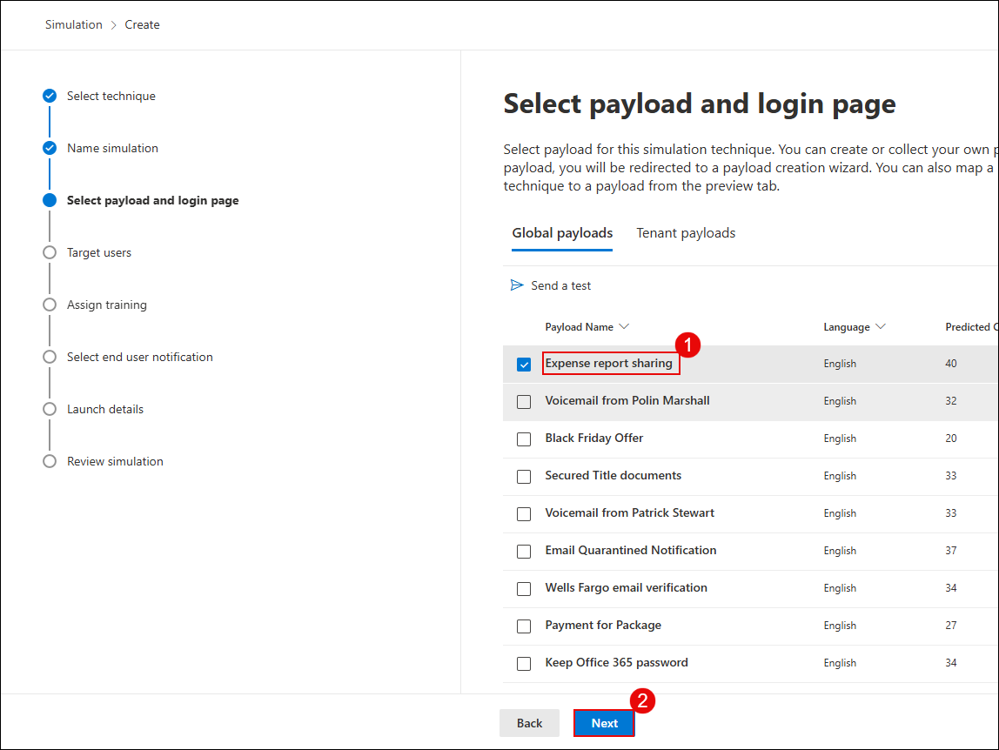
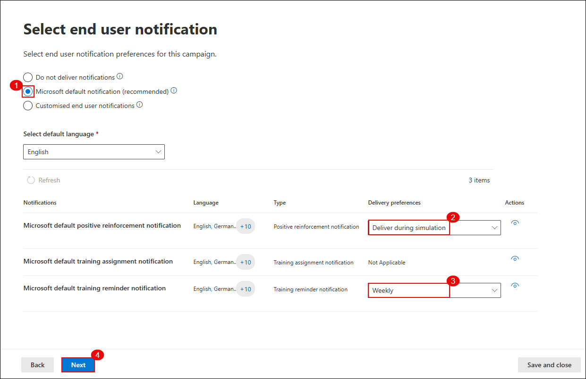
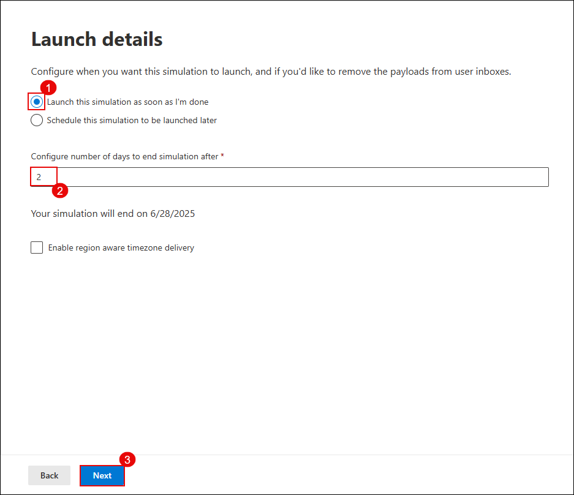
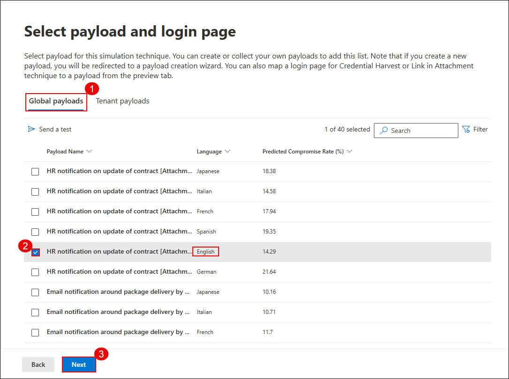

## Task 2: Simulate Phishing and Malware Attacks Using Attack Simulator

In this task, you'll simulate phishing and malware attacks using Microsoft Defender's built-in **Attack Simulation Training**. These simulations help you evaluate user vulnerability and response to social engineering techniques.

### Estimated Duration: 30 Minutes

1. In the **Microsoft Defender portal**, select **Email & collaboration (1)**, click **Attack simulation training (2)**, and then click **Launch your own simulation (3)**.

   

1. On the **Create your own simulation** screen, select **Launch a single simulation (1)** and click **Continue (2)**.

   

1. Under **Select technique**, choose **Credential Harvest (1)** and click **Next (2)**.

   

1. In the **Name simulation** step, enter a simulation name as `Test1` in the **Simulation name (1)** field, and click **Next (2)**.

   

1. Under **Select payload and login page**, choose **Global payloads (1)** and select a phishing payload such as **Expense report sharing - English (2)**. Click **Next (3)**.

   

1. On the **Target users** screen, select **Include only specific users and groups (1)**, click **Add users (2)**, and then click **Next (3)**.

   

1. On the **Add users** screen, search for the **user email (1)**, select the **user (2)** from the list, and click **Add User(s) (3)**.

   

1. On the **Target users** screen, confirm the **User** has been added and click **Next**.

1. On the **Assign training** screen, select **Microsoft training experience (1)**, choose **Assign training for me (2)**, set the due date to **7 days after Simulation ends (3)**, and click **Next (4)**.

   

1. Under **Select landing page**, choose a **login page template (1)** and click **Next (2)**.

    

1. In the **End user notification** section, select **Microsoft default notification (1)** and configure:
    - Positive reinforcement: **Deliver during simulation (2**)
    - Training reminder: **Weekly (3)**
    Click **Next (4)**.

        

1. In the **Launch details** step, select **Launch this simulation as soon as I'm done (1)**, set **duration to 2 days (2)**, and click **Next (3)**.

    

1. Review the configuration summary and click **Submit** to start the simulation.

    

1. On completion, click **Done**.

    

1. Verify the simulation appears in the dashboard as **In progress**.

    

    > **Note:** You’ve successfully launched a phishing simulation. It will monitor how users interact with suspicious emails.

1. Under **Email & collaboration**, select **Attack simulation training** **(2)**. On the **Attack simulation training** page, select the **Simulations** tab **(3)**. Click **Launch a simulation** to begin creating a new attack simulation **(4)**.

    

1. To simulate a **Malware Attack**, choose **Malware Attachment (1)**. Click **Next (2)**.

    

1. Enter a new simulation name **`Test2`** and click **Next (2)**.

    

1. Under **Payload selection**, choose a malware attachment like **HR notification on update of contract - English (2)** and click **Next (3)**.

    

1. In the **End user notification** screen, select **Microsoft default notification (1)**, ensure **Deliver during simulation (2)** and **Weekly reminder (3)** are selected, and click **Next (4)**.

    

1. Set the **Launch configuration (1)** to launch immediately, set duration to **2 days (2)**, and click **Next (3)**.

    

1. Review the details and click **Submit** to complete the malware simulation setup.

    

> **Note:** This simulation mimics a malicious file being sent via email, testing how users respond to attachment-based threats.

> **Note:** The malware attack simulation will not appear in **Threat Explorer** because Microsoft Defender treats simulation payloads as non-malicious content. Simulated attacks are designed for training purposes and do not trigger standard detection engines or generate real threat signals within Explorer.

> **Congratulations** on completing the task! Now, it's time to validate it. Here are the steps:  
> - Hit the Validate button for the corresponding task. If you receive a success message, you can proceed to the next task.  
> - If not, carefully read the error message and retry the step, following the instructions in the lab guide.  
> - If you need any assistance, please contact us at cloudlabs-support@spektrasystems.com. We are available 24/7 to help you out.  
<validation step="a3ccf157-db5b-463e-b7cc-1a3b175c2f84" />

## Review

In this lab, you have completed the following tasks:

- Launched phishing and malware simulations using Attack Simulation Training.
- Evaluated user responses to simulated attacks and verified that protection policies were working as expected.

### You have successfully completed the lab. Click on **Next >>** to proceed with the next Lab.

