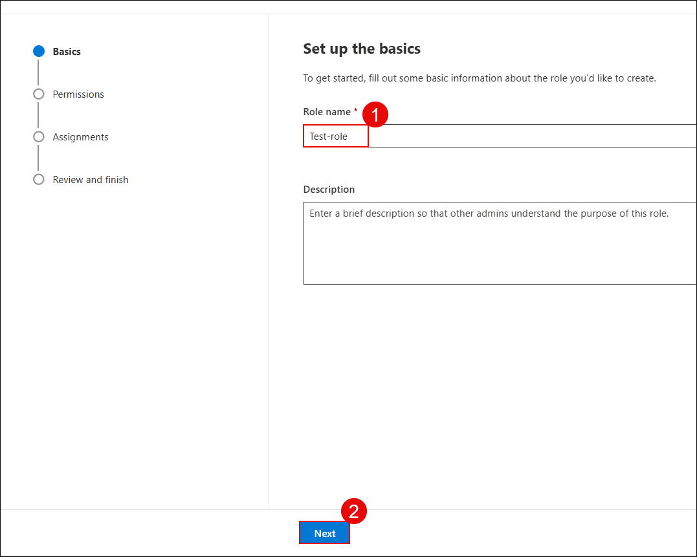
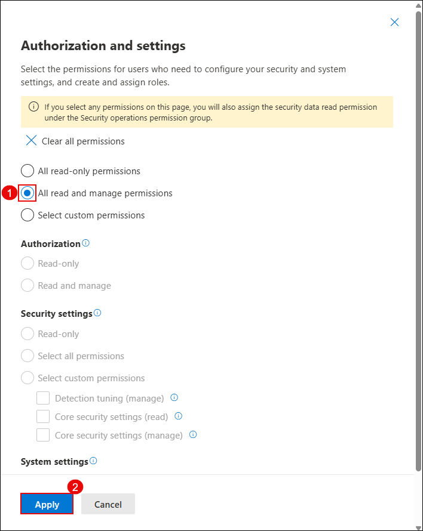
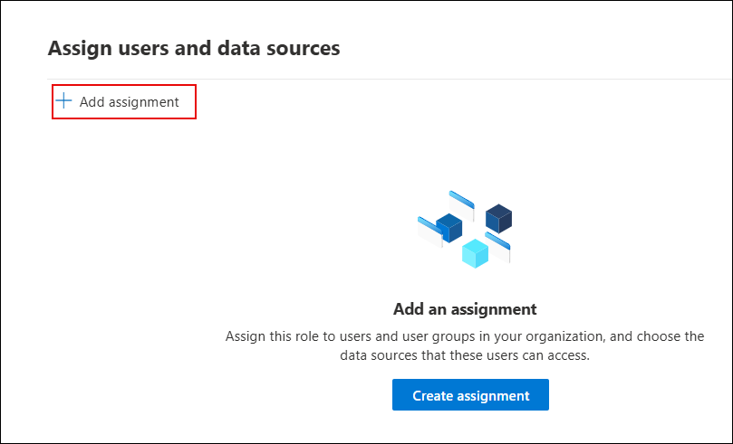
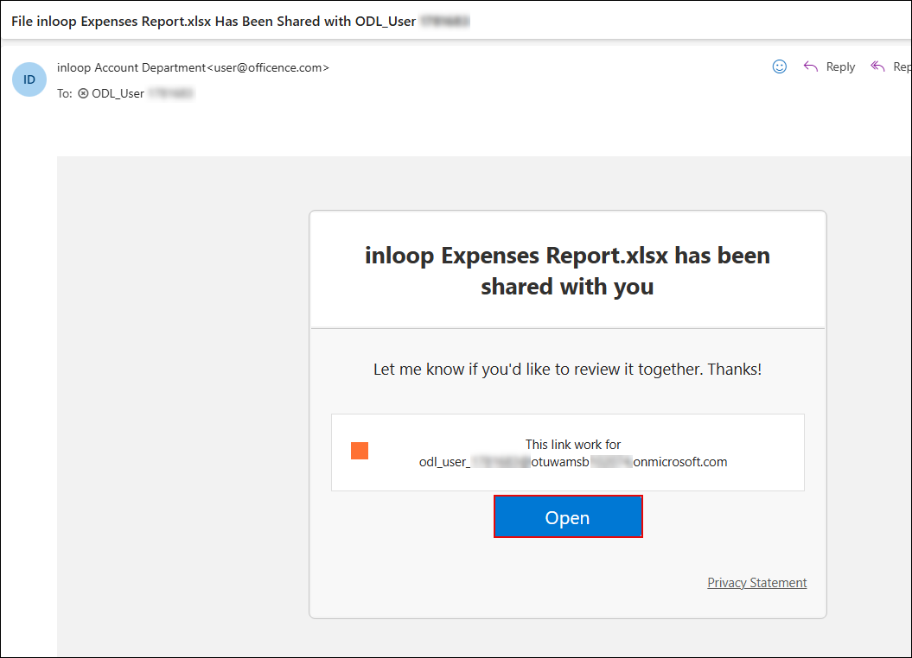
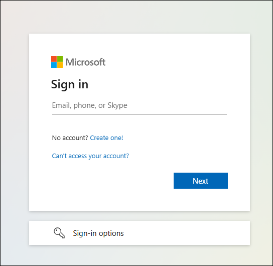

## Task 3: Analyze Threats with Threat Explorer and Real-Time Detections

### Estimated Duration: 30 Minutes

## Overview

In this task, you'll create a custom role in Microsoft Defender to manage access and permissions, simulate a phishing interaction, and investigate user activity using Threat Explorer.

1. On a new tab in the **Microsoft Edge browser** and go to the following URL in the address bar: https://security.microsoft.com.

1. On the **System > Permissions** blade in the Microsoft Defender portal, click **Create a custom role**.

   

1. Under the **Microsoft Defender XDR** section, click **Create custom role**.

   

1. On the **Set up the basics** page, enter a role name **`Test-role` (1)** and click **Next (2)**.

   

1. On the **Security operations** screen, select **All read and manage permissions (1)** and click **Apply (2)**.

   

1. On the **Security posture** pane, **All read and manage permissions** **(1)**. Then click **Apply** to save the configuration **(2)**.

1. On the **Authorization and settings** pane, select **All read and manage permissions** **(1)**. Then click **Apply** to save the configuration **(2)**.

   

1. On the **Assign users and data sources** page, click **Add assignment** to assign this role to users and select the data sources they can access.

   

1. On the **Assignments** screen, provide assignment details:
   - Assignment name: **`Test-assignment` (1)**.
   - Select the lab user , **`ODL_User<inject key="Deployment-id" enableCopy="false"></inject>` (2)**.
   - Choose data source: **Microsoft Defender for Office 365 (3)**. 
   Click **Add (4)**.

      

1. On the **Review and finish** page, verify the assigned permissions and users, then click **Submit (2)**.

   

1. Open the lab user’s mailbox and locate the phishing email titled **"File inloop Expenses Report.xlsx Has Been Shared with ODL_User"**.

   

1. Click **Open** in the email to simulate a phishing link click.

   

   > Note: This activity simulates a phishing attack and trigger credential submission logs.

1. When the user clicks the phishing simulation link and enters their credentials, they are redirected to a training page that displays a message indicating they were phished by the security team, along with guidance to learn from the experience.

   

1. In the **Microsoft Defender portal**, do the following:

   - Select **Email & collaboration (1)** from the left navigation pane.
   - Click **Explorer (2)** under the Email section.
   - In the **URL clicks** tab, select the entry for the clicked timestamp.
   - Review the **URL (4)** that was clicked to investigate further.

      

1. Click on the **Open url page** to open the full event details.

   

   > Note: This shows the clicked URL, click metadata, and incident correlation.

1. In the **Microsoft Defender portal**, do the following:

   - Select **Email & collaboration (1)** from the left navigation pane.  
   - Click **Attack simulation training (2)**.  
   - Navigate to the **Simulations (3)** tab.  
   - Locate and select the simulation named **Test1 (4)** from the list.

      

1. View the simulation report to observe the results.  
   In this example, 100% of users were compromised and 0% reported the phishing attempt.

   

1. Click the **Affected user** to view detailed actions taken during the simulation such as reading the email, clicking the link, and submitting credentials.

   

   > Note: This data helps evaluate user behavior and identify high-risk individuals.

## Review

In this lab, you have completed the following tasks:

- Created a custom role in Microsoft Defender to manage access and permissions.
- Simulated a phishing interaction and investigated user activity using Threat Explorer.
- Analyzed real-time detections and simulation reports to assess user risk.

### You have successfully completed the lab. Click on **Next >>** to proceed with the next Lab.

