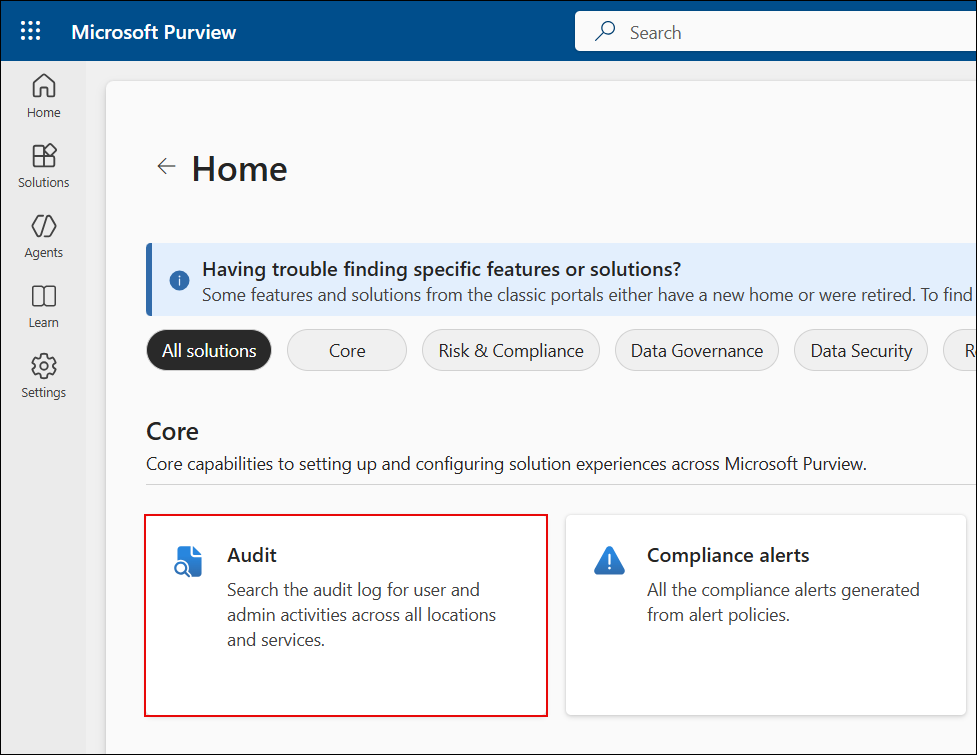
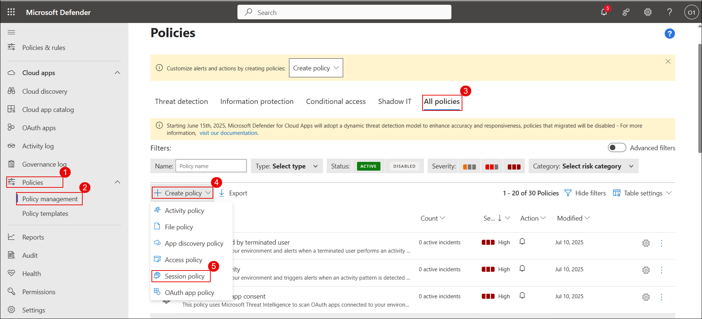
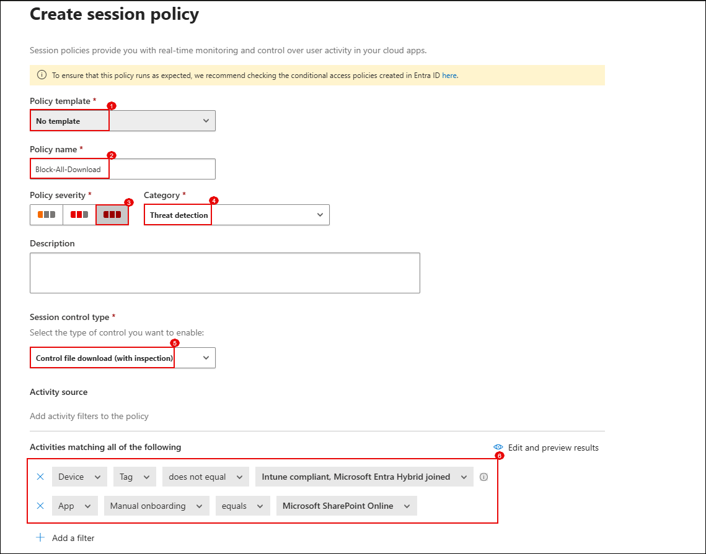
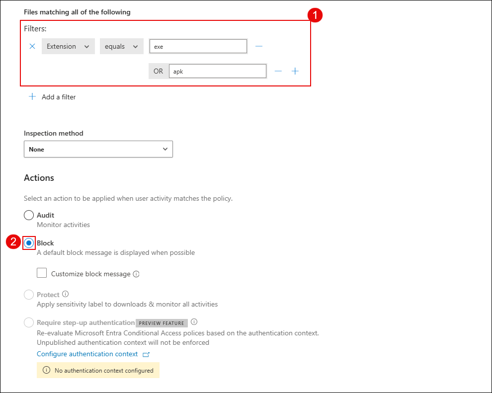
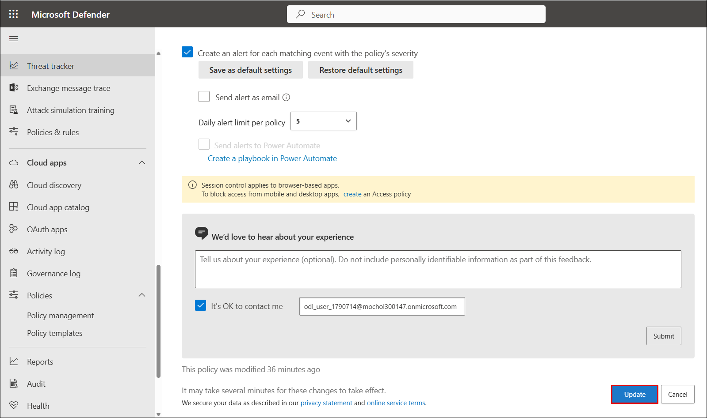
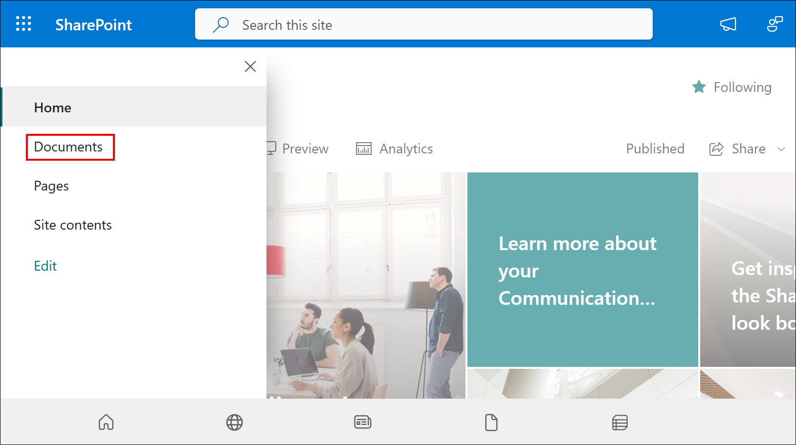
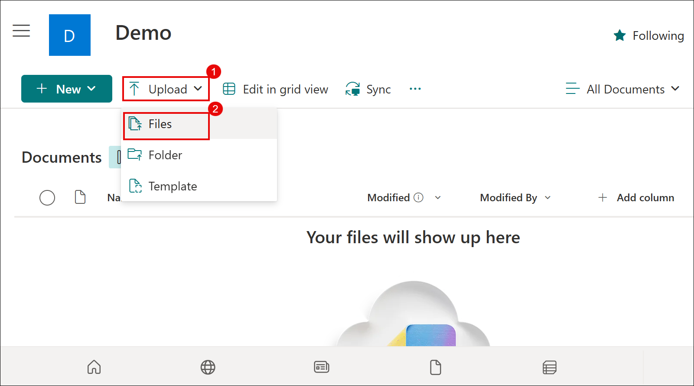
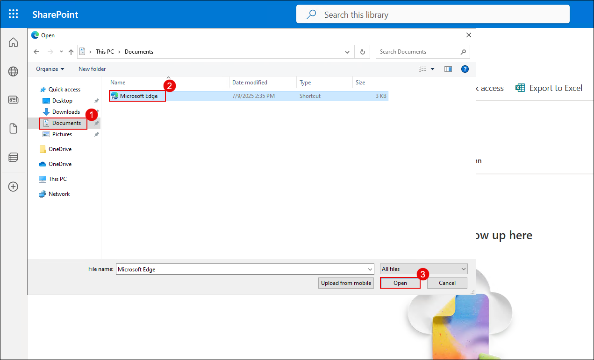

## Task 1: Connect and Onboard a SaaS App to Microsoft Defender for Cloud Apps

In this task, you'll verify license assignment, enable auditing, configure Conditional Access policies, and onboard Microsoft 365 to Defender for Cloud Apps.

1. On the **Azure portal** homepage, search for **Microsoft Entra ID (1)** and select **Microsoft Entra ID (2)** from the results.

   

2. On the **Microsoft Entra ID Overview** page, expand **Manage (1)** and select **Users (2)**.

   

3. From the list of users, select the user **ODL_User 1777538 (1)**.

   

4. On the user profile page, select **Licenses (1)** and ensure the user has an active **Microsoft 365 E5 (2)** license.

   

5. In a new browser tab, go to `https://purview.microsoft.com`.

   

6. If prompted, click **Get started (1)** on the Microsoft Purview welcome dialog.

   

7. On the Microsoft Purview homepage, click on **View all solutions (1)**.

   

8. Under the **Core** section, click on the **Audit (1)** tile.

   

9. On the **Audit** blade, click **Start recording user and admin activity (1)**.

   

10. When prompted, click **Yes (1)** to complete the organizational setup.

    

    > **Note:** It may take a few hours for audit recording to become active. You may continue with the rest of the exercise while it completes.

11. Switch to the Azure portal tab and search for **Windows Azure Active Directory (1)**. Select **Windows Azure Active Directory (2)** from the results.

    

12. On the left menu, expand **Security (1)** and select **Conditional Access (2)**. Then click **+ New policy (3)**.

    

13. On the **New policy** page, enter the name `MCAS – M365 Session Control`.

14. Under **Assignments > Users**, click **Specific users included (1)**.  
    In the **Include (2)** tab, select **Select users and groups (3)** → check **Users and groups (4)** → click **0 users and groups selected (5)**.

    

15. In the **Select users and groups** pane, search for `odl (1)`, check the box next to **ODL_User (2)**, and click **Select (3)**.

    

16. Confirm that the user is now listed under the **Users** section.

    

17. Under **Target resources**, click **1 resource included (1)**.  
    In the right pane, under **Include (2)**, select **Select resources (3)** → click **Windows Azure Active Directory (4)** → check **Office 365 (5)** → click **Select (6)**.

    

18. Under **Access controls > Session**, click **0 controls selected (1)**.  
    In the Session panel, check **Use Conditional Access App Control (2)**, select **Use custom policy (3)**, and click **Select (4)**.

    

19. At the bottom of the page, toggle **Enable policy** to **On (1)** and click **Create (2)**.

    

20. In the **Microsoft Defender portal**, expand **Cloud apps**, go to **Information Protection (1)** → **Files (2)**.  
    On the right, check **Enable file monitoring (3)** and click **Save (4)**.

    

21. Wait for the confirmation message: **Configuration saved successfully**.

    

22. Under **Connected apps**, select **App Connectors (1)**.  
    Check **Microsoft 365 (2)** and click **+ Connect (3)**.

    

23. On the next screen, click **Done (1)** to confirm that Microsoft 365 is connected.

    

## Task 2: Configure Session Policies to Monitor and Block Risky Behavior

In this task, you’ll create a session policy in Microsoft Defender for Cloud Apps to block file downloads for non-compliant devices.

1. On the Microsoft Defender portal, select **Cloud Apps** from the left-hand menu.

1. Under **Cloud Apps**, click **Policy management**.

   

1. On the **Policy management** page, click **+ Create policy**, then select **Session policy**.

   

1. On the **Apply template?** dialog box, click **Cancel (1)** to start with a blank policy.

   

1. Configure the session policy with the following values:
   - **Policy name**: `Block-All-Download`
   - **Policy severity**: High  
   - **Category**: Threat detection  
   - **Session control type**: Control file download (with inspection)

   

1. In the **Filters** section:
   - Add a condition where **Device tag** `does not equal` `Intune compliant, Microsoft Entra Hybrid joined`  
   - Add another condition where **App** `equals` `Microsoft SharePoint Online`

   

1. Scroll to the **Files matching all of the following** section.

1. Add a condition to filter files by extension:  
   - **Extension** → `exe`, `apk`  
   - Under **Actions**, select **Block**

   

1. Click **Create** to save and activate the policy.

   

   > **Note**: Ensure Conditional Access policy is configured to route sessions through Microsoft Defender for Cloud Apps.

1. On the **Desktop**, right-click the **Microsoft Edge** shortcut, select **Send to (1)** → **Documents (2)** to copy the shortcut into your Documents folder.

   

1. Open an incognito browser window and go to `https://www.office.com`.

1. Sign in using your lab credentials and go to **Apps** → **SharePoint**.

1. Click **+ Create site**.

   

1. On the site type selection, choose **Communication site**.

   

1. Select the **Standard communication** template and click **Use template**.

   

1. On the **Set language and other options** screen:
   - Make sure **English (1)** is selected  
   - Click **Create site (2)**

   

1. On your new **Demo** site, click the **☰ (hamburger menu) (1)**.

   

1. Select **Documents** from the menu.

   

1. Click **Upload (1)** → **Files (2)**.

   

1. In the **File Explorer** window, navigate to **Documents (1)**, select the **Microsoft Edge shortcut (2)**, and click **Open (3)**.

   

1. Once the upload completes, locate and click on the **msedge.exe** file in SharePoint.

   

1. Click the **Download** button.

   

1. You should see a download block notification:
   > **Download blocked** – Downloading msedge.exe is blocked by your organization’s security policy.

   

25. Verify that both **Microsoft 365** and **Microsoft Azure** show status as **Connected**.

    

