# Exercise 2: Implement App Governance and Create Custom Detection Policies in Microsoft Defender for Cloud Apps

## Overview

In this exercise, you will implement App Governance in Microsoft Defender for Cloud Apps to detect and investigate risky OAuth applications connected to your Microsoft 365 environment. You’ll begin by enabling the App Governance add-on and reviewing app permissions, usage patterns, and risk indicators. Then, you’ll create custom detection policies to monitor abnormal behavior, generate alerts for suspicious OAuth activity, and investigate connected apps for potential data exposure or misuse.

## Objectives

- Task 1: Implement App Governance and Risk Detection for OAuth Apps  
- Task 2: Investigate Alerts and Create Custom Detection Policies

## Task 1: Implement App Governance and Risk Detection for OAuth Apps

In this task, you'll enable App Governance, analyze high-risk OAuth apps, and create a custom detection policy to flag suspicious apps based on permissions and publisher verification.

1. On the **Microsoft Defender portal**, go to **System (1)** > **Settings (2)** and click **Cloud Apps (3)**.

   

1. Under **App governance**, select **Service status (1)** and click **Turn on app governance (2)**.

   

   > App Governance is now activated. It will begin evaluating connected OAuth apps and generating insights into their behavior and risk posture.

1. On the OAuth apps page, click **Go to app governance**.

   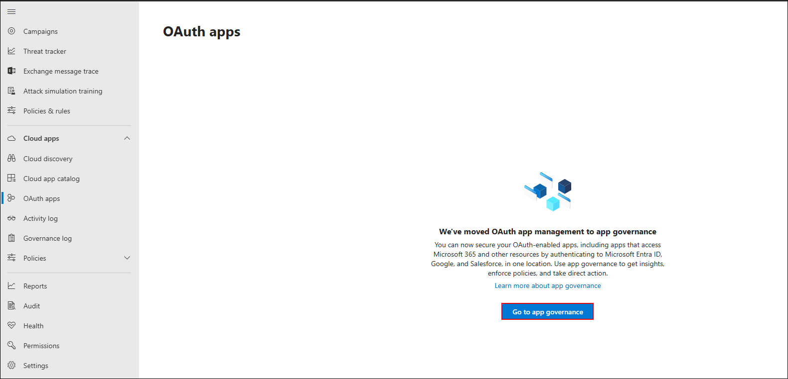

   > You may be redirected to the new App Governance interface.

1. In the left menu, go to **Cloud apps (1)** > **Governance log (2)** and select the **AuditLogApp (3)** from the listed apps.

   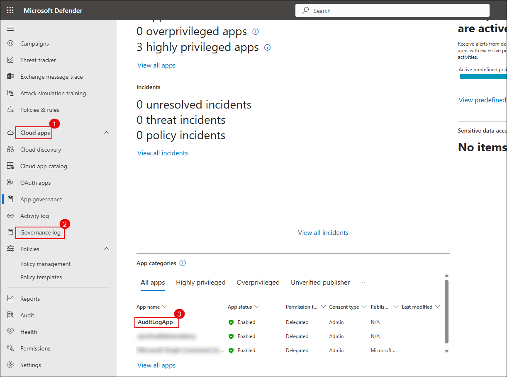

1. In the AuditLogApp details pane, select the **Permissions (1)** tab and review the permissions classified as **High privilege (2)**.

   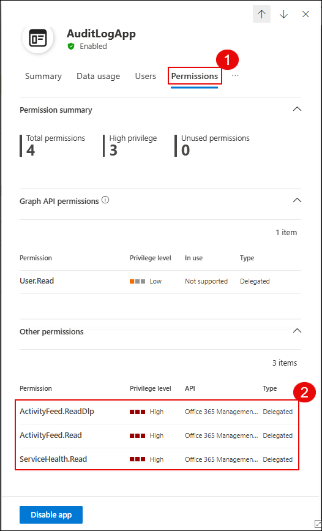

   > You've now reviewed an OAuth app's access level and identified potentially risky permissions that may require action.

1. Go to the **Policies (1)** tab > select **Microsoft 365 (2)**, then click **Create policy (3)**.

   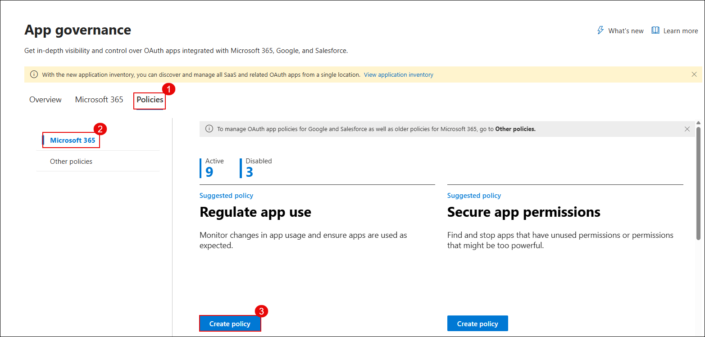

1. In the **Choose a policy template** pane, select **Custom (1)** > **Custom policy (2)** and click **Next (3)**.

   

1. Name the policy as **Detect High-Permission OAuth Apps (1)**, set **Severity to High (2)**, and click **Next (3)**.

   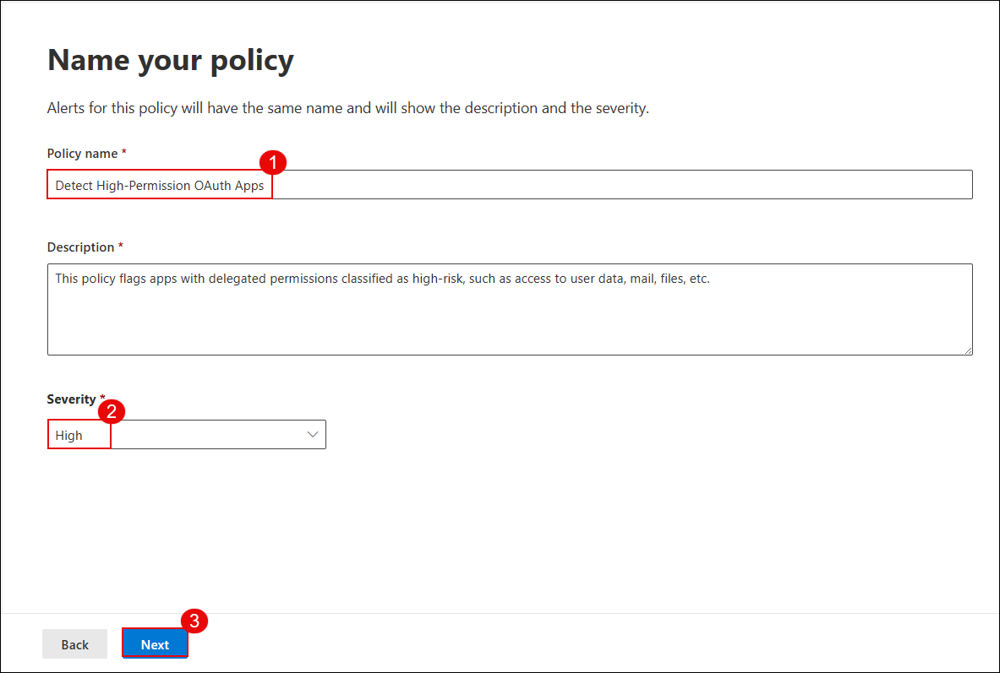

1. Select **No, I’ll customize the policy (1)**, then click **Next (2)**.

   

1. Under policy scope, select **All apps (1)** and click **Next (2)**.

    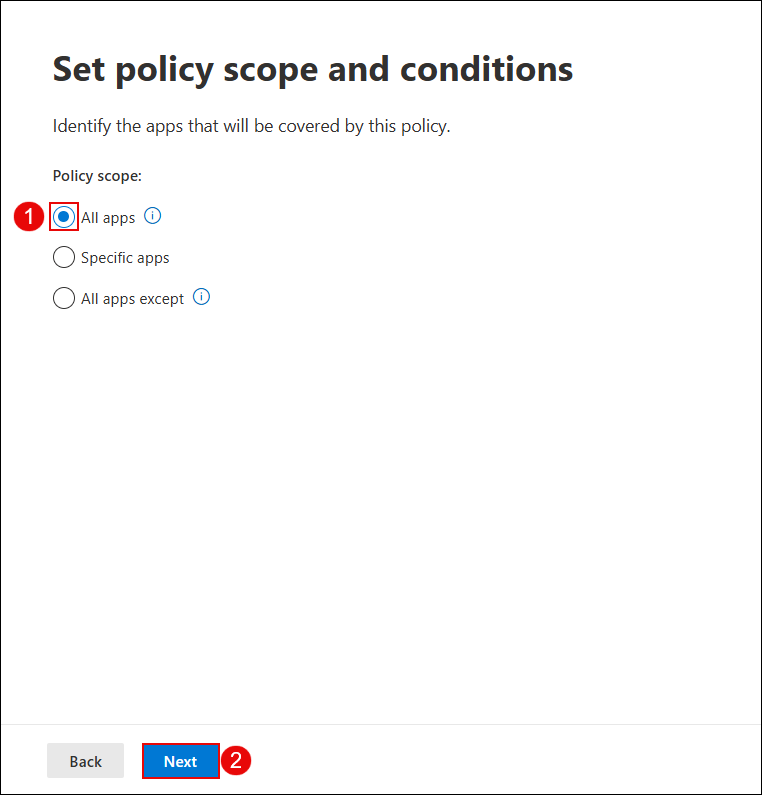

1. Configure the policy conditions:  
    - Set **Highly privileged (1)** to **Yes (2)**  
    - Set **Publisher verified (3)** to **No (4)**  
    - Click **Save (5)**

    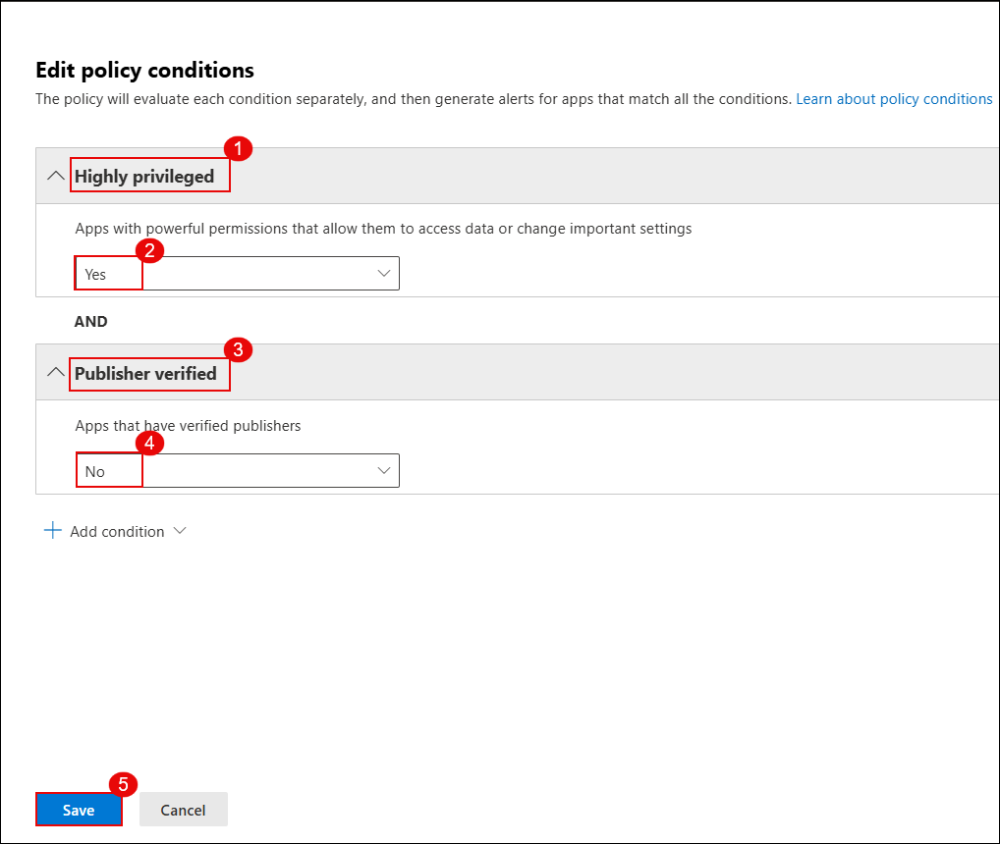

1. In the **Set policy action** step, choose **Disable app (1)** and click **Next (2)**.

    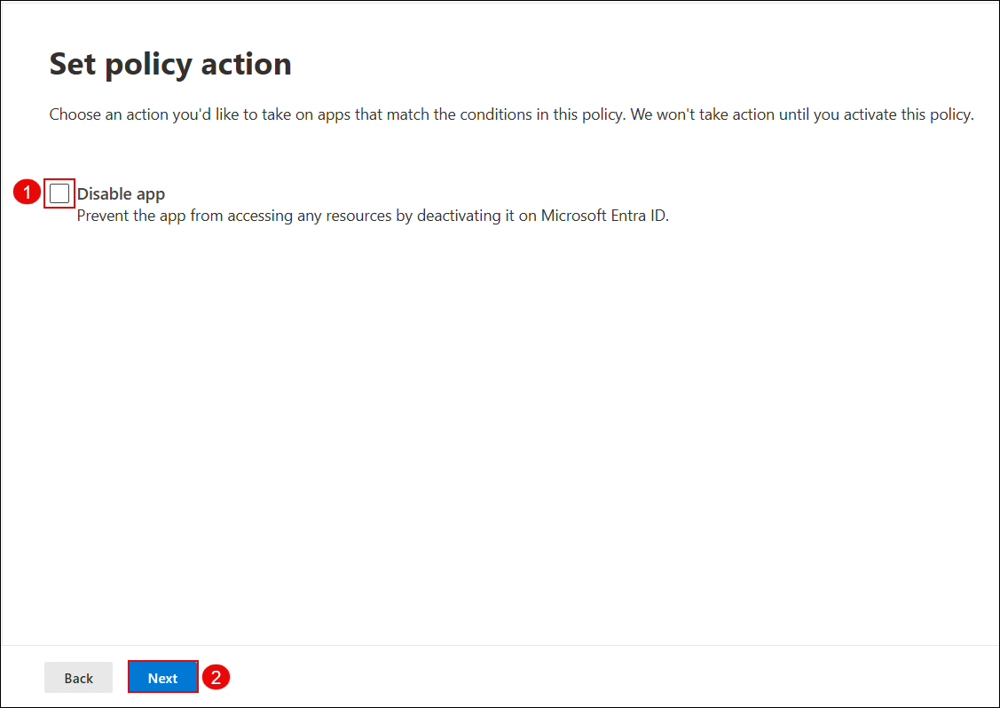

1. Set the policy status to **Active (1)** and click **Next (2)**.

    

1. Review the policy settings and click **Submit** to create the policy.

    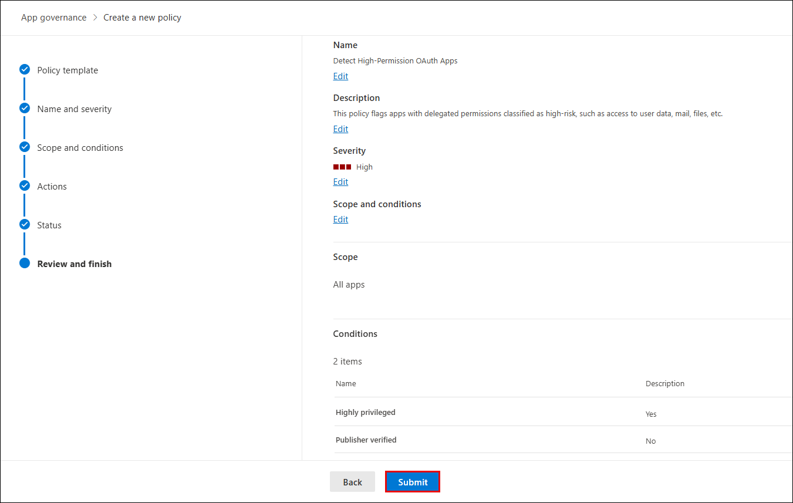

1. On the confirmation screen, click **Done** to finish.

    
   
   > The detection policy is now active and will monitor all onboarded OAuth apps for risky permissions and unverified publishers.

1. Back on the **App governance** overview, click **View all apps** to analyze detected apps.

    

1. In the **Microsoft 365 (1)** tab, notice apps flagged with a **High (2)** privilege level.

    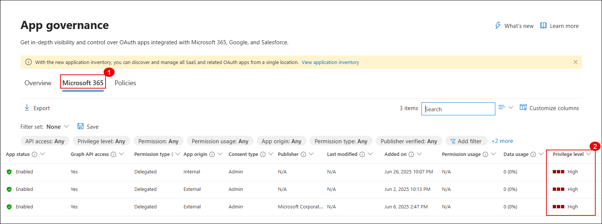

1. Go to **Incidents & alerts (1)** > **Incidents (2)**, and click the incident **Detect High-Permission OAuth Apps (3)**.

    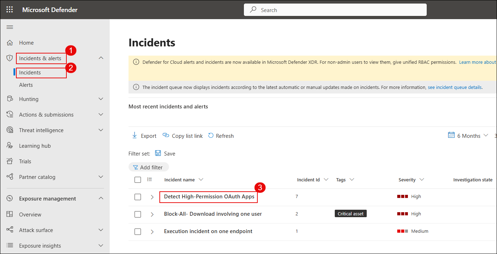

1. In the incident details pane, review the violation summary, app, and policy triggered.

    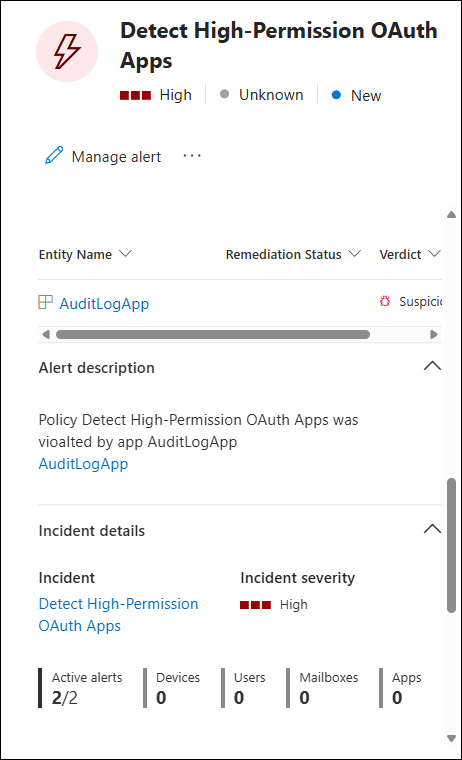

## Task 2: Investigate Alerts and Create Custom Detection Policies

1. In the Microsoft Defender Portal, go to **Cloud Apps** → **Activity log**.

1. Under the **App** filter, click on **Select apps** (3), select **Microsoft SharePoint Online**

    

   > **Note:** Once selected, all user activities performed in SharePoint—such as file uploads, downloads, edits, and access attempts—will be visible in the activity log.

1. Go to **Incidents & alerts** → **Alerts**, and look for `Block-All-Download`.

   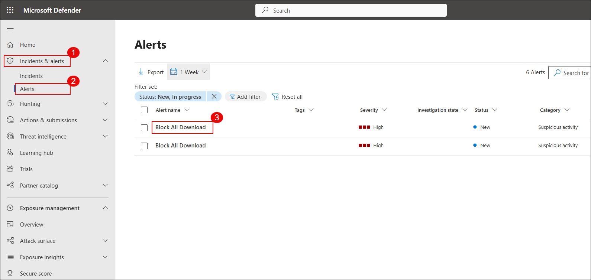

1. Click the alert, then select **Open alert page**.
   
   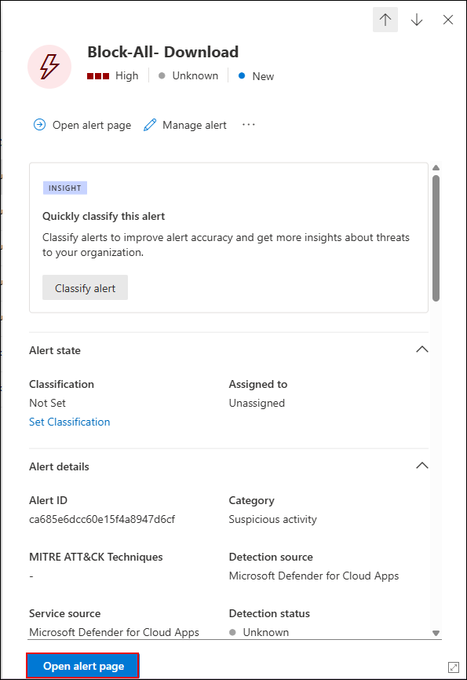

1. Click **Investigate in activity log**.
 
   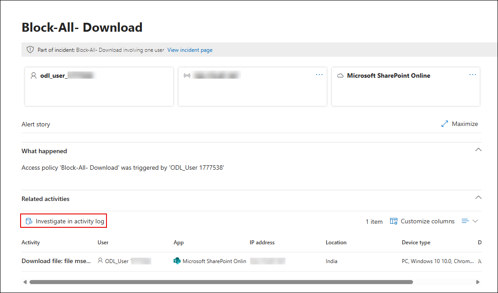

   

1. Configure the following:

   - **Policy template:** `No template`
   - **Policy name:** `Detect Suspicious File Download – msedge.exe`  
   - **Severity:** `High`  
   - **Category:** `Threat detection`  
   - **Act on:** `Single activity`  
   - **Activity type:** `Download file`  
   - **Files and folders:** `msedge.exe`  
   - **App:** `Microsoft SharePoint Online`
   
   

1. Click **Edit and preview results**, review matches, then click **Save filters**.

   

1. Under **Alerts**, enable **Send alert as email**, add a valid address, set daily alert limit to `5`.

1. Click **Create** to save and activate the policy.

    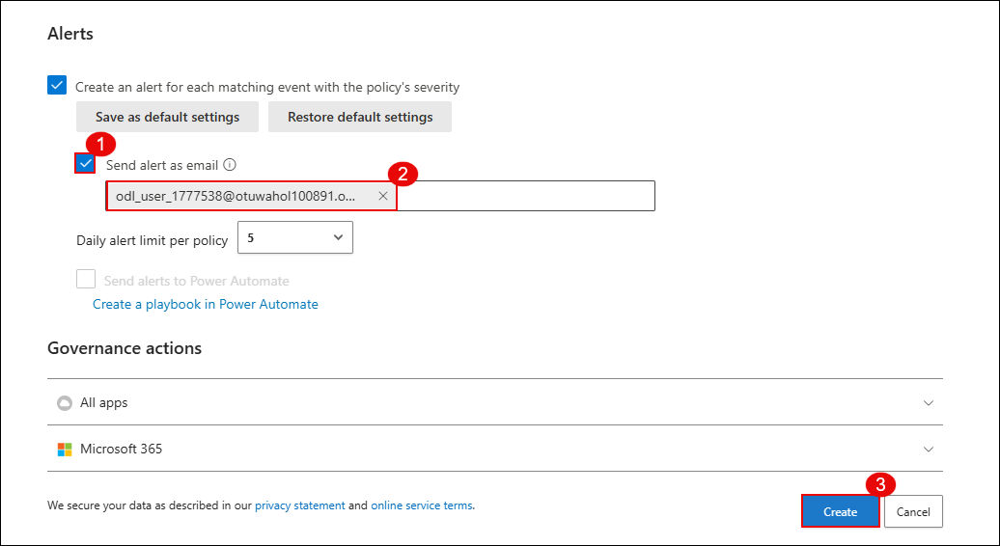

1. Simulate a download again in SharePoint, and downloading `msedge.exe`.
    
    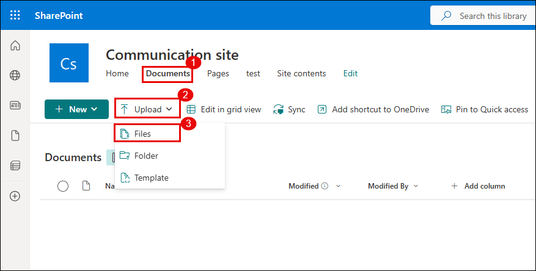

    

    

1. Open your Outlook email inbox and locate the alert email titled `Alert - Detect Suspicious File Download – msedge.exe`.
   
    
    > **Note:** If you do not see the alert email, wait for 5–10 minutes and refresh your inbox.

1. In the portal, go to **Incidents & alerts** → **Alerts**, and open the alert.
   
    

1. Click **Open alert page** → **view incident page**.

    

1. Carefully review the event details:

    - User name  
    - File name  
    - App used  
    - IP address  
    - Device info  
    - Triggered policy
   
    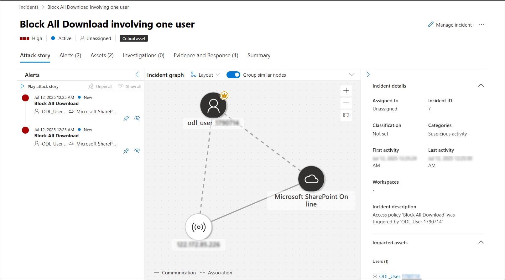

### Task 3: Deploy Microsoft Defender for Identity Sensor on Domain Controllers

In this task you will install and configure the Defender for Identity sensor on a domain controller to monitor identity-based threats.

Install the AD DS role to enable the server to function as a domain controller.

1. Open **Server Manager**:
   - Click the **Start** button and select **Server Manager**, or type "Server Manager" in the search bar and press **Enter**.

      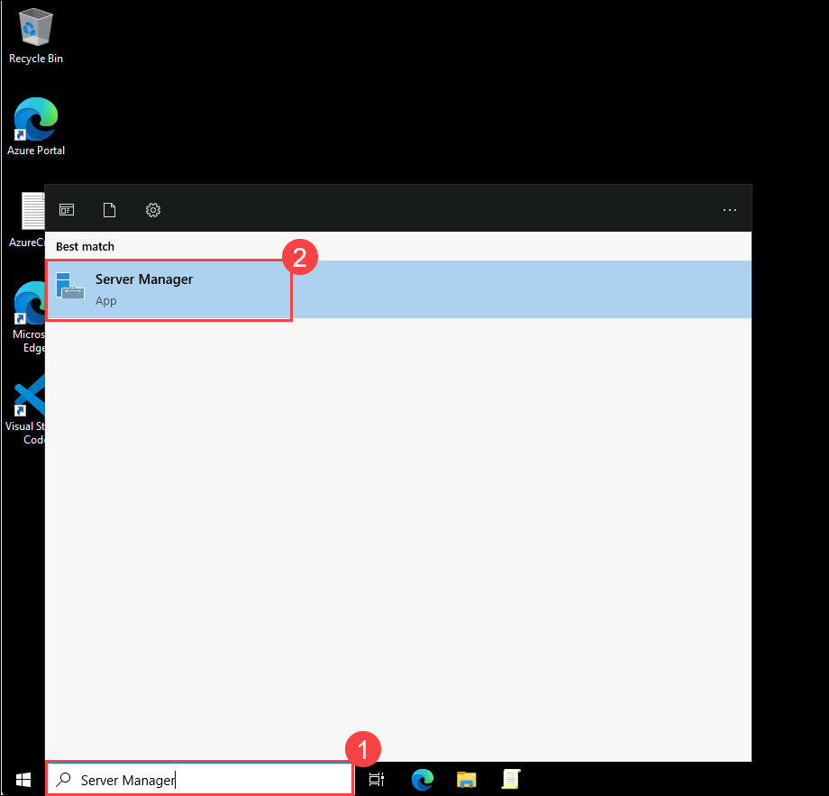

2. Launch the **Add Roles and Features Wizard**:
   - In Server Manager, click **Manage** in the top-right corner, then select **Add Roles and Features**.

      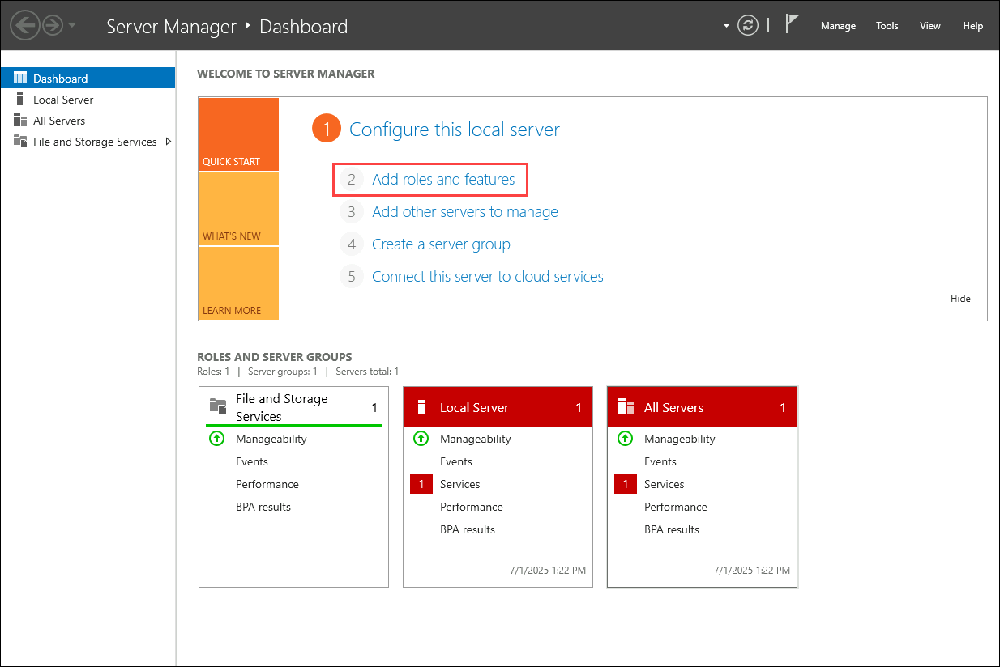

3. Configure the Wizard:
   - Select **Role-based or feature-based installation**, then click **Next**.
   - Choose your server from the server pool, then click **Next**.
   - In the "Server Roles" list, check **Active Directory Domain Services**.

      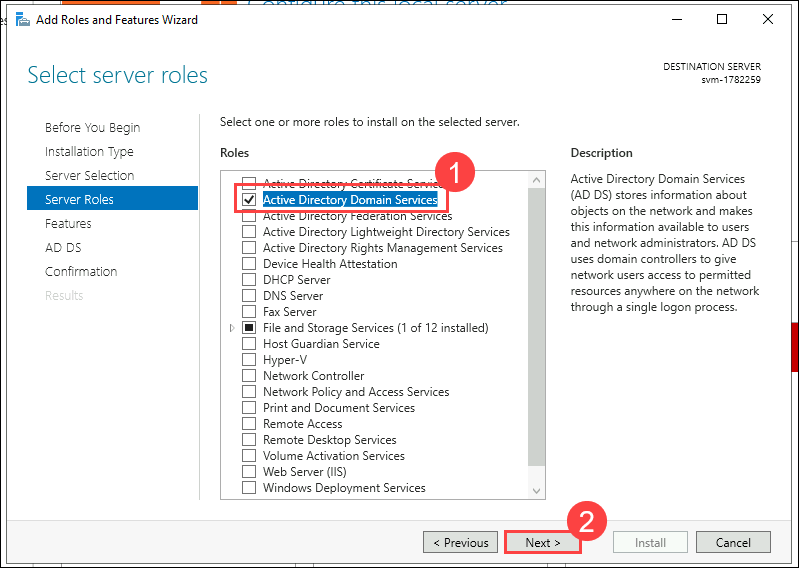

   - When prompted, click **Add Features** to include required tools, then click **Next**.
   - Skip the "Features" page by clicking **Next**.
   - Review the AD DS information page, then click **Next**.
   - Confirm your selections and click **Install**.
   - Wait for the installation to complete and click on **Close**.

      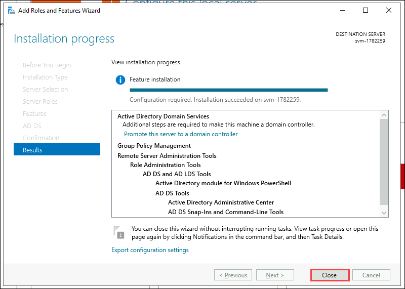

   > **Note:** Do not close Server Manager after installation; the next step begins from there.

1. In Server Manager, click the yellow notification flag and select **Promote this server to a domain controller**.

      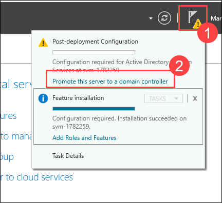

1. In the wizard, select **Add a new forest** and enter the root domain name as `defenderxdr.internal`, then click **Next**.

      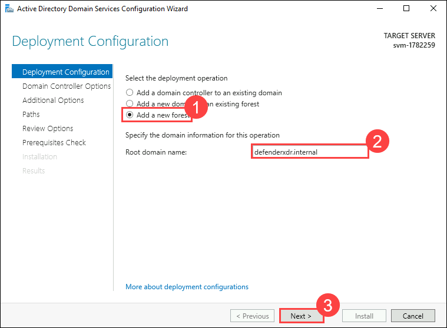

1. Set Domain Controller Options:
   - Set both **Forest Functional Level** and **Domain Functional Level** to **Windows Server 2016** (or your server’s version).
   - Ensure **Domain Name System (DNS) server** is checked.
   - Enter a **Directory Services Restore Mode (DSRM)** password (e.g., `P@ssw0rd123!`), then click **Next**.

      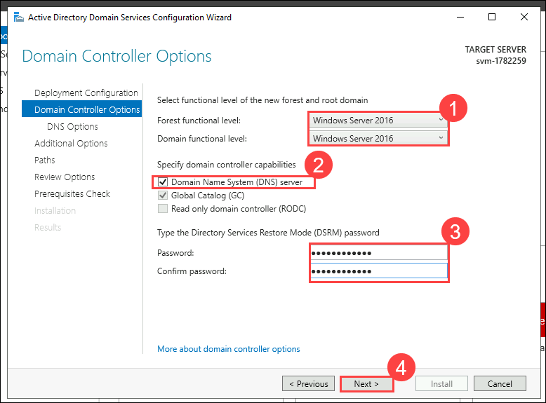

   - Ignore DNS delegation warnings, click on **Next**.
   - Accept the default **NetBIOS domain name** `DEFENDERXDR`, then click **Next**.

      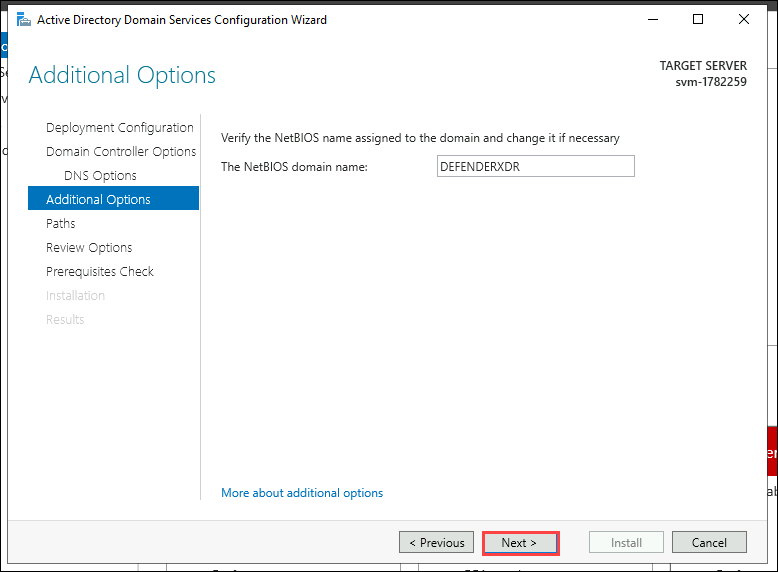

   - Use default paths for the AD DS database, logs, and SYSVOL, then click **Next**.

      

   - Review your selections, then click **Next**.
   - Wait for the prerequisites check to complete, then click **Install**.
   - Wait for the process to complete; the server will restart automatically.

   > **Note:** The VM will restart now, wait for 5 minutes and **Reconnect** to the VM.

      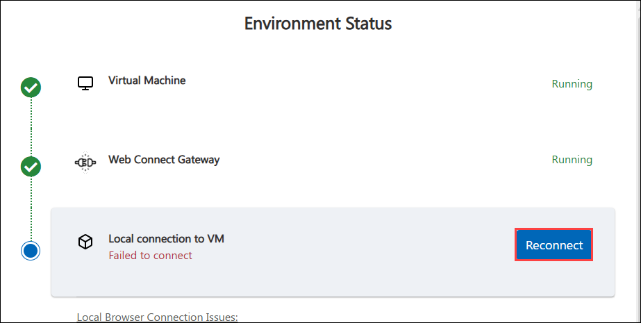

1. Sign in to the Microsoft Defender Portal, open a Edge browser and navigate to `security.microsoft.com`.

   - If you see the **Sign in to Microsoft Azure** tab, you will see the login screen. Enter the following email/username, and click on **Next**.

   * **Email/Username:** <inject key="AzureAdUserEmail"></inject>
     
     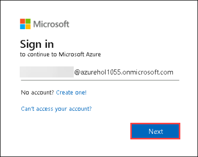

   - Now enter the following password and click on **Sign in**.
   
   * **Password:** <inject key="AzureAdUserPassword"></inject>

     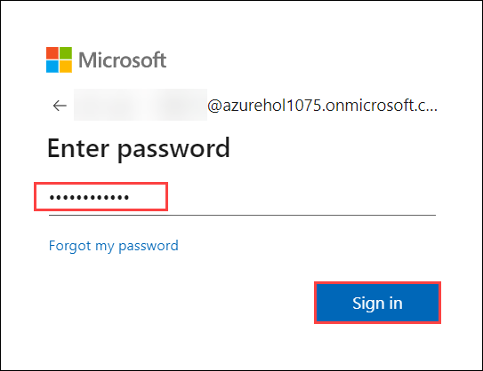 

      >**Note:** Take a moment to allow the option panel to fully load on the security portal.
      
1. On the Microsoft Defender page, select **Settings** and select **Identities** and you will be navigated to **Microsoft Defender for Identity** page.

      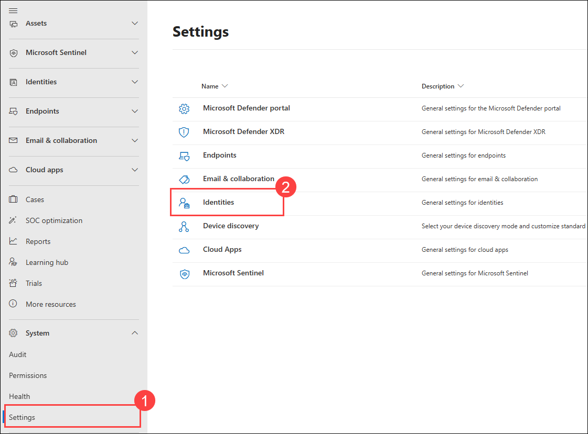

      >**Note:** Please wait while the **identities** page loads—this may take a few minutes.

1. Click on **Sensors** at the top, then select **Add sensor** in the top-right corner. On the **Simplify your installation process** pop-up, click **Continue with classic sensor**.

      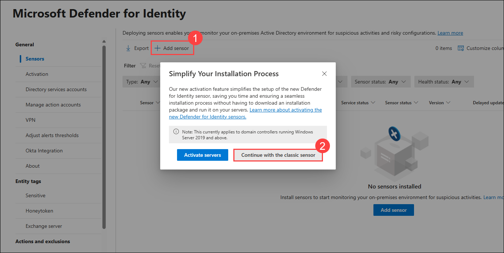

1. A pop-up will display a **Download installer** button and an **Access key**. Click **Download installer** to download `Azure ATP Sensor Setup.zip` and copy the **Access key** to your clipboard which will be used during the installation.

      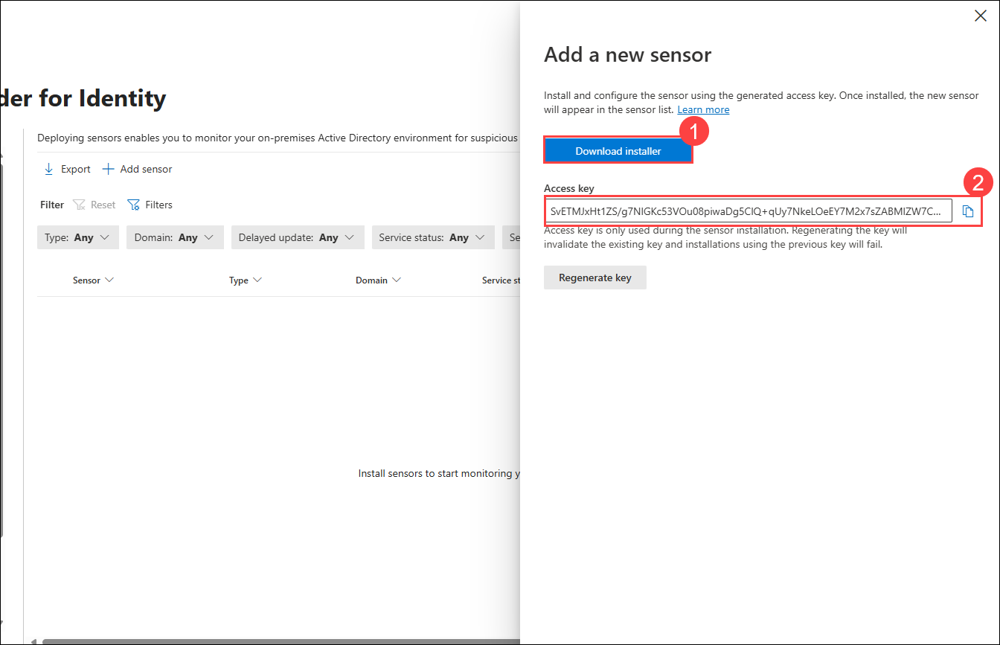
      > **Note:** If you do not see that the file is downloading, click on the pop-up window button and then select Always allow pop-ups and redirects from `https://security.microsoft.com`and click on **Done** and **download** the file again

      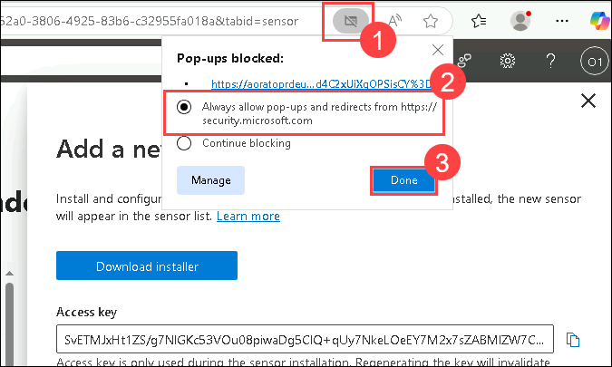

1. From your VM, navigate to the downloaded `Azure ATP Sensor Setup.zip` file in the **Downloads** folder, extract it to `C:\ATP`, and run `Azure ATP Sensor Setup.exe` as administrator.

      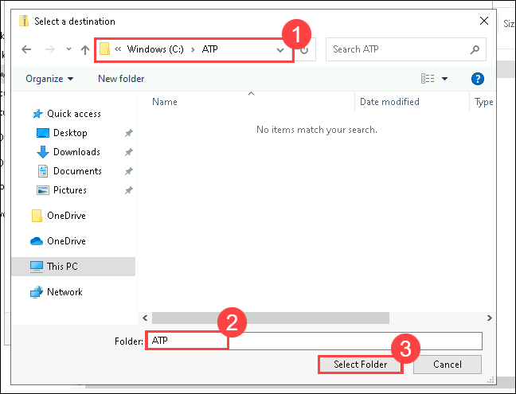
    > **Note:** If the `ATP` folder does not exist in `C:\`, click on **New** > **Create new folder**, name it **ATP**, and then extract the files.

      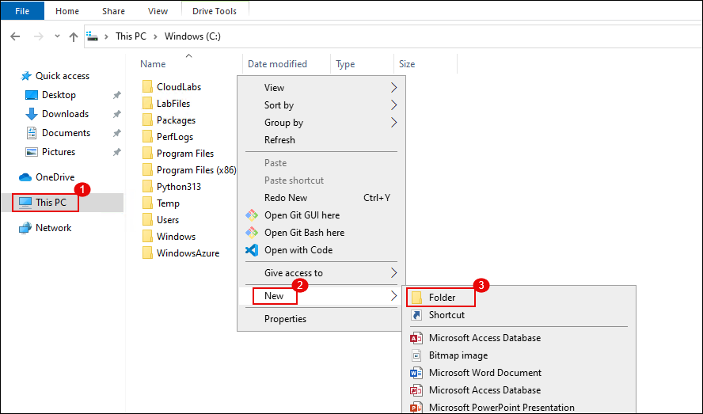

1. On the Setup wizard follow the below steps:
     - Accept the license terms and click **Next**.
     - Enter the **Access key** copied earlier and click **Next**.
         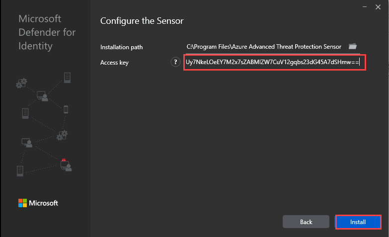

     - Choose the default installation path (e.g., `C:\Program Files\Azure Advanced Threat Protection Sensor`) and click **Install**.
   - Wait for the installation to complete.

1. Return to the Microsoft Defender portal, go to **Settings** > **Identities** > **Sensors**, find the sensor for `defenderxdr.internal`, and verify that the **Status** shows **Running** within 5–10 minutes.

> **Congratulations** on completing the task! Now, it's time to validate it. Here are the steps:
> - Hit the Validate button for the corresponding task. If you receive a success message, you can proceed to the next task. 
> - If not, carefully read the error message and retry the step, following the instructions in the lab guide.
> - If you need any assistance, please contact us at cloudlabs-support@spektrasystems.com. We are available 24/7 to help you out.
<validation step="a35ecb78-8ff8-4873-9f92-37f3811cdc3f" />

## Review

In this lab, you have completed the following tasks:

- Enabled App Governance in Microsoft Defender for Cloud Apps to monitor OAuth application activity.  
- Reviewed permissions, usage, and risk indicators for connected third-party apps.  
- Created custom detection policies to flag abnormal behavior such as high data access or overprivileged app activity.  
- Investigated generated alerts to identify potential threats and took appropriate response actions.

### You have successfully completed the lab. Click on **Next >>** to proceed with the next Lab.

