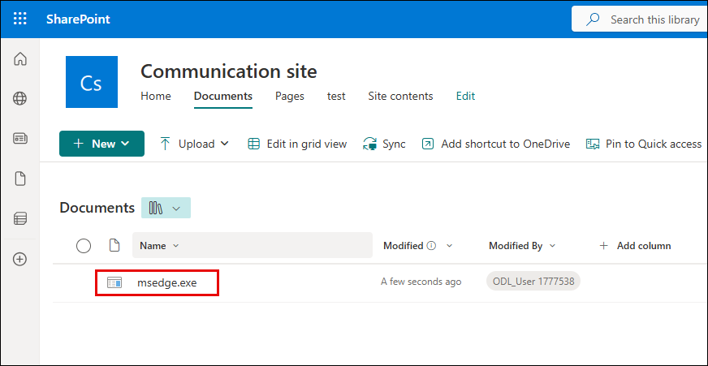

## Task 1: Implement App Governance and Risk Detection for OAuth Apps

In this task, you'll create a custom policy using App Governance in Microsoft Defender for Cloud Apps to detect high-permission OAuth apps, and then verify if incidents are triggered when such apps are detected.

1. In the Microsoft Defender portal, navigate to **Cloud apps** from the left-hand menu.

2. Select **App governance** from the submenu.

3. On the **App governance** page, select the **Policies** tab.

   

4. Click **+ Create policy** at the top.

   

5. On the **Create a new policy** page, choose **Custom policy** under the Custom category.

6. Click **Next** to proceed.

   

7. Provide the following policy details:

   - **Name**: `Detect High-Permission OAuth Apps`  
   - **Description**: Flags apps with high-risk delegated permissions and unverified publishers  
   - **Severity**: High

8. Click **Next**.

   

9. When asked to use a template, select **No, I'll customize the policy**, then click **Next**.

   

10. Under the **Scope** section, select **All apps** and click **Next**.

   

11. In the **Conditions** page, apply the following filters:

   - **Highly privileged** = Yes  
   - **Publisher verified** = No

12. Click **Save**.

   

13. On the **Set policy action** page, leave the **Disable app** checkbox **unchecked (1)**, then click **Next (2)**.

   

14. On the **Set policy status** screen, select **Active (1)** and click **Next (2)**.

   

15. Review the configuration and click **Submit** to create the policy.

   

16. When the confirmation screen appears, click **Done**.

   

17. Back on the **App governance** homepage, click **View all apps**.

   

18. Select the **Microsoft 365 (1)** tab and look for apps with **High** privilege level (2).

   

19. From the left-hand menu, go to **Incidents & alerts (1)** → **Incidents (2)**.

20. Locate the incident named **Detect High-Permission OAuth Apps (3)** and click on it.

   

21. In the incident pane, note the alert description and involved entity, e.g., `AuditLogApp`.

   

22. Expand the **Alert description** and **Incident details** sections to verify:

   - Entity Name  
   - Remediation status  
   - Verdict  
   - Incident severity  
   - Linked policy name

   

23. **(MISSING STEP)**: Ideally, include a screenshot that shows the **Permissions**, **Activity**, and **Risk indicators** tabs for the flagged app, to complete the validation.

   > If available, please capture a screenshot of the app detail view showing risk indicators, and permissions usage.

24. **(MISSING STEP)**: Optionally validate the **Policy list** to ensure the created policy is listed as **Active** under **App Governance > Policies**.

   > Screenshot needed for completeness of policy validation.

25. You have now implemented a custom App Governance policy, triggered an alert, and reviewed the incident tied to risky OAuth behavior.

## Task 2: Investigate Alerts and Create Custom Detection Policies

1. In the Microsoft Defender Portal, go to **Cloud Apps** → **Activity log**.

1. Under the **App** filter, click on **Select apps** (3), select **Microsoft SharePoint Online**

    

   > **Note:** Once selected, all user activities performed in SharePoint—such as file uploads, downloads, edits, and access attempts—will be visible in the activity log.

1. Go to **Incidents & alerts** → **Alerts**, and look for `Block-All-Download`.

   

1. Click the alert, then select **Open alert page**.
   
   

1. Click **Investigate in activity log**.
 
   

   

1. Configure the following:

   - **Policy template:** `No template`
   - **Policy name:** `Detect Suspicious File Download – msedge.exe`  
   - **Severity:** `High`  
   - **Category:** `Threat detection`  
   - **Act on:** `Single activity`  
   - **Activity type:** `Download file`  
   - **Files and folders:** `msedge.exe`  
   - **App:** `Microsoft SharePoint Online`
   
   

1. Click **Edit and preview results**, review matches, then click **Save filters**.

   

1. Under **Alerts**, enable **Send alert as email**, add a valid address, set daily alert limit to `5`.

1. Click **Create** to save and activate the policy.

    

1. Simulate a download again in SharePoint, and downloading `msedge.exe`.
    
    

    

    

1. Open your Outlook email inbox and locate the alert email titled `Alert - Detect Suspicious File Download – msedge.exe`.
   
    
    > **Note:** If you do not see the alert email, wait for 5–10 minutes and refresh your inbox.

1. In the portal, go to **Incidents & alerts** → **Alerts**, and open the alert.
   
    

1. Click **Open alert page** → **view incident page**.

    

1. Carefully review the event details:

    - User name  
    - File name  
    - App used  
    - IP address  
    - Device info  
    - Triggered policy
   
    

### Task 3: Deploy Microsoft Defender for Identity Sensor on Domain Controllers

In this task you will install and configure the Defender for Identity sensor on a domain controller to monitor identity-based threats.

Install the AD DS role to enable the server to function as a domain controller.

1. Open **Server Manager**:
   - Click the **Start** button and select **Server Manager**, or type "Server Manager" in the search bar and press **Enter**.

      

2. Launch the **Add Roles and Features Wizard**:
   - In Server Manager, click **Manage** in the top-right corner, then select **Add Roles and Features**.

      

3. Configure the Wizard:
   - Select **Role-based or feature-based installation**, then click **Next**.
   - Choose your server from the server pool, then click **Next**.
   - In the "Server Roles" list, check **Active Directory Domain Services**.

      

   - When prompted, click **Add Features** to include required tools, then click **Next**.
   - Skip the "Features" page by clicking **Next**.
   - Review the AD DS information page, then click **Next**.
   - Confirm your selections and click **Install**.
   - Wait for the installation to complete and click on **Close**.

      

   > **Note:** Do not close Server Manager after installation; the next step begins from there.

1. In Server Manager, click the yellow notification flag and select **Promote this server to a domain controller**.

      

1. In the wizard, select **Add a new forest** and enter the root domain name as `defenderxdr.internal`, then click **Next**.

      

1. Set Domain Controller Options:
   - Set both **Forest Functional Level** and **Domain Functional Level** to **Windows Server 2016** (or your server’s version).
   - Ensure **Domain Name System (DNS) server** is checked.
   - Enter a **Directory Services Restore Mode (DSRM)** password (e.g., `P@ssw0rd123!`), then click **Next**.

      

   - Ignore DNS delegation warnings, click on **Next**.
   - Accept the default **NetBIOS domain name** `DEFENDERXDR`, then click **Next**.

      

   - Use default paths for the AD DS database, logs, and SYSVOL, then click **Next**.

      

   - Review your selections, then click **Next**.
   - Wait for the prerequisites check to complete, then click **Install**.
   - Wait for the process to complete; the server will restart automatically.

   > **Note:** The VM will restart now, wait for 5 minutes and **Reconnect** to the VM.

      

1. Sign in to the Microsoft Defender Portal, open a Edge browser and navigate to `security.microsoft.com`.

   - If you see the **Sign in to Microsoft Azure** tab, you will see the login screen. Enter the following email/username, and click on **Next**.

   * **Email/Username:** <inject key="AzureAdUserEmail"></inject>
     
     

   - Now enter the following password and click on **Sign in**.
   
   * **Password:** <inject key="AzureAdUserPassword"></inject>

      

      >**Note:** Take a moment to allow the option panel to fully load on the security portal.
      
1. On the Microsoft Defender page, select **Settings** and select **Identities** and you will be navigated to **Microsoft Defender for Identity** page.

      

      >**Note:** Please wait while the **identities** page loads—this may take a few minutes.

1. Click on **Sensors** at the top, then select **Add sensor** in the top-right corner. On the **Simplify your installation process** pop-up, click **Continue with classic sensor**.

      

1. A pop-up will display a **Download installer** button and an **Access key**. Click **Download installer** to download `Azure ATP Sensor Setup.zip` and copy the **Access key** to your clipboard which will be used during the installation.

      
      > **Note:** If you do not see that the file is downloading, click on the pop-up window button and then select Always allow pop-ups and redirects from `https://security.microsoft.com`and click on **Done** and **download** the file again

      

1. From your VM, navigate to the downloaded `Azure ATP Sensor Setup.zip` file in the **Downloads** folder, extract it to `C:\ATP`, and run `Azure ATP Sensor Setup.exe` as administrator.

      
    > **Note:** If the `ATP` folder does not exist in `C:\`, click on **New** > **Create new folder**, name it **ATP**, and then extract the files.

      

1. On the Setup wizard follow the below steps:
     - Accept the license terms and click **Next**.
     - Enter the **Access key** copied earlier and click **Next**.
         

     - Choose the default installation path (e.g., `C:\Program Files\Azure Advanced Threat Protection Sensor`) and click **Install**.
   - Wait for the installation to complete.

1. Return to the Microsoft Defender portal, go to **Settings** > **Identities** > **Sensors**, find the sensor for `defenderxdr.internal`, and verify that the **Status** shows **Running** within 5–10 minutes.

> **Congratulations** on completing the task! Now, it's time to validate it. Here are the steps:
> - Hit the Validate button for the corresponding task. If you receive a success message, you can proceed to the next task. 
> - If not, carefully read the error message and retry the step, following the instructions in the lab guide.
> - If you need any assistance, please contact us at cloudlabs-support@spektrasystems.com. We are available 24/7 to help you out.
<validation step="a35ecb78-8ff8-4873-9f92-37f3811cdc3f" />

