## Exercise 3: Detect Identity Threats and Integrate Defender for Identity with Microsoft XDR and Sentinel

### Estimated Duration: 60 Minutes

## Overview

In this exercise, you will explore how Microsoft Defender for Identity detects and responds to identity-based threats. You’ll begin by simulating a lateral movement attack using a DC Sync technique and observe how Defender for Identity automatically contains the threat. Next, you’ll investigate user activity and threat timelines to analyze suspicious behavior. Finally, you’ll integrate Defender for Identity with Microsoft 365 Defender and Microsoft Sentinel to centralize alert visibility and incident correlation across your environment.

## Objectives

- Task 1: Simulate and Detect Lateral Movement Attacks `(Read-Only)`  
- Task 2: Investigate Identity-Based Threats and User Timelines  
- Task 3: Integrate Defender for Identity with Microsoft Defender Portal and Microsoft Sentinel
- Task 4: Onboard a Device

### Task 1: Simulate and Detect Lateral Movement Attacks `(Read-Only)`

In this task, you will simulate a Lateral Movement attack and detect it using Microsoft Defender for Identity. Please note that this is a `read-only` task, as you will be logged out of your virtual machine during the attack simulation—this is a security measure enforced by Defender for Identity.

> **Note:** This exercise is **Read-only** because the tool used below is blocked by Microsoft Defender. If this software is used for any malicious activity, Microsoft Defender will flag the user as a threat, resulting in an automatic logout from the virtual machine. The user will not be able to log in again.

1. Open **PowerShell (Admin)** and navigate to the below mentioned directory.

      ```powershell
      cd C:\MimikatzLab\mimikatz-master\mimikatz-master\x64
      ```
1. In the same PowerShell session, run the below command to run the mimikatz application

     ```powershell
     mimikatz.exe 
     ```

1. Simulate a DC Sync attack and extract the credentials of the krbtgt account.

      ```shell
      lsadump::dcsync /domain:yourdomain.com /user:krbtgt
      ```

1. Now you can check your alerts in the Microsoft Defender portal, navigate to **Incidents & alerts** in the left-hand navigation pane.

      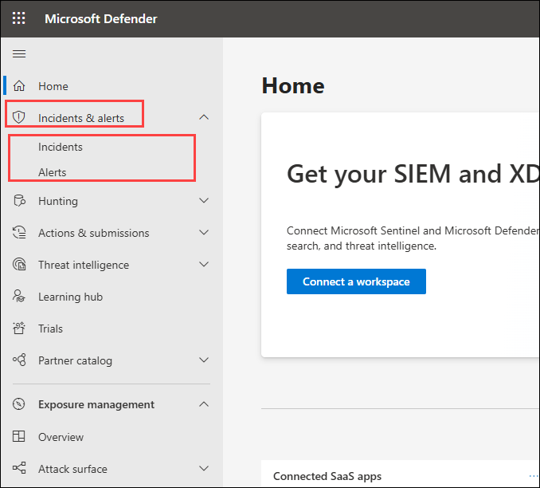

1. Click **Alerts** to view the alerts queue.

1. You will find alerts with the below names
     - **Lateral movement using remote logon by contained user blocked**
     - **Lateral movement using RDP blocked**

      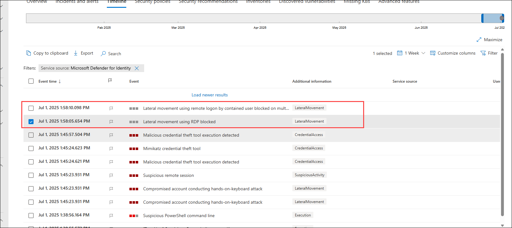
      > **Note:** The user will be logged out of the virtual machine as part of the containment measures initiated by the Defender in response to the user's attempted lateral movement attack.

### Task 2: Investigate Threats and User Timelines 

In this task you will analyze using user timelines and alert details in the Defender portal.

1. In the Microsoft Defender portal, in the search bar, type `demouser` and select it.

      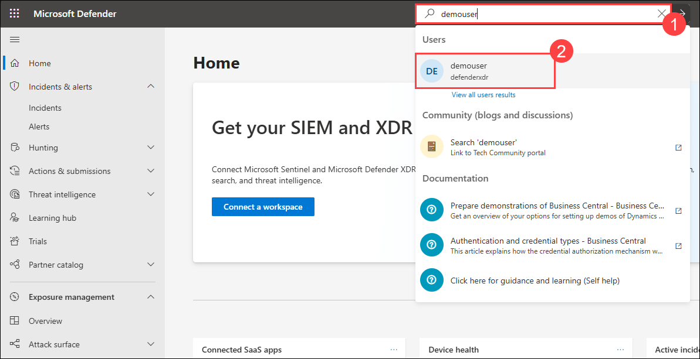

1. Click on **Go to user page**

      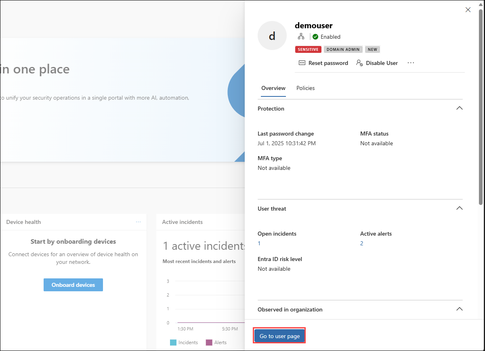

1. In the user profile, click the **Timeline** tab to view all events and alerts.

      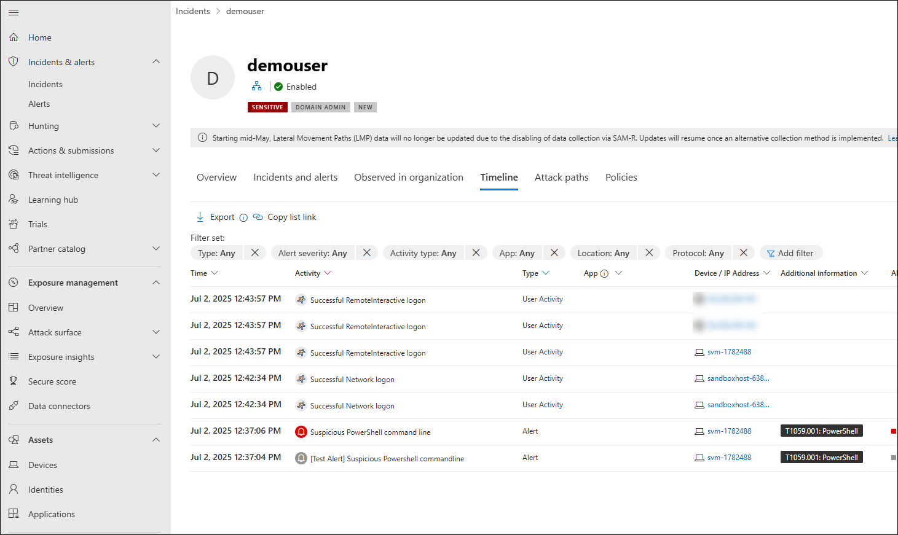

### Task 3: Integrate Defender for Identity with Microsoft 365 Defender Portal

In this task you will enable integration to view Defender for Identity incidents in the unified Microsoft 365 Defender portal and Microsoft Sentinel.

1. Navigate to `portal.azure.com` and navigate to **Microsoft Sentinel** and select `loganalyticworkspace`.

      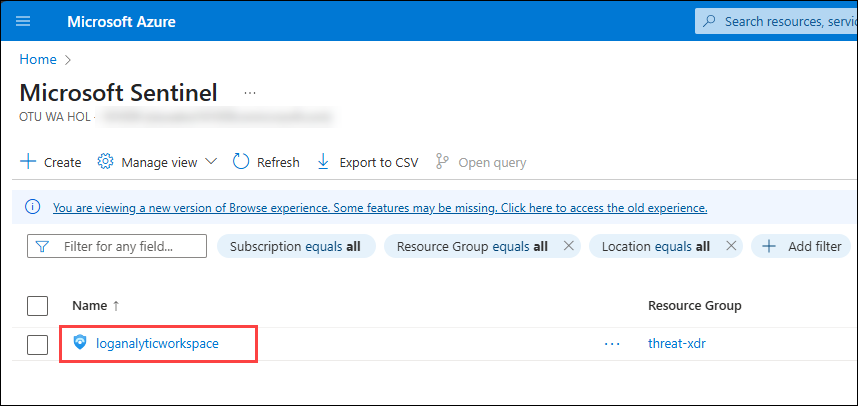

1. In the left-hand pane, click **Content hub**. 

      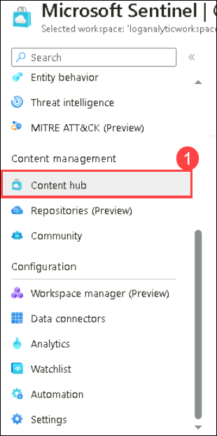

1. Search for **Defender for XDR** and select it and click on **Install** and wait for the installation to be complete

      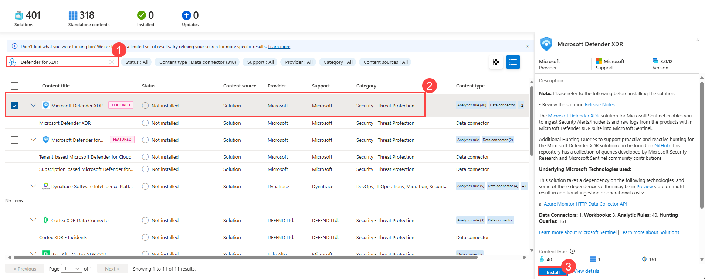

1. Return to the Sentinel workspace and navigate to **Data Connectors** and click on  **Defender for XDR** and select **Open connector page**.

      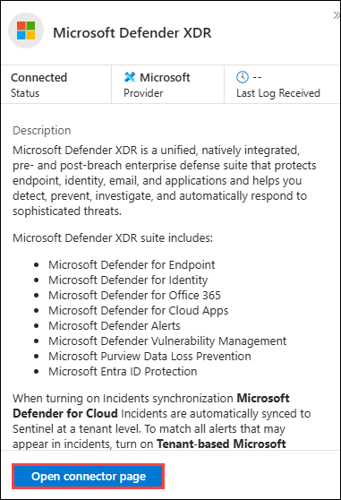

1. Click on **Connect incidents & alerts** and navigate back to Data connectors page and make sure that **Defender for XDR** shows as connected

      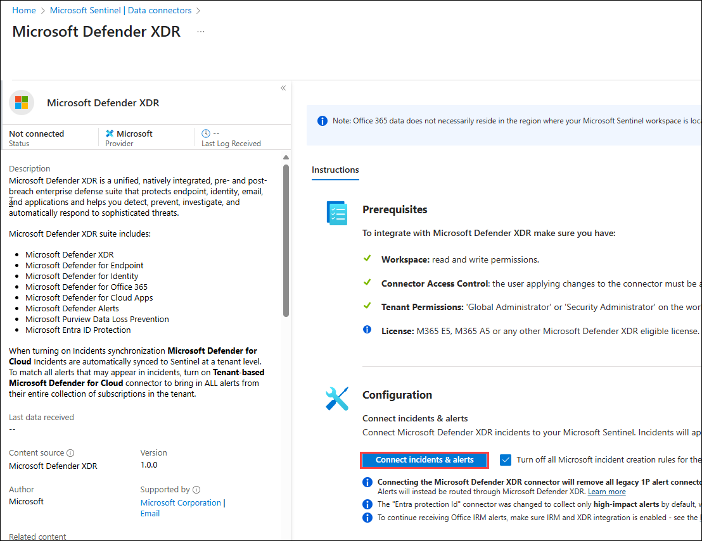

### Task 4: Onboard a Device

1. Navigate to **Settings** in the left menu bar, and then, on the Settings page, choose **Endpoints**.

    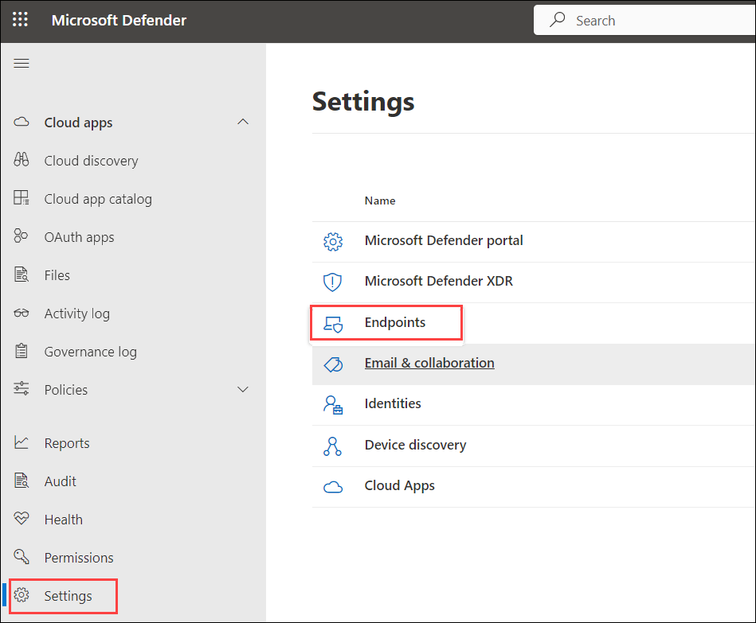

    > **Note:** The **Endpoints** option under **Settings** may take a few moments to appear after the initial setup.

    > If you don't see it right away, wait a minute and try refreshing the page.

1. Navigate to the **Onboarding** option in the Device Management section.

    >**Note:** Device onboarding can also be initiated from the **Assets** section on the left menu bar. Expand 'Assets' and choose 'Devices.' On the Device Inventory page, with 'Computers & Mobile' selected, scroll down to find the option for **Onboard devices.** Clicking on this option will direct you to the **Settings > Endpoints** page.

1. In the '1. Onboard a device' section, ensure that 'Local Script (for up to 10 devices)' is visible in the Deployment method drop-down, then click the **Download onboarding package** button.

    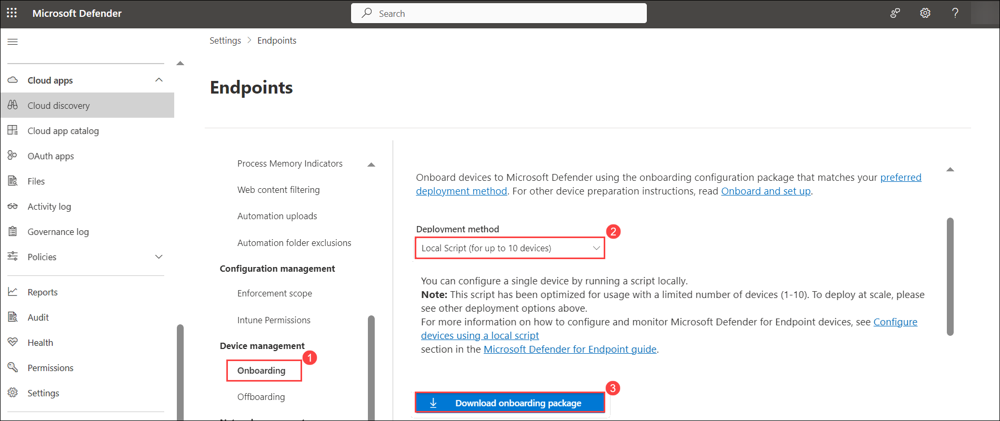 

1. In the *Downloads* pop-up, use your mouse to select the 'WindowsDefenderATPOnboardingPackage.zip' file, and then click on the folder icon for **Show in folder**. **Hint:** If you can't locate it, the file should be in the 'c:\users\admin\downloads' directory.

    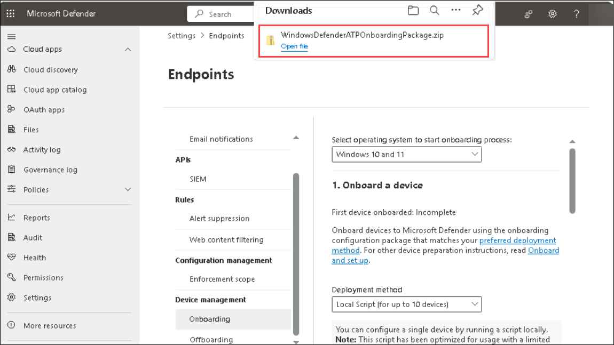

1. Right-click on the downloaded zip file, choose **Extract All...**, ensure that **Show extracted files when complete** is checked, and then click **Extract**.

    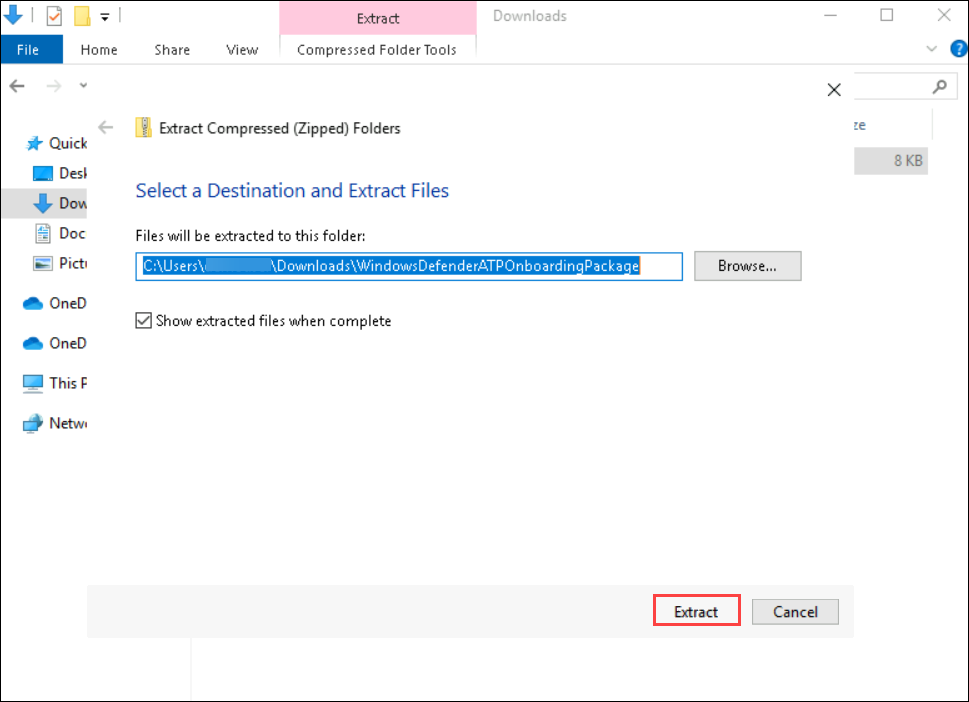 

1. Right-click on the extracted file 'WindowsDefenderATPLocalOnboardingScript.cmd' and choose **Properties**. Tick the **Unblock** checkbox located in the bottom right of the Properties window, and then click **OK**.

    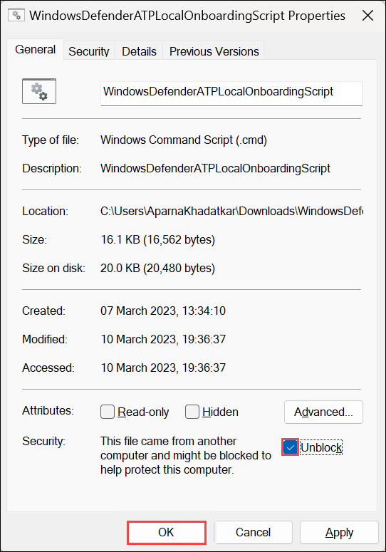 

1. Once again, right-click on the extracted file **WindowsDefenderATPLocalOnboardingScript.cmd** and opt for **Run as Administrator**. **Hint:** If the Windows SmartScreen window appears, click on **More info**, and then select **Run anyway**.
    
1. When the "User Account Control" window appears, select **Yes** to allow the script to run, answer **Y** to the question presented by the script, and press **Enter**. Once complete, you should see a message in the command screen that says *Successfully onboarded machine to Microsoft Defender for Endpoint*.

1. Press any key to continue. This action will close the Command Prompt window.

    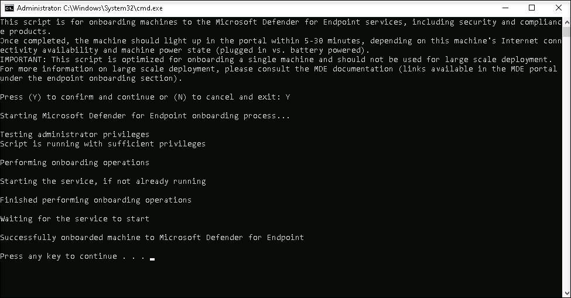

1. Back on the Onboarding page within the Microsoft 365 Defender portal, navigate to the "2. Run a detection test" section, and copy the detection test script by clicking the **Copy** button.

    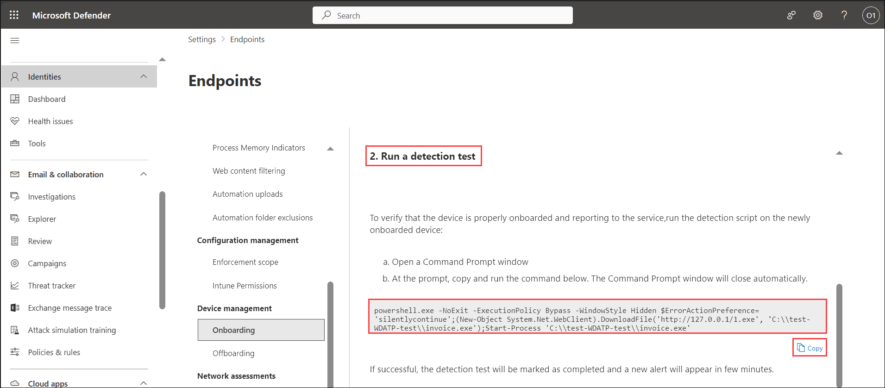 

1. In the Windows search bar of the virtual machine, type **CMD**, and choose **Run as Administrator** from the right pane for the Command Prompt app.

1. When the "User Account Control" window appears, select **Yes** to allow the app to run. 

1. Paste the script by right-clicking in the **Administrator: Command Prompt** window and press **Enter** to run it. **Note:** The window closes automatically after running the script.

1. In the Microsoft 365 Defender portal, navigate to the left-hand menu, and under the **Assets** area, select **Devices**. If the device is not shown, proceed with the next task and return to check it later. It can take up to 60 minutes for the first device to be displayed in the portal.

    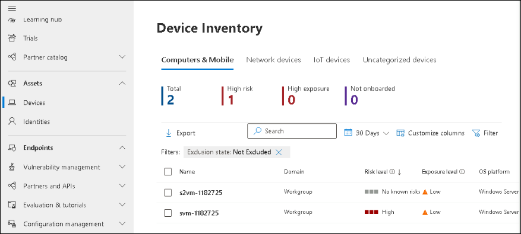 

    >**Note:** If you have completed the onboarding process and don't see devices in the Devices list after an hour, it might indicate an onboarding or connectivity problem.

## Review

In this lab, you have completed the following tasks:

- Simulated a lateral movement attack using the DC Sync technique to test Defender for Identity detection.  
- Observed automatic threat response and containment triggered by Defender for Identity.  
- Investigated identity-based threats using the user timeline and activity alerts.  
- Integrated Defender for Identity with Microsoft 365 Defender and Microsoft Sentinel for centralized threat visibility.

### You have successfully completed the lab. Click on **Next >>** to proceed with the next Lab.


