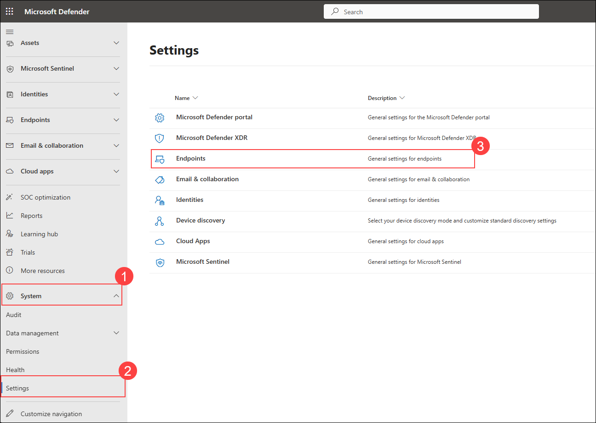
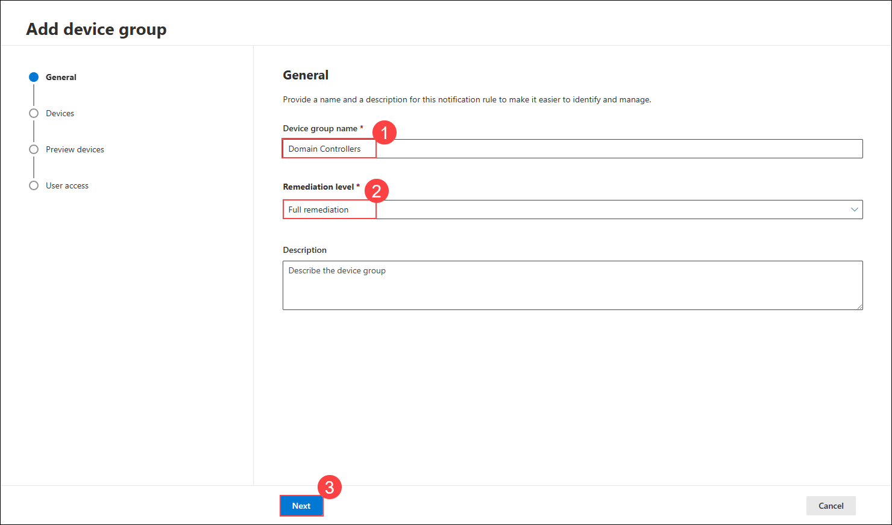
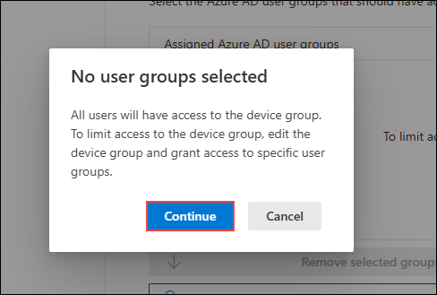
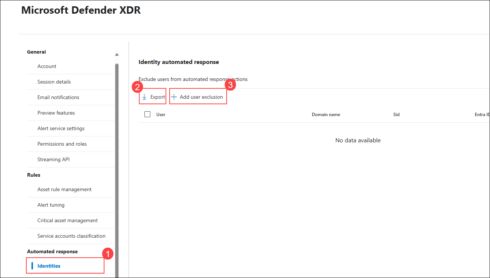
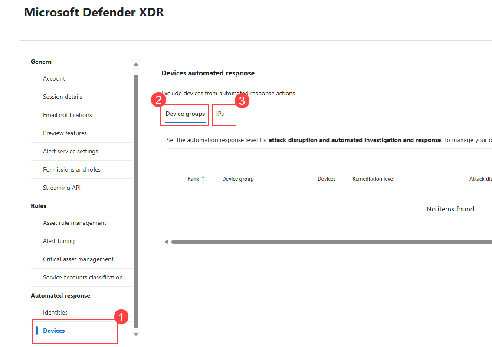
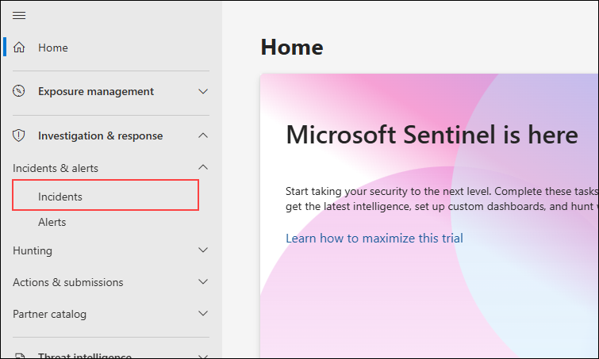

## Exercise 4: Automate End-to-End Incident Response with Microsoft Defender XDR, Sentinel, Power Automate, and SharePoint

### Overview

In this exercise, you will implement an end-to-end automated incident response solution by integrating Microsoft Defender XDR, Microsoft Sentinel, Power Automate, and SharePoint. You'll begin by reviewing existing configurations for Automated Investigation and Response (AIR) and analyzing identity-based incidents with attack disruption tags. Then, you'll build a custom workflow that logs flagged Outlook emails to SharePoint, sends automated SOC notifications via a Sentinel playbook, and triggers the response pipeline using a Sentinel analytics rule—creating a unified and automated threat detection and response loop.


### Objectives

- Task 1: Review Automated Investigation and Response (AIR) configuration (`Read-Only`)
- Task 2: Investigate Identity-Based Incidents and Attack Disruption Tags (`Read-Only`)  
- Task 3: Create a SharePoint site and custom list to store incident logs  
- Task 4: Create a Microsoft Sentinel playbook to notify SOC via email  
- Task 5: Create an analytics rule in Sentinel to detect suspicious activity and trigger the playbook  
- Task 6: Build a Power Automate flow to log flagged Outlook emails into SharePoint

### Task 1: Review Automated Investigation and Response (`Read-Only`)

> **Note:** In this task, we will **only review** the configuration steps. No actual deployment or configuration will be performed, as the Microsoft E5 license assigned to this lab **already includes AIR pre-configured**.

1. Navigate to the Defender portal and from the left navigation pane go to **Settings** → **Endpoints**.

      

1. Under **Permissions** select **Device groups** and click on **+ Add device group**

      

1. Enter the following settings on the **General** tab and click on **Next**

    - **Device group name:** Domain Controllers
    - **Remediation level:** Full – remediate threats automatically

      

1. Enter the following settings **Devices** and click on **Next**

    - **Name:** svm-<inject key="DeploymentID" enableCopy="false"/>
    - **Domain:** defenderxdr.internal

      

1. Leave everything as default and click on **Next** in the **Preview devices** and click on **Submit**

1. On the **No user groups selected** pop-up click on **Continue** and click on **Done**

      
      >**Note:** You can create user groups in Entra and assign permissions to modify the device group exclusively to those groups. This approach enhances governance by restricting access to authorized users only.

1. From the left navigation pane in the Defender portal go to **Settings** → **Microsoft Defender XDR**.

      

1. Under **Automated response**, review the **Identities** tab to see available actions:
    - Export: This option exports the list of users excluded from automated response actions
    - Add user exclusion: This option

      

1. Now, go to **Devices** under **Automated response** and review available actions:
    - Device groups: You can use this to exclude device groups from automated response actions.
    - Exclude IPs: You can configure specific IP addresses to be excluded from automated response actions.

      

### Task 2: Incident Investigation & Automated Response Review (`Read-Only`)

> **Note:** This task is **read-only**, as no lateral movement attacks were performed (in the previous exercise). As a result, no alerts will be generated. The images below are provided for **illustration purposes only**.

1. From the left navigation pane in the Defender portal go to **Investigation & response** → **Incidents & alerts** →  **Identity**

      

1. In the incidents page, review **Incident name**, **Incident id**, **Tags** etc

      

1. Observe the tags tab, you will notice the **Lateral Movement attack** tag and **Attack Disruption** tag.

      
      > **Note:** The **Attack Disruption** tag indicates that Microsoft Defender has actively contained the attack by taking actions such as disabling user accounts, blocking sign-ins, revoking access tokens, and similar measures.

1. You can also view the timeline of the attack from the Users page

      
      > **Note:** The **Contained** tag shown below the Demouser account indicates that the user has been contained and is no longer able to access the virtual machine.

### Task 3: Create a SharePoint site and custom list to store incident logs

In this task, you'll create a SharePoint communication site named `Incident_Logs` and set up a list called `Powershell_Logs_list`. This list will be used to log incident details such as flagged emails via Power Automate.

1. On the **SharePoint home page**, click **Create site** from the top menu **(1)**.

   

1. On the **Select the site type** screen, choose **Communication site** **(2)**.

   

1. Under **Select a template**, click **Standard communication** **(3)**.

   

1. On the template preview screen, click **Use template** **(4)**.

   

1. Enter **Incident_Logs** as the **Site name** **(1)**, then click **Next** **(2)**.

   

1. On the **Set language and other options** screen, keep the default language as **English** **(1)** and click **Create site** **(2)**.

   

1. After the site is created, click **New (1)** and select **List (2)** from the dropdown to begin creating a custom list.

   

1. In the **How would you like to start?** dialog, select **List** under **Create from blank**.

   

1. Name the list as **Powershell_Logs_list** **(1)** and click **Create** **(2)**.

   

1. On the newly created list page, click **+ Add column** to begin adding custom fields to the list.

   

1. In the **Create a column** pane, choose **Text** as the column type **(1)** and click **Next** **(2)**.

   

1. Enter **Flagged by** as the column name **(1)** and click **Save** **(2)**.

   

1. Repeat the previous steps to add the following columns:

    - **Email Body** (Multiple lines of Text)
    - **Message ID** (Text)
    - **Flagged Date** (Date and time)

   

## Task 4: Create a Microsoft Sentinel Playbook to Notify SOC

In this task, you will create a Sentinel playbook named **Notify-SOC-OnPowerShellIncident** using Logic Apps. The playbook will trigger from a Sentinel incident and send an email to the SOC team containing dynamic incident details such as title, severity, status, and more.

1. On the **Add an action** pane in Logic App designer, search for **Send an email (V2)** in the search box **(1)**. From the **Office 365 Outlook** connector, click **Send an email (V2) (2)**.<br>
   

1. In the **Send an email (V2)** configuration pane:
    - In the **To** field, enter the ODL user email (e.g., `odl_user_xxx@otuwa...onmicrosoft.com`) **(1)**.
    - In the **Subject** field, enter:  
      ```
      [Sentinel] Incident: <Incident Title> - Severity: <Severity>
      ```
      **(2)**<br>
   

1. Select the placeholder text **<Incident Title> (1)** in the **Subject** field and click the **dynamic content icon (2)** to open available variables.

   

1. In the dynamic content popup, search for **Incident Title (1)** and click **Incident Title (2)** from the Microsoft Sentinel incident list.

   

1. Similarly, select the placeholder **<Severity> (1)** in the Subject field and click the **dynamic content icon (2)** again.

   

1. Search for **Incident Severity (1)** and select **Incident Severity (2)**.

   

1. In the **Body** field, begin entering the incident metadata using the following format:
    ```
    Alert: Incident Title
    Severity: Incident Severity
    Status: Incident Status
    Entities: Entities
    Link: Incident URL
    ```
    Then insert each of the corresponding dynamic content values.<br>

   
   > **Note:** Use dynamic fields to enrich the SOC email with full visibility into the incident.

1. Add **Incident Status** from dynamic content under **Status**.

   

1. Add the **Entities** field next to the Entities label.

   

1. Select and add the **Incident URL** field for the **Link** label to provide direct access to the incident in Microsoft Sentinel.

    

1. After verifying all fields are correctly added in the **Subject** and **Body** sections, ensure the flow looks like the one shown.

    

1. On the **Logic App Designer** toolbar, click **Save (1)** to save the playbook.

    

1. The playbook named **Notify-SOC-OnPowerShellIncident** is now configured to notify SOC teams via email whenever a Sentinel incident is triggered.

    > **Note:** You can now link this playbook to an analytics rule as an automated response to PowerShell-based attacks or similar alerts.


## Task 5: Create Analytics Rule and Trigger Playbook using Microsoft Sentinel

In this task, you'll configure an analytics rule in Microsoft Sentinel to detect suspicious PowerShell activity and trigger an automated playbook when an incident is created.

1. In the **Microsoft Sentinel** portal, under your selected workspace, go to **Configuration (1)** > **Analytics (2)** and click **+ Create (3)** > **Scheduled query rule (4)**.

   

1. On the **Analytics rule wizard**, configure the General settings:
   - Enter **Suspicious PowerShell Execution (1)** as the rule name.
   - Set **Severity (2)** to `High`.
   - Select **Lateral Movement (3)** under MITRE ATT&CK.
   - Ensure **Status (4)** is set to `Enabled`.
   - Click **Next: Set rule logic (5)**.

   

1. On the **Set rule logic** tab:
   - Paste the following KQL under **Rule query (1)**:
     ```
     SecurityAlert
     | where TimeGenerated > ago(5m)
     | where AlertName has "Suspicious Powershell commandline"
     | where ProductName == "Microsoft Defender Advanced Threat Protection"
     | where AlertSeverity != "Informational"
         or (AlertSeverity == "Informational" and DisplayName startswith "[Test Alert]")
     ```
   - Under **Alert enhancement**, set **Entity mapping (2)**:
     - Entity type: `Host`
     - Identifier: `HostName` → `CompromisedEntity`

   

1. Scroll down to **Query scheduling**:
   - Set **Run query every (3)**: `5` Minutes
   - Set **Lookup data from the last (4)**: `6` Minutes
   - Choose **Automatically (5)** for start running
   - Click **Next: Incident settings (6)**

   

1. On the **Automated response** tab, click **+ Add new** to create a new automation rule.

   

1. In the **Create new automation rule** window:
   - Set **Automation rule name (1)**: `Run Notify-SOC-OnPowerShellIncident Playbook`
   - Under **Trigger (2)**: Select `When incident is created`
   - Click **+ Add (3)** and select **Condition (And) (4)**

   

1. Configure the condition and action:
   - Set condition:
     - Property: `Title (1)`
     - Operation: `Contains (2)`
     - Value: `PowerShell (3)`
   - Under **Actions**, select **Run playbook (4)** and choose:
     - `Notify-SOC-OnPowerShellIncident (5)` from your `threadprotection-rg` resource group.
   - Click **Apply (6)**

   

1. The configured automation rule will now run the playbook when an incident title contains `PowerShell`. Once triggered, an email notification is sent with incident details including severity, entities, and incident link.

   


### Task 6: Create a Power Automate Flow to Log Flagged Emails into SharePoint

In this task, you'll create a flow in Power Automate that triggers when an email is flagged in Outlook and logs its details (subject, sender, body, etc.) into the SharePoint list you created earlier.

1. On the **Power Automate portal**, click **Create (1)** in the left menu and select **Automated cloud flow (2)**.

   

1. In the **Build an automated cloud flow** window:
   - Enter **Automate Flagged Mail** as the **Flow name (1)**.
   - Search and select **When an email is flagged (V3)** as the trigger **(2, 3)**.
   - Click **Create (4)** to proceed.

   

1. On the flow canvas, click the **+ (1)** icon below the trigger to add a new action.

   

1. In the **Add an action** pane:
   - Search for **Get email (V2)** **(1)**.
   - Select **Get email (V2)** from **Office 365 Outlook** **(2)**.

   

1. In the **Get email (V2)** action, under **Message Id**, click the field **(1)** and select **Insert dynamic content (2)**.

   

1. In the dynamic content pane, search for **Message Id (1)** and select the field from **When an email is flagged (V3)** **(2)**.

   

1. Verify that **Message Id** is now populated dynamically. Leave the other default values as-is.

   

1. Click the **+ (1)** icon below the **Get email (V2)** step to add another action.

   

1. Search for **Create item (1)** and select it under **SharePoint (2)**.

   

1. In the **Create item** action:
    - Set **Site Address** to your SharePoint site (e.g., `Incident_Logs`) **(1)**.
    - Set **List Name** to `Powershell_Logs_list` **(2)**.
    - Expand **Advanced parameters** to view list columns **(3)**.

   

1. Select the following fields to display: **Title**, **Flagged by**, **Email Body**, **Message ID**, and **Flagged Date**.

   

1. In the **Title** field, click inside and select **Insert dynamic content (2)**.

   

1. From the dynamic content pane, search for **Subject** and select it from either trigger or action.

   

1. Fill in the remaining fields as follows:
    - **Title**: `Subject`
    - **Flagged by**: `From`
    - **Email Body**: `Body`
    - **Message ID**: `Internet Message Id`
    - **Flagged Date**: `Received Time`

   

   > **Note:** Use the dynamic content from **Get email (V2)** wherever possible for more complete data.  
   > **Important:** The **Body** field might store raw HTML — use additional processing if formatting is needed.

1. Once the flow is complete, click **Save** in the top-right corner.

   

1. Now go to your Outlook mailbox and flag an email you want to test the flow with.

   

1. After a few moments, go to the **Powershell_Logs_list** on your SharePoint site and verify that the email entry appears with all details logged.

   

> **Tip:** You can further extend this flow by notifying the SOC via Teams or email, or even triggering an Azure Logic App or Defender investigation.

## Review

In this exercise, you completed a comprehensive automated incident response setup using Microsoft Defender XDR, Microsoft Sentinel, Power Automate, and SharePoint:

- Reviewed pre-configured Automated Investigation and Response (AIR) settings for identities and devices.  
- Analyzed identity-based incidents and observed Attack Disruption and Containment tags in Defender XDR.  
- Created a SharePoint communication site and a custom list to store metadata from flagged Outlook emails.  
- Built a Power Automate flow to log flagged email details into the SharePoint list in real-time.  
- Designed and configured a Microsoft Sentinel playbook using Logic Apps to notify SOC teams via email when incidents are triggered.  
- Created a custom analytics rule in Sentinel to detect suspicious PowerShell executions and trigger the response playbook automatically.

You now have a fully operational, low-touch detection-to-response workflow that logs, notifies, and remediates threats across Microsoft’s security stack.

### You have successfully completed the lab.
