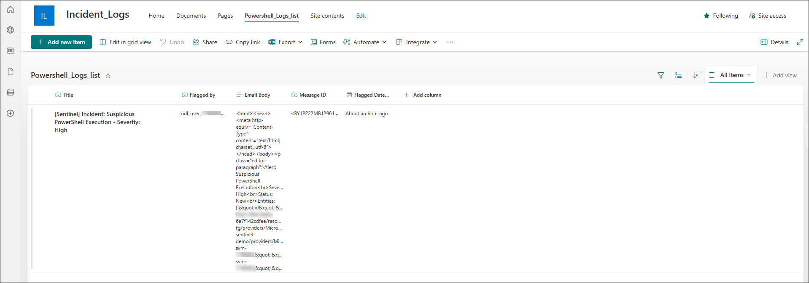

### Task 2: Create a SharePoint Site and List to Log Incident Details

In this task, you'll create a SharePoint communication site named `Incident_Logs` and set up a list called `Powershell_Logs_list`. This list will be used to log incident details such as flagged emails via Power Automate.

1. On the **SharePoint home page**, click **Create site** from the top menu **(1)**.

   

1. On the **Select the site type** screen, choose **Communication site** **(2)**.

   

1. Under **Select a template**, click **Standard communication** **(3)**.

   

1. On the template preview screen, click **Use template** **(4)**.

   

1. Enter **Incident_Logs** as the **Site name** **(1)**, then click **Next** **(2)**.

   

1. On the **Set language and other options** screen, keep the default language as **English** **(1)** and click **Create site** **(2)**.

   

1. After the site is created, click **New (1)** and select **List (2)** from the dropdown to begin creating a custom list.

   

1. In the **How would you like to start?** dialog, select **List** under **Create from blank**.

   

1. Name the list as **Powershell_Logs_list** **(1)** and click **Create** **(2)**.

   

1. On the newly created list page, click **+ Add column** to begin adding custom fields to the list.

   

1. In the **Create a column** pane, choose **Text** as the column type **(1)** and click **Next** **(2)**.

   

1. Enter **Flagged by** as the column name **(1)** and click **Save** **(2)**.

   

1. Repeat the previous steps to add the following columns:

    - **Email Body** (Text)
    - **Message ID** (Text)
    - **Flagged Date** (Date and time)
    - **Email URL** (Hyperlink)

   

### Task 2: Create a Power Automate Flow to Log Flagged Emails into SharePoint

In this task, you'll create a flow in Power Automate that triggers when an email is flagged in Outlook and logs its details (subject, sender, body, etc.) into the SharePoint list you created earlier.

1. On the **Power Automate portal**, click **Create (1)** in the left menu and select **Automated cloud flow (2)**.

   

2. In the **Build an automated cloud flow** window:
   - Enter **Automate Flagged Mail** as the **Flow name (1)**.
   - Search and select **When an email is flagged (V3)** as the trigger **(2, 3)**.
   - Click **Create (4)** to proceed.

   

3. On the flow canvas, click the **+ (1)** icon below the trigger to add a new action.

   

4. In the **Add an action** pane:
   - Search for **Get email (V2)** **(1)**.
   - Select **Get email (V2)** from **Office 365 Outlook** **(2)**.

   

5. In the **Get email (V2)** action, under **Message Id**, click the field **(1)** and select **Insert dynamic content (2)**.

   

6. In the dynamic content pane, search for **Message Id (1)** and select the field from **When an email is flagged (V3)** **(2)**.

   

7. Verify that **Message Id** is now populated dynamically. Leave the other default values as-is.

   

8. Click the **+ (1)** icon below the **Get email (V2)** step to add another action.

   

9. Search for **Create item (1)** and select it under **SharePoint (2)**.

   

10. In the **Create item** action:
    - Set **Site Address** to your SharePoint site (e.g., `Incident_Logs`) **(1)**.
    - Set **List Name** to `Powershell_Logs_list` **(2)**.
    - Expand **Advanced parameters** to view list columns **(3)**.

   

11. Select the following fields to display: **Title**, **Flagged by**, **Email Body**, **Message ID**, and **Flagged Date**.

   

12. In the **Title** field, click inside and select **Insert dynamic content (2)**.

   

13. From the dynamic content pane, search for **Subject** and select it from either trigger or action.

   

14. Fill in the remaining fields as follows:
    - **Title**: `Subject`
    - **Flagged by**: `From`
    - **Email Body**: `Body`
    - **Message ID**: `Internet Message Id`
    - **Flagged Date**: `Received Time`

   

> **Note:** Use the dynamic content from **Get email (V2)** wherever possible for more complete data.  
> **Important:** The **Body** field might store raw HTML — use additional processing if formatting is needed.

15. Once the flow is complete, click **Save** in the top-right corner.

   

16. Now go to your Outlook mailbox and flag an email you want to test the flow with.

   

17. After a few moments, go to the **Powershell_Logs_list** on your SharePoint site and verify that the email entry appears with all details logged.

   

> **Tip:** You can further extend this flow by notifying the SOC via Teams or email, or even triggering an Azure Logic App or Defender investigation.

