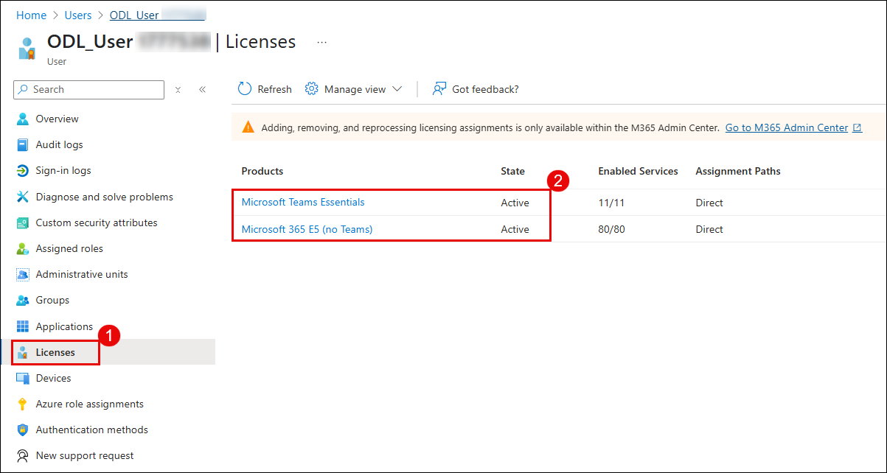
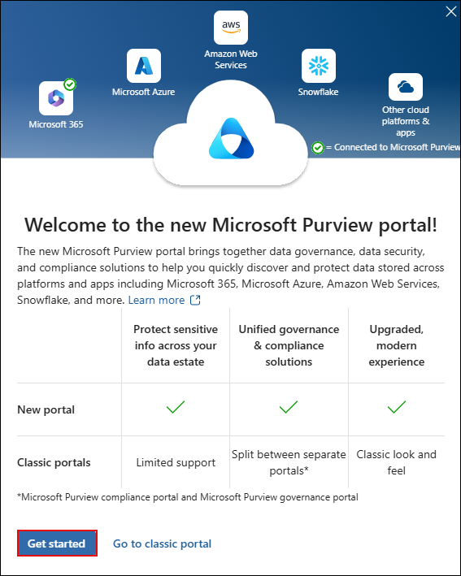
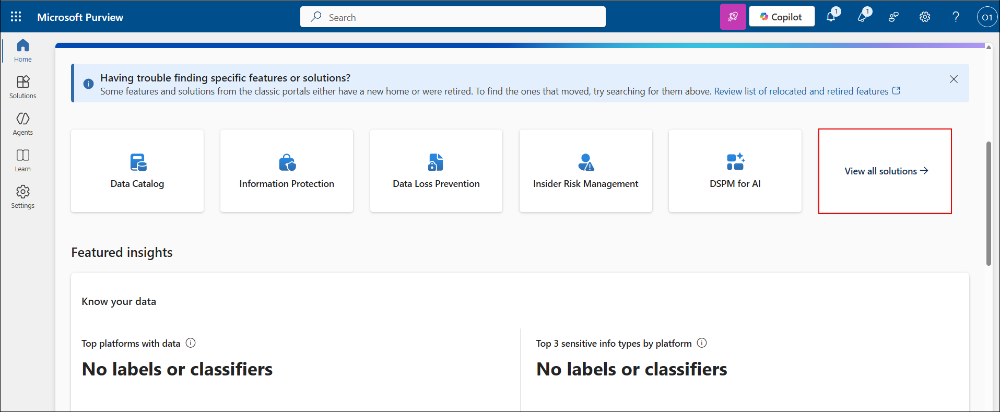
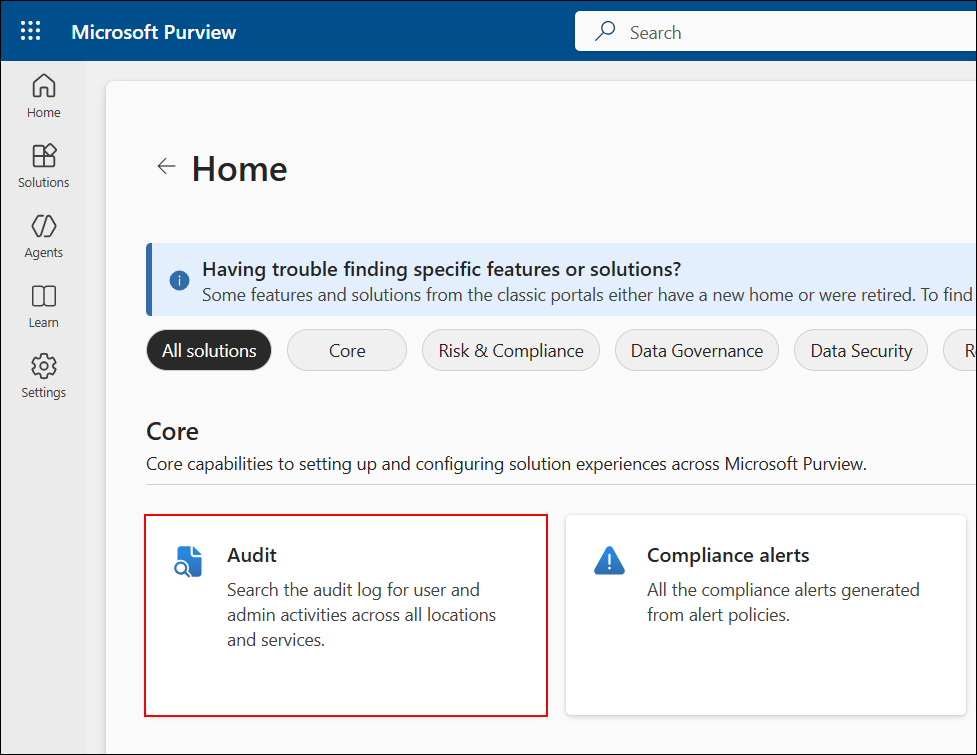
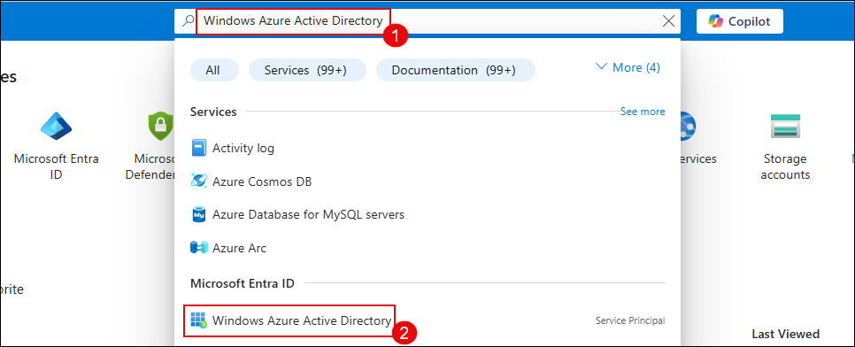
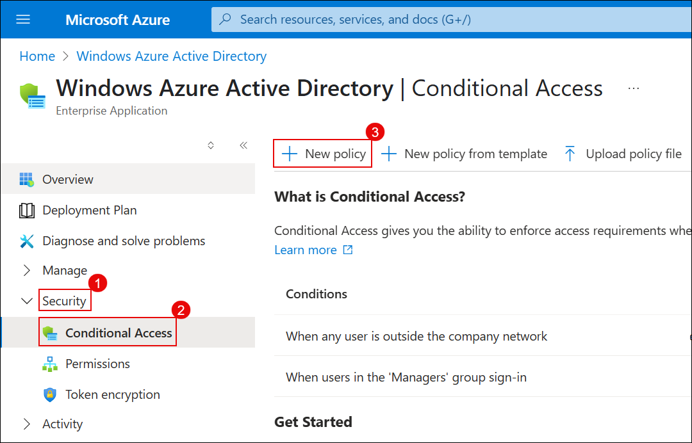
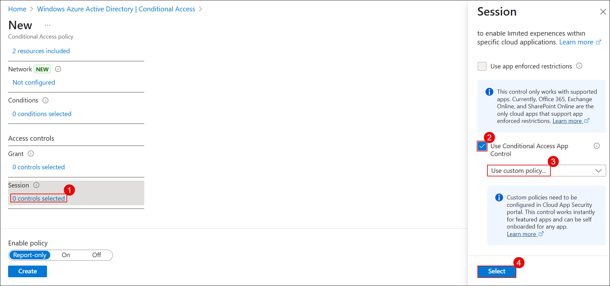
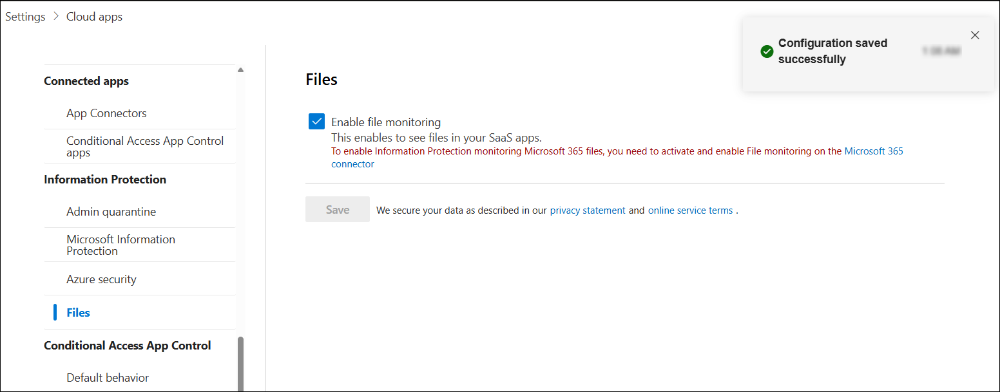

## Task 1: Connect and Onboard a SaaS App to Microsoft Defender for Cloud Apps

In this task, you'll verify license assignment, enable auditing, configure Conditional Access policies, and onboard Microsoft 365 to Defender for Cloud Apps.

### Estimated Duration: 30 Minutes

1. On the **Azure portal** homepage, search for **Microsoft Entra ID (1)** and select **Microsoft Entra ID (2)** from the results.

   

1. On the **Microsoft Entra ID Overview** page, expand **Manage (1)** and select **Users (2)**.

   

1. From the list of users, select the **user** <inject key="Deployment-id" enableCopy="false"></inject>.

   

1. On the user profile page, select **Licenses (1)** and ensure the user has an active **Microsoft 365 E5 (2)** license.

   

1. In a new browser tab, go to `https://purview.microsoft.com`.

   

1. If prompted, click **Get started (1)** on the Microsoft Purview welcome dialog.

   

1. On the Microsoft Purview homepage, click on **View all solutions (1)**.

   

1. Under the **Core** section, click on the **Audit** tile.

   

1. On the **Audit** blade, click **Start recording user and admin activity**.

   

1. When prompted, click **Yes** to complete the organizational setup.

    

    > **Note:** It may take a few hours for audit recording to become active. You may continue with the rest of the exercise while it completes.

1. Switch to the Azure portal tab and search for **Windows Azure Active Directory (1)**. Select **Windows Azure Active Directory (2)** from the results.

    

1. On the left menu, expand **Security (1)** and select **Conditional Access (2)**. Then click **+ New policy (3)**.

    

1. On the **New policy** page, enter the name `MCAS – M365 Session Control`.

1. Under **Assignments > Users**, click **Specific users included (1)**.  
    In the **Include (2)** tab, select **Select users and groups (3)** → check **Users and groups (4)** → click **0 users and groups selected (5)**.

    

1. In the **Select users and groups** pane, search for `<inject key="Deployment-id" enableCopy="false"></inject>
 `, check the box next to **ODL_User (2)**, and click **Select (3)**.

    

1. Confirm that the user is now listed under the **Users** section.

    

1. Under **Target resources**, click **1 resource included (1)**.  
    In the right pane, under **Include (2)**, select **Select resources (3)** → click **Windows Azure Active Directory (4)** → check **Office 365 (5)** → click **Select (6)**.

    

1. Under **Access controls > Session**, click **0 controls selected (1)**.  
    In the Session panel, check **Use Conditional Access App Control (2)**, select **Use custom policy (3)**, and click **Select (4)**.

    

1. At the bottom of the page, toggle **Enable policy** to **On (1)** and click **Create (2)**.

    

1. In the **Microsoft Defender portal**, expand **Cloud apps**, go to **Information Protection (1)** → **Files (2)**.  
    On the right, check **Enable file monitoring (3)** and click **Save (4)**.

    

1. Wait for the confirmation message: **Configuration saved successfully**.

    

1. Under **Connected apps**, select **App Connectors (1)**.  
    Check **Microsoft 365 (2)** and click **+ Connect (3)**.

    

1. On the next screen, click **Done** to confirm that Microsoft 365 is connected.

    

> **Congratulations** on completing the task! Now, it's time to validate it. Here are the steps:
> - Hit the Validate button for the corresponding task. If you receive a success message, you can proceed to the next task. 
> - If not, carefully read the error message and retry the step, following the instructions in the lab guide.
> - If you need any assistance, please contact us at cloudlabs-support@spektrasystems.com. We are available 24/7 to help you out.
<validation step="d841263c-65e4-4a6c-ab16-b57b20463af8" />

## Review

In this lab, you have completed the following tasks:

- Connected and onboarded a third-party SaaS application to Microsoft Defender for Cloud Apps.
- Verified successful connection through the connected apps dashboard.

### You have successfully completed the lab. Click on **Next >>** to proceed with the next Lab.

