## Task 2: Configure Session Policies to Monitor and Block Risky Behavior

In this task, you will create a Microsoft Defender for Cloud Apps session policy to block downloads of risky files (e.g., `.exe`, `.apk`) from SharePoint Online for non-compliant devices.

### Estimated Duration: 30 Minutes

1. On the **Microsoft Defender portal**, navigate to **Policies (1)** under **Cloud apps**, then click **Policy management (2)**. On the **Policies** page, click **All policies (3)** at the top. Then select **Create policy (4)** and choose **Session policy (5)** from the dropdown.

   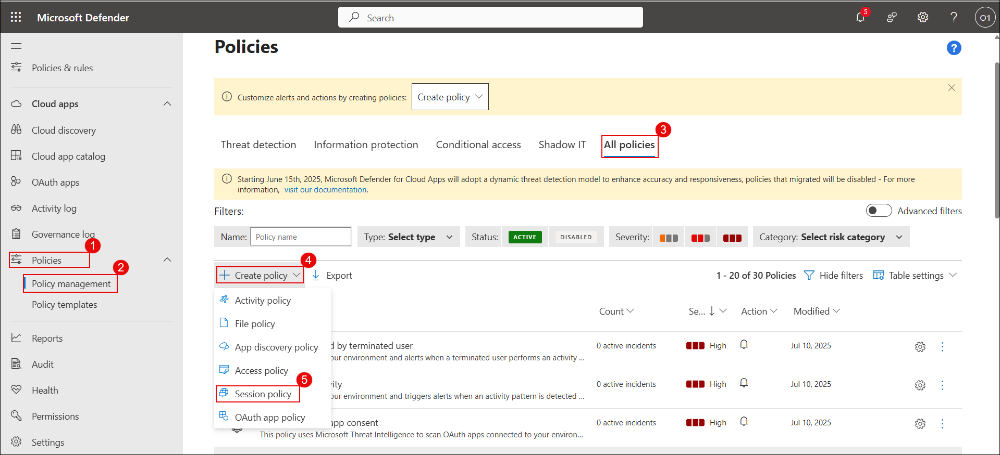

1. On the **Create session policy** page, set the following values:
   - **Policy template (1)**: No template
   - **Policy name (2)**: Block-All-Download
   - **Policy severity (3)**: High (Red)
   - **Category (4)**: Threat detection
   - **Session control type (5)**: Control file download (with inspection)

   In the **Activity source** section, define the following filters:
   - **Device | Tag | does not equal | Intune compliant, Microsoft Entra Hybrid joined**
   - **App | Manual onboarding | equals | Microsoft SharePoint Online**

      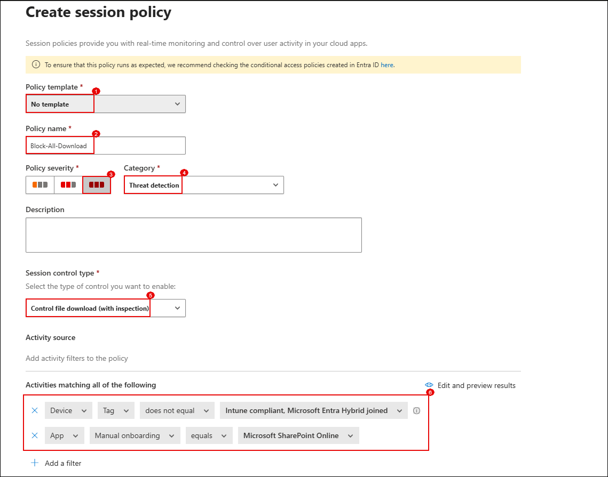

1. In the **Files matching all of the following** section, add file extension filters:
   - **Extension equals exe**
   - **OR apk (1)**

   Under **Actions**, select **Block (2)**.

   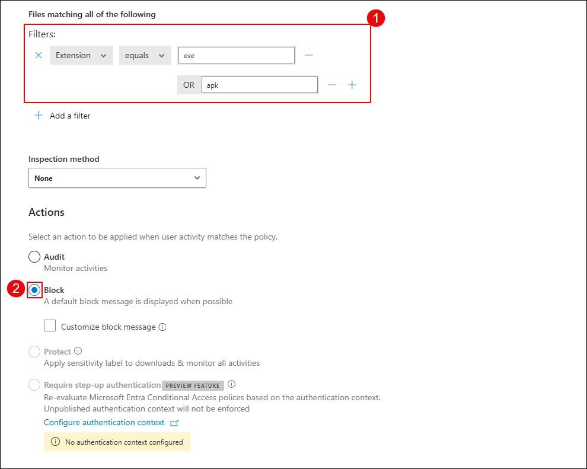

1. Scroll down and click **Update** to save the policy.

   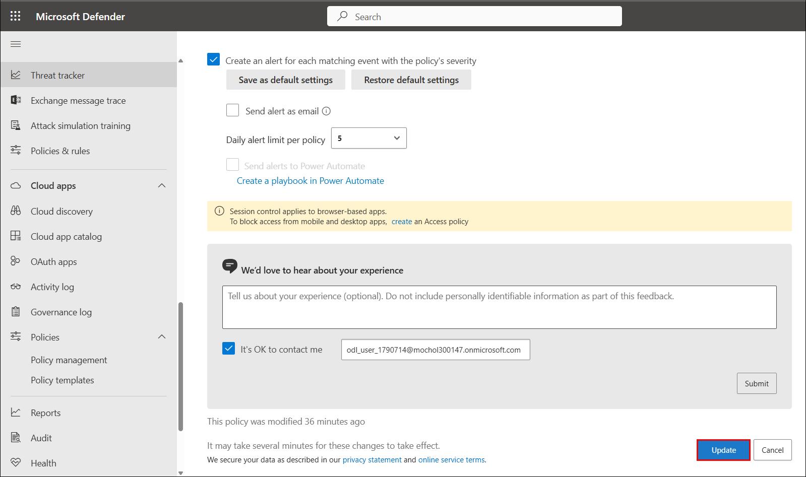

    Now simulate the download attempt to validate the policy.

1. On your desktop, right-click the **Microsoft Edge (1)** shortcut, go to **Send to (2)** and select **Documents (3)**.

   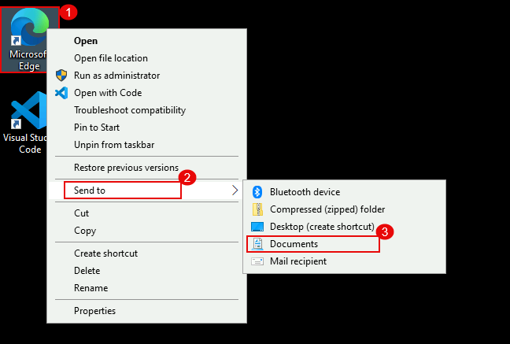

1. Navigate to **https://portal.office.com**, open **SharePoint**, and click **Create site**.

   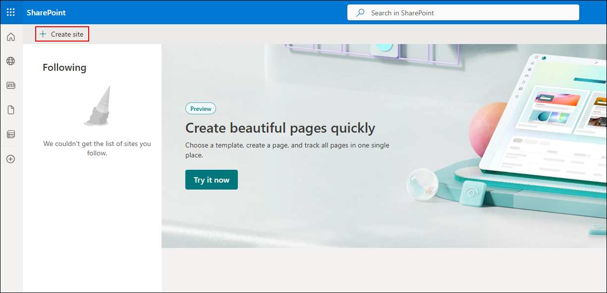

1. Choose **Communication site**.

   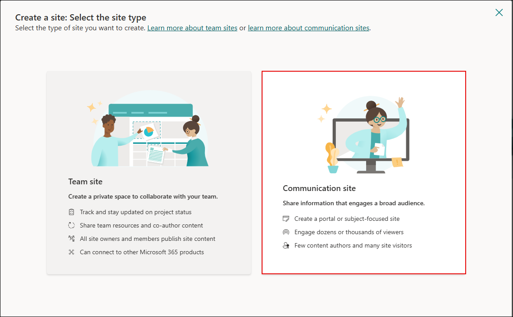

1. Provide a **Site name (1)** as "Demo" and click **Next (2)**.

   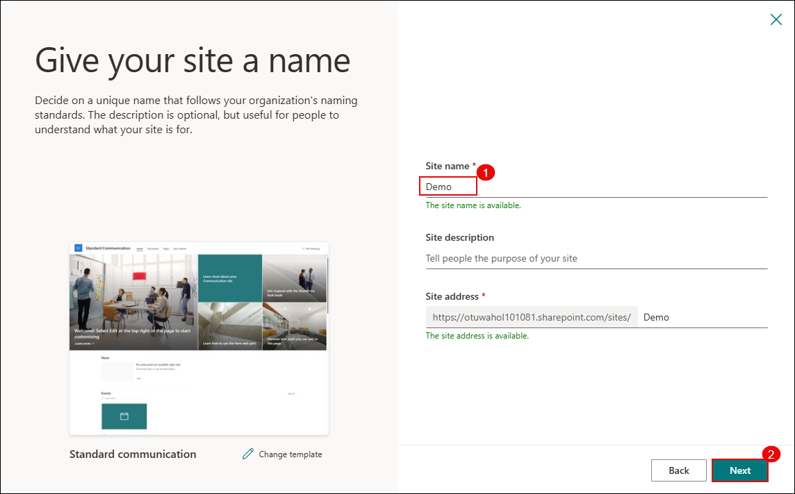

1. On the **language selection** page, select **English (1)** and click **Create site (2)**.

    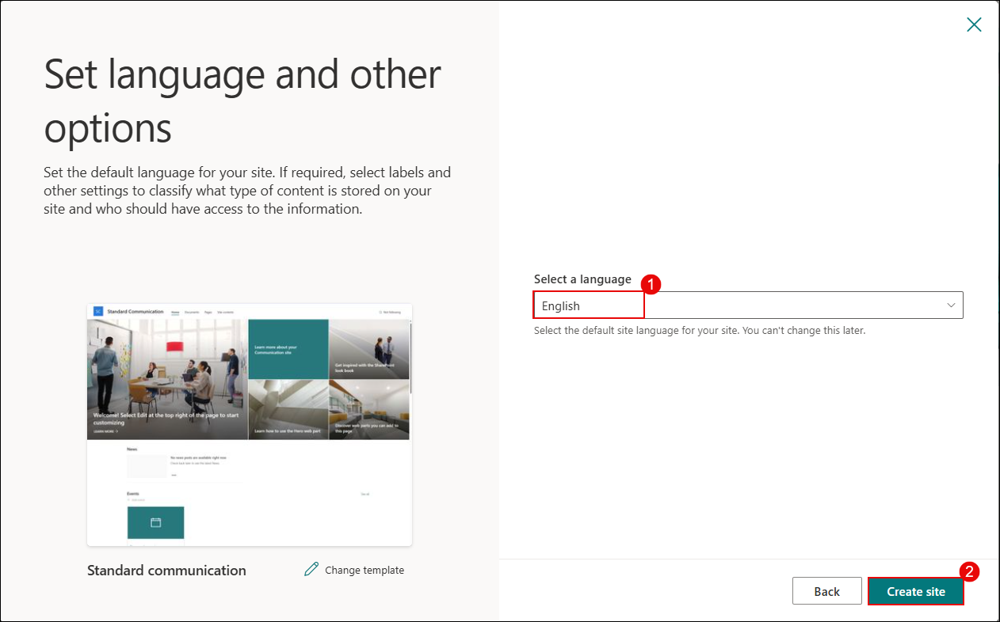

1. Once the site loads, click the **menu icon** on the top left to expand the navigation.

    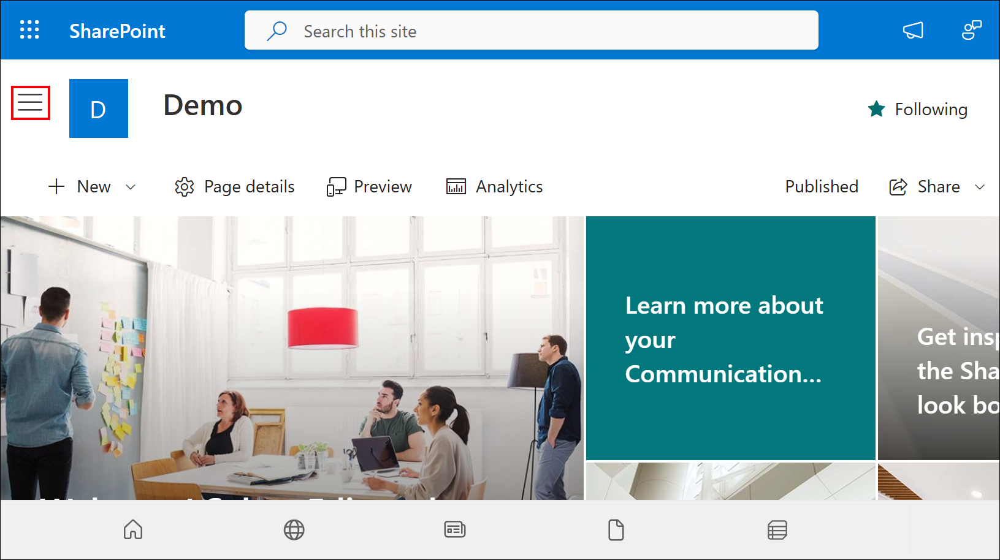

1. In the left navigation panel, click **Documents**.

    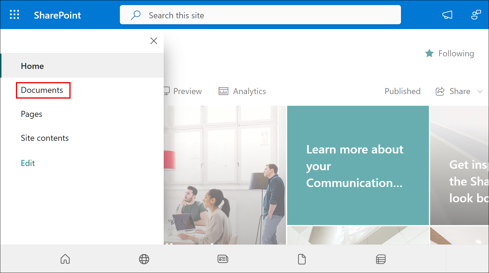

1. On the **Documents** page, click **Upload (1)** and select **Files (2)**.

    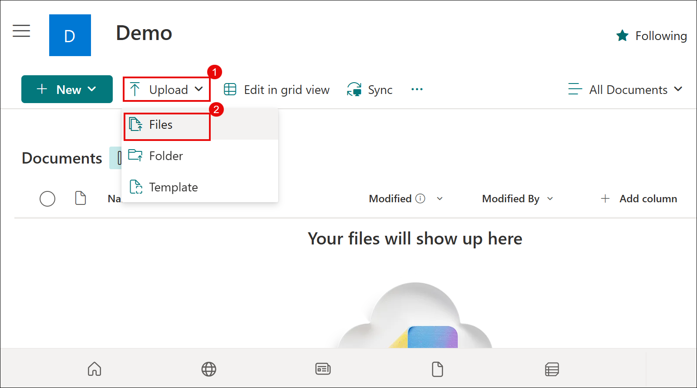

1. In the file picker window, browse to **Documents (1)**, select the **Microsoft Edge shortcut (2)**, and click **Open (3)**.

    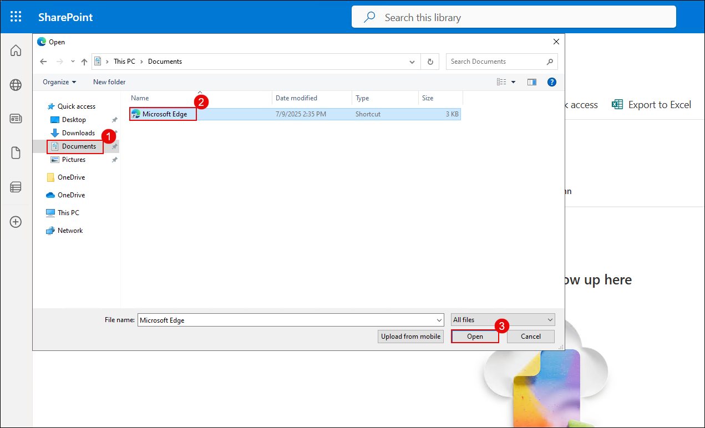

1. After the upload, verify that the file **msedge.exe** appears in the list.

    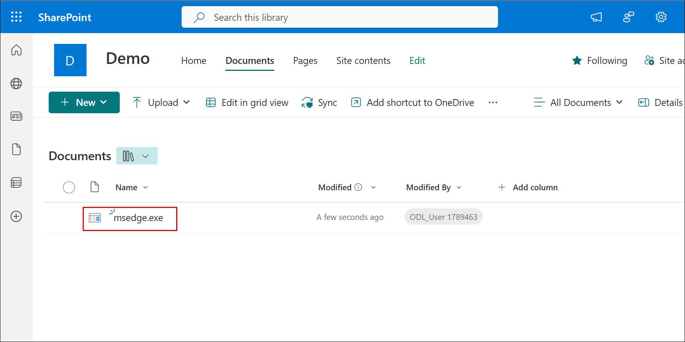

1. Attempt to download the file by clicking **Download** on the preview screen.

    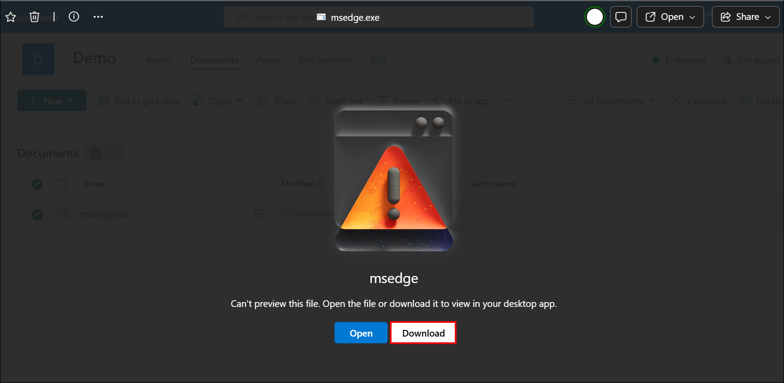

1. A message appears saying the **Download is blocked**, confirming the session policy is working.

    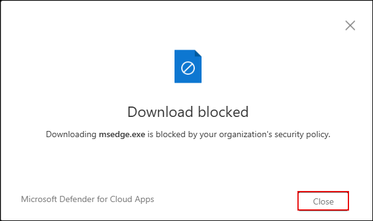

   > **Note:** Session policies apply only to browser-based sessions. To block access from mobile or desktop apps, configure **Access policies** separately.

## Review

In this lab, you have completed the following tasks:

- Created session policies to detect risky behaviors such as file downloads and suspicious user activity.
- Tested policy enforcement to ensure risky actions were blocked or monitored in real time.

You’ve implemented real-time monitoring and control over SaaS applications using Defender for Cloud Apps.

### You have successfully completed the lab. Click on **Next >>** to proceed with the next Lab.

