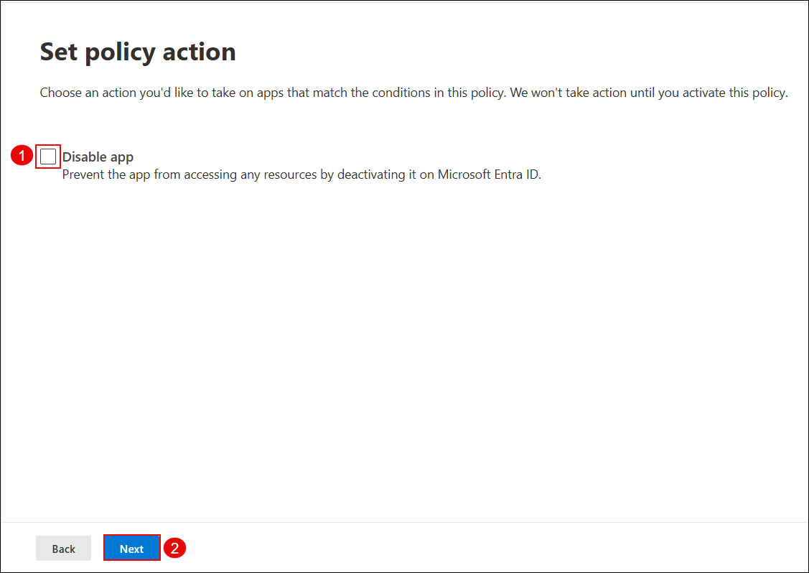
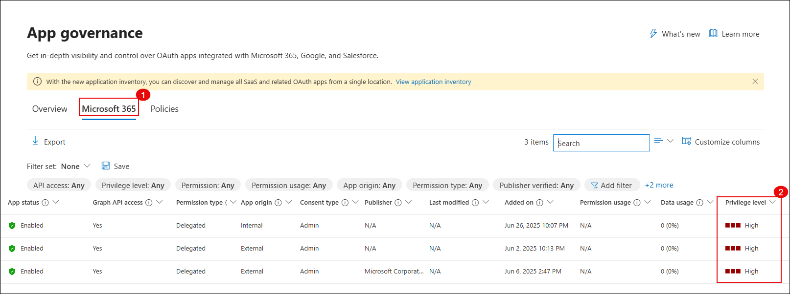

## Task 3: Implement App Governance and Risk Detection for OAuth Apps (`Read-Only`)

In this task, you will explore how to enable App Governance in Microsoft Defender XDR and configure a custom detection policy to flag high-risk OAuth apps based on their permissions and publisher status. This is a **read-only task** because, after turning on App Governance, it can take **4–5 hours** for connected OAuth apps to appear and be fully evaluated by the system.

### Estimated Duration: 15 Minutes

1. On the **Microsoft Defender portal**, go to **System (1)** > **Settings (2)** and click **Cloud Apps (3)**.

   

1. Under **App governance**, select **Service status (1)** and click **Turn on app governance (2)**.

   

   > App Governance is now activated. It will begin evaluating connected OAuth apps and generating insights into their behavior and risk posture.

1. On the OAuth apps page, click **Go to app governance**.

   

   > You may be redirected to the new App Governance interface.

1. In the left menu, go to **Cloud apps (1)** > **Governance log (2)** and select the **AuditLogApp (3)** from the listed apps.

   

1. In the AuditLogApp details pane, select the **Permissions (1)** tab and review the permissions classified as **High privilege (2)**.

   

   > You've now reviewed an OAuth app's access level and identified potentially risky permissions that may require action.

1. Go to the **Policies (1)** tab > select **Microsoft 365 (2)**, then click **Create policy (3)**.

   

1. In the **Choose a policy template** pane, select **Custom (1)** > **Custom policy (2)** and click **Next (3)**.

   

1. Name the policy as **Detect High-Permission OAuth Apps (1)**, set **Severity to High (2)**, and click **Next (3)**.

   

1. Select **No, I’ll customize the policy (1)**, then click **Next (2)**.

   

1. Under policy scope, select **All apps (1)** and click **Next (2)**.

   

1. Configure the policy conditions:  
    - Set **Highly privileged (1)** to **Yes (2)**  
    - Set **Publisher verified (3)** to **No (4)**  
    - Click **Save (5)**

      

1. In the **Set policy action** step, choose **Disable app (1)** and click **Next (2)**.

   

1. Set the policy status to **Active (1)** and click **Next (2)**.

   

1. Review the policy settings and click **Submit** to create the policy.

   

1. On the confirmation screen, click **Done** to finish.

   
   
   > The detection policy is now active and will monitor all onboarded OAuth apps for risky permissions and unverified publishers.

1. Back on the **App governance** overview, click **View all apps** to analyze detected apps.

   

1. In the **Microsoft 365 (1)** tab, notice apps flagged with a **High (2)** privilege level.

   

1. Go to **Incidents & alerts (1)** > **Incidents (2)**, and click the incident **Detect High-Permission OAuth Apps (3)**.

   

1. In the incident details pane, review the violation summary, app, and policy triggered.

   

## Review

In this lab, you have completed the following tasks:

- Enabled App Governance in Microsoft Defender for Cloud Apps to monitor and assess OAuth app risk.
- Created a custom detection policy to identify apps with high privileges and unverified publishers.
- Investigated alerts and user activity logs to trace suspicious downloads and policy violations.
- Created an activity policy to detect and alert on specific file downloads from Microsoft SharePoint Online.
- Installed and configured the Microsoft Defender for Identity sensor on a domain controller.
- Verified sensor health and ensured identity telemetry was active in the Defender portal.

### You have successfully completed the lab. Click on **Next >>** to proceed with the next Lab.

