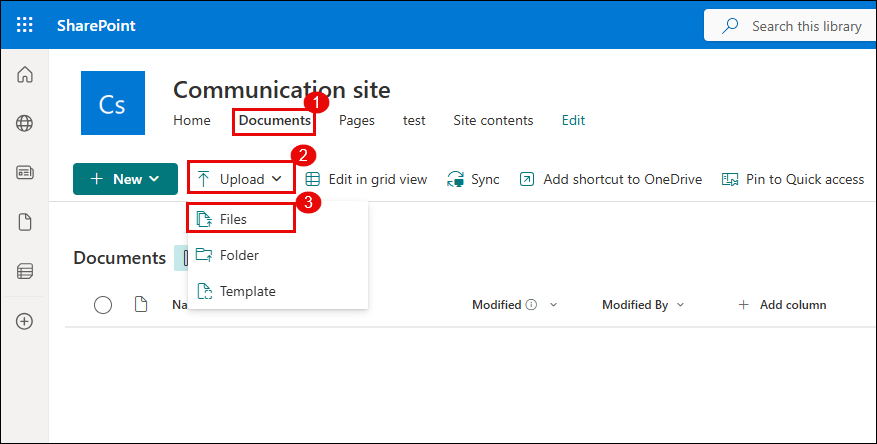
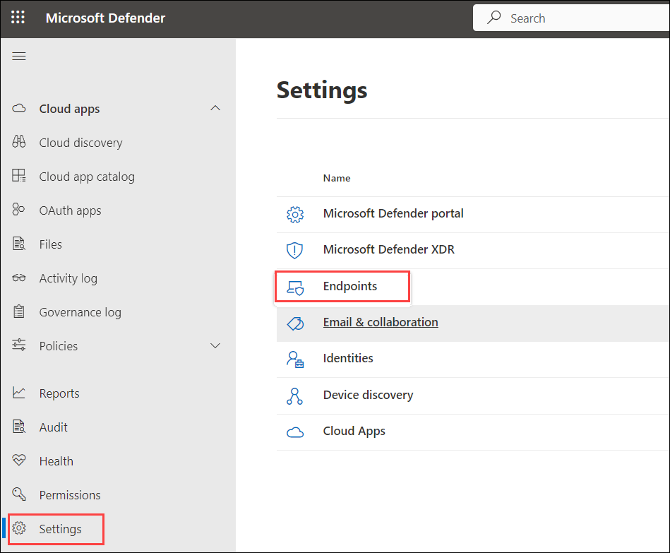
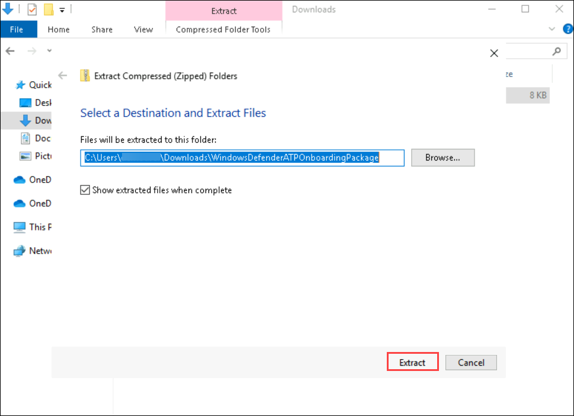
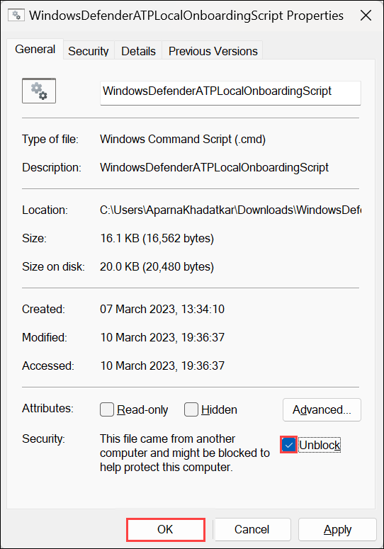

## Task 4: Investigate Alerts and Create Custom Detection Policies

### Estimated Duration: 15 Minutes

1. In the Microsoft Defender Portal, go to **Cloud Apps** → **Activity log**.

1. Under the **App** filter, click on **Select apps** (3), select **Microsoft SharePoint Online**

    

   > **Note:** Once selected, all user activities performed in SharePoint—such as file uploads, downloads, edits, and access attempts—will be visible in the activity log.

1. Go to **Incidents & alerts** → **Alerts**, and look for `Block-All-Download`.

   

1. Click the alert, then select **Open alert page**.
   
   

1. Click **Investigate in activity log**.
 
   

   

1. Go to **Cloud Apps** → **Policy management**, and click **Create policy** → **Activity policy**.

   

1. Configure the following:

   - **Policy template:** `No template`
   - **Policy name:** `Detect Suspicious File Download – msedge.exe`  
   - **Severity:** `High`  
   - **Category:** `Threat detection`  
   - **Act on:** `Single activity`  
   - **Activity type:** `Download file`  
   - **Files and folders:** `msedge.exe`  
   - **App:** `Microsoft SharePoint Online`
   
      

1. Click **Edit and preview results**, review matches, then click **Save filters**.

   

1. Under **Alerts**, enable **Send alert as email**, add a valid address, set daily alert limit to `5`.

1. Click **Create** to save and activate the policy.

   

1. Simulate a download again in SharePoint, and downloading `msedge.exe`.
    
   

   

   

1. Open your Outlook email inbox and locate the alert email titled `Alert - Detect Suspicious File Download – msedge.exe`.
   
   

   > **Note:** If you do not see the alert email, wait for 5–10 minutes and refresh your inbox.

1. In the portal, go to **Incidents & alerts** → **Alerts**, and open the alert.
   
   

1. Click **Open alert page** → **view incident page**.

   

1. Carefully review the event details:

    - User name  
    - File name  
    - App used  
    - IP address  
    - Device info  
    - Triggered policy
   
      

### Onboard a Device

1. Navigate to **Settings** in the left menu bar, and then, on the Settings page, choose **Endpoints**.

    

    > **Note:** The **Endpoints** option under **Settings** may take a few moments to appear after the initial setup.

    > If you don't see it right away, wait a minute and try refreshing the page.

1. Navigate to the **Onboarding** option in the Device Management section.

    >**Note:** Device onboarding can also be initiated from the **Assets** section on the left menu bar. Expand 'Assets' and choose 'Devices.' On the Device Inventory page, with 'Computers & Mobile' selected, scroll down to find the option for **Onboard devices.** Clicking on this option will direct you to the **Settings > Endpoints** page.

1. In the '1. Onboard a device' section, ensure that 'Local Script (for up to 10 devices)' is visible in the Deployment method drop-down, then click the **Download onboarding package** button.

     

1. In the *Downloads* pop-up, use your mouse to select the 'WindowsDefenderATPOnboardingPackage.zip' file, and then click on the folder icon for **Show in folder**. **Hint:** If you can't locate it, the file should be in the 'c:\users\admin\downloads' directory.

    

1. Right-click on the downloaded zip file, choose **Extract All...**, ensure that **Show extracted files when complete** is checked, and then click **Extract**.

     

1. Right-click on the extracted file 'WindowsDefenderATPLocalOnboardingScript.cmd' and choose **Properties**. Tick the **Unblock** checkbox located in the bottom right of the Properties window, and then click **OK**.

     

1. Once again, right-click on the extracted file **WindowsDefenderATPLocalOnboardingScript.cmd** and opt for **Run as Administrator**. **Hint:** If the Windows SmartScreen window appears, click on **More info**, and then select **Run anyway**.
    
1. When the "User Account Control" window appears, select **Yes** to allow the script to run, answer **Y** to the question presented by the script, and press **Enter**. Once complete, you should see a message in the command screen that says *Successfully onboarded machine to Microsoft Defender for Endpoint*.

1. Press any key to continue. This action will close the Command Prompt window.

    

1. Back on the Onboarding page within the Microsoft 365 Defender portal, navigate to the "2. Run a detection test" section, and copy the detection test script by clicking the **Copy** button.

     

1. In the Windows search bar of the virtual machine, type **CMD**, and choose **Run as Administrator** from the right pane for the Command Prompt app.

1. When the "User Account Control" window appears, select **Yes** to allow the app to run. 

1. Paste the script by right-clicking in the **Administrator: Command Prompt** window and press **Enter** to run it. **Note:** The window closes automatically after running the script.

1. In the Microsoft 365 Defender portal, navigate to the left-hand menu, and under the **Assets** area, select **Devices**. If the device is not shown, proceed with the next task and return to check it later. It can take up to 60 minutes for the first device to be displayed in the portal.

     

    >**Note:** If you have completed the onboarding process and don't see devices in the Devices list after an hour, it might indicate an onboarding or connectivity problem.

## Review

In this lab, you have completed the following tasks:

- Created a custom detection policy to identify apps with high privileges and unverified publishers.
- Investigated alerts and user activity logs to trace suspicious downloads and policy violations.
- Created an activity policy to detect and alert on specific file downloads from Microsoft SharePoint Online.

### You have successfully completed the lab. Click on **Next >>** to proceed with the next Lab.

