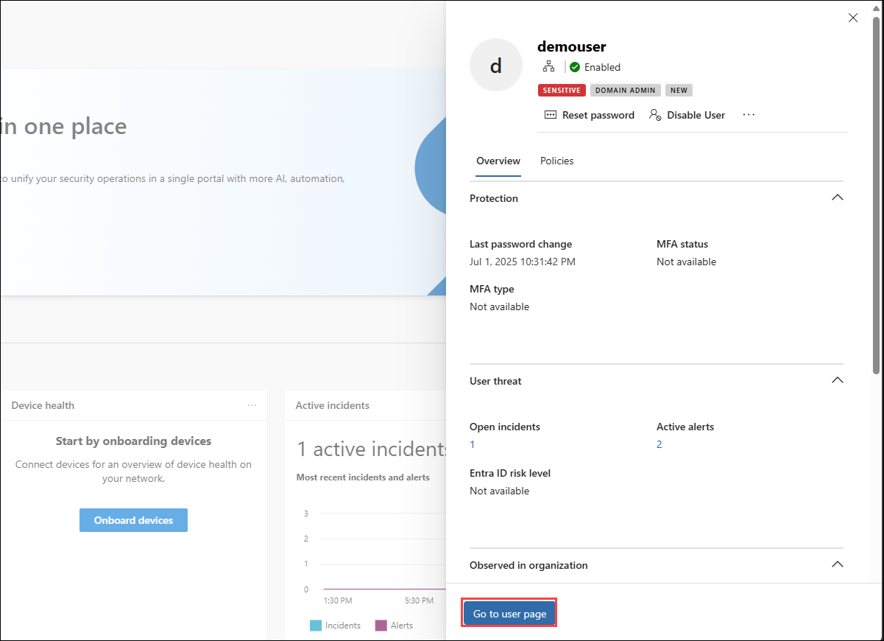

# Lab 07: Investigate Threats and User Timelines 

In this task you will analyze using user timelines and alert details in the Defender portal.

### Estimated Duration: 10 Minutes

1. In the Microsoft Defender portal, in the search bar, type `demouser` and select it.

      

1. Click on **Go to user page**

      

1. In the user profile, click the **Timeline** tab to view all events and alerts.

      

## Review

In this lab, you have completed the following tasks:

- Investigated identity-based threats using the user timeline and activity alerts.  

### You have successfully completed the lab. Click on **Next >>** to proceed with the next Lab.

