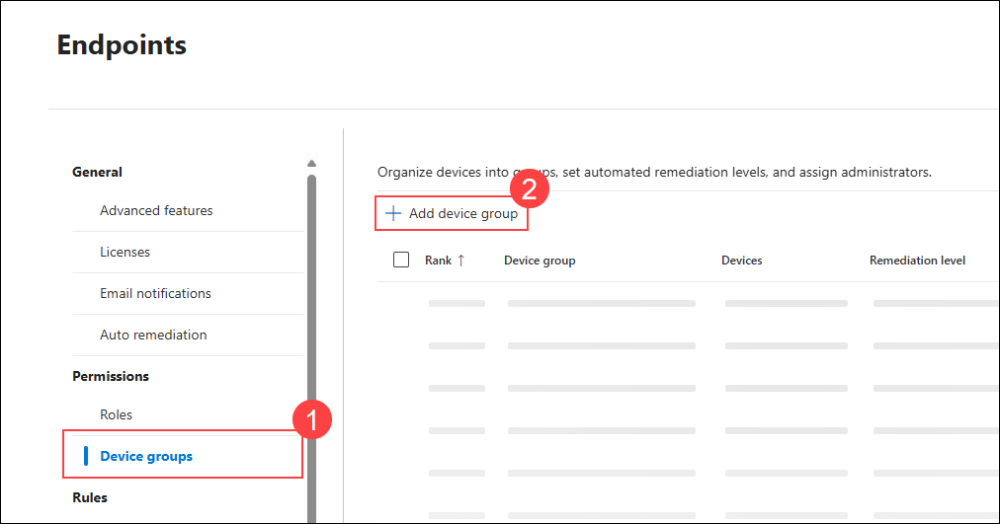

# Lab 09: Implement Automated Investigation and Response (AIR) for Identity Threats (`Read-Only`)

> **Note:** In this task, we will **only review** the configuration steps. No actual deployment or configuration will be performed, as the Microsoft E5 license assigned to this lab **already includes AIR pre-configured**.

1. Navigate to the Defender portal and from the left navigation pane go to **Settings** → **Endpoints**.

      

1. Under **Permissions** select **Device groups** and click on **+ Add device group**

      

1. Enter the following settings on the **General** tab and click on **Next**

    - **Device group name:** Domain Controllers
    - **Remediation level:** Full – remediate threats automatically

      

1. Enter the following settings **Devices** and click on **Next**

    - **Name:** svm-<inject key="DeploymentID" enableCopy="false"/>
    - **Domain:** defenderxdr.internal

      

1. Leave everything as default and click on **Next** in the **Preview devices** and click on **Submit**

1. On the **No user groups selected** pop-up click on **Continue** and click on **Done**

      
      >**Note:** You can create user groups in Entra and assign permissions to modify the device group exclusively to those groups. This approach enhances governance by restricting access to authorized users only.

1. From the left navigation pane in the Defender portal go to **Settings** → **Microsoft Defender XDR**.

      

1. Under **Automated response**, review the **Identities** tab to see available actions:
    - Export: This option exports the list of users excluded from automated response actions
    - Add user exclusion: This option

      

1. Now, go to **Devices** under **Automated response** and review available actions:
    - Device groups: You can use this to exclude device groups from automated response actions.
    - Exclude IPs: You can configure specific IP addresses to be excluded from automated response actions.

      

## Review

In this exercise, you completed a comprehensive automated incident response setup using Microsoft Defender XDR, Microsoft Sentinel, Power Automate, and SharePoint:

- Reviewed pre-configured Automated Investigation and Response (AIR) settings for identities and devices.  

### You have successfully completed the lab. Click on **Next >>** to proceed with the next Lab.

