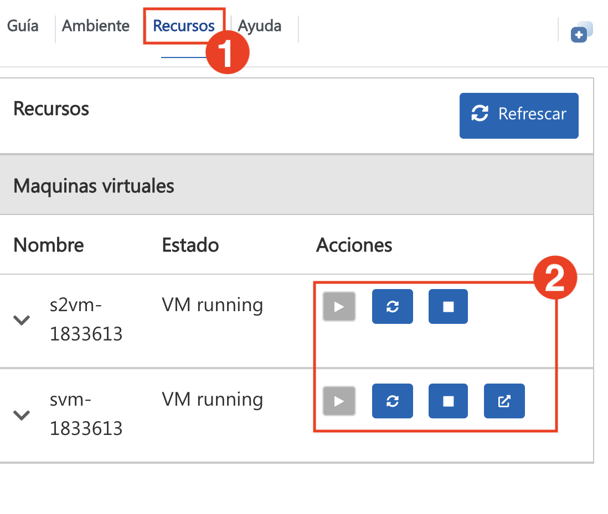
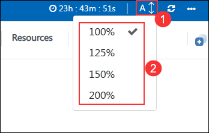
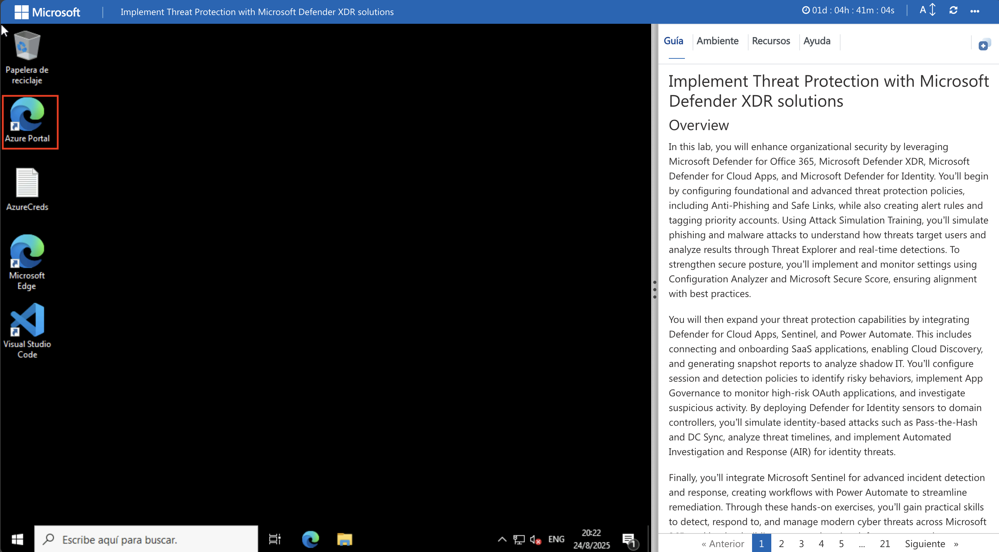
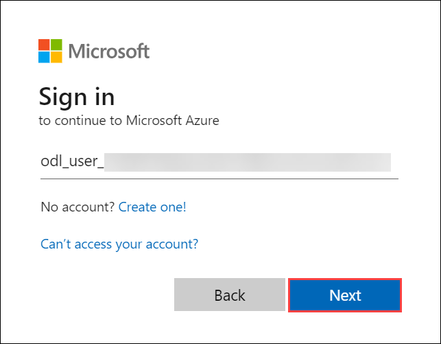
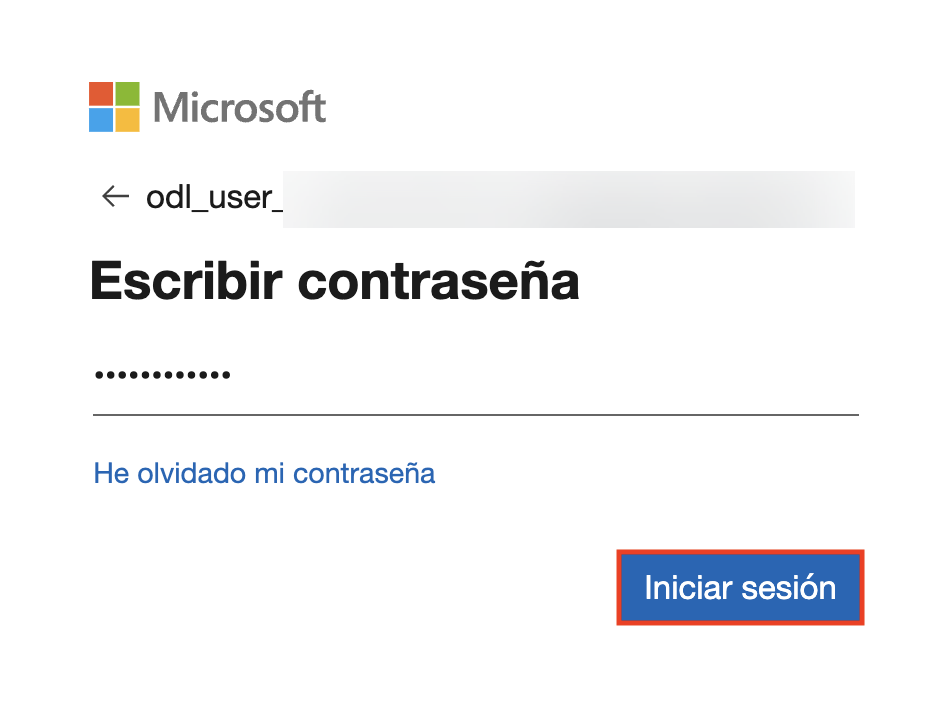

# Implement Threat Protection with Microsoft Defender XDR solutions - Day 02

### Overall Estimated Duration: 4 Hours

## Overview

In this lab, you will advance your threat protection capabilities by integrating Microsoft Defender for Cloud Apps, Microsoft Defender for Identity, Microsoft Sentinel, and Power Automate. You’ll start by connecting and onboarding SaaS applications to Defender for Cloud Apps and configuring session policies to detect and block risky user behaviors. Then, you’ll implement App Governance to identify high-risk OAuth applications and create custom detection policies for suspicious activity. You’ll deploy Defender for Identity sensors to domain controllers, simulate and detect identity-based attacks such as Pass-the-Hash and DC Sync, and analyze threat timelines. Finally, you’ll implement automated investigation and response (AIR) for identity threats and build incident response workflows using Microsoft Sentinel and Power Automate.

## Objectives

- Onboard SaaS applications and configure session policies using Microsoft Defender for Cloud Apps.
- Implement App Governance to detect high-risk OAuth apps and create custom detection policies.
- Deploy Microsoft Defender for Identity sensors and investigate identity-based threats and lateral movement attacks.
- Integrate Defender for Identity with Microsoft Defender XDR and analyze user timelines.
- Implement automated investigation and response (AIR) for identity threats.
- Build incident response workflows using Microsoft Sentinel and Power Automate.

## Prerequisites

Participants should have:

- Familiarity with Microsoft 365 security and compliance capabilities.
- Understanding of Microsoft Defender for Endpoint and Defender for Cloud Apps.
- Access to the lab-provided Microsoft 365 tenant and administrative permissions.
- Basic knowledge of Conditional Access, SaaS onboarding, and security policy configuration.
- Awareness of Shadow IT risks, OAuth application security, and file governance.
- Basic knowledge of KQL, incident management, and security policy configuration.
- Awareness of attack techniques, threat hunting, and incident response.

# Getting Started with the Lab
 
Welcome to your Securing Access to SaaS Apps with Microsoft Defender for Cloud Apps workshop! We've prepared a seamless environment for you to familiarize yourself with the Microsoft security operations analyst, you monitor, identify, investigate, and respond to threats in multi-cloud environments and related Microsoft services. Let's begin by making the most of this experience:
 
## Managing Your Virtual Machine

On the **Resources (1)** tab, you can manage your virtual machines. Under the **Actions (2)** column, use the buttons to start, stop, restart, or open your VM as needed.

## Lab Guide Zoom In/Zoom Out
 
Click the **A↕ icon (1)** next to the timer to adjust the zoom level for the environment page. From the drop-down menu, select the desired **Percentage (2)**.

## Let's Get Started with Azure Portal

1. On your virtual machine desktop, double-click the **Azure Portal** shortcut (Microsoft Edge browser) to open the Azure portal.
 
    

2. You'll see the **Sign into Microsoft Azure** tab. Here, enter your credentials:
 
   - **Email/Username:** <inject key="AzureAdUserEmail"></inject>
 
     
 
3. Next, provide your password:
 
   - **Password:** <inject key="AzureAdUserPassword"></inject>
 
     

1. If you see the pop-up Stay Signed in?, select No.

   > **NOTE**: If prompted with MFA, and Ask Later option is not available please follow the steps highlighted under - [Steps to Proceed with MFA Setup if Ask Later Option is Not Visible](#steps-to-proceed-with-mfa-setup-if-ask-later-option-is-not-visible)

1. If you see the pop-up **You have free Azure Advisor recommendations!**, close the window to continue the lab.

1. If a Welcome to **Microsoft Azure** popup window appears, select **Maybe Later** to skip the tour.

## Steps to Proceed with MFA Setup if Ask Later Option is Not Visible

   > **Note:** Continue with the exercises if MFA is already enabled or the option is unavailable.

1. At the **"More information required"** prompt, select **Next**.

1. On the **"Keep your account secure"** page, select **Next** twice.

1. **Note:** If you don’t have the Microsoft Authenticator app installed on your mobile device:

   - Open **Google Play Store** (Android) or **App Store** (iOS).
   - Search for **Microsoft Authenticator** and tap **Install**.
   - Open the **Microsoft Authenticator** app, select **Add account**, then choose **Work or school account**.

1. A **QR code** will be displayed on your computer screen.

1. In the Authenticator app, select **Scan a QR code** and scan the code displayed on your screen.

1. After scanning, click **Next** to proceed.

1. On your phone, enter the number shown on your computer screen in the Authenticator app and select **Next**.
       
1. If prompted to stay signed in, you can click **No**.

1. If a **Welcome to Microsoft Azure** popup window appears, click **Cancel** to skip the tour.

1. Now, click on the **Next** from the lower right corner to move to the next page.
   
### **Support Contact**

The CloudLabs support team is available 24/7, 365 days a year, via email and live chat to ensure seamless assistance at any time. We offer dedicated support channels tailored specifically for both learners and instructors, ensuring that all your needs are promptly and efficiently addressed.
 
Learner Support Contacts:
 
- Email Support: cloudlabs-support@spektrasystems.com
- Live Chat Support: https://cloudlabs.ai/labs-support

Now you're all set to explore the powerful world of technology. Feel free to reach out if you have any questions along the way. Enjoy your workshop!

Now, click on **Next** from the lower right corner to move on to the next page.
 

### Happy learning!

Now you're all set to explore the powerful world of technology. Feel free to reach out if you have any questions along the way. Enjoy your workshop!

Now, click on **Next** from the lower right corner to move on to the next page.
 
  

### Happy learning!
