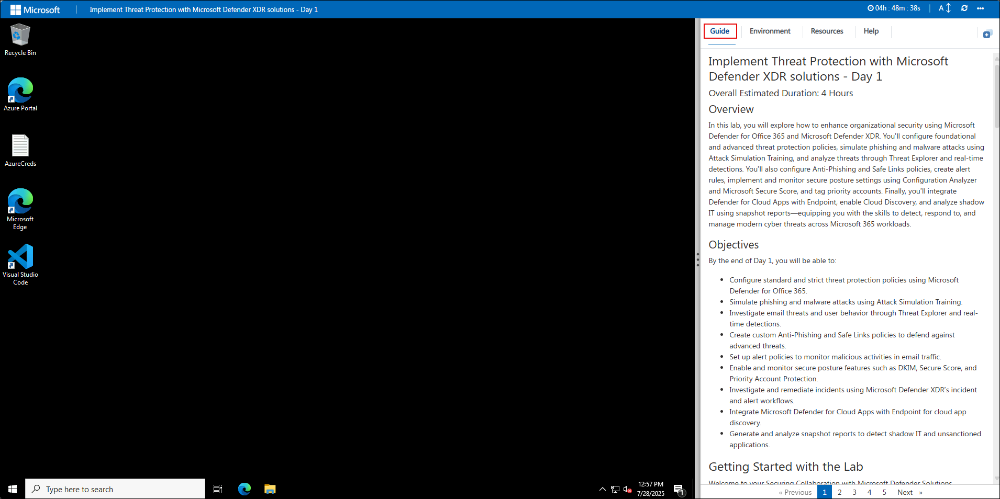
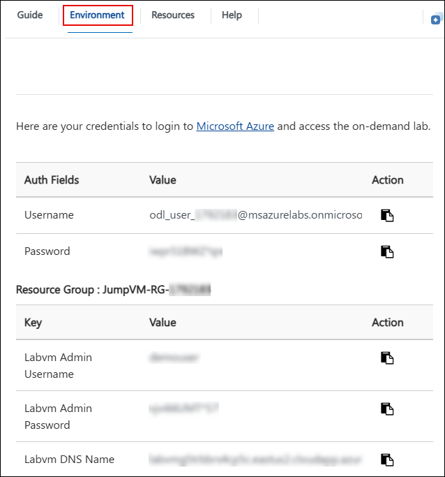
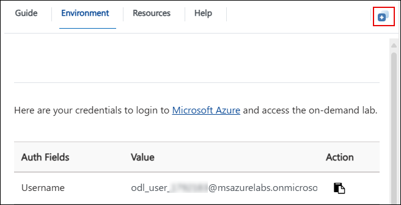
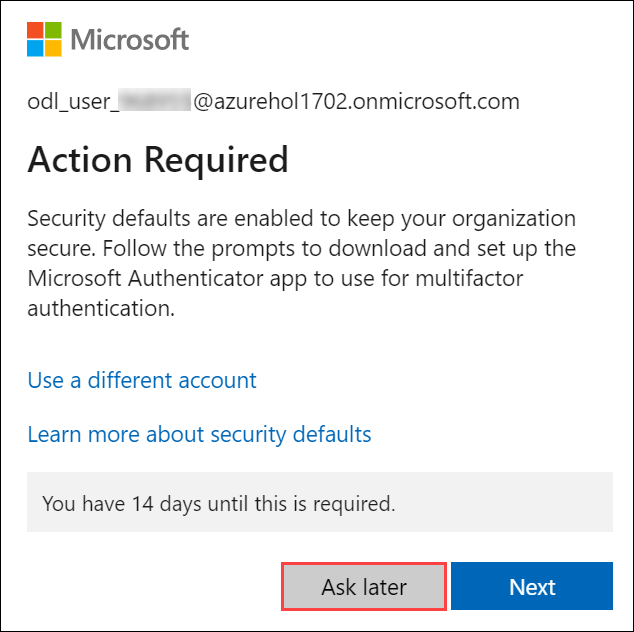

# Implement Threat Protection with Microsoft Defender XDR solutions - Day 1

### Overall Estimated Duration: 4 Hours

## Overview

In this lab, you will explore how to enhance organizational security using Microsoft Defender for Office 365 and Microsoft Defender XDR. You’ll configure foundational and advanced threat protection policies, simulate phishing and malware attacks using Attack Simulation Training, and analyze threats through Threat Explorer and real-time detections. You’ll also configure Anti-Phishing and Safe Links policies, create alert rules, implement and monitor secure posture settings using Configuration Analyzer and Microsoft Secure Score, and tag priority accounts. Finally, you’ll integrate Defender for Cloud Apps with Endpoint, enable Cloud Discovery, and analyze shadow IT using snapshot reports—equipping you with the skills to detect, respond to, and manage modern cyber threats across Microsoft 365 workloads.

## Objectives

By the end of Day 1, you will be able to:

- Configure standard and strict threat protection policies using Microsoft Defender for Office 365.
- Simulate phishing and malware attacks using Attack Simulation Training.
- Investigate email threats and user behavior through Threat Explorer and real-time detections.
- Create custom Anti-Phishing and Safe Links policies to defend against advanced threats.
- Set up alert policies to monitor malicious activities in email traffic.
- Enable and monitor secure posture features such as DKIM, Secure Score, and Priority Account Protection.
- Investigate and remediate incidents using Microsoft Defender XDR’s incident and alert workflows.
- Integrate Microsoft Defender for Cloud Apps with Endpoint for cloud app discovery.
- Generate and analyze snapshot reports to detect shadow IT and unsanctioned applications.

# Getting Started with the Lab
 
Welcome to your Securing Collaboration with Microsoft Defender Solutions workshop! We've prepared a seamless environment for you to familiarize yourself with the Microsoft security operations analyst, you monitor, identify, investigate, and respond to threats in multi-cloud environments and related Microsoft services. Let's begin by making the most of this experience:
 
## Accessing Your Lab Environment
 
Once you're ready to dive in, your virtual machine and lab guide will be right at your fingertips within your web browser.
 

### Virtual Machine & Lab Guide
 
Your virtual machine is your workhorse throughout the workshop. The lab guide is your roadmap to success.
 
## Exploring Your Lab Resources
 
To get a better understanding of your lab resources and credentials, navigate to the **Environment Details** tab.
 

 
## Utilizing the Split Window Feature
 
For convenience, you can open the lab guide in a separate window by selecting the **Split Window** button from the Top right corner.
 

 
## Managing Your Virtual Machine
 
Feel free to start, stop, or restart your virtual machine as needed from the **Resources** tab. Your experience is in your hands!
 

## Let's Get Started with Azure Portal
 
1. On your virtual machine, click on the Azure Portal icon as shown below:
 
    

1. You'll see the **Sign into Microsoft Azure** tab. Here, enter your credentials:
 
   - **Email/Username:** <inject key="AzureAdUserEmail"></inject>
 
     
 
1. Next, provide your password:
 
   - **Password:** <inject key="AzureAdUserPassword"></inject>
 
     

1. If you see the pop-up **Action Required**, click **Ask Later**.

     
 
1. If prompted to stay signed in, you can click **No**.

1. If a **Welcome to Microsoft Azure** pop-up window appears, simply click **Cancel** to skip the tour.

1. If a **Welcome to Microsoft Azure** pop-up window appears, simply click **Cancel** to skip the tour.
 
1. Click **Next** from the bottom right corner to embark on your Lab journey!
 
     

Now you're all set to explore the powerful world of technology. Feel free to reach out if you have any questions along the way. Enjoy your workshop!

## Support Contact

The CloudLabs support team is available 24/7, 365 days a year, via email and live chat to ensure seamless assistance at any time. We offer dedicated support channels tailored specifically for both learners and instructors, ensuring that all your needs are promptly and efficiently addressed.

Learner Support Contacts:

- Email Support: cloudlabs-support@spektrasystems.com
- Live Chat Support: https://cloudlabs.ai/labs-support
