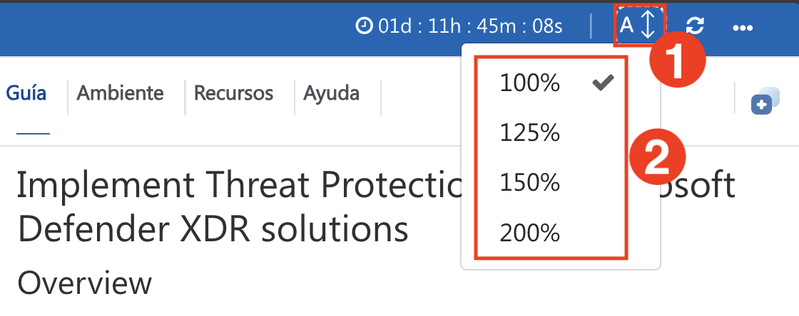

# Implement Threat Protection with Microsoft Defender XDR solutions

## Overview

In this lab, you will enhance organizational security by leveraging Microsoft Defender for Office 365, Microsoft Defender XDR, Microsoft Defender for Cloud Apps, and Microsoft Defender for Identity. You’ll begin by configuring foundational and advanced threat protection policies, including Anti-Phishing and Safe Links, while also creating alert rules and tagging priority accounts. Using Attack Simulation Training, you’ll simulate phishing and malware attacks to understand how threats target users and analyze results through Threat Explorer and real-time detections. To strengthen secure posture, you’ll implement and monitor settings using Configuration Analyzer and Microsoft Secure Score, ensuring alignment with best practices.

You will then expand your threat protection capabilities by integrating Defender for Cloud Apps, Sentinel, and Power Automate. This includes connecting and onboarding SaaS applications, enabling Cloud Discovery, and generating snapshot reports to analyze shadow IT. You’ll configure session and detection policies to identify risky behaviors, implement App Governance to monitor high-risk OAuth applications, and investigate suspicious activity. By deploying Defender for Identity sensors to domain controllers, you’ll simulate identity-based attacks such as Pass-the-Hash and DC Sync, analyze threat timelines, and implement Automated Investigation and Response (AIR) for identity threats.

Finally, you’ll integrate Microsoft Sentinel for advanced incident detection and response, creating workflows with Power Automate to streamline remediation. Through these hands-on exercises, you’ll gain practical skills to detect, respond to, and manage modern cyber threats across Microsoft 365 workloads—building a comprehensive defense strategy that spans email, identity, applications, endpoints, and cloud services.

## Objectives

- Configure standard and strict threat protection policies in Microsoft Defender for Office 365.
- Simulate phishing and malware attacks using Attack Simulation Training and analyze results.
- Investigate threats with Threat Explorer, real-time detections, and incident workflows in Microsoft Defender XDR.
- Create and manage Anti-Phishing, Safe Links, and alert policies to defend against advanced threats.
- Enable and monitor secure posture settings with DKIM, Secure Score, and Priority Account Protection.
- Integrate Microsoft Defender for Cloud Apps with Endpoint to enable cloud app discovery.
- Generate snapshot reports to analyze shadow IT and onboard SaaS apps with session policies.
- Implement App Governance to detect risky OAuth apps and configure custom detection policies.
- Deploy Microsoft Defender for Identity sensors to detect identity-based threats and lateral movement.
- Integrate with Microsoft Sentinel and Power Automate to enable AIR and automated incident response workflows.

## Day-by-Day Breakdown:

### Day 1

In this hands-on lab, you will strengthen organizational security with Microsoft Defender for Office 365 and Microsoft Defender XDR. You’ll configure standard and advanced protection policies, simulate phishing and malware attacks, and investigate threats using Threat Explorer and real-time detections. You’ll set up Anti-Phishing, Safe Links, and alert policies, while monitoring posture with Secure Score and priority account protection. Finally, you’ll integrate Defender for Cloud Apps with Endpoint, enable Cloud Discovery, and analyze shadow IT using snapshot reports.

### Day 2 

In this hands-on lab, you will enhance threat protection by integrating Microsoft Defender for Cloud Apps, Defender for Identity, Microsoft Sentinel, and Power Automate. You’ll onboard SaaS applications, configure session policies to detect risky behavior, and implement App Governance for high-risk OAuth apps. You’ll deploy Defender for Identity sensors to detect attacks like Pass-the-Hash and DC Sync, analyze threat timelines, and apply automated investigation and response (AIR). Finally, you’ll build incident response workflows using Sentinel and Power Automate

## Getting Started with the Lab
 
Welcome to Implement Threat Protection with Microsoft Defender XDR solutions workshop! We've prepared a seamless environment for you to familiarize yourself with the Microsoft security operations analyst, you monitor, identify, investigate, and respond to threats in multi-cloud environments and related Microsoft services. Let's begin by making the most of this experience:
 
## Accessing Your Lab Environment
 
Once you're ready to dive in, your virtual machine and lab guide will be right at your fingertips within your web browser.
 

## Virtual Machine & Lab Guide
 
Your virtual machine is your workhorse throughout the workshop. The lab guide is your roadmap to success.

## Exploring Your Lab Resources

To get a better understanding of your lab resources and credentials, navigate to the **Environment** tab.
 

## **Utilizing the Split Window Feature***

For convenience, you can open the lab guide in a separate window by selecting the **Split Window** button from the Top right corner.
 

## Managing Your Virtual Machine

On the **Resources (1)** tab, you can manage your virtual machines. Under the **Actions (2)** column, use the buttons to start, stop, restart, or open your VM as needed.

## Lab Guide Zoom In/Zoom Out
 
Click the **A↕ icon (1)** next to the timer to adjust the zoom level for the environment page. From the drop-down menu, select the desired **Percentage (2)**.

## Let's Get Started with Azure Portal

1. On your virtual machine desktop, double-click the **Azure Portal** shortcut (Microsoft Edge browser) to open the Azure portal.
 
    

2. You'll see the **Sign into Microsoft Azure** tab. Here, enter your credentials:
 
   - **Email/Username:** <inject key="AzureAdUserEmail"></inject>
 
     
 
3. Next, provide your password:
 
   - **Password:** <inject key="AzureAdUserPassword"></inject>
 
     

1. If you see the pop-up Stay Signed in?, select No.

   > **NOTE**: If prompted with MFA, and Ask Later option is not available please follow the steps highlighted under - [Steps to Proceed with MFA Setup if Ask Later Option is Not Visible](#steps-to-proceed-with-mfa-setup-if-ask-later-option-is-not-visible)

1. If you see the pop-up **You have free Azure Advisor recommendations!**, close the window to continue the lab.

1. If a Welcome to **Microsoft Azure** popup window appears, select **Maybe Later** to skip the tour.

## Steps to Proceed with MFA Setup if Ask Later Option is Not Visible

   > **Note:** Continue with the exercises if MFA is already enabled or the option is unavailable.

1. At the **"More information required"** prompt, select **Next**.

1. On the **"Keep your account secure"** page, select **Next** twice.

1. **Note:** If you don’t have the Microsoft Authenticator app installed on your mobile device:

   - Open **Google Play Store** (Android) or **App Store** (iOS).
   - Search for **Microsoft Authenticator** and tap **Install**.
   - Open the **Microsoft Authenticator** app, select **Add account**, then choose **Work or school account**.

1. A **QR code** will be displayed on your computer screen.

1. In the Authenticator app, select **Scan a QR code** and scan the code displayed on your screen.

1. After scanning, click **Next** to proceed.

1. On your phone, enter the number shown on your computer screen in the Authenticator app and select **Next**.
       
1. If prompted to stay signed in, you can click **No**.

1. If a **Welcome to Microsoft Azure** popup window appears, click **Cancel** to skip the tour.

1. Now, click on the **Next** from the lower right corner to move to the next page.
   
### **Support Contact**

The CloudLabs support team is available 24/7, 365 days a year, via email and live chat to ensure seamless assistance at any time. We offer dedicated support channels tailored specifically for both learners and instructors, ensuring that all your needs are promptly and efficiently addressed.
 
Learner Support Contacts:
 
- Email Support: cloudlabs-support@spektrasystems.com
- Live Chat Support: https://cloudlabs.ai/labs-support

Now you're all set to explore the powerful world of technology. Feel free to reach out if you have any questions along the way. Enjoy your workshop!

Now, click on **Next** from the lower right corner to move on to the next page.
 

### Happy learning!
