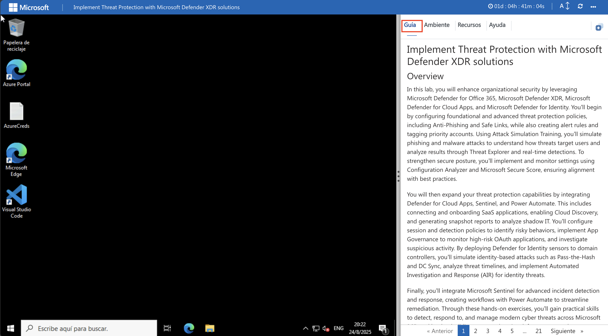
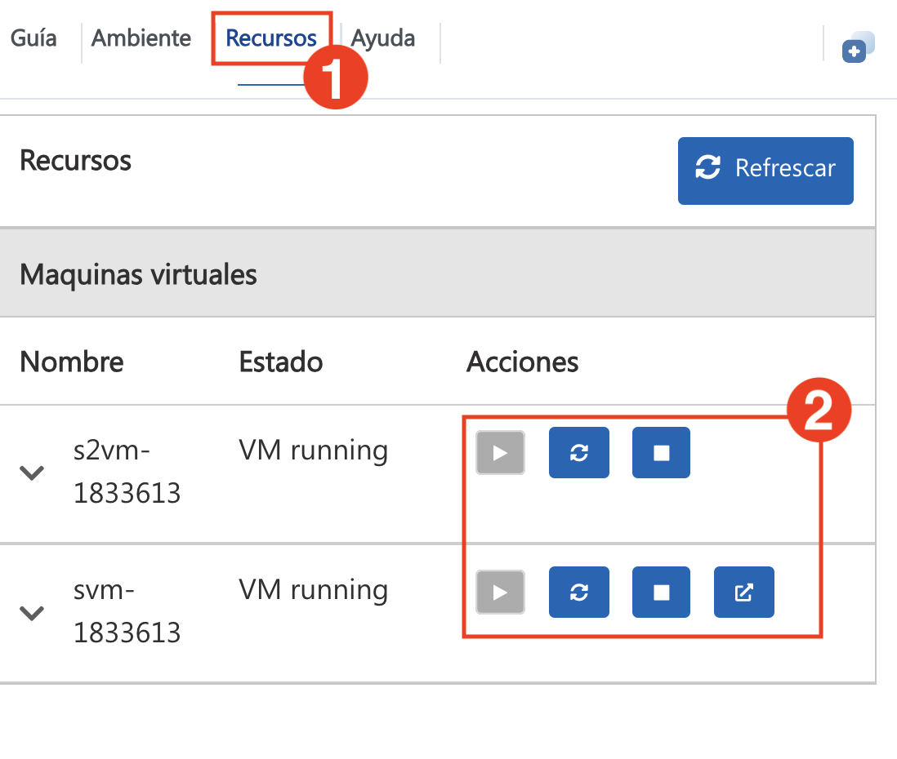
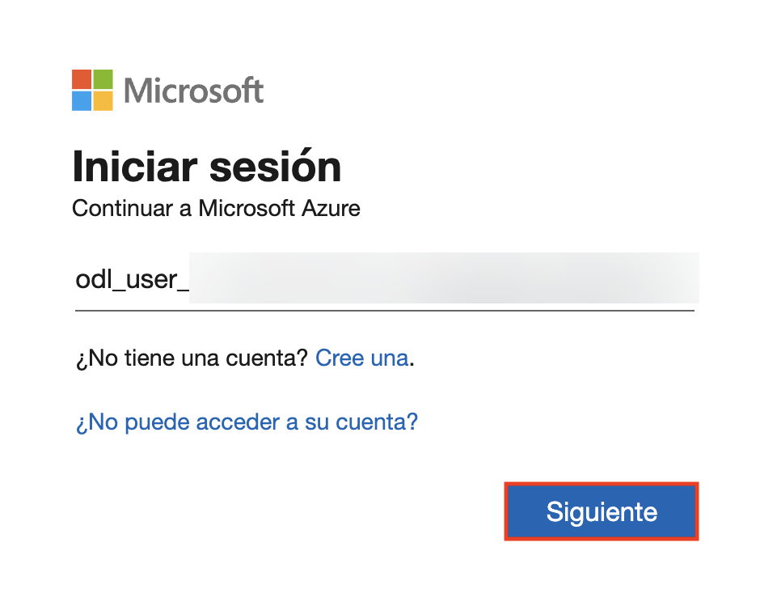
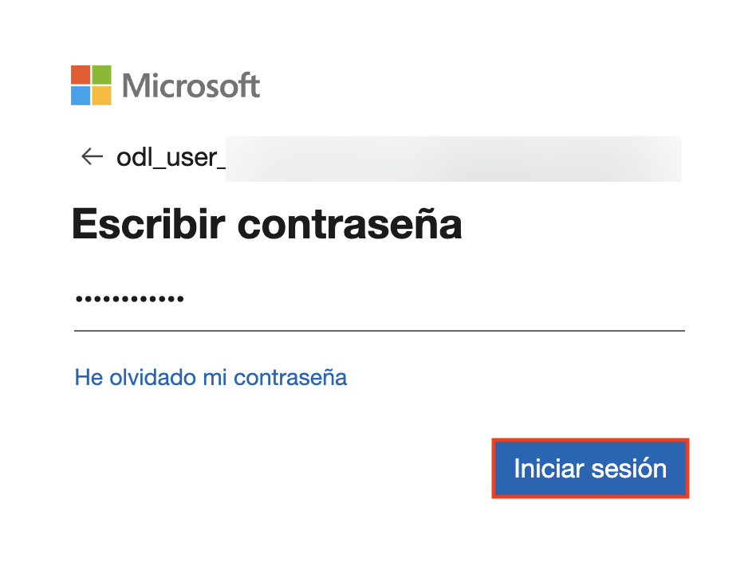

# Implementar la Protección Contra Amenazas con las Soluciones Microsoft Defender XDR

## Descripción General

En este laboratorio, mejorará la seguridad de su organización aprovechando Microsoft Defender para Office 365, Microsoft Defender XDR, Microsoft Defender for Cloud Apps y Microsoft Defender for Identity. Comenzará configurando directivas de protección contra amenazas básicas y avanzadas, como Anti-Phishing y Vínculos Seguros (Safe Links), a la vez que creará reglas de alerta y etiquetará cuentas prioritarias. Mediante el entrenamiento de simulación de ataques, simulará ataques de phishing y malware para comprender cómo las amenazas atacan a los usuarios y analizará los resultados mediante el Explorador de Amenazas (Threat Explorer) y detecciones en tiempo real. Para fortalecer la seguridad, implementará y supervisará la configuración con Analizador de Configuración (Configuration Analyzer) y Puntuación de Seguridad de Microsoft (Microsoft Secure Score), garantizando la conformidad con las prácticas recomendadas.

A continuación, ampliará sus capacidades de protección contra amenazas integrando Defender for Cloud Apps, Sentinel y Power Automate. Esto incluye la conexión e integración de aplicaciones SaaS, la habilitación de Cloud Discovery y la generación de informes de instantáneas para analizar las TI en la Sombra (Shadow IT). Configurará directivas de sesión y detección para identificar comportamientos de riesgo, implementará Gobernanza de Aplicaciones para supervisar aplicaciones OAuth de alto riesgo e investigará actividades sospechosas. Al implementar sensores de Defender for Identity en controladores de dominio, simulará ataques basados ​​en identidad, como Pass-the-Hash y DC Sync, analizará líneas de tiempo de amenazas e implementará Investigación y Respuesta Automatizadas (AIR) para amenazas de identidad.

Finalmente, integrará Microsoft Sentinel para la detección y respuesta avanzadas a incidentes, creando flujos de trabajo con Power Automate para agilizar la remediación. Mediante estos ejercicios prácticos, adquirirá habilidades prácticas para detectar, responder y gestionar ciberamenazas modernas en las cargas de trabajo de Microsoft 365, creando una estrategia de defensa integral que abarca correo electrónico, identidad, aplicaciones, puntos de conexión y servicios en la nube.

## Objetivos

- Configurar directivas de protección contra amenazas estándar y estrictas en Microsoft Defender para Office 365.
- Simular ataques de phishing y malware con el Entrenamiento de Simulación de Ataques y analizar los resultados.
- Investigar amenazas con el Explorador de Amenazas (Threat Explorer), detecciones en tiempo real y flujos de trabajo de incidentes en Microsoft Defender XDR.
- Crear y administrar directivas de Anti-Phishing, Vínculos Seguros (Safe Links) y alertas para defenderse de amenazas avanzadas.
- Habilitar y supervisar la configuración de la posición segura con DKIM, Puntuación de Seguridad (Secure Score) y Protección de Cuentas Prioritarias (Priority Account Protection).
- Integrar Microsoft Defender for Cloud Apps con Punto de Conexión (Endpoint) para habilitar la detección de aplicaciones en la nube.
- Generar informes de instantáneas para analizar TI en la Sombra (Shadow IT) e integrar aplicaciones SaaS con directivas de sesión.
- Implementar la Gobernanza de Aplicaciones para detectar aplicaciones OAuth de riesgo y configurar directivas de detección personalizadas.
- Implementar sensores de Microsoft Defender for Identity para detectar amenazas basadas en la identidad y movimiento lateral.
- Integrar con Microsoft Sentinel y Power Automate para habilitar AIR y flujos de trabajo automatizados de respuesta a incidentes.

## Desglose Diario:

### Día 1

En este laboratorio práctico, reforzará la seguridad de su organización con Microsoft Defender para Office 365 y Microsoft Defender XDR. Configurará directivas de protección estándar y avanzadas, simulará ataques de phishing y malware, e investigará amenazas mediante el Explorador de Amenazas (Threat Explorer) y detecciones en tiempo real. Configurará Anti-Phishing, Vínculos Seguros (Safe Links) y directivas de alerta, a la vez que supervisará la posición con Puntuación de Seguridad (Secure Score) y protección de cuentas prioritarias (priority account protection). Finalmente, integrará Defender para Cloud Apps con Punto de Conexión (Endpoint), habilitará Cloud Discovery y analizará TI en la Sombra (shadow IT) mediante informes de instantáneas.

### Día 2 

En este laboratorio práctico, mejorará la protección contra amenazas integrando Microsoft Defender for Cloud Apps, Defender for Identity, Microsoft Sentinel y Power Automate. Integrará aplicaciones SaaS, configurará directivas de sesión para detectar comportamientos de riesgo e implementará Gobernanza de Aplicaciones para aplicaciones OAuth de alto riesgo. Implementará sensores de Defender for Identity para detectar ataques como Pass-the-Hash y DC Sync, analizará líneas de tiempos de amenazas y aplicará Investigación y Respuesta Automatizadas (AIR). Finalmente, creará flujos de trabajo de respuesta a incidentes con Sentinel y Power Automate.

## Comenzando con el Laboratorio

¡Bienvenido al taller Implementar la Protección Contra Amenazas con las Soluciones Microsoft Defender XDR! Hemos preparado un entorno optimizado para que se familiarice con el analista de operaciones de seguridad de Microsoft. Podrá supervisar, identificar, investigar y responder a las amenazas en entornos multinube y los servicios relacionados de Microsoft. Comencemos por aprovechar al máximo esta experiencia:

## Accediendo a Su Ambiente de Laboratorio
 
Una vez que esté listo para comenzar, su máquina virtual y la guía de laboratorio estarán a su disposición en su navegador web.
 

## Máquina Virtual & Guía de Laboratorio
 
Su máquina virtual es su herramienta principal durante todo el taller. La guía de laboratorio es su hoja de ruta hacia el éxito.

## Explorando Sus Recursos de Laboratorio

Para comprender mejor los recursos y credenciales de su laboratorio, diríjase a la pestaña **Ambiente**.
 

## **Utilizando la Función de Ventana Dividida***

Para mayor comodidad, puede abrir la guía de laboratorio en una ventana independiente seleccionando el botón **Ventana Dividida** en la esquina superior derecha.
 

## Administrando Su Máquina Virtual

En la pestaña **Recursos (1)**, puede administrar sus máquinas virtuales. En la columna **Acciones (2)**, use los botones para iniciar, detener, reiniciar o abrir su máquina virtual según sea necesario.

## Guía de laboratorio: Acercar/Alejar
 
Haga clic en el ícono **A↕ (1)** junto al temporizador para ajustar el nivel de ampliación de la página del ambiente. En el menú desplegable, seleccione el **Porcentaje (2)** deseado.

## Comencemos con el Portal de Azure

1. En el escritorio de su máquina virtual, haga doble clic en el acceso directo del **Portal de Azure** (explorador Microsoft Edge) para abrir el Portal de Azure.
 
    

2. Verá la pestaña **Iniciar sesión en Microsoft Azure**. Aquí, ingrese sus credenciales:
 
   - **Correo electrónico/Nombre de usuarip:** <inject key="AzureAdUserEmail"></inject>
 
     
 
3. A continuación, introduzca su contraseña:
 
   - **Contraseña:** <inject key="AzureAdUserPassword"></inject>
 
     

1. Si ve la ventana emergente ¿Permanecer conectado?, seleccione No.

   > **NOTA**: Si se le solicita MFA y la opción Preguntar más tarde no está disponible, siga los pasos resaltados en - [Pasos para continuar con la configuracion de MFA si la opcion Preguntar mas tarde no esta visible](#pasos-para-continuar-con-la-configuracion-de-mfa-si-la-opcion-preguntar-mas-tarde-no-esta-visible)

1. Si ve la ventana emergente **¡Tiene recomendaciones gratuitas de Azure Advisor!**, cierre la ventana para continuar con el laboratorio.

1. Si aparece la ventana emergente Bienvenido a **Microsoft Azure**, seleccione **Quizás más tarde** para omitir la visita guiada.

## Pasos para continuar con la configuracion de MFA si la opcion Preguntar mas tarde no esta visible

   > **Nota:** Continúe con los ejercicios si MFA ya está habilitado o la opción no está disponible.

1. En el mensaje **"Se requiere más información"**, seleccione **Siguiente**.

1. En la página **"Mantenga su cuenta segura"**, seleccione **Siguiente** dos veces.

1. **Nota:** Si no tiene la aplicación Microsoft Authenticator instalada en su dispositivo móvil:

   - Abra **Google Play Store** (Android) o **App Store** (iOS).
   - Busque **Microsoft Authenticator** y pulse **Instalar**.
   - Abra la aplicación **Microsoft Authenticator**, seleccione **Añadir cuenta** y, a continuación, elija **Cuenta profesional o educativa**.

1. Se mostrará un **código QR** en la pantalla de su computadora.

1. En la aplicación Authenticator, seleccione **Escanear un código QR** y escanee el código que aparece en la pantalla.

1. Después de escanearlo, presione **Siguiente** para continuar.

1. En su teléfono, introduzca el número que aparece en la pantalla de su computadora en la aplicación Authenticator y seleccione **Siguiente**.
       
1. Si se le pide que mantenga la sesión iniciada, puede presionar **No**.

1. Si aparece una ventana emergente de **Bienvenido a Microsoft Azure**, presione **Cancelar** para omitir la visita guiada.

1. Ahora, haga clic en **Siguiente** en la esquina inferior derecha para pasar a la página siguiente.
   
### **Contacto de Soporte**

El equipo de soporte de CloudLabs está disponible las 24 horas, los 7 días de la semana, los 365 días del año, por correo electrónico y chat en vivo para garantizar una asistencia fluida en cualquier momento. Ofrecemos canales de soporte dedicados, diseñados específicamente para estudiantes e instructores, para garantizar que todas sus necesidades se atiendan de forma rápida y eficiente.
 
Contactos de Soporte para Estudiantes:
 
- Soporte por Correo Electrónico: cloudlabs-support@spektrasystems.com
- Soporte por Chat en Vivo: https://cloudlabs.ai/labs-support

Ahora está listo para explorar el poderoso mundo de la tecnología. No dude en contactarnos si tiene alguna pregunta durante el proceso. ¡Disfrute del taller!

Ahora, haga clic en **Siguiente** en la esquina inferior derecha para pasar a la siguiente página.
 

### ¡Feliz aprendizaje!
