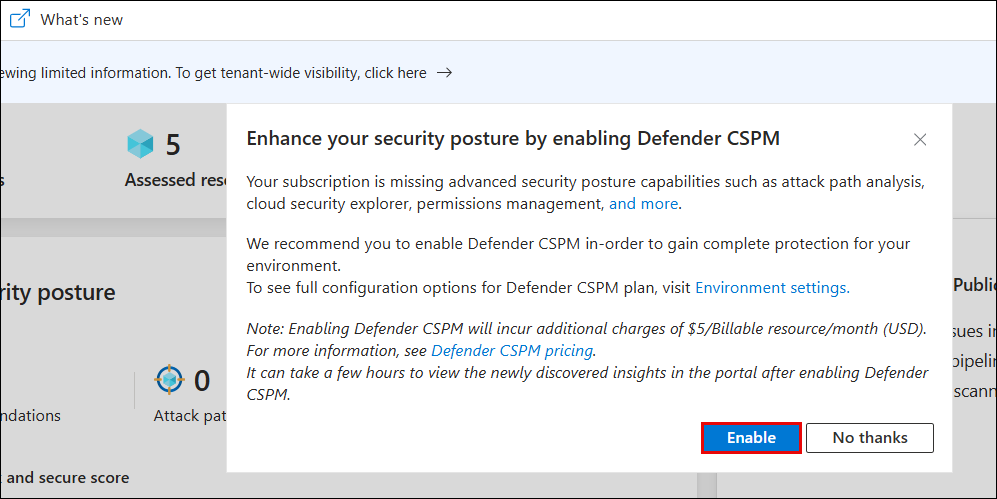
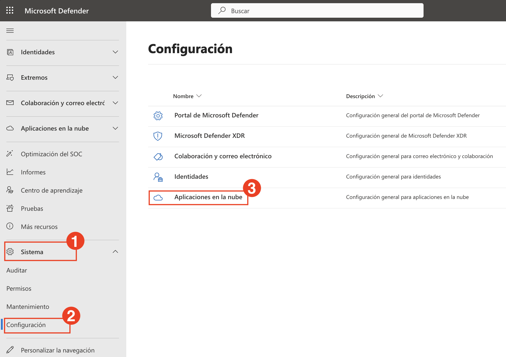
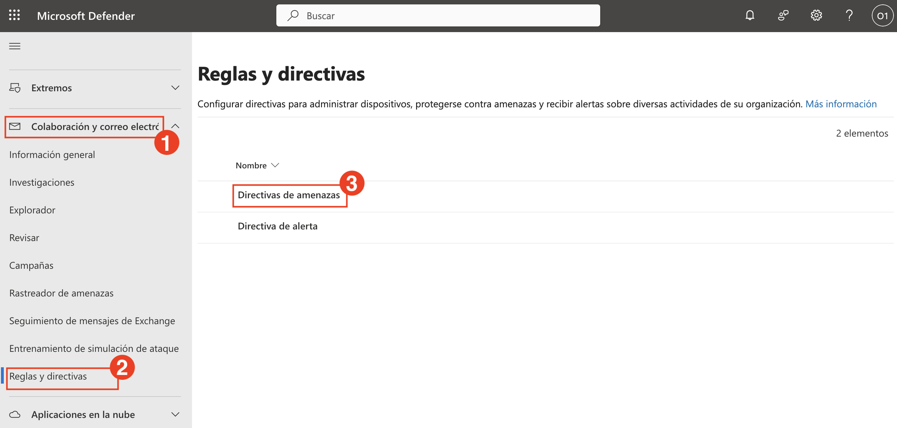
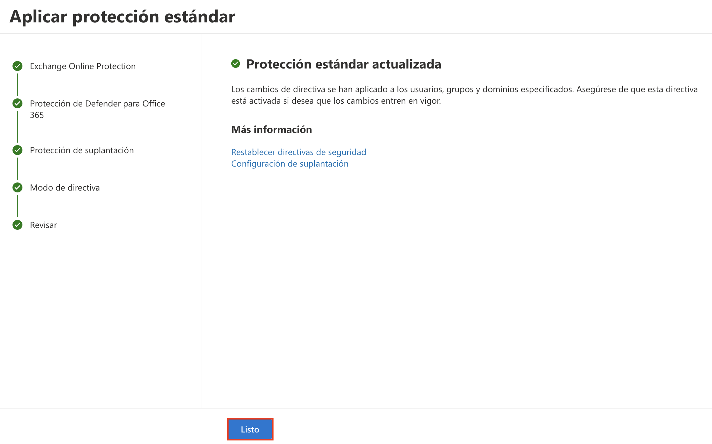
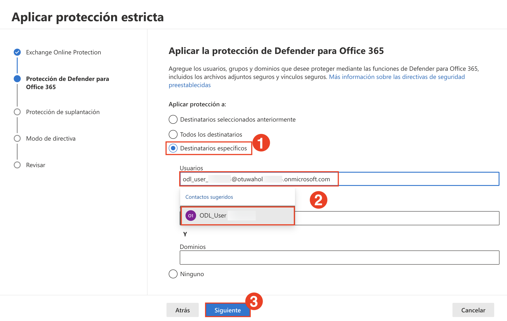
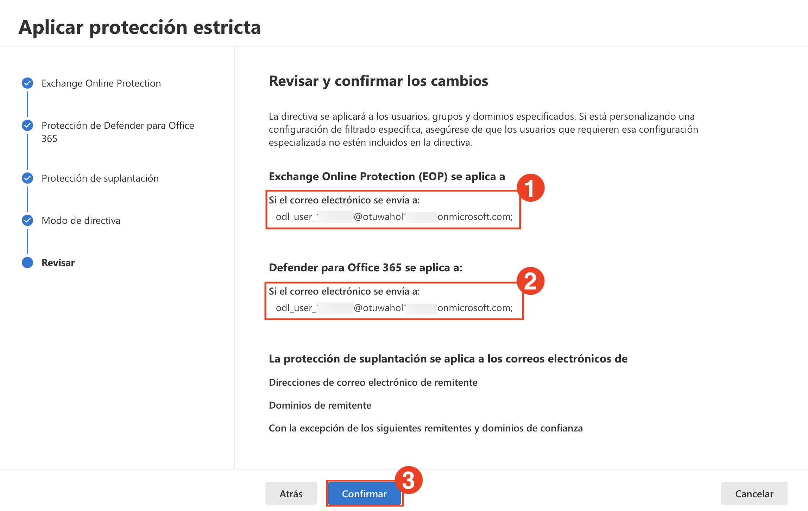
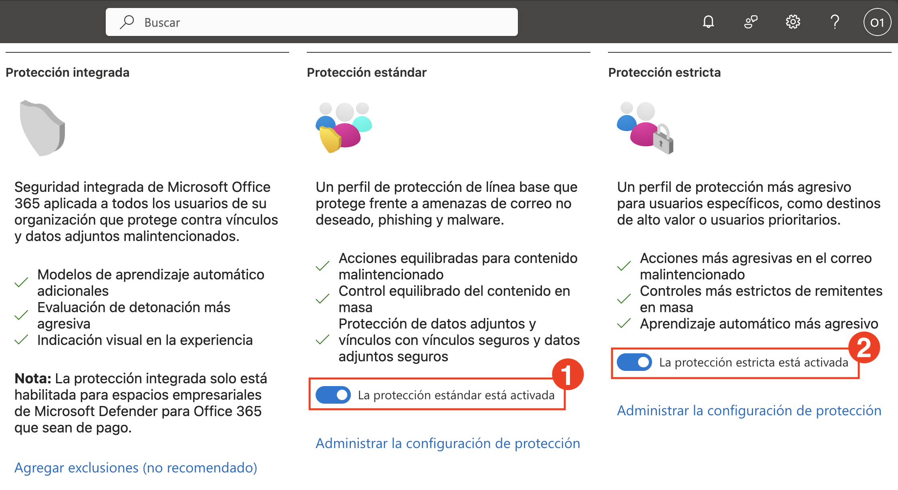

# **Día-01**

# Laboratorio 1: Configurar Directivas de Amenazas en Microsoft Defender para Office 365

En este laboratorio, habilitará Microsoft Defender CSPM para su entorno y configurará directivas de protección estándar y estrictas con Microsoft Defender XDR.

1. Vaya al Portal de Azure, busque **Microsoft Defender for Cloud (1)** y selecciónelo de los **resultados (2)**.

   

1. Cuando se le solicite, haga clic en **Habilitar (Enable)** para activar Defender CSPM.

   

   > **Nota:** Si no ve la ventana emergente, continúe con los pasos del laboratorio mostrados a continuación.

   > **Nota:** Habilitar Defender CSPM desbloquea funciones avanzadas de gestión de la postura, tales como el análisis de la ruta de acceso del ataque y la visibilidad de permisos.

1. Vaya a **Configuración del entorno (2)** en **Administración (1)**, expanda **Azure (3)** → **Tenant Root Group (4)**, y seleccione su **suscripción (5)**.

   

1. En **Planes de Defender (1)**, active las siguientes opciones y haga clic en **Guardar (5)**:
   - **CSPM Fundamental (2)**
   - **Defender CSPM (3)**
   - **Servers en Protección de cargas de trabajo en la nube (4)**

        

1. En una nueva pestaña del navegador **Microsoft Edge**, acceda a la siguiente URL en la barra de direcciones:: [https://security.microsoft.com](https://security.microsoft.com).

1. En el **portal de Microsoft Defender**, vaya a **Sistema (1)** > **Configuración (2)** y haga clic en **Aplicaciones en la nube (3)**.

   

1. En **Gobernanza de aplicaciones**, seleccione **Estado del servicio (1)** y haga clic en **Activar la gobernanza de aplicaciones (2)**.

   

   > La Gobernanza de Aplicaciones ya está activada. Comenzará a evaluar las aplicaciones OAuth conectadas y a generar información sobre su comportamiento y posición de riesgo.

1. En la página de aplicaciones OAuth, haga clic en **Ir a gobernanza de aplicaciones**.

   

   > Es posible que se le redirija a la nueva interfaz de Gobernanza de Aplicaciones.

   > **Nota:** El portal de Microsoft Defender puede tardar de 3 a 4 horas en habilitar las aplicaciones OAuth en Gobernanza de Aplicaciones. Este paso se realiza ahora para evitar retrasos o problemas posteriores en el laboratorio. 

1. En el panel izquierdo, vaya a **Colaboración y correo electrónico (1)** → **Reglas y directivas (2)** → **Directivas de amenazas (3)**.

   

1. En la página **Directivas de amenazas**, en **Directivas con plantilla**, seleccione **Restablecer directivas de seguridad**.

   

   > **Nota:** Si aparece la ventana emergente **Aprender sobre Restablecer directivas de seguridad**, haga clic en **Cancelar** para cerrarla y continuar con el laboratorio.

1. En **Protección estándar**, haga clic en **Administrar la configuración de protección**.

   

1. En la pantalla **Aplicar Exchange Online Protection**, seleccione **Destinatarios específicos (1)**, introduzca el correo electrónico del usuario en el campo **Usuarios** (2), selecciónelo de la lista y haga clic en **Siguiente (3)**.

    

1. En la pantalla **Aplicar la protección de Defender para Office 365**, seleccione **Destinatarios específicos (1)**, introduzca el correo electrónico del usuario en el campo **Usuarios (2)**, selecciónelo de la lista y haga clic en **Siguiente (3)**.

    

1. En las pantallas **Protección de suplantación** y **Modo de directiva**, mantenga todas las configuraciones con sus valores predeterminados y haga clic en **Siguiente** hasta llegar a la sección **Revisar**.

1. En la pantalla **Revisar**, verifique que **Exchange Online Protection (1)** y **Defender para Office 365 (2)** se apliquen al usuario correcto y luego haga clic en **Confirmar (3)**.

    

1. En la pantalla de confirmación **Aplicar protección estándar**, verifique que la actualización de la directiva se haya realizado correctamente y haga clic en **Listo**.

    

    > **Nota:** La protección estándar incluye Datos Adjuntos Seguros (Safe Attachments), Vínculos Seguros (Safe Links) y directivas anti-phishing. 

1. En **Protección estricta**, haga clic en **Administrar la configuración de protección**.

    

1. En la pantalla **Aplicar Exchange Online Protection**, seleccione **Destinatarios específicos (1)**, introduzca el correo electrónico del usuario en el campo **Usuarios** (2) y haga clic en **Siguiente (3)**.

    

1. En la pantalla **Aplicar la protección de Defender para Office 365**, seleccione **Destinatarios específicos (1)**, introduzca el correo electrónico del usuario en el campo **Usuarios** (2) y haga clic en **Siguiente (3)**.

    

1. En las pantallas **Protección de suplantación** y **Modo de directiva**, mantenga todas las configuraciones con sus valores predeterminados y haga clic en **Siguiente** hasta llegar a la sección **Revisar**.

1. En la pantalla **Revisar**, verifique que **Exchange Online Protection (1)** y **Defender para Office 365 (2)** se apliquen al usuario correcto y luego haga clic en **Confirmar (3)**.

    

1. Una vez completado, confirme que:
    - **La protección estándar está activada (1)**  
    - **La protección estricta está activada (2)**

        

      > **Nota:** Ahora ha configurado con éxito las directivas de amenazas multicapa para usuarios generales y de alto riesgo. 

## Revisión

En este laboratorio, ha completado lo siguiente:

- Habilitó Microsoft Defender CSPM para activar las funciones avanzadas de administración de la posición.
- Configuró las directivas de seguridad predefinidas Estándar y Estricta para proteger a los usuarios según sus niveles de riesgo.

### Ha completado el Laboratorio con éxito. Haga clic en **Siguiente >>** para continuar con el siguiente Laboratorio.

