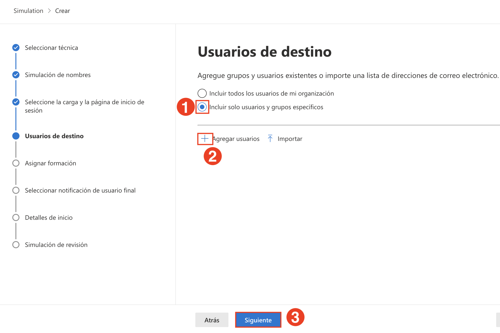
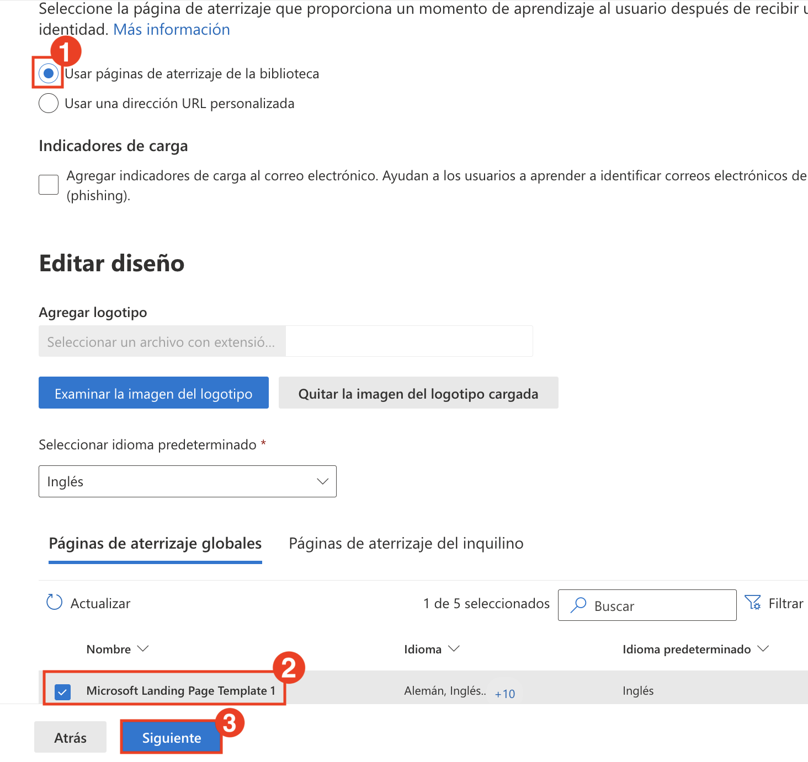
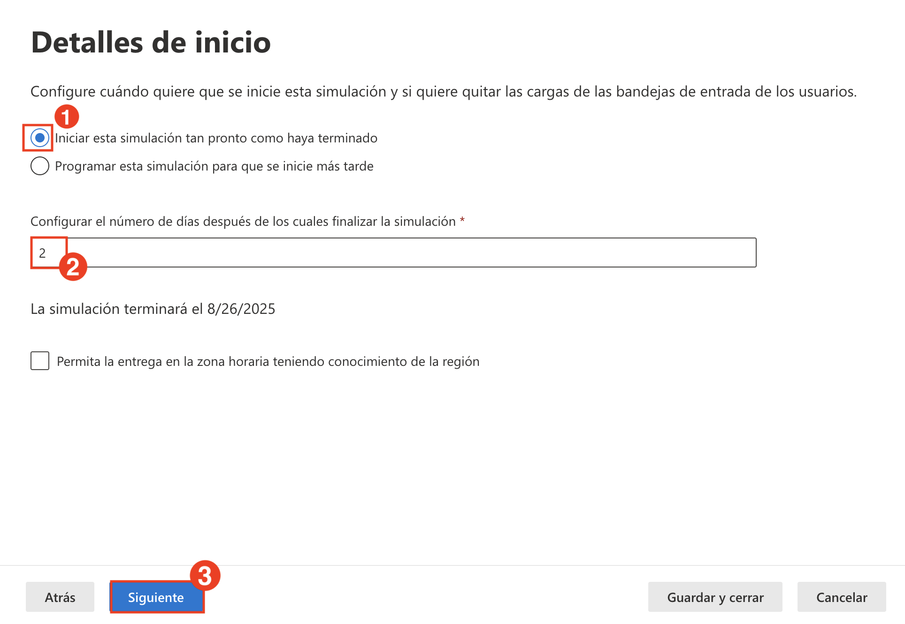
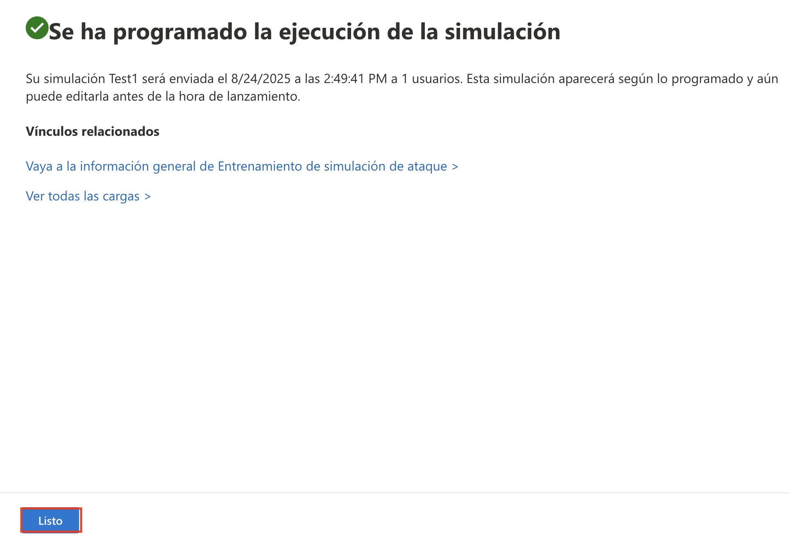
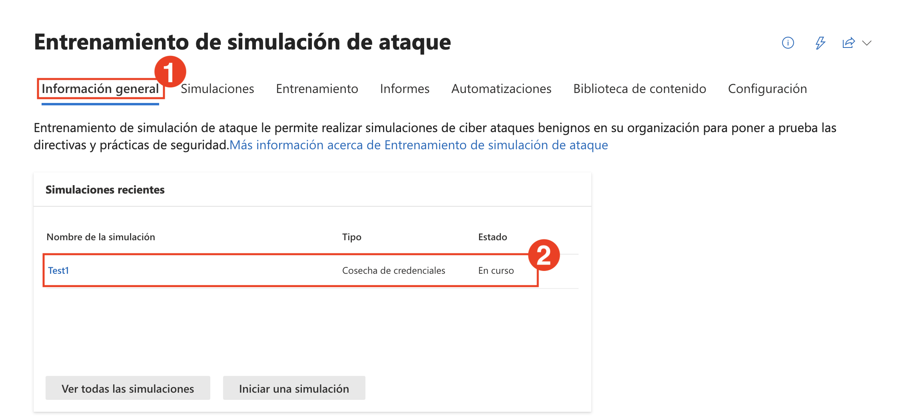

# Laboratorio 2: Simular Ataques de Phishing y Malware con el Simulador de Ataques

En este laboratorio, simulará ataques de phishing y malware con el **Entrenamiento de Simulación de Ataques** integrado en Microsoft Defender. Estas simulaciones le ayudarán a evaluar la vulnerabilidad del usuario y su respuesta a las técnicas de ingeniería social.

1. En el menú de navegación izquierdo, expanda **Colaboración y correo electrónico (1)** y seleccione **Entrenamiento de simulación de ataque (2)**. En la página **Entrenamiento de simulación de ataque**, seleccione la pestaña **Simulaciones (3)** y haga clic en **Iniciar una simulación (4)**.

   

1. En **Seleccionar técnica**, elija **Cosecha de credenciales (1)** y haga clic en **Siguiente (2)**.

   

1. En el paso **Simulación de nombres**, ingrese el nombre de la simulación `Test1` en el campo **Nombre de la simulación (1)** y haga clic en **Siguiente (2)**.

   

1. En **Seleccione la carga y la página de inicio de sesión**, elija **Cargas globales**, seleccione una carga (payload) de phishing de la **lista (1)**, y haga clic en **Siguiente (3)**.

   

1. En la pantalla **Usuarios de destino**, seleccione **Incluir solo usuarios y grupos específicos (1)**, haga clic en **Agregar usuarios (2)** y luego haga clic en **Siguiente (3)**.

   

1. En la pantalla **Agregar usuarios**, busque el **correo electrónico del usuario**, seleccione el **usuario (2)** de la lista, y haga clic en **Agregar 1 usuario(s) (3)**.

   

1. En la pantalla **Usuarios de destino**, confirme que el **Usuario** se ha añadido y haga clic en **Siguiente**.

1. En la pantalla **Excluir usuarios**, deje la opción deshabilitada para no excluir usuarios y haga clic en **Siguiente**.

   

1. En la pantalla **Asignar formación**, seleccione **Experiencia de entrenamiento de Microsoft (1)**, elija **Asginar entrenamiento para mí (2)**, establezca la fecha límite en **7 días tras finalizar la simulación (3)**, y haga clic en **Siguiente (4)**.

   

1. En **Seleccionar página de aterrizaje**, seleccione **Usar páginas de aterrizaje de la biblioteca (1)**, elija una **plantilla de aterrizaje global (2)** y haga clic en **Siguiente (3)**.

    

1. En la sección **Seleccionar notificación de usuario final**, seleccione **Notificación predeterminada de Microsoft (1)** y configure:
    - Notificación de refuerzo positivo: **Entregar durante la simulación (2**)
    - Notificación de recordatorio de formación: **Semanalmente (3)**
    Haga clic en **Siguiente (4)**.

        

1. En el paso **Detalles de inicio**, seleccione **Iniciar esta simulación tan pronto como haya terminado (1)**, establezca **duración en 2 días (2)**, y haga clic en **Siguiente (3)**.

    

1. Revise el resumen de configuración y haga clic en **Enviar** para iniciar la simulación.

    

1. Al finalizar, haga clic en **Listo**.

    

    > **Nota:** Ha iniciado correctamente una simulación de phishing. Ésta supervisará cómo interactúan los usuarios con correos electrónicos sospechosos.

1. Verifique que la simulación aparezca en el panel como **En curso**.

    

1. En la página **Entrenamiento de simulación de ataque**, seleccione la pestaña **Simulaciones (1)** y haga clic en **Iniciar una simulación (2)**.

    

1. Para simular un **Ataque de Malware**, seleccione **Datos adjuntos de malware (1)**, y haga clic en **Siguiente (2)**.

    

1. Ingrese un nuevo nombre de simulación **`Test2`** y haga clic en **Siguiente (2)**.

    

1. En **Seleccione la carga y la página de inicio de sesión**, seleccione **Cargas globales (1)**, elija un archivo adjunto de malware de la lista y configure el idioma preferido (2), luego haga clic en **Siguiente (3)**.

    

1. En la pantalla **Usuarios de destino**, seleccione **Incluir solo usuarios y grupos específicos (1)**, haga clic en **Agregar usuarios (2)** y luego haga clic en **Siguiente (3)**.

   

1. En la pantalla **Agregar usuarios**, busque el **correo electrónico del usuario**, seleccione el **usuario (2)** de la lista, y haga clic en **Agregar 1 usuario(s) (3)**.

   

1. En la pantalla **Usuarios de destino**, confirme que el **Usuario** se ha añadido y haga clic en **Siguiente**.

1. En la pantalla **Excluir usuarios**, deje la opción deshabilitada para no excluir usuarios y haga clic en **Siguiente**.

   

1. En la pantalla **Asignar formación**, seleccione **Experiencia de entrenamiento de Microsoft (1)**, elija **Asginar entrenamiento para mí (2)**, establezca la fecha límite en **7 días tras finalizar la simulación (3)**, y haga clic en **Siguiente (4)**.

   

1. En la página **Asignar formación**, seleccione una plantilla de página de aterrizaje de la lista (1) y haga clic en **Siguiente (2)**.

   

1. En la pantalla **End user notification**, seleccione **Microsoft default notification (1)**, asegúrese de que **Deliver during simulation (2)** y **Weekly reminder (3)** estén seleccionados y haga clic en **Siguiente (4)**.

    

1. Establezca la **Launch configuration (1)** para que se inicie inmediatamente, establezca la duración en **2 días (2)** y haga clic en **Siguiente (3)**.

    

1. En la pantalla **Seleccionar notificación de usuario final**, elija **Notificación predeterminada de Microsoft (1)**, establezca **Entregar durante la simulación (2)** y **Semanalmente (3)** como preferencias de entrega y haga clic en **Siguiente (4)**.

    

1. Revise los detalles y haga clic en **Enviar** para completar la configuración de la simulación de malware.

    

> **Nota:** Esta simulación simula el envío de un archivo malicioso por correo electrónico para comprobar cómo responden los usuarios a las amenazas en archivos adjuntos.

> **¡Felicitaciones** por completar la tarea! Ahora es el momento de validarla. Estos son los pasos:
> - Presione el botón Validar de la tarea correspondiente. Si recibe un mensaje de éxito, puede continuar con la siguiente tarea. 
- De lo contrario, lea atentamente el mensaje de error y vuelva a intentar el paso, siguiendo las instrucciones de la guía del laboratorio.
- Si necesita ayuda, contáctenos en cloudlabs-support@spektrasystems.com. Estamos disponibles las 24 horas, los 7 días de la semana.  
<validation step="eb927b6a-3f37-4714-9622-000f458f8bac" />

## Revisión

En este laboratorio, ha completado las siguientes tareas:

- Lanzó simulaciones de phishing y malware mediante el Entrenamiento de Simulación de Ataques.
- Evaluó las respuestas de los usuarios a los ataques simulados y verificó que las directivas de protección funcionaban según lo previsto.

### Ha completado el Laboratorio con éxito. Haga clic en **Siguiente >>** para continuar con el siguiente Laboratorio.

