# Lab 3: Analyze Threats with Threat Explorer and Real-Time Detections

In this lab, you'll create a custom role in Microsoft Defender to manage access and permissions, simulate a phishing interaction, and investigate user activity using Threat Explorer.

1. On a new tab in the **Microsoft Edge browser** and go to the following URL in the address bar: https://security.microsoft.com.

1. Open a new tab, navigate to https://outlook.office.com, sign in with the lab user’s credentials, and access the mailbox.

   > **Note:** If the **Your privacy matters** pop-up appears, click **Continue** to proceed.

      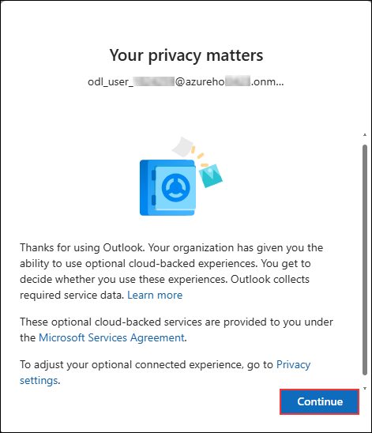

1. In the mailbox, select the **phishing simulation email (1)** and click the **link (2)** provided in the message body to proceed.

   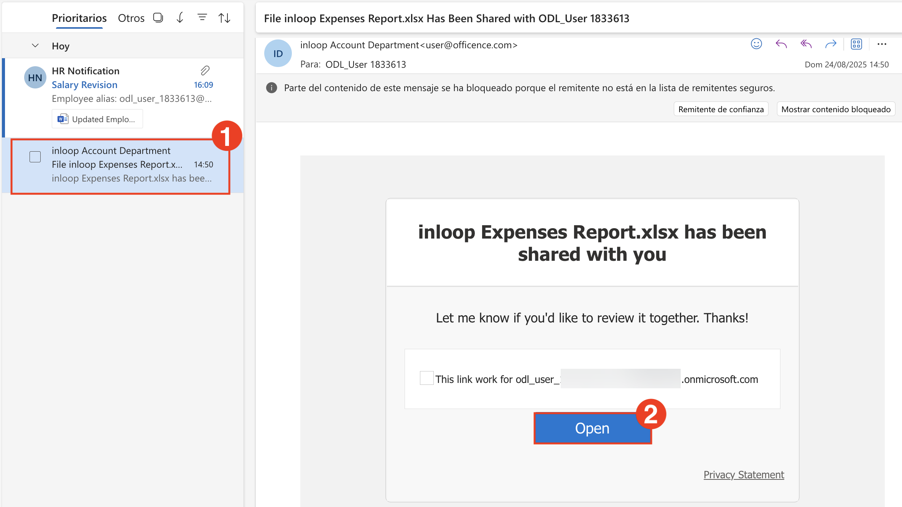

1. On the **Sign in** page, type any random email address (1) and click **Next (2)**.

   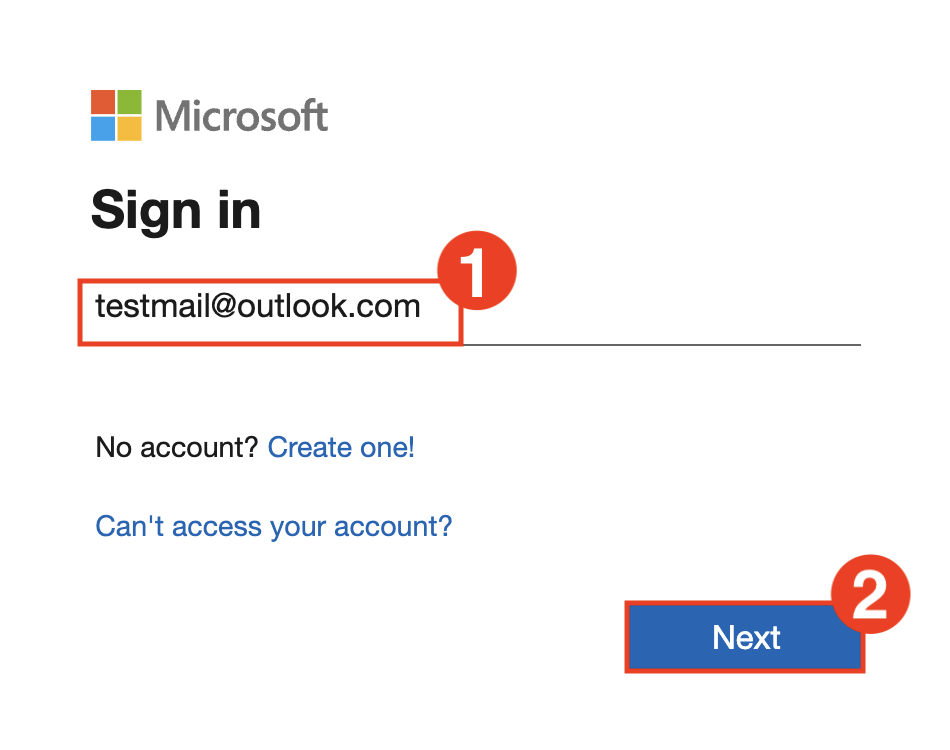

1. On the **Enter password** page, type any random password (1) and click **Sign in (2)**.

   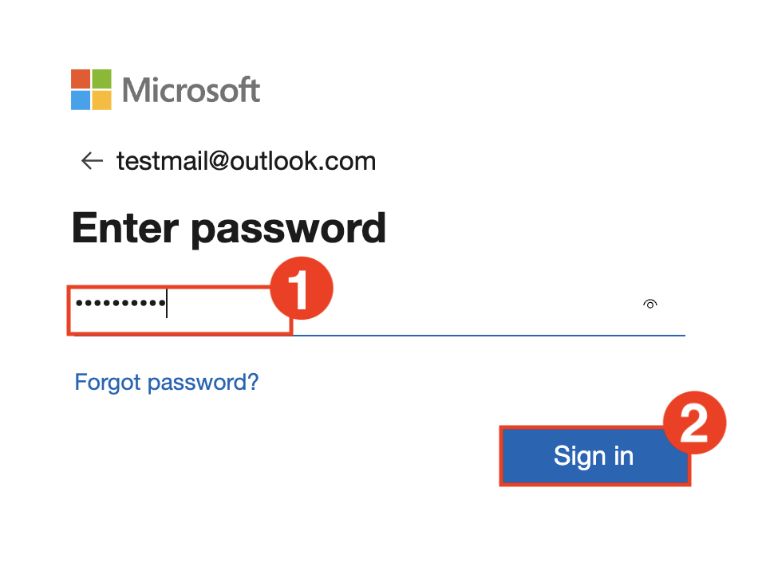

1. After submitting the fake credentials, the phishing simulation results page will appear indicating that you were phished. Review the message and proceed as instructed in the lab.

   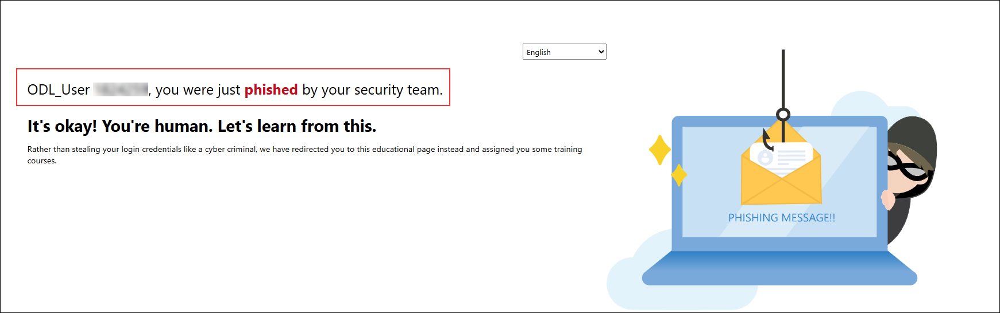

      > Note: This activity simulates a phishing attack and trigger credential submission logs.

1. A training assignment email is also generated for users who fall for the phishing simulation. In the mailbox, open the **Training assignment notification** email and review the details.

   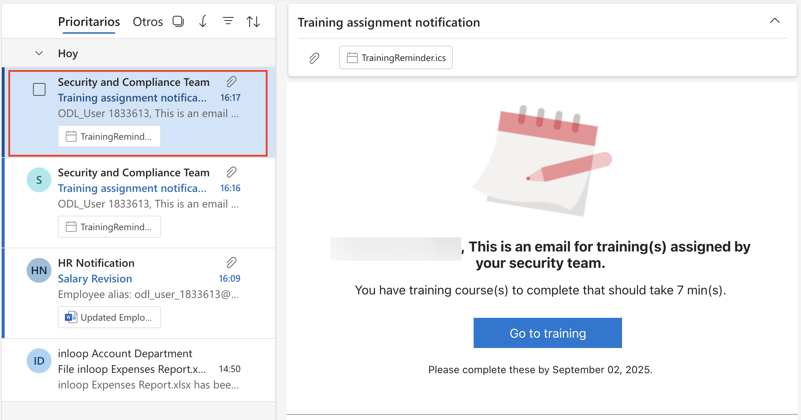

1. In the mailbox, select the malware attachment simulation email to view its contents.

   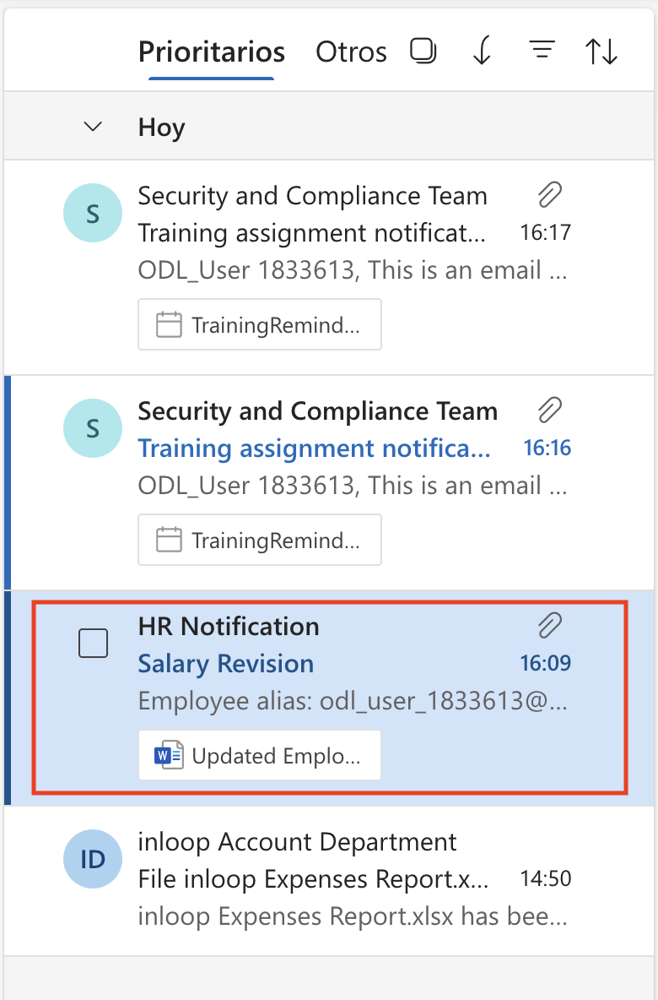

1. With the malware attachment simulation email open, click the **More actions (1)** menu, select **Report (2)**, and then click **Report phishing (3)**.

   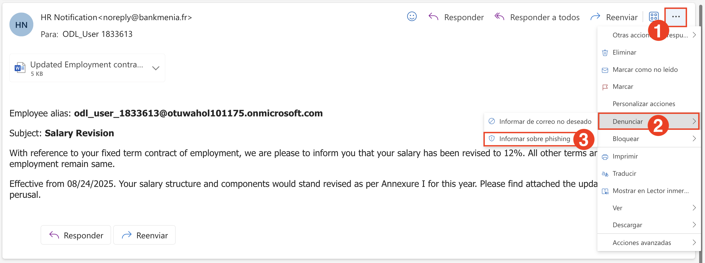

1. In the **Report phishing** confirmation dialog, click **Report** to submit the phishing report.

   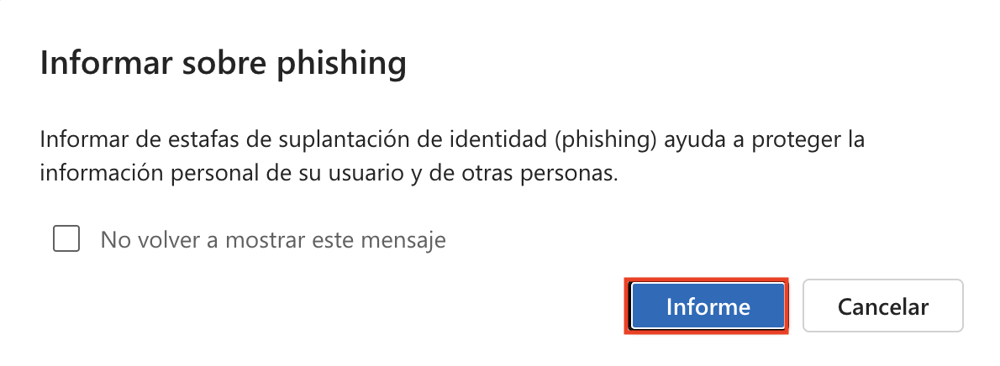

1. After reporting the phishing email, a confirmation message will be sent to your mailbox. Open the **Thank you for reporting a phish!** email to review the acknowledgment.

   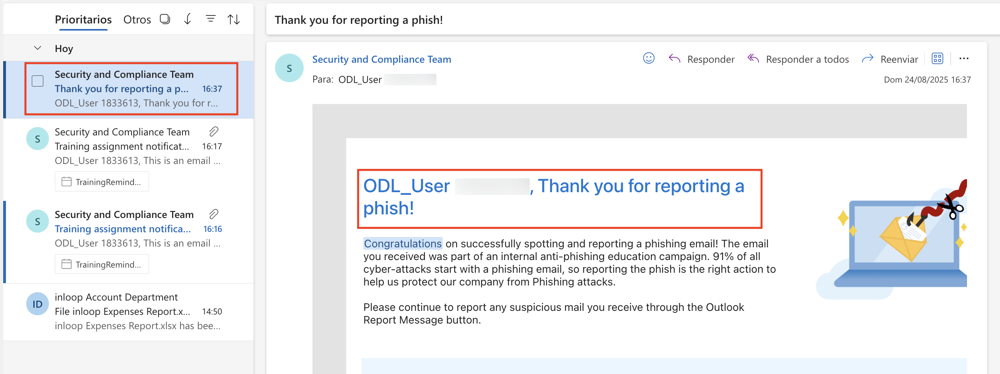

1. In the **Microsoft Defender portal**, do the following:

   - Select **Email & collaboration (1)** from the left navigation pane.
   - Click **Explorer (2)** under the Email section.
   - In the **URL clicks** tab, select the entry for the clicked timestamp.
   - Review the **URL (4)** that was clicked to investigate further.

      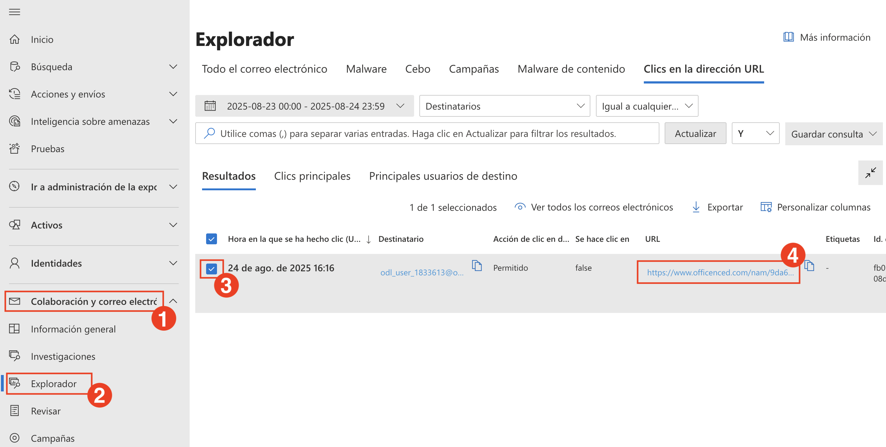

   > **Note:** Sometimes the Microsoft Defender portal can take 1–2 hours for initial backend data to load. If refreshing the page doesn’t display results, check back later.

      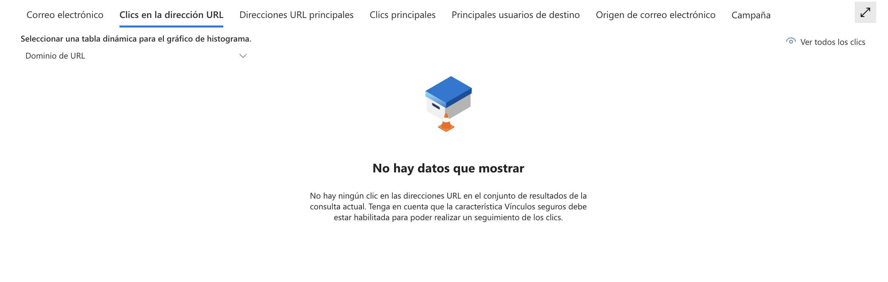
   
   > **Note:** If no data appears after waiting and refreshing, skip ahead to step 14 to continue with the lab.

1. Click on the **Open url page** to open the full event details.

   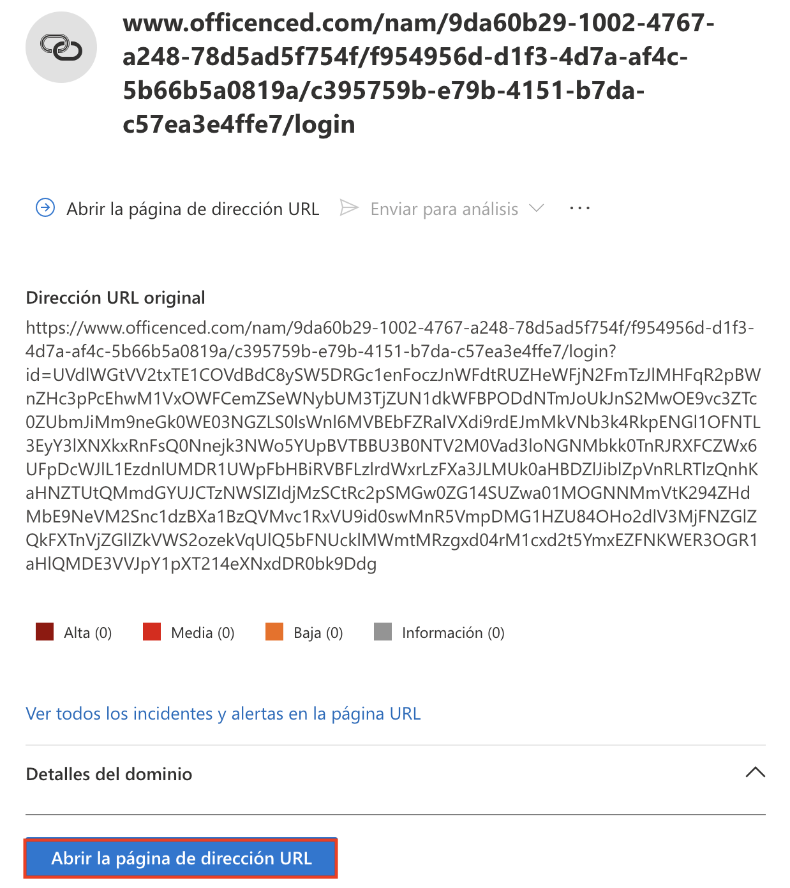

   > Note: This shows the clicked URL, click metadata, and incident correlation.

1. In the **Microsoft Defender portal**, do the following:

   - Select **Email & collaboration (1)** from the left navigation pane.  
   - Click **Attack simulation training (2)**.  
   - Navigate to the **Simulations (3)** tab.  
   - Locate and select the simulation named **Test1 (4)** from the list.

      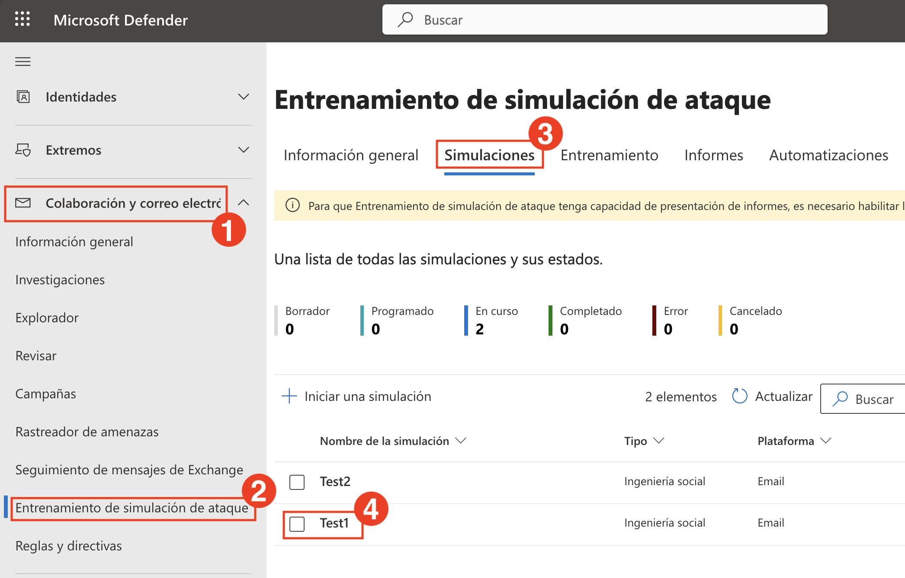

1. View the simulation report to observe the results.  
   In this example, 100% of users were compromised and 0% reported the phishing attempt.

   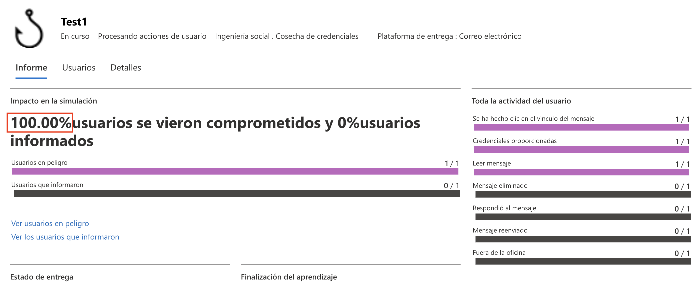

1. Click the **Affected user** to view detailed actions taken during the simulation such as reading the email, clicking the link, and submitting credentials.

   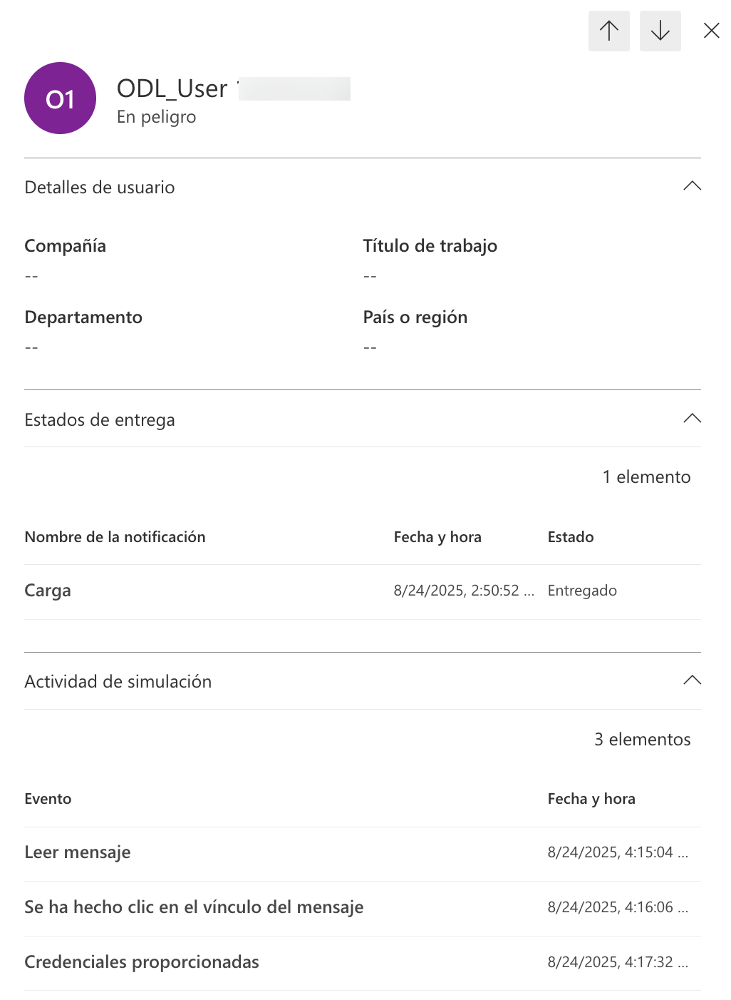

   > Note: This data helps evaluate user behavior and identify high-risk individuals.

1. Navigate back to the **Simulations** tab, select the simulation named **Test2**, and view the report details for the malware attachment simulation.

## Review

In this lab, you have completed the following:

- Created a custom role in Microsoft Defender to manage access and permissions.
- Simulated a phishing interaction and investigated user activity using Threat Explorer.
- Analyzed real-time detections and simulation reports to assess user risk.

### You have successfully completed the lab. Click on **Next >>** to proceed with the next Lab.

