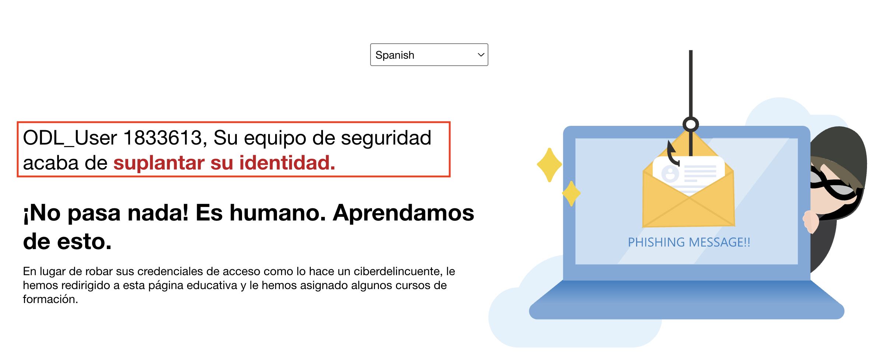

# Laboratorio 3: Analizar Amenazas con el Explorador de Amenazas y Detecciones en Tiempo Real

En este laboratorio, creará un rol personalizado en Microsoft Defender para administrar el acceso y los permisos, simular una interacción de phishing e investigar la actividad del usuario con el Explorador de Amenazas.

1. En una nueva pestaña del explorador **Microsoft Edge**, acceda a la siguiente URL en la barra de direcciones: https://security.microsoft.com.

1. Abra una nueva pestaña, navegue a https://outlook.office.com, inicie sesión con las credenciales del usuario del laboratorio y acceda al buzón.

   > **Nota:** Si aparece la ventana emergente **La privacidad importa**, haga clic en **Continuar**.

      

1. En el buzón, seleccione el **correo electrónico de simulación de phishing (1)** y haga clic en el **enlace (2)** que aparece en el cuerpo del mensaje para continuar.

   

1. En la página **Sign in**, escriba cualquier dirección de correo electrónico (1) y haga clic en **Next (2)**.

   

1. En la página **Enter password**, escriba cualquier contraseña (1) y haga clic en **Sign in (2)**.

   

1. Tras enviar las credenciales falsas, aparecerá la página de resultados de la simulación de phishing, indicando que ha sido víctima de phishing. Revise el mensaje y proceda según las instrucciones del laboratorio.

   

      > Nota: Esta actividad simula un ataque de phishing y activa los registros de envío de credenciales.

1. También se genera un correo electrónico con la tarea de capacitación para los usuarios que caen en la simulación de phishing. En el buzón, abra el correo electrónico **Training assignment notification** y revise los detalles.

   

1. En el buzón, seleccione el correo electrónico con el archivo adjunto de simulación de malware para ver su contenido.

   

1. Con el correo electrónico de simulación de malware adjunto abierto, haga clic en el menú **Más acciones (1)**, seleccione **Denunciar (2)** y, a continuación, haga clic en **Informar sobre phishing (3)**.

   

1. En el cuadro de diálogo de confirmación **Informar sobre phishing**, haga clic en **Informe** para enviar el informe de phishing.

   

1. Tras informar del correo electrónico de phishing, recibirá un mensaje de confirmación en su buzón. Abra el correo electrónico **Thank you for reporting a phish!** para revisar la confirmación.

   

1. En el **portal de Microsoft Defender**, realice lo siguiente:

   - Seleccione **Colaboración y correo electrónico (1)** en el panel de navegación izquierdo.
   - Haga clic en **Explorador (2)** en la sección Email.
   - En la pestaña **Clics en la dirección URL**, seleccione **(3)** la entrada para la marca de tiempo del clic.
   - Revise la **URL (4)** en la que se hizo clic para investigar más a fondo.

      

   > **Nota:** En ocasiones, el portal de Microsoft Defender puede tardar entre 1 y 2 horas en cargar los datos iniciales del backend. Si al actualizar la página no se muestran los resultados, vuelva a consultarla más tarde.

      
   
   > **Nota:** Si no aparecen datos después de esperar y actualizar, vaya al paso 14 para continuar con el laboratorio.

1. Haga clic en **Abrir la página de dirección URL** para ver los detalles completos del evento.

   

   > Nota: Esto muestra la URL en la que se hizo clic, los metadatos de clic y la correlación del incidente.

1. En el **portal de Microsoft Defender**, realice lo siguiente:

   - Seleccione **Colaboración y correo electrónico (1)** en el panel de navegación izquierdo.
   - Haga clic en **Entrenamiento de simulación de ataque (2)**.  
   - Navegue a la pestaña **Simulaciones (3)**.  
   - Localice y seleccione la simulación llamada **Test1 (4)** de la lista.

      

1. Consulte el informe de la simulación para observar los resultados.  
   En este ejemplo, el 100 % de los usuarios se vieron comprometidos y el 0 % reportó el intento de phishing.

   

1. Haga clic en **Ver usuarios en peligro** para ver las acciones detalladas realizadas durante la simulación, como leer el correo electrónico, hacer clic en el enlace y enviar las credenciales.

   

   > Nota: Estos datos ayudan a evaluar el comportamiento del usuario e identificar a los individuos de alto riesgo.

1. Regrese a la pestaña **Simulaciones**, seleccione la simulación llamada **Test2**, y consulte los detalles del informe de simulación del archivo adjunto de malware.

## Revisión

En este laboratorio, ha completado lo siguiente:

- Creó un rol personalizado en Microsoft Defender para administrar el acceso y los permisos.
- Simuló una interacción de phishing e investigó la actividad del usuario con el Explorador de Amenazas.
- Analizó las detecciones en tiempo real e informes de simulación para evaluar el riesgo del usuario.

### Ha completado el Laboratorio con éxito. Haga clic en **Siguiente >>** para continuar con el siguiente Laboratorio.

