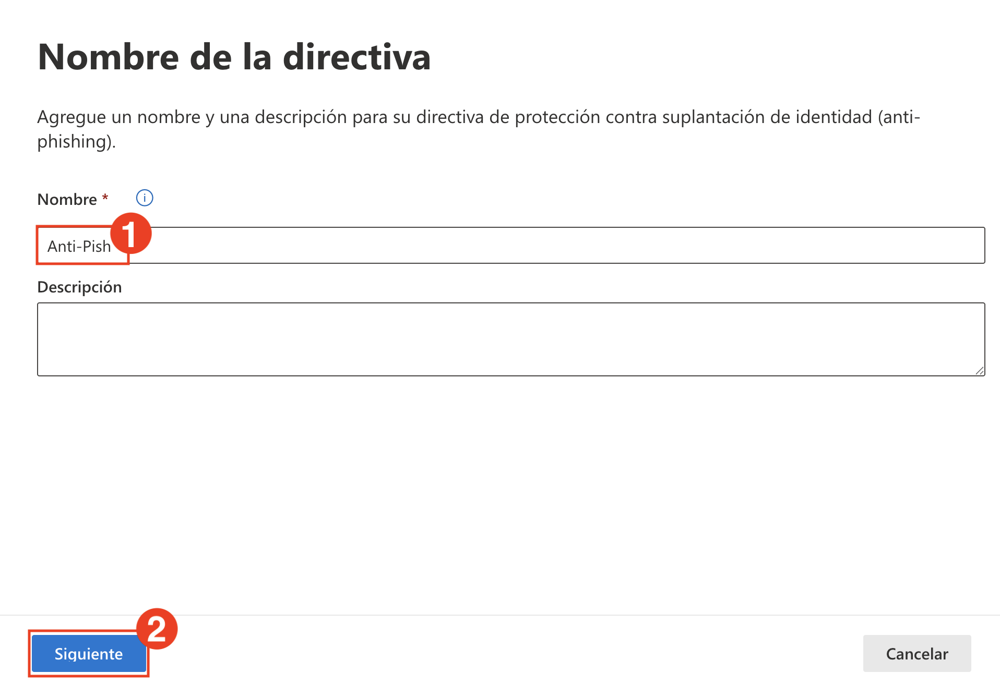
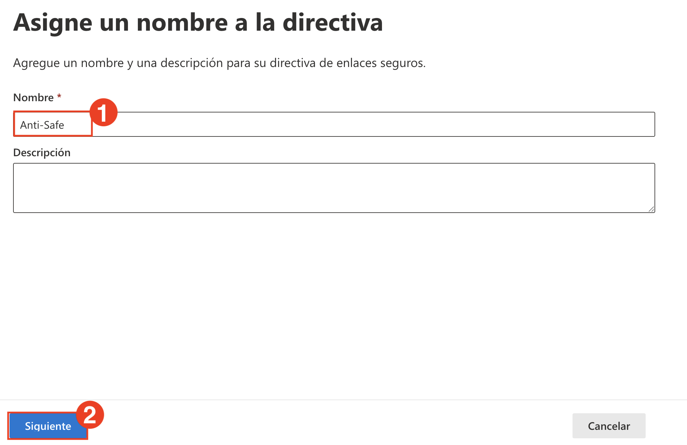
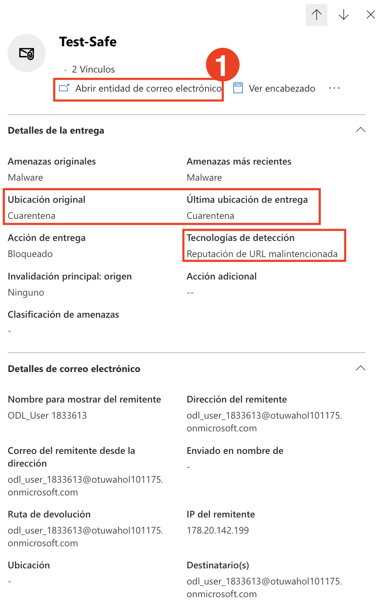

# Laboratorio 4: Configurar Directivas Antiphishing y de Vínculos Seguros

En este laboratorio, creará una directiva Anti-Phishing personalizada y una directiva de Vínculos Seguros (Safe Links) para mejorar la protección contra correos electrónicos maliciosos y enlaces de phishing. También simulará un correo electrónico de phishing y verificará las alertas y detecciones.

1. En el **portal de Microsoft Defender**, vaya a **Colaboración y correo electrónico (1)** → **Reglas y directivas (2)** → **Directivas de amenazas (3)**.

   

1. En la página **Directivas de amenazas**, en **Directivas**, seleccione **Protección contra phishing**.

   

1. En la página **Protección contra phishing**, haga clic en **Crear (1)** para crear una nueva directiva.

   

1. Ingrese el nombre **Anti-Phish (1)** y haga clic en **Siguiente (2)**.

   

1. En **Usuarios, grupos y dominios**, agregue el usuario **ODL User (1)** y haga clic en **Siguiente (2)**.

   

1. Establezca el **Umbral de correo electrónico de phishing** en **4 - El más agresivo** para activar la máxima protección.

   

1. En **Agregar dominios y remitentes de confianza**, marque las siguientes opciones:

   - **Habilitar la inteligencia de buzones (1)**
   - **Habilitar la inteligencia para la protección contra la suplantación de identidad (2)**
   - **Habilitar la inteligencia contra la suplantación de identidad (3)**  
   - Luego haga clic en **Siguiente (4)**. 
     
      

1. En **Acciones en mensajes**, configure lo siguiente y haga clic en **Siguiente (5)**.

   - Si la inteligencia de buzones detecta un usuario suplantado:  
     **Mover el mensaje a las carpetas de correo no deseado de los destinatarios (1)**
   - Si el mensaje se detecta como suplantación de identidad y la directiva DMARC se establece como p=quarantine:  
     **Mover el mensaje a las carpetas de correo no deseado de los destinatarios (2)**
   - Si el mensaje se detecta como suplantación de identidad y la directiva DMARC se establece como p=reject:  
     **Poner en cuarentena el mensaje (3)**
   - Si el mensaje se detecta como suplantación de identidad por la inteligencia de suplantación de identidad:  
     **Mover el mensaje a las carpetas de correo no deseado de los destinatarios (4)**  

      

1. De vuelta en la página **Directivas de amenazas**, vaya a **Colaboración y correo electrónico (1)** > **Reglas y directivas (2)** y seleccione **Vínculos seguros (3)**. Haga clic en **Crear**.

   

   

1. Ingrese el nombre de la directiva **Anti-Safe (1)** y haga clic en **Siguiente (2)**.

   

1. En **Usuarios y dominios**, agregue al usuario **ODL_User (1)** y haga clic en **Siguiente (2)**.

    

1. En **Configuración de protección de direcciones URL y clics**, asegúrese de que todas las casillas estén activadas, incluyendo:

    - Vínculos seguros en correo electrónico
    - Análisis de URL
    - Protección de Teams y Aplicaciones de Office 365 
    - Realizar un seguimiento de los clics de usuario 

    Luego haga clic en **Siguiente**.

    

    

1. Navegue a **Colaboración y correo electrónico (1)** > **Reglas y directivas (2)** > **Directiva de alerta (3)**.

    

1. En la página **Directiva de alerta**, haga clic en **+ Nueva directiva de alerta**.

    

1. Ingrese los siguientes detalles:
    
    - **Nombre (1):** Alert-Safe  
    - **Gravedad (2):** High  
    - **Categoría (3):** Threat management  
      
      Haga clic en **Siguiente (4)**.

      

1. Para la condición de la actividad, configure lo siguiente y haga clic en **Siguiente (4)**.

    - **La actividad es (1):** Se ha detectado malware en un mensaje
    - **Correo: La dirección de correo es (2):** Entrante
    - **¿Cómo quiere que se active la alerta? (3):** Cada vez que una actividad coincide con la regla  

      

1. Agregue la dirección de correo electrónico del destinatario **(1)** y haga clic en **Siguiente (2)**.

    

1. Revise la configuración de alertas, elija **Sí, deseo activarla inmediatamente (1)**, y haga clic en **Enviar (2)**.

    

   > **Nota:** Su directiva de alertas ahora está activa y se desencadenará si se detecta actividad coincidente.

1. Envíe un correo electrónico de prueba con enlaces maliciosos de ejemplo para simular una amenaza:
    
    - **(1)** https://www.amtso.org/check-desktop-phishing-page/  
    - **(2)** https://malware.wicar.org/data/eicar.com.txt  
    - Click **Send (3)** to deliver the email.

    

1. Navegue a **Colaboración y correo electrónico (1)** > **Explorador (2)** y localice el correo electrónico de prueba **Test-safe (3)**.

    

1. Haga clic en **Abrir entidad de correo electrónico (1)** y verifique que:
    
    - **Ubicación original:** Cuarentena
    - **Acción de entrega:** Bloqueado  
    - **Tecnologías de detección:** Reputación de URL malintencionada, Detección de análisis mixto

      

## Revisión

En este laboratorio, ha completado lo siguiente:

- Creó un rol personalizado en Microsoft Defender para administrar el acceso y los permisos.
- Simuló una interacción de phishing e investigó la actividad del usuario con el Explorador de Amenazas.
- Analizó detecciones en tiempo real e informes de simulación para evaluar el riesgo del usuario.
- Configuró directivas personalizadas de Anti-Phishing y Vínculos Seguros (Safe Links) para mejorar la protección contra amenazas.
- Creó una directiva de alertas y la validó mediante la simulación de un correo electrónico de phishing y malware.

### Ha completado el laboratorio con éxito. Haga clic en **Siguiente >>** para continuar con el siguiente laboratorio.

