# Lab 5: Implement and Monitor Defender for Office 365 Secure Posture

1. On the **Microsoft Defender portal**, select **Email & collaboration (1)** from the left navigation pane and then click on **Policies & rules (2)** under **Policies & rules**, click **Threat policies (3)**.

   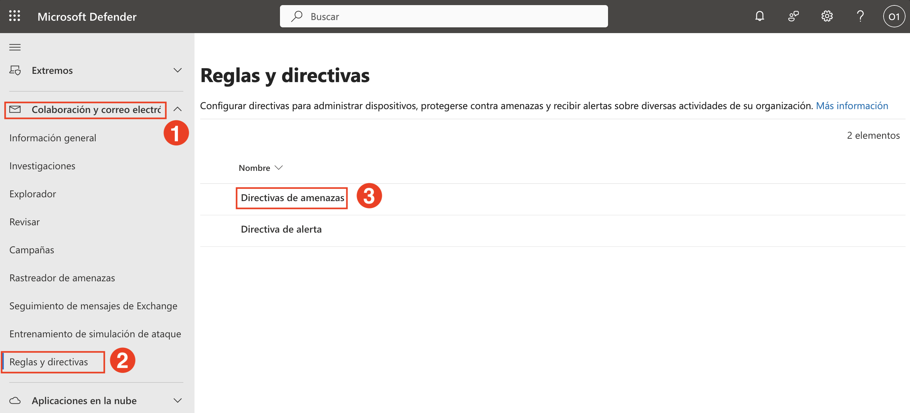

3. On the **Threat policies** page, under **Templated policies**, click on **Preset Security Policies**.
  
   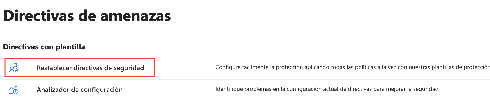

1. Confirm that **Standard protection (1)** and **Strict protection (2)** are enabled. These policies enforce Safe Links, Safe Attachments, and tighter anti-phishing controls based on user risk levels.

   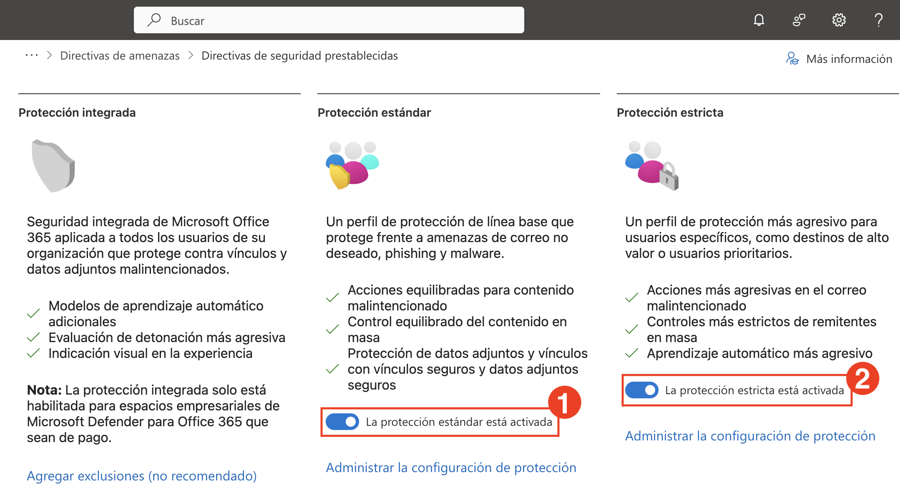

   > **Standard protection** applies to all users with a baseline of spam, phishing, and malware protection.

   > **Strict protection** targets VIP or high-risk users with more aggressive detection rules and enhanced ML-based scanning.

   > If either toggle is **Off**, enable it to strengthen your Defender posture.

1. On the **Threat policies** page, scroll to **Templated policies** and click **Configuration analyzer**.
  
   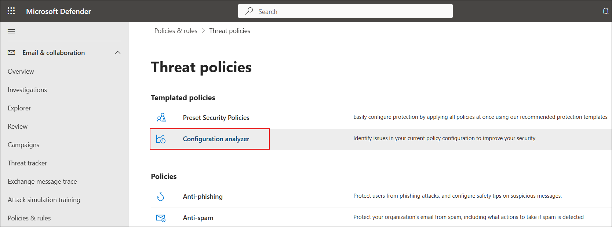

1. The **Configuration analyzer** provides recommendations under **Standard recommendations**. Note the counts for Anti-spam, Anti-phishing, DKIM, and Outlook misconfigurations.
  
   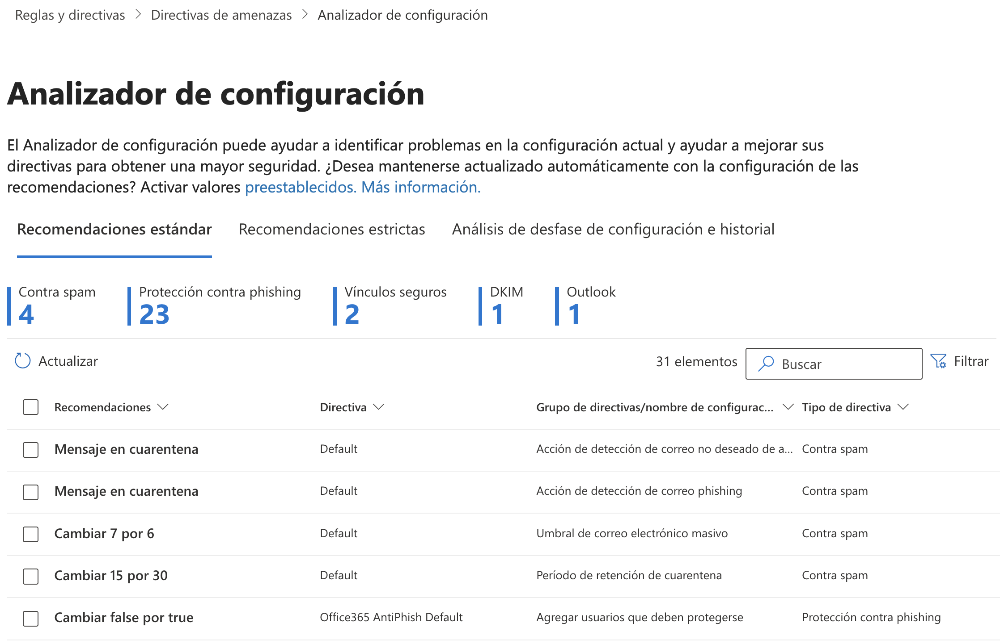

1. In the search box **(1)**, type `dkim` to filter results. Tick the checkbox for **Enable DKIM** **(2)**.
  
   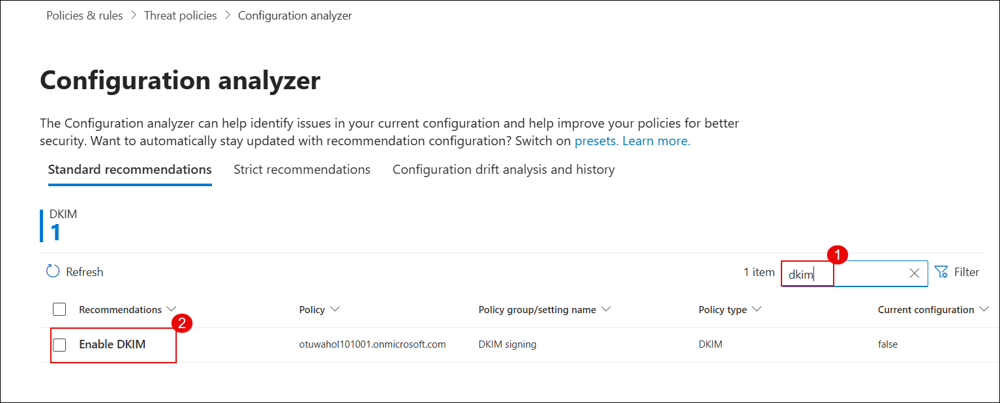

1. In the recommendation popup, click on **View policy** to jump to the DKIM settings page.
  
   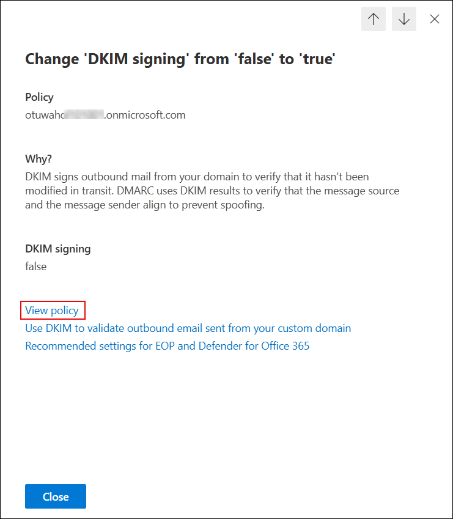

1. On the **Email authentication settings** page, ensure that DKIM signing is **Enabled** for your domain.
  
   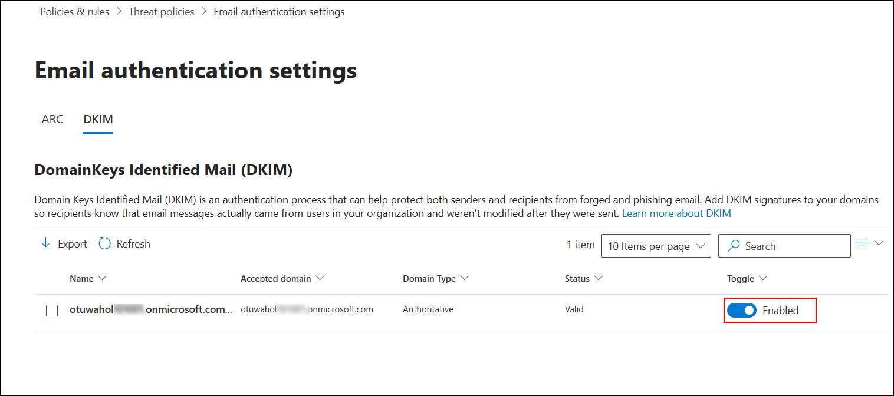

1. Open Outlook or any other client and compose a test email addressed to a Gmail ID to verify DKIM.
  
   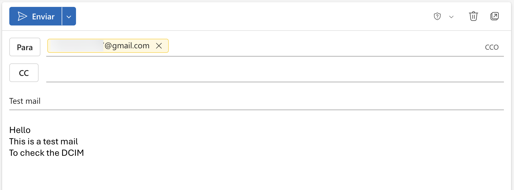

1. In Gmail, open the received test email, click the three dots in the top right corner, and select **Show original**.
  
   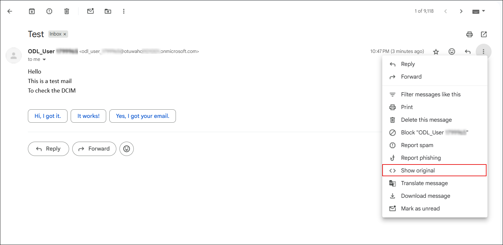

1. Under the **Original Message** view, confirm that **DKIM** shows as `'PASS'` for your domain.
  
    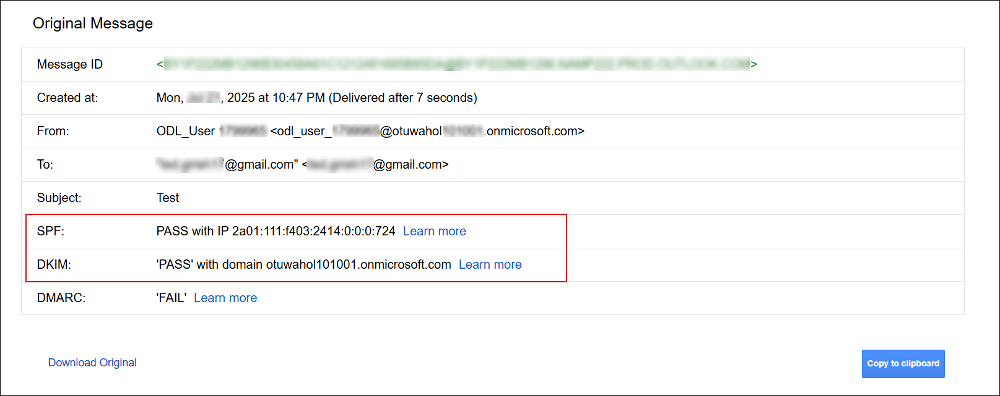

    > **Note**: DMARC validation may show as `'FAIL'` on `.onmicrosoft.com` domains. To enable full SPF, DKIM, and DMARC authentication, use a custom domain (e.g., `contoso.com`).

1. Back in the Defender portal, from the left menu, navigate to **System (1)** > **Settings (2)**, then select **Email & collaboration (3)**.
  
    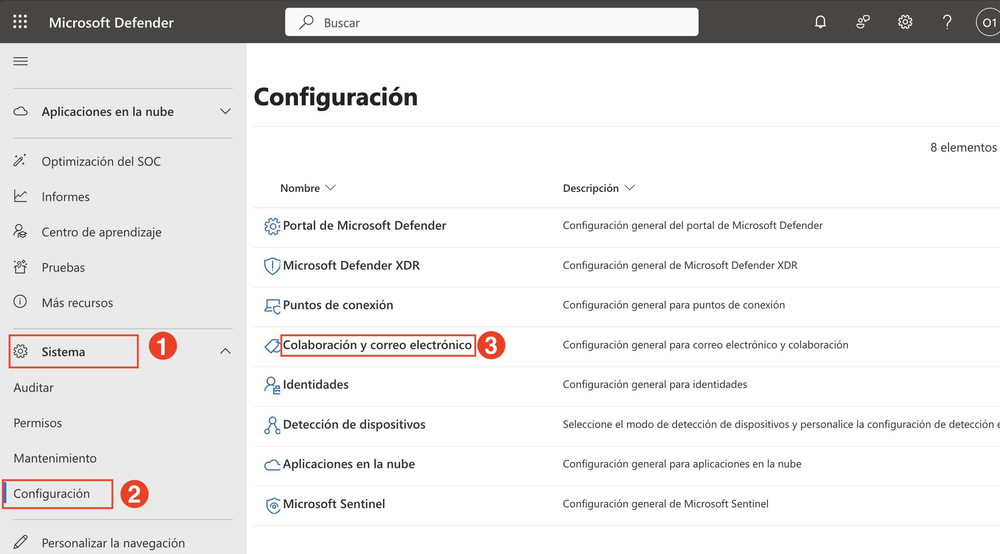

1. On the settings page, click **Priority account protection (1)** and turn the toggle to **On (2)**.
  
    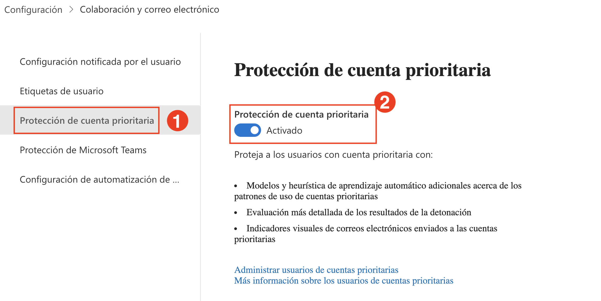

1. From the same settings pane, click **User tags (1)**, select the **PRIORITY ACCOUNT (2)** tag, and click **Edit (3)**.
  
    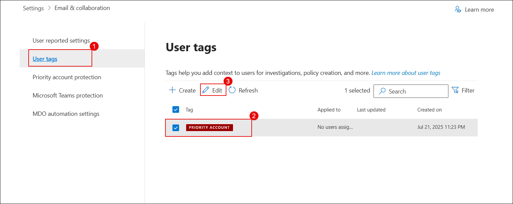

1. On the **Edit tag Priority account** screen, click **+ Add members**.
  
    

1. Search for the user you want to tag (e.g., `ODL_User`) **(1)** and click **Add (2)**.
  
    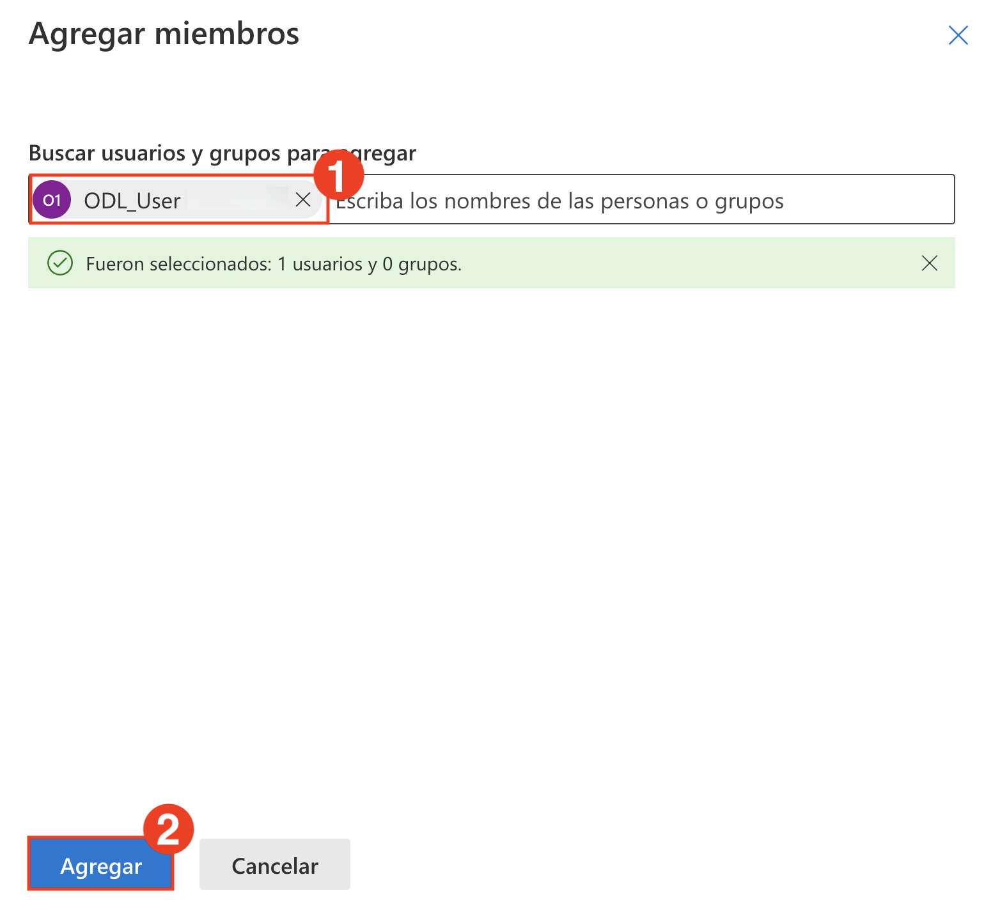

1. After the user is added, click **Next** to proceed.
  
    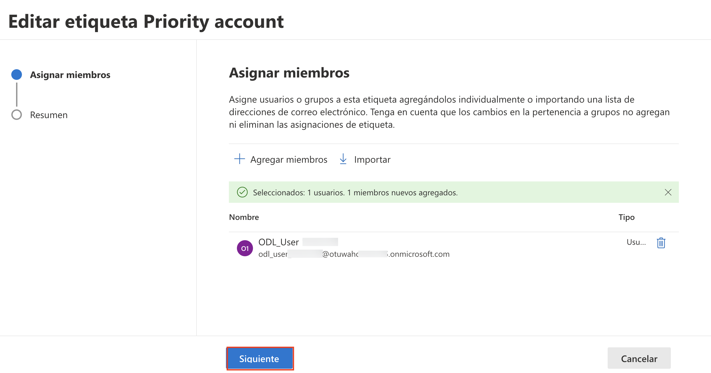

1. Review the tag summary and click **Submit**.
  
    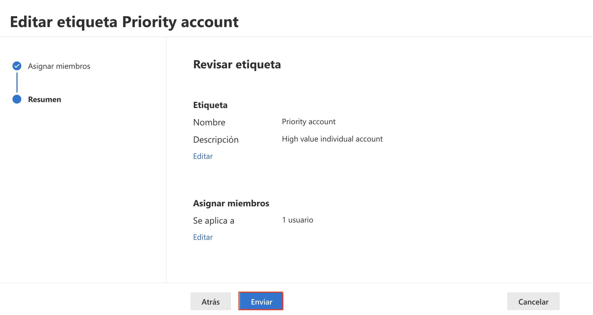

1. After successful submission, click **Done** to finish tagging the user as a Priority Account.
  
    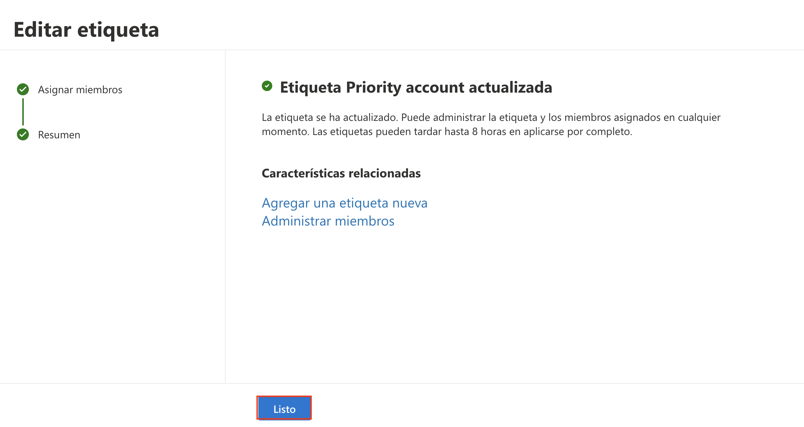

1. Finally, navigate to **Microsoft Secure Score** in the Defender portal. Review your organization’s **Secure Score**, top recommended actions, and breakdown by category.
  
    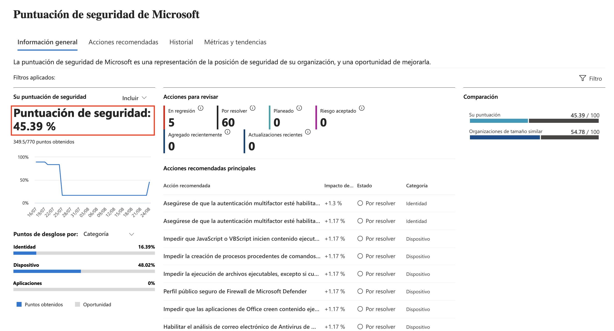

> 💡 This score helps monitor and improve your org’s security posture over time. Completing recommended actions here boosts your overall score and resilience.

## Review

In this lab, you have completed the following:

- Verified preset security policies and enabled DKIM and Priority Account protection.
- Reviewed secure posture using Configuration Analyzer and Secure Score.

### You have successfully completed the lab. Click on **Next >>** to proceed with the next Lab.

