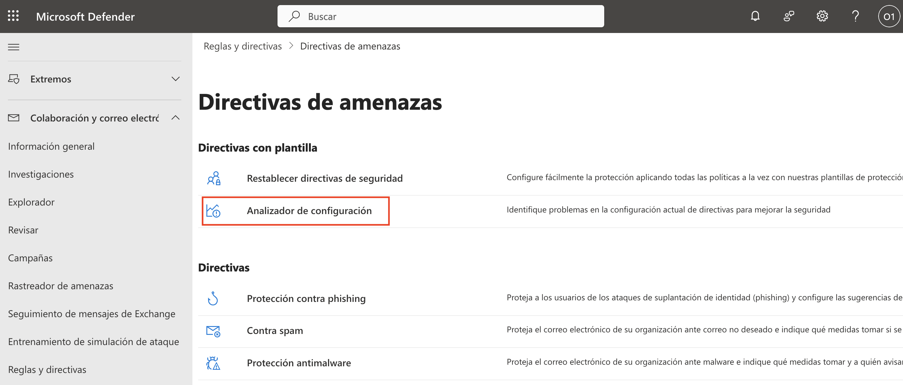
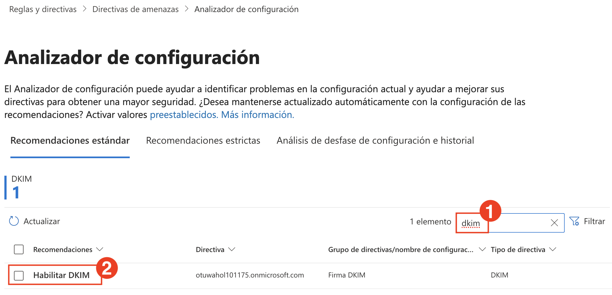
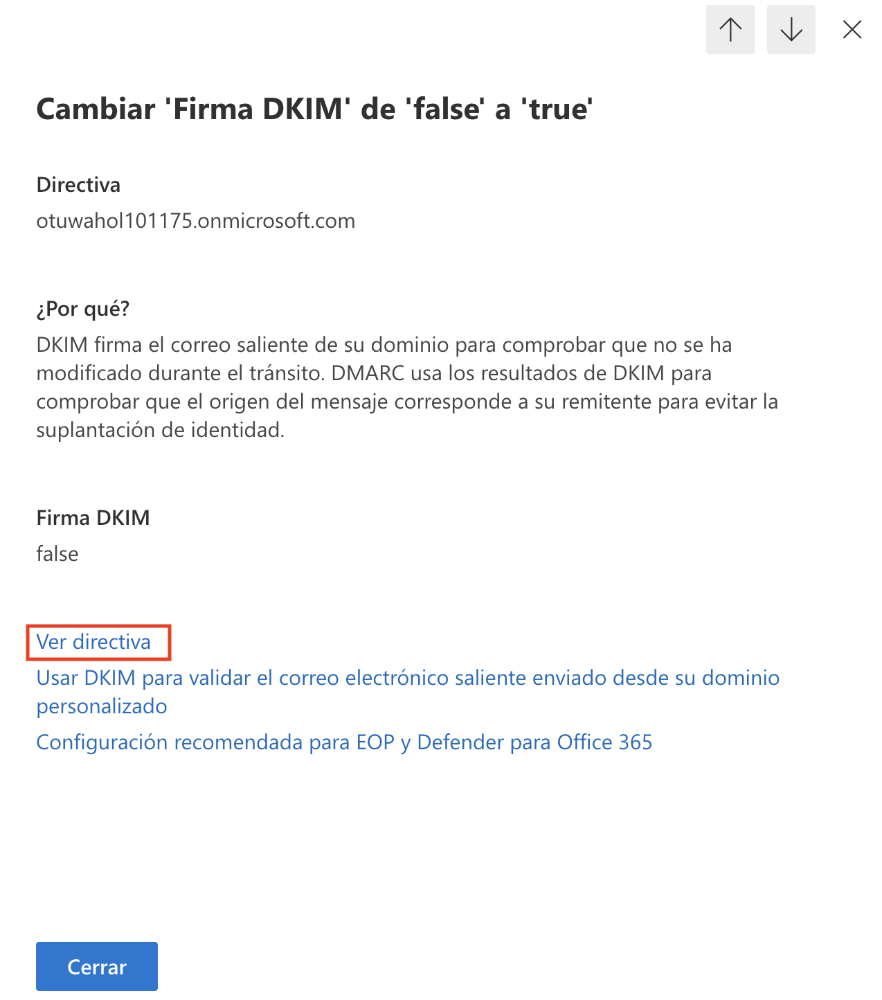
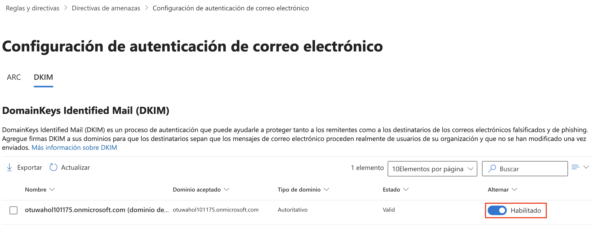
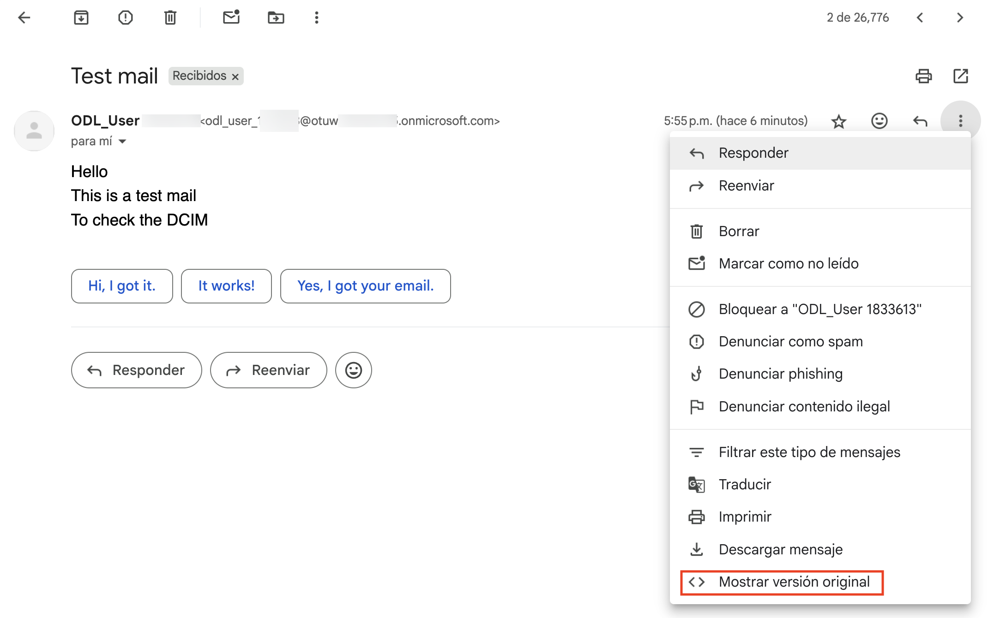
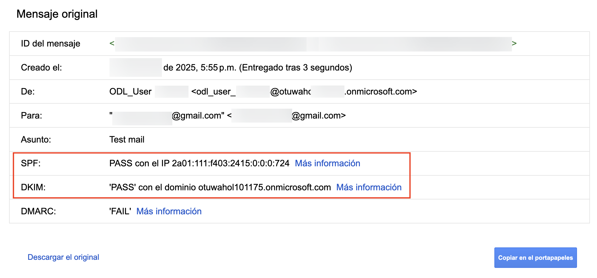
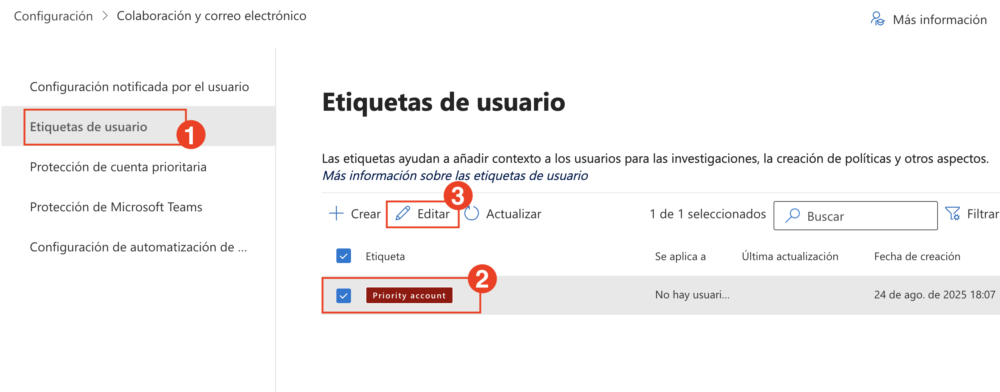
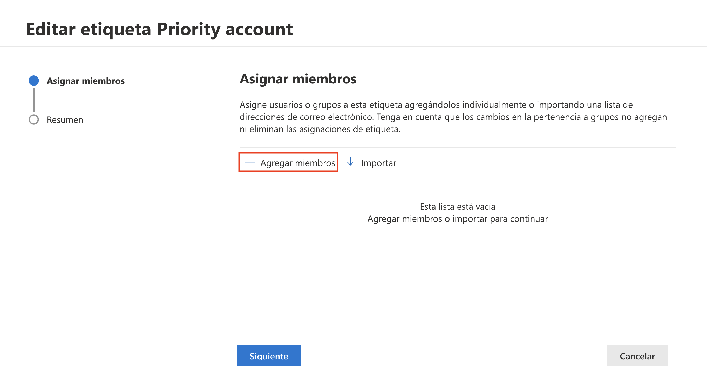

# Laboratorio 5: Implementar y Supervisar la Posición Segura de Defender para Office 365

1. En el **portal de Microsoft Defender**, seleccione **Colaboración y correo electrónico (1)** en el panel de navegación izquierdo y, a continuación, haga clic en **Reglas y directivas (2)** en **Reglas y directivas**. Haga clic en **Directivas de amenazas (3)**.

   

3. En la página **Directivas de amenazas**, en **Directivas con plantilla**, haga clic en **Restablecer directivas de seguridad**.
  
   

1. Confirme que **Protección estándar (1)** y **Protección estricta (2)** estén habilitadas. Estas directivas aplican Vínculos Seguros (Safe Links), Datos Adjuntos Seguros (Safe Attachments) y controles anti-phishing más estrictos según el nivel de riesgo del usuario. 

   

   > La **Protección Estándar** se aplica a todos los usuarios con protección básica contra spam, phishing y malware.

   > La **Protección Estricta** se dirige a usuarios VIP o de alto riesgo con reglas de detección más agresivas y análisis mejorado basado en aprendizaje automático (machine learning).

   > Si alguna opción está **Desactivada**, actívela para reforzar su posición de Defender.

1. En la página **Directivas de amenazas**, desplácese hasta **Directivas con plantilla** y haga clic en **Analizador de configuración**.
  
   

1. El **Analizador de Configuración (Configuration Analyzer)** ofrece recomendaciones en **Recomendaciones estándar**. Observe los recuentos de configuraciones incorrectas de Anti-spam, Anti-phishing, DKIM y Outlook.
  
   

1. En el cuadro de búsqueda **(1)**, escriba `dkim` para filtrar los resultados. Marque la casilla **Habilitar DKIM** **(2)**.
  
   

1. En la ventana emergente de recomendaciones, haga clic en **Ver directiva** para acceder a la página de configuración de DKIM.
  
   

1. En la página **Configuración de autenticación de correo electrónico**, asegúrese de que la firma DKIM esté **Habilitada** para su dominio. 
  
   

1. Abra Outlook o cualquier otro cliente y redacte un correo electrónico de prueba dirigido a una ID de Gmail para verificar DKIM.
  
   

1. En Gmail, abra el correo electrónico de prueba recibido, haga clic en los tres puntos de la esquina superior derecha y seleccione **Mostrar versión original**.
  
   

1. En la vista **Mensaje original**, confirme que **DKIM** aparezca como `'PASS'` para su dominio.
  
    

    > **Nota**: La validación de DMARC puede mostrarse como `'FAIL'` en los dominios `.onmicrosoft.com`. Para habilitar la autenticación completa de SPF, DKIM y DMARC, use un dominio personalizado (por ejemplo, `contoso.com`).

1. De vuelta en el portal de Defender, en el menú izquierdo, vaya a **Sistema (1)** > **Configuración (2)** y seleccione **Colaboración y correo electrónico (3)**.
  
    

1. En la página de configuración, haga clic en **Protección de cuenta prioritaria (1)** y coloque el interruptor en **Activado (2)**.
  
    

1. En el mismo panel de configuración, haga clic en **Etiquetas de usuario (1)**, seleccione la etiqueta **Priority account (2)** y haga clic en **Editar (3)**.
  
    

1. En la pantalla **Editar etiqueta Priority account**, haga clic en **+ Agregar miembros**.
  
    

1. Busque al usuario que desea etiquetar (por ejemplo, `ODL_User`) **(1)** y haga clic en **Agregar (2)**.
  
    

1. Una vez agregado el usuario, haga clic en **Siguiente** para continuar.
  
    

1. Revise el resumen de la etiqueta y haga clic en **Enviar**.
  
    

1. Tras el envío correcto, haga clic en **Listo** para terminar de etiquetar al usuario como Cuenta Prioritaria.
  
    

1. Finalmente, navegue a **Puntuación de Seguridad de Microsoft (Microsoft Secure Score)** en el portal de Defender. Revise la **Puntuación de Seguridad** de su organización, las principales acciones recomendadas y el desglose por categoría.
  
    

> 💡 Esta puntuación ayuda a supervisar y mejorar la seguridad de su organización a lo largo del tiempo. Completar las acciones recomendadas aquí aumenta su puntuación general y su resiliencia.

## Revisión

En este laboratorio, ha completado lo siguiente:

- Verificó las directivas de seguridad preestablecidas y habilitó la protección de DKIM y Cuentas Prioritarias.
- Revisó la posición de seguridad con Analizador de Configuración (Configuration Analyzer) y Puntuación de Seguridad (Secure Score).

### Ha completado el Laboratorio con éxito. Haga clic en **Siguiente >>** para continuar con el siguiente Laboratorio..

