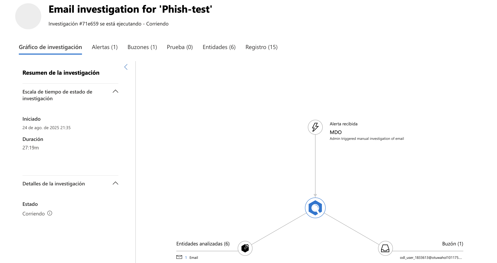
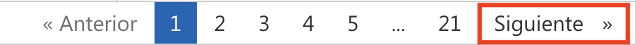

# Laboratorio 6: Investigar y Remediar Incidentes en Microsoft Defender XDR

En este laboratorio, simulará un incidente de phishing, investigará el mensaje sospechoso con el Explorador de Amenazas, tomará medidas correctivas, enviará el mensaje a Microsoft para su análisis y revisará los resultados de la investigación automatizada.

1. Envíe un correo electrónico de prueba a su usuario de laboratorio que contenga enlaces como:

   - https://youtube.com/  
   - https://openai.com/  

   

1. En el portal de Microsoft Defender (https://security.microsoft.com), vaya a **Colaboración y correo electrónico (1)** → **Explorador (2)**. Seleccione la entrada de correo electrónico de phishing **Test Phishing (4)**.

   

   > **Nota:** El correo electrónico puede tardar de 2 a 3 minutos en aparecer en el Explorador tras su entrega. 

1. Haga clic en el mensaje para abrir sus detalles. A continuación, haga clic en **Realizar acción**.

   

1. En la página **Elegir acciones de respuesta**:

   - **(1)** Active **Mostrar todas las acciones de respuesta**. 
   - **(2)** Seleccione **Mover o eliminar**.
   - **(3)** Elija **Correo no deseado**.
   - **(4)** Seleccione **Enviar a Microsoft para su revisión**.
   - **(5)** Elija **He confirmado que se trata de una amenaza**.
   - **(6)** Seleccione **Cebo (Phish)** como la categoría.  
   - **(7)** Habilite **Iniciar investigación automatizada**.  
   - Haga clic en **Siguiente (8)**

      

1. En la página **Elegir entidades de destino**, introduzca un nombre como `report-phish (1)` y revise los usuarios afectados. Haga clic en **Siguiente (2)**.

   

1. Navegue a **Incidentes y alertas (1)** → **Alertas (2)**. Localice la alerta titulada **Administrative action submitted by an Administrator (3)**.

   

1. Haga clic en la alerta para abrir los detalles. Luego, haga clic en **Administrar alerta**.

   

1. En el panel **Administrar alerta**:

   - **(1)** Establezca **Estado** en `En curso`.  
   - **(2)** Asigne a su usuario de laboratorio.
   - **(3)** Establezca **Clasificación** en `True positive – Phishing`  
   - Haga clic en **Guardar (4)**

     

1. Vaya a **Colaboración y correo electrónico (1)** → **Investigaciones (2)**. Haga clic en la última entrada de investigación relacionada con su prueba de phishing **(3)**.

   

1. Revise el gráfico de investigación que muestra:

    - **Alerta recibida**  
    - **Entidades analizadas**  
    - **Buzón**  
    - **Resultado**: No se encontraron amenazas

      

    > **Nota:** La investigación automatizada puede tardar entre 10 y 15 minutos en completarse totalmente y mostrar los resultados.

## Revisión

En este laboratorio, ha completado lo siguiente:

- Simuló un correo electrónico de phishing y realizó una investigación y una corrección utilizando Defender XDR.

### Ha completado el Laboratorio con éxito. Haga clic en **Siguiente >>** para continuar con el siguiente Laboratorio..

