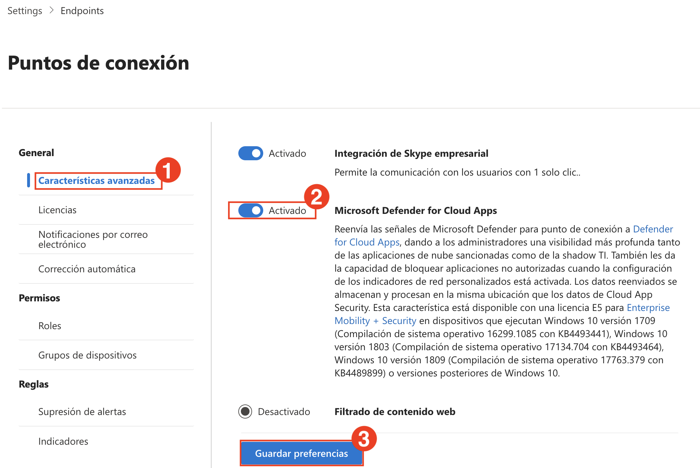
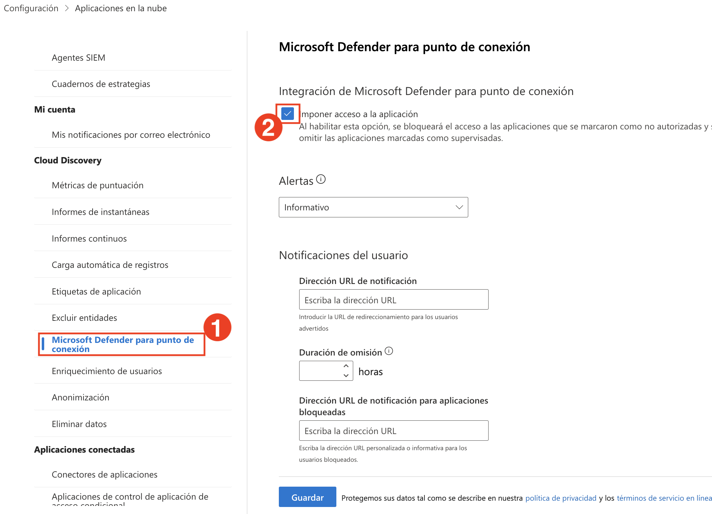
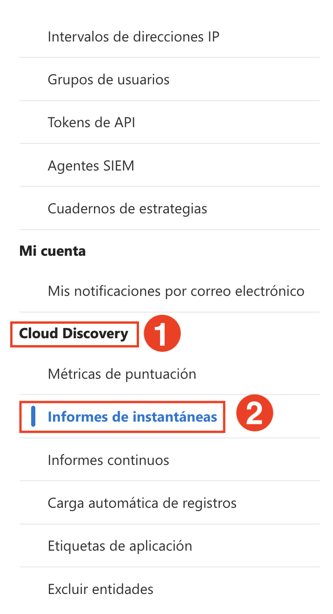
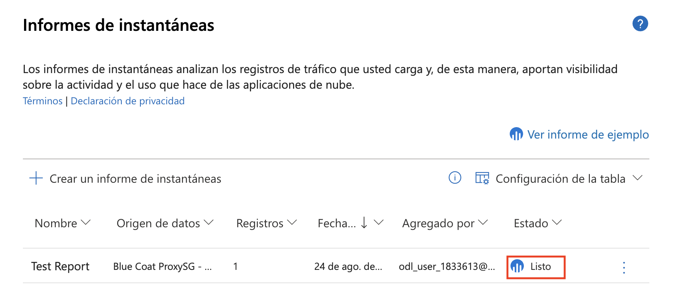

## Laboratorio 7: Microsoft Defender for Cloud Apps: Configuración de la Detección de Aplicaciones en la Nube

En este laboratorio, integrará Defender for Cloud Apps con Microsoft Defender para Punto de Conexión, habilitará la detección de TI en la Sombra y analizará datos mediante informes de instantáneas.

1. En el **portal de Microsoft Defender**, seleccione **Sistema (1)** y haga clic en **Configuración (2)**.

   

1. En la página **Configuración**, haga clic en **Puntos de conexión (2)** en la categoría **Configuración (1)**.

   
   > **Nota:** Si no ve la opción Puntos de conexión, puede acceder directamente al portal de Puntos de conexión mediante el siguiente enlace [https://security.microsoft.com/securitysettings/endpoints/integration](https://security.microsoft.com/securitysettings/endpoints/integration).

1. Si aparece una pantalla de carga, espere a que se complete la configuración del espacio de trabajo.

   

1. En la configuración de **Puntos de conexión**, seleccione **Características avanzadas (1)**. Active **Microsoft Defender for Cloud Apps (2)** en **Activado**, y haga clic en **Guardar preferencias (3)**.

   

1. Regrese a **Configuración (1)** y seleccione **Aplicaciones en la nube (2)** de la lista.

   

1. En **Cloud Discovery**, haga clic en **Microsoft Defender para punto de conexión (1)** y marque la casilla **Imponer acceso a la aplicación (2)**.

   
   > **Nota:** Habilitar la aplicación de restricciones de acceso a las aplicaciones ayuda a bloquear automáticamente las aplicaciones marcadas como no autorizadas según la información de Defender para Punto de Conexión.

1. Desplácese hacia abajo en el panel izquierdo, bajo **Cloud Discovery (1)** y seleccione **Informes de instantáneas (2)**.

   

1. Haga clic en **Crear un informe de instantáneas**.

   

1. En el paso **Información general**, haga clic en **Siguiente** para continuar.

   

1. Ingrese un nombre para su informe (por ejemplo, **Test Report**) (1), seleccione la fuente del registro (por ejemplo, **Blue Coat ProxySG – Access log**) (2) y haga clic en **Siguiente (3)**.

   

1. En la pantalla **Carga de registros de tráfico**, haga clic en **Examinar...** para subir un archivo de registro..

   

1. En el selector de archivos, seleccione **bluecoat_sample (1)** y haga clic en **Abrir (2)**.

   

1. Después de cargar el archivo, haga clic en **Cargar registros**.

   

1. Una vez que el informe esté listo, verifique que el estado sea **Listo**.

   

1. Haga clic en el informe para abrir y analizar las aplicaciones, las IP, los usuarios y los niveles de riesgo de tráfico detectados.

   

## Revisión

En este laboratorio, ha completado lo siguiente:

- Habilitó la integración entre Defender para Punto de Conexión y Defender for Cloud Apps.

### Ha completado el Laboratorio con éxito. Haga clic en **Siguiente >>** para continuar con el siguiente Laboratorio..

