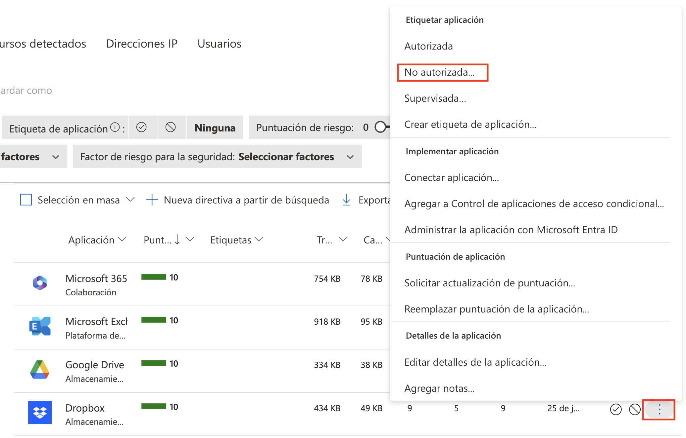

# Laboratorio 8: Descubrir y Analizar la TI en la Sombra con Cloud Discovery

En este laboratorio, integrará Defender for Cloud Apps con Microsoft Defender para Punto de Conexión, habilitará la detección de TI en la Sombra y analizará datos mediante informes de instantáneas.

1. Analice el informe para las siguientes opciones:

    - **Consultar las Métricas de Resumen:** Observe el número total de aplicaciones, usuarios, direcciones IP y volumen de tráfico para comprender el uso general de la nube.
    
    - **Revisar Categorías de Aplicaciones:** Identifique qué categorías (por ejemplo, Computación en la Nube, Almacenamiento, Colaboración) utilizan la mayor cantidad de ancho de banda y compruebe si hay aplicaciones no autorizadas implicadas.
    
    - **Analizar Niveles de Riesgo:** Utilice el gráfico de niveles de riesgo para ver cuánto tráfico proviene de aplicaciones de riesgo bajo, medio o alto; céntrese en el riesgo medio/alto.
    
    - **Identificar Usuarios Principales:** Consulte la sección “Entidades principales” para ver qué usuarios generan la mayor cantidad de tráfico, especialmente hacia aplicaciones de riesgo o no autorizadas.
    
    - **Inspeccionar Aplicaciones Descubiertas**: Revise la lista de aplicaciones en uso, su volumen de tráfico y verifique si están aprobadas o necesitan ser bloqueadas o revisadas más a fondo.

1. En el panel, diríjase a la sección **Aplicaciones detectadas**.

   

1. Esta sección muestra todas las aplicaciones detectadas, mostrando su nivel de riesgo, volumen de tráfico, número de usuarios y última actividad.

   

1. Haga clic en los puntos suspensivos junto a cualquier aplicación para marcarla como **No autorizada**. Esta acción marca la aplicación como no autorizada, lo que le ayuda a supervisar y generar informes sobre su uso en el panel.

   

## Revisión

En este laboratorio, ha completado lo siguiente:

- Habilitó la integración entre Defender para Punto de Conexión y Defender for Cloud Apps.
- Generó un informe de instantáneas utilizando registros de tráfico para descubrir el uso de la aplicación en la nube.
- Analizó la actividad de TI en la Sombra, evaluó los niveles de riesgo de las aplicaciones y marcó las aplicaciones no autorizadas.

### Ha completado los Laboratorios del Día 1 con éxito. 