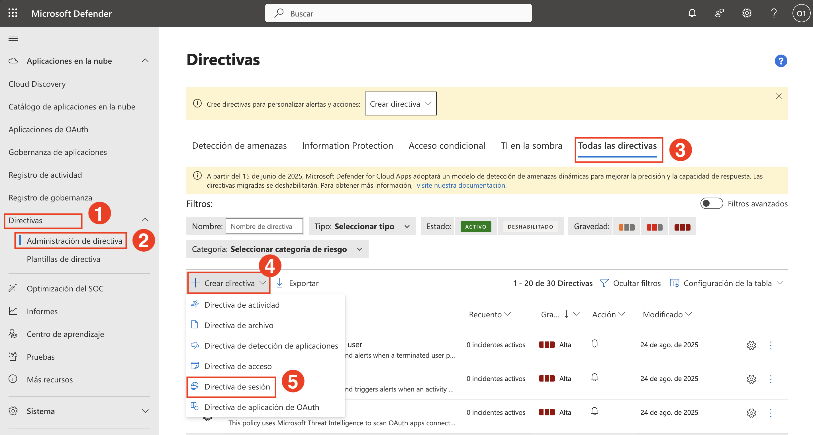
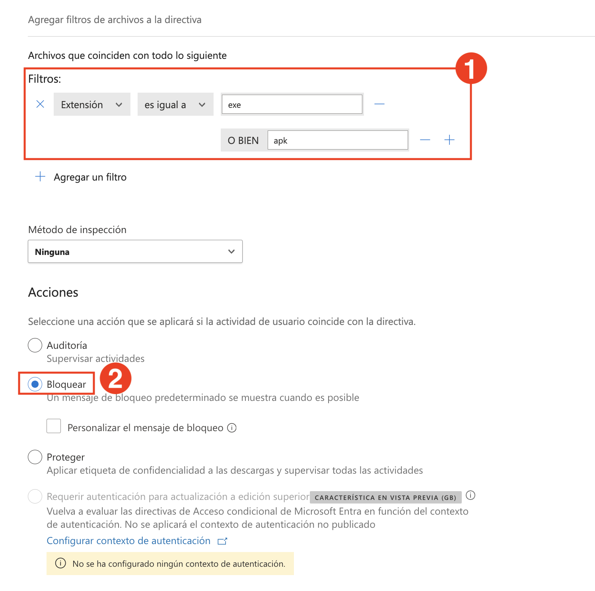
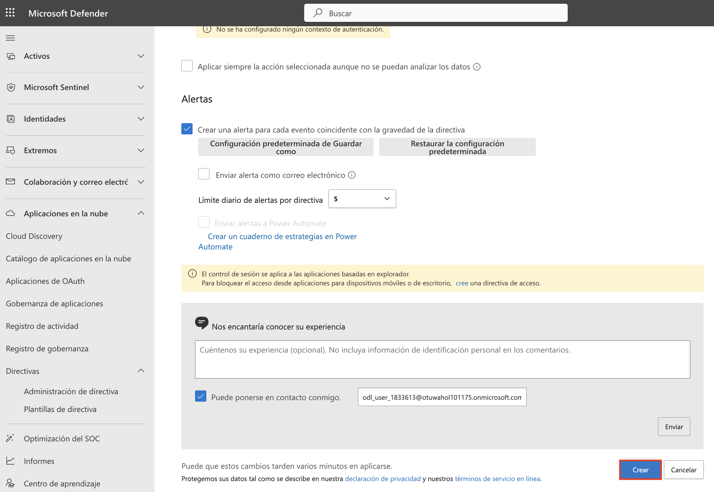
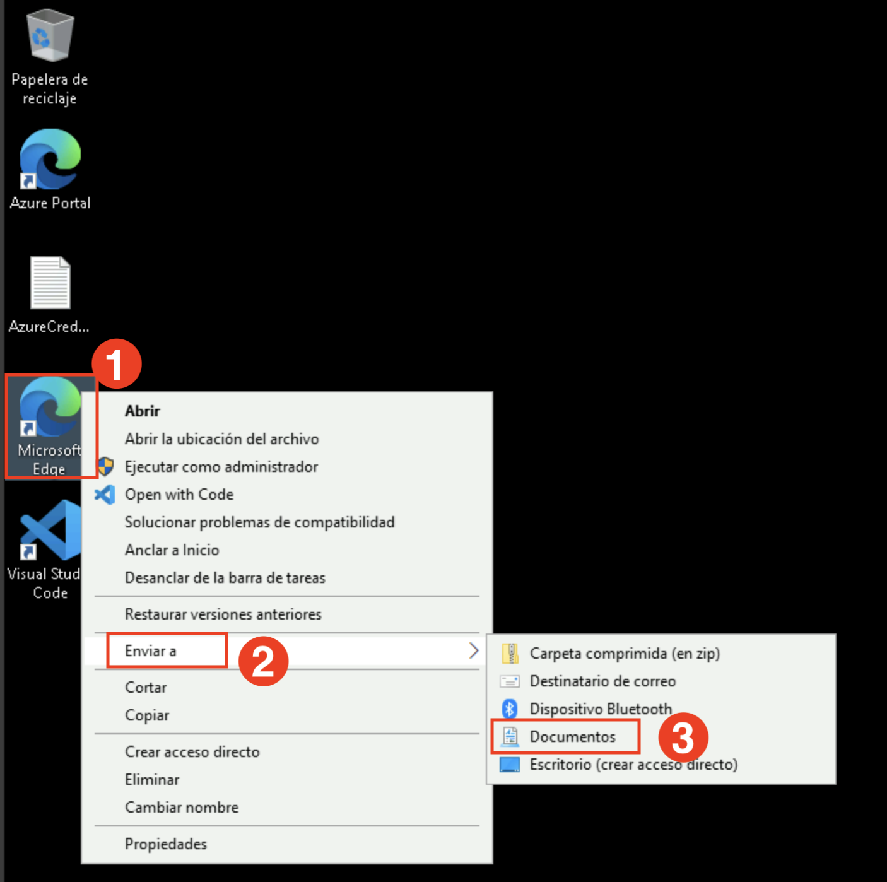
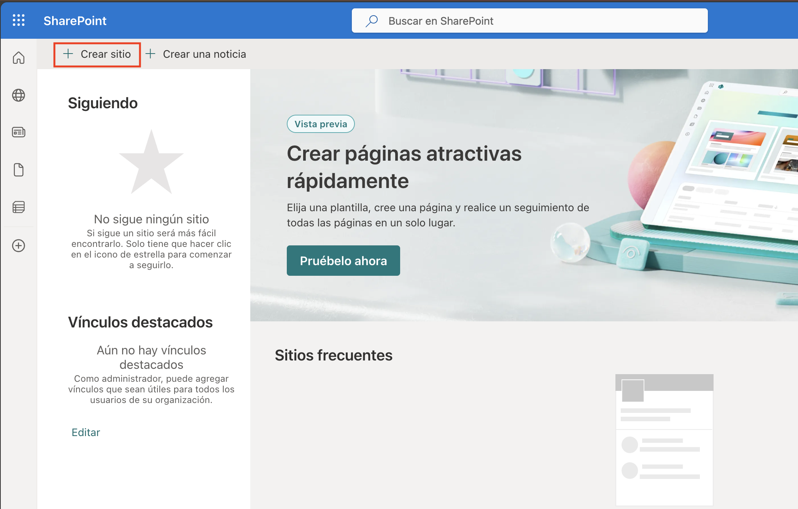
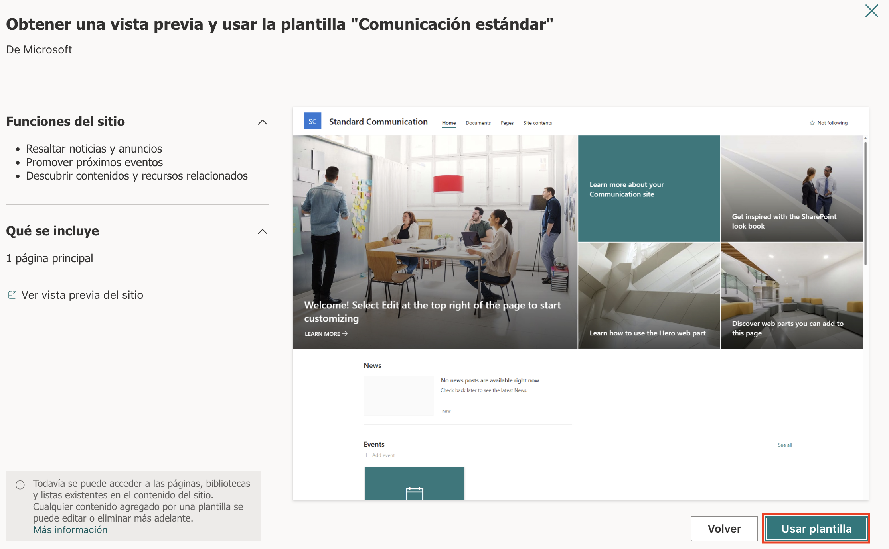
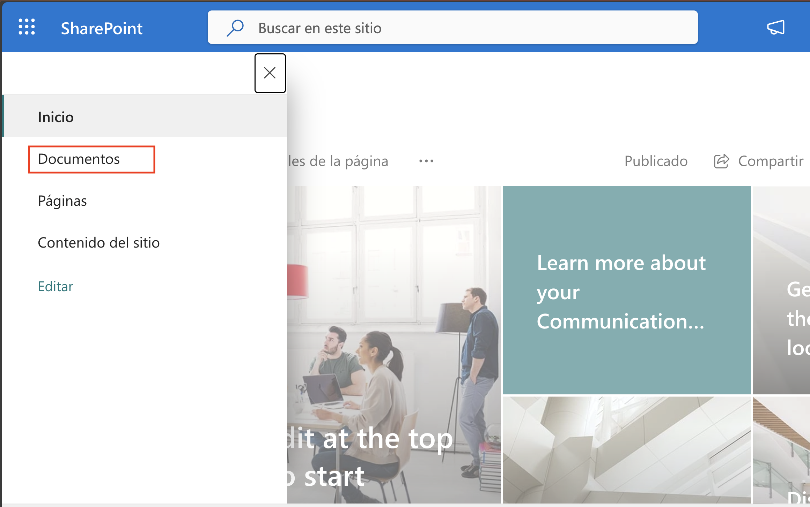
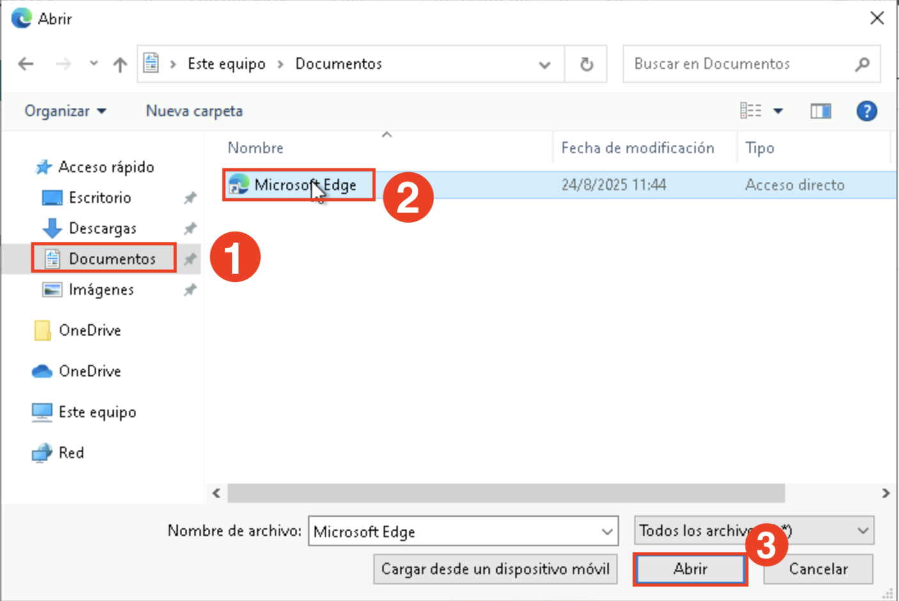
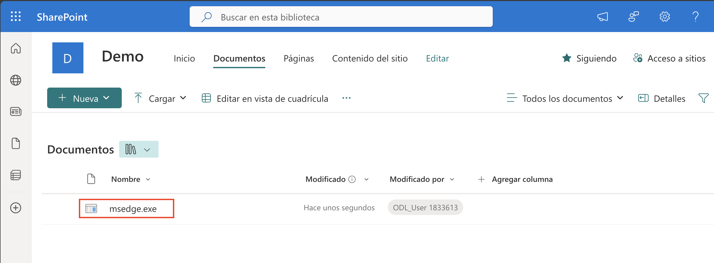
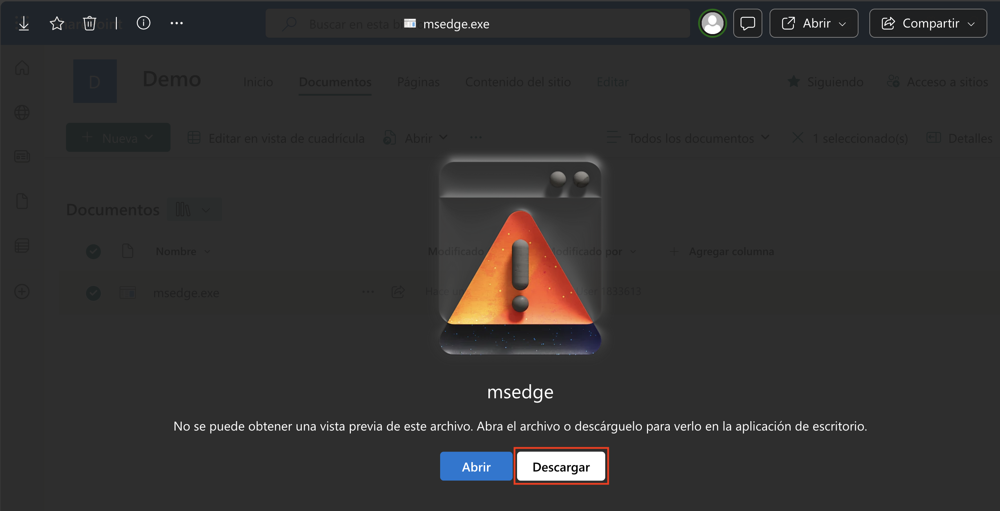

# Laboratorio 10: Configurar Directivas de Sesión para Supervisar y Bloquear Comportamientos de Riesgo

En este laboratorio, creará una directiva de sesión de Microsoft Defender for Cloud Apps para bloquear la descarga de archivos de riesgo (por ejemplo, `.exe`, `.apk`) desde SharePoint Online en dispositivos que no cumplan con los requisitos.

1. En el **portal de Microsoft Defender**, navegue a **Directivas (1)** en **Aplicaciones en la nube**, luego haga clic en **Administración de directiva (2)**. En la página **Directivas**, haga clic en **Todas las directivas (3)** en la parte superior. A continuación, seleccione **Crear directiva (4)** y elija **Directiva de sesión (5)** del menú desplegable.

   

1. En la página **Crear directiva de sesión**, configure los siguientes valores:
   - **Plantilla de directiva (1)**: Ninguna plantilla
   - **Nombre de directiva (2)**: Block-All-Download
   - **Gravedad de directiva (3)**: Alta (Rojo)
   - **Categoría (4)**: Detección de amenazas
   - **Tipo de control de sesión (5)**: Control de la descarga de archivos (con inspección)

   En la sección **Origen de actividad**, defina los siguientes filtros:
   - **Dispositivo | Etiqueta | no es igual a | Conformes con Intune, Unido a Microsoft Entra híbrido**
   - **Aplicación | Incorporación automática de Entra ID | es igual a | Office 365 SharePoint Online**

      

1. En la sección **Archivos que coinciden con todo lo siguiente**, agregue filtros de extensión de archivo::
   - **Extensión es igual a exe**
   - **O BIEN apk (1)**

   En **Acciones**, seleccione **Bloquear (2)**.

   

1. Desplácese hacia abajo y haga clic en **Crear** para guardar la directiva.

   

    Ahora simule el intento de descarga para validar la directiva.

1. En su escritorio, haga clic con el botón derecho en el acceso directo de **Microsoft Edge (1)**, vaya a **Enviar a (2)** y seleccione **Documentos (3)**.

   

1. Navegue a **https://portal.office.com**, abra **SharePoint**, y haga clic en **Crear sitio**.

   

1. Elija **Sitio de comunicación**.

   

1. Elija la plantilla **Comunicación estándar**. Luego, de clic en **Usar plantilla** y asigne el **Nombre del sitio (1)** como "Demo" y haga clic en **Siguiente (2)**.

   

   

   

1. En la página **Establecer idioma y otras opciones**, seleccione **Inglés (1)** y haga clic en **Crear sitio (2)**.

    

1. Una vez cargado el sitio, haga clic en el **ícono de menu** en la esquina superior izquierda para expandir la navegación..

    

1. En el panel de navegación izquierdo, haga clic en **Documentos**.

    

1. En la página **Documentos**, haga clic en **Cargar (1)** y seleccione **Archivos (2)**.

    

1. En la ventana del selector de archivos, navegue a **Documentos (1)**, seleccione el **acceso directo de Microsoft Edge(2)**, y haga clic en **Abrir (3)**.

    

1. Tras la carga, verifique que el archivo **msedge.exe** aparezca en la lista.

    

1. Intente descargar el archivo haciendo clic en **Descargar** en la pantalla de vista previa.

    

1. Aparecerá un mensaje indicando **Descarga bloqueada**, lo que confirma que la directiva de sesión funciona.

    

   > **Nota:** Las directivas de sesión solo se aplican a sesiones basadas en navegador. Para bloquear el acceso desde aplicaciones móviles o de escritorio, configure las **directivas de acceso** por separado.

## Revisión

En este laboratorio, ha completado lo siguiente:

- Creó directivas de sesión para detectar comportamientos de riesgo, como descargas de archivos y actividad sospechosa de usuarios.
- Probó la aplicación de directivas para garantizar que las acciones de riesgo se bloquearan o supervisaran en tiempo real.

### Ha completado el Laboratorio con éxito. Haga clic en **Siguiente >>** para continuar con el siguiente Laboratorio.

