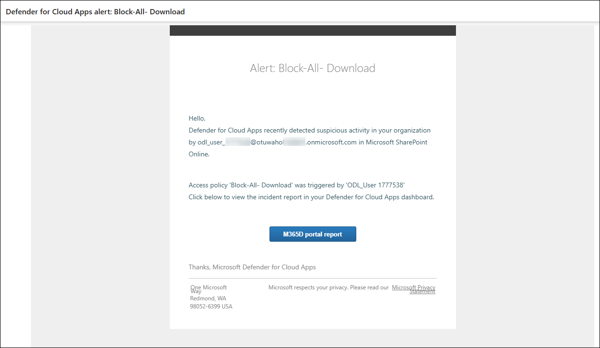

# Lab 12: Investigate Alerts and Create Custom Detection Policies

1. In the Microsoft Defender Portal, go to **Cloud Apps** → **Activity log**.

1. Under the **App** filter, click on **Select apps** (3), select **Microsoft SharePoint Online**

    

   > **Note:** Once selected, all user activities performed in SharePoint—such as file uploads, downloads, edits, and access attempts—will be visible in the activity log.

1. Go to **Incidents & alerts** → **Alerts**, and look for `Block-All-Download`.

   

1. Click the alert, then select **Open alert page**.
   
   

1. Click **Investigate in activity log**.
 
   

   

1. Go to **Cloud Apps** → **Policy management**, and click **Create policy** → **Activity policy**.

   

1. Configure the following:

   - **Policy template:** `No template`
   - **Policy name:** `Detect Suspicious File Download – msedge.exe`  
   - **Severity:** `High`  
   - **Category:** `Threat detection`  
   - **Act on:** `Single activity`  
   - **Activity type:** `Download file`  
   - **Files and folders:** `msedge.exe`  
   - **App:** `Microsoft SharePoint Online`
   
      

1. Click **Edit and preview results**, review matches, then click **Save filters**.

   

1. Under **Alerts**, enable **Send alert as email**, add a valid address, set daily alert limit to `5`.

1. Click **Create** to save and activate the policy.

   

1. Simulate a download again in SharePoint, and downloading `msedge.exe`.
    
   

   

   

1. Open your Outlook email inbox and locate the alert email titled `Alert - Detect Suspicious File Download – msedge.exe`.
   
   

   > **Note:** If you do not see the alert email, wait for 5–10 minutes and refresh your inbox.

1. In the portal, go to **Incidents & alerts** → **Alerts**, and open the alert.
   
   

1. Click **Open alert page** → **view incident page**.

   

1. Carefully review the event details:

    - User name  
    - File name  
    - App used  
    - IP address  
    - Device info  
    - Triggered policy
   
      

## Review

In this lab, you have completed the following:

- Investigated alerts and user activity logs to trace suspicious downloads and policy violations.
- Created an activity policy to detect and alert on specific file downloads from Microsoft SharePoint Online.

### You have successfully completed the lab. Click on **Next >>** to proceed with the next Lab.

