# Task 13: Deploy Microsoft Defender for Identity Sensor on Domain Controllers

In this task you will install and configure the Defender for Identity sensor on a domain controller to monitor identity-based threats.

Install the AD DS role to enable the server to function as a domain controller.

1. Open **Server Manager**:
   - Click the **Start** button and select **Server Manager**, or type "Server Manager" in the search bar and press **Enter**.

      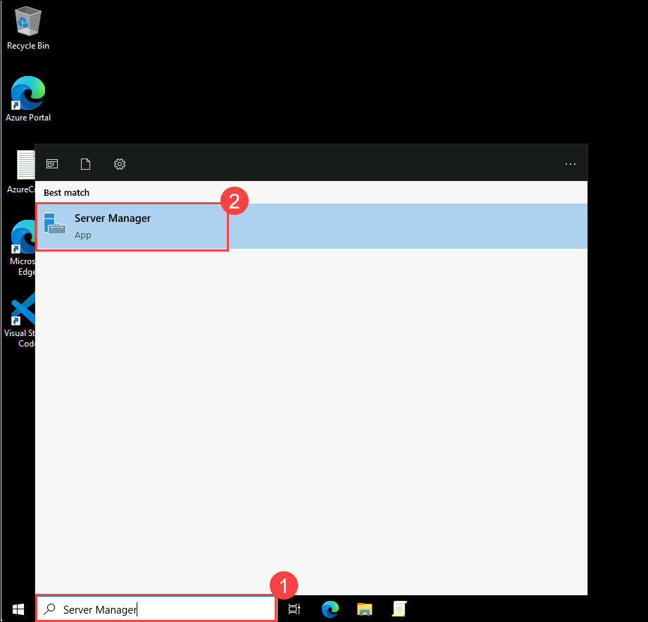

2. Launch the **Add Roles and Features Wizard**:
   - In Server Manager, click **Manage** in the top-right corner, then select **Add Roles and Features**.

      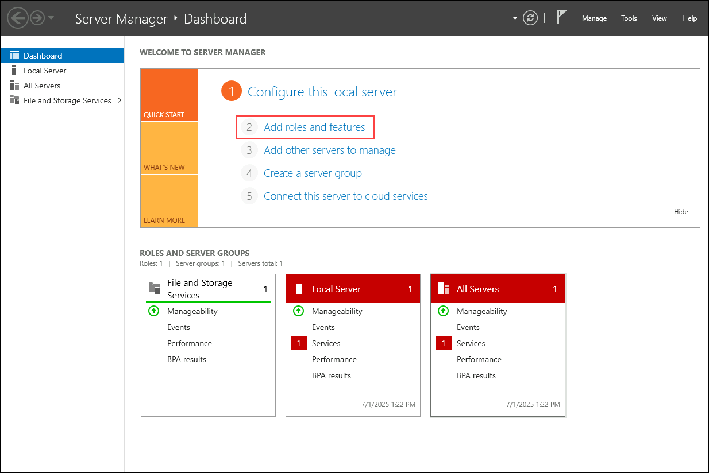

3. Configure the Wizard:
   - Select **Role-based or feature-based installation**, then click **Next**.
   - Choose your server from the server pool, then click **Next**.
   - In the "Server Roles" list, check **Active Directory Domain Services**.

      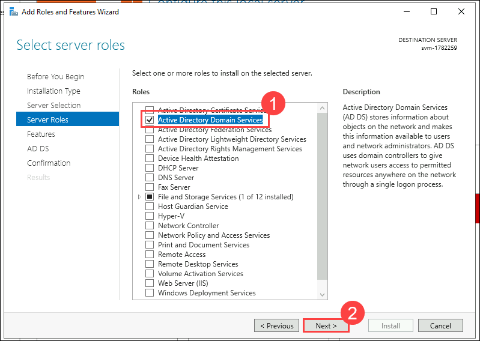

   - When prompted, click **Add Features** to include required tools, then click **Next**.
   - Skip the "Features" page by clicking **Next**.
   - Review the AD DS information page, then click **Next**.
   - Confirm your selections and click **Install**.
   - Wait for the installation to complete and click on **Close**.

      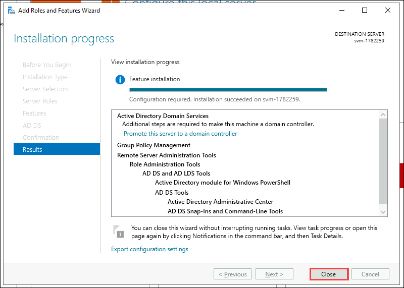

   > **Note:** Do not close Server Manager after installation; the next step begins from there.

1. In Server Manager, click the yellow notification flag and select **Promote this server to a domain controller**.

      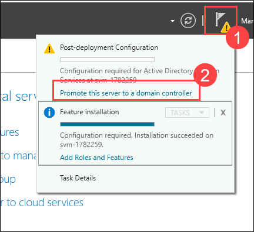

1. In the wizard, select **Add a new forest** and enter the root domain name as `defenderxdr.internal`, then click **Next**.

      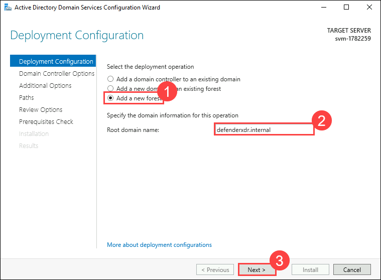

1. Set Domain Controller Options:
   - Set both **Forest Functional Level** and **Domain Functional Level** to **Windows Server 2016** (or your server’s version).
   - Ensure **Domain Name System (DNS) server** is checked.
   - Enter a **Directory Services Restore Mode (DSRM)** password (e.g., `P@ssw0rd123!`), then click **Next**.

      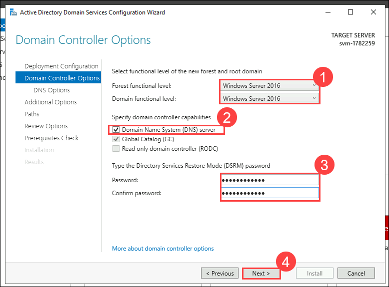

   - Ignore DNS delegation warnings, click on **Next**.
   - Accept the default **NetBIOS domain name** `DEFENDERXDR`, then click **Next**.

      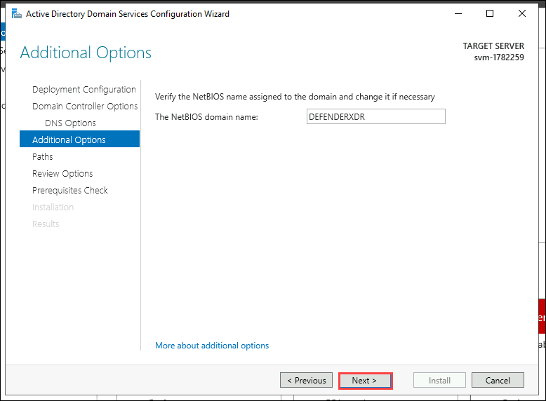

   - Use default paths for the AD DS database, logs, and SYSVOL, then click **Next**.
   - Review your selections, then click **Next**.
   - Wait for the prerequisites check to complete, then click **Install**.
   - Wait for the process to complete; the server will restart automatically.

      > **Note:** The VM will restart now, wait for 5 minutes and **Reconnect** to the VM.

      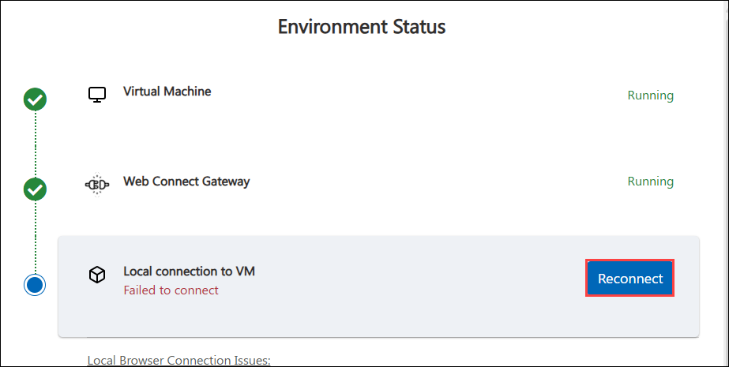

1. Sign in to the Microsoft Defender Portal, open a Edge browser and navigate to `security.microsoft.com`.

   - If you see the **Sign in to Microsoft Azure** tab, you will see the login screen. Enter the following email/username, and click on **Next**.

   * **Email/Username:** <inject key="AzureAdUserEmail"></inject>
     
      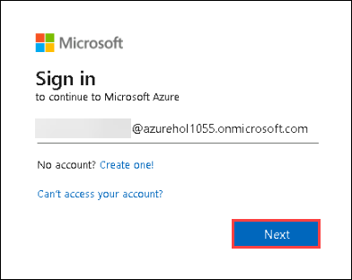

   - Now enter the following password and click on **Sign in**.
   
   * **Password:** <inject key="AzureAdUserPassword"></inject>

     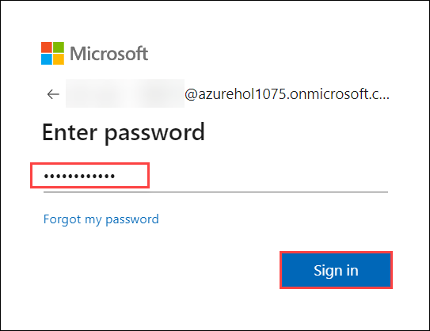 

      >**Note:** Take a moment to allow the option panel to fully load on the security portal.
      
1. On the Microsoft Defender page, select **Settings** and select **Identities** and you will be navigated to **Microsoft Defender for Identity** page.

      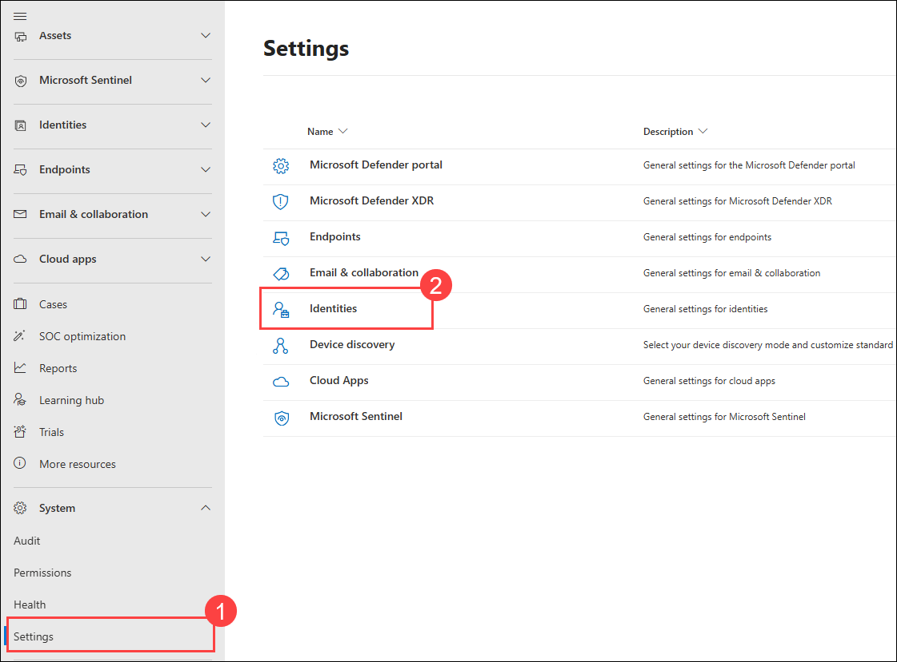

      >**Note:** Please wait while the **identities** page loads—this may take a few minutes.

1. Click on **Sensors** at the top, then select **Add sensor** in the top-right corner. On the **Simplify your installation process** pop-up, click **Continue with classic sensor**.

      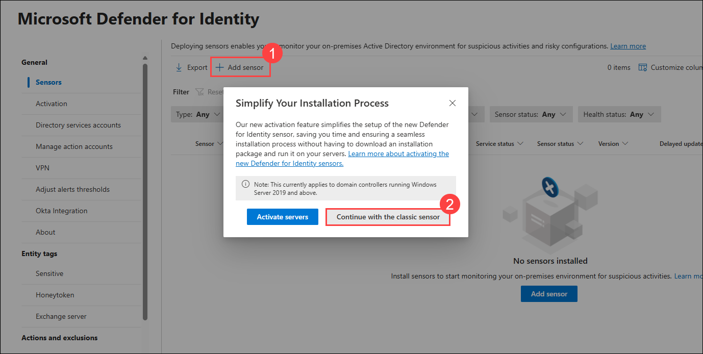

1. A pop-up will display a **Download installer** button and an **Access key**. Click **Download installer** to download `Azure ATP Sensor Setup.zip` and copy the **Access key** to your clipboard which will be used during the installation.

      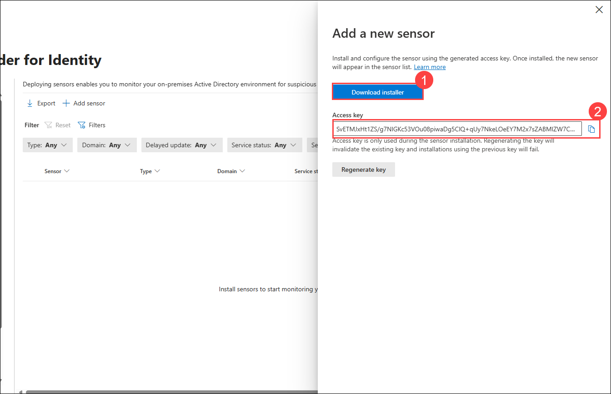
      > **Note:** If you do not see that the file is downloading, click on the pop-up window button and then select Always allow pop-ups and redirects from `https://security.microsoft.com`and click on **Done** and **download** the file again

      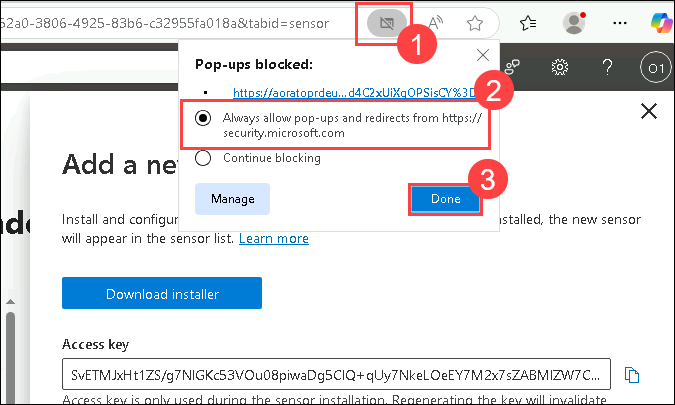

1. From your VM, navigate to the downloaded `Azure ATP Sensor Setup.zip` file in the **Downloads** folder, extract it to `C:\ATP`, and run `Azure ATP Sensor Setup.exe` as administrator.

      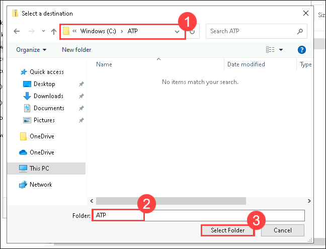
    > **Note:** If the `ATP` folder does not exist in `C:\`, click on **New** > **Create new folder**, name it **ATP**, and then extract the files.

      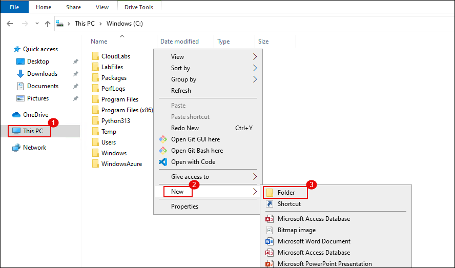

1. On the Setup wizard follow the below steps:
     - Accept the license terms and click **Next**.
     - Enter the **Access key** copied earlier and click **Next**.
         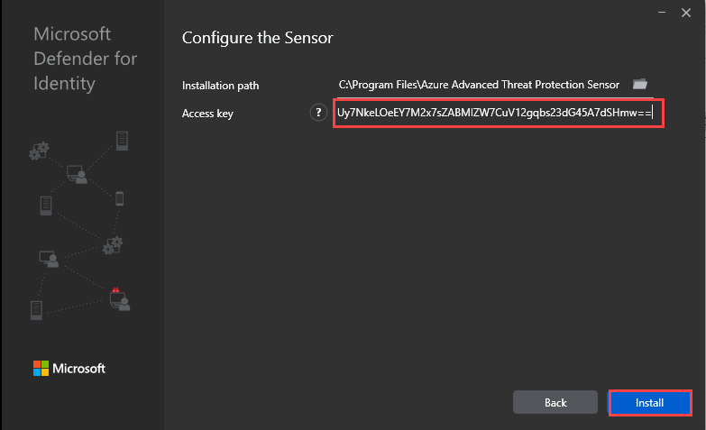

     - Choose the default installation path (e.g., `C:\Program Files\Azure Advanced Threat Protection Sensor`) and click **Install**.
   - Wait for the installation to complete.

1. Return to the Microsoft Defender portal, go to **Settings** > **Identities** > **Sensors**, find the sensor for `defenderxdr.internal`, and verify that the **Status** shows **Running** within 5–10 minutes.

## Review

In this lab, you have completed the following tasks:

- Verified sensor health and ensured identity telemetry was active in the Defender portal.

### You have successfully completed the lab. Click on **Next >>** to proceed with the next Lab.

