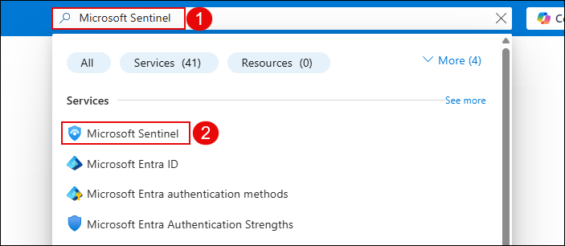
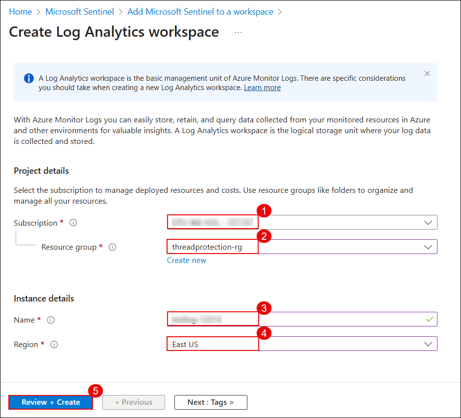
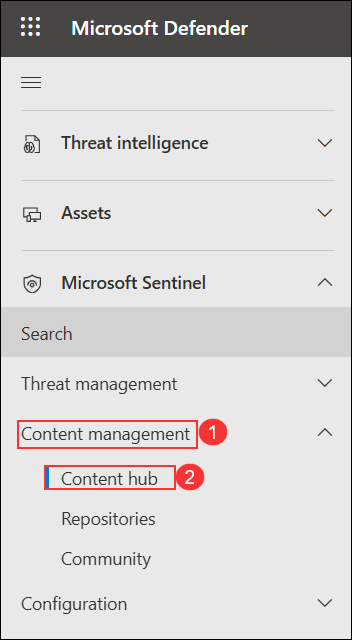

# Lab 16: Integrate Defender for Identity with Microsoft 365 Defender Portal

In this task you will enable integration to view Defender for Identity incidents in the unified Microsoft 365 Defender portal and Microsoft Sentinel.

1. In the **Azure portal**, search for **Microsoft Sentinel (1)** in the top search bar and click **Microsoft Sentinel (2)** under the Services section.

   

   > **Note:** If there is **no Sentinel deployed yet**, follow the steps from **Step 2 to Step 8** to create and connect a new workspace. 

   > If Sentinel is already set up, you can **skip to Step 9** and continue from there.

1. On the **Microsoft Sentinel** page, click **+ Create** to start setting up a new Sentinel resource or workspace configuration.

   

1. On the **Add Microsoft Sentinel to a workspace** page, click **+ Create a new workspace** to begin provisioning a Log Analytics workspace for Sentinel.

   

1. On the **Create Log Analytics workspace** page, configure the following settings:

   - Select the defualt **Subscription (1)**.
   - Choose **threadprotection-rg (2)** as the Resource group.
   - Enter a unique name for the workspace, **loganalyticworkspace (3)**.
   - Select **East US (4)** as the Region.
   - Click **Review + Create (5)** to proceed.

      

1. After validation passes, review the workspace details and click **Create** to deploy the Log Analytics workspace.

   

1. Once the workspace is created, return to **Microsoft Sentinel**. On the Sentinel page, click **+ Create** again.

   

1. On the **Add Microsoft Sentinel to a workspace** page, select the newly created workspace **loganalyticworkspace (1)** and click **Add (2)** to onboard it to Microsoft Sentinel.

   

1. Navigate to `https://security.microsoft.com`. In the **Microsoft Defender** portal, expand **Content management (1)** under the **Microsoft Sentinel** section, and then click **Content hub (2)**.

   

1. On the **Content hub** page, search for **Defender for XDR (1)**, select **Microsoft Defender XDR (2)** from the results, and then click **Install (3)** to add the solution. 

   

   

1. In the **Microsoft Sentinel** section, expand **Configuration (1)**, select **Automation (2)**, and then click **Configure permissions (3)**. 

   

1. On the **Manage permissions** pane, select all resource groups including **threadprotection-rg** **1** by checking the boxes on the left. Then click **Apply 2** to grant Microsoft Sentinel permission to run playbooks in those resource groups.

   

## Review

In this lab, you have completed the following tasks:

- Integrated Defender for Identity with Microsoft 365 Defender and Microsoft Sentinel for centralized threat visibility.

### You have successfully completed the lab. Click on **Next >>** to proceed with the next Lab.

