# Lab 18: Automate Response with Power Automate and Microsoft Sentinel

### Task 1: Create a SharePoint site and custom list to store incident logs

In this task, you'll create a SharePoint communication site named `Incident_Logs` and set up a list called `Powershell_Logs_list`. This list will be used to log incident details such as flagged emails via Power Automate.

1. On the **SharePoint home page**, click **Create site** from the top menu.

   

1. On the **Select the site type** screen, choose **Communication site**.

   

1. Under **Select a template**, click **Standard communication**.

   

1. On the template preview screen, click **Use template**.

   

1. Enter **Incident_Logs** as the **Site name** **(1)**, then click **Next** **(2)**.

   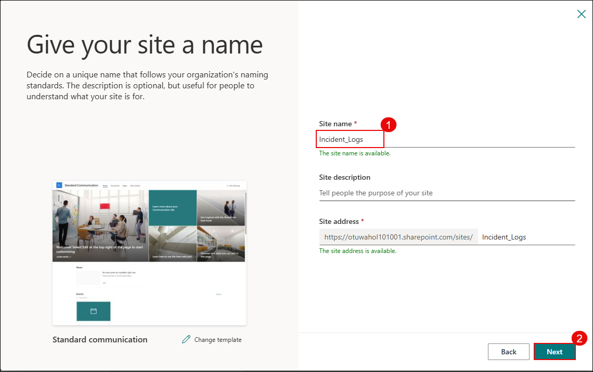

1. On the **Set language and other options** screen, keep the default language as **English** **(1)** and click **Create site** **(2)**.

   

1. After the site is created, click **New (1)** and select **List (2)** from the dropdown to begin creating a custom list.

   

1. In the **How would you like to start?** dialog, select **List** under **Create from blank**.

   

1. Name the list as **Powershell_Logs_list** **(1)** and click **Create** **(2)**.

   

1. On the newly created list page, click **+ Add column** to begin adding custom fields to the list.

   

1. In the **Create a column** pane, choose **Text** as the column type **(1)** and click **Next** **(2)**.

   

1. Enter **Flagged by** as the column name **(1)** and click **Save** **(2)**.

   

1. Repeat the previous steps to add the following columns:

    - **Email Body** (Multiple lines of Text)
    - **Message ID** (Text)
    - **Flagged Date** (Date and time)

      

## Task 2: Create a Microsoft Sentinel Playbook to Notify SOC

In this task, you will create a Sentinel playbook named **Notify-SOC-OnPowerShellIncident** using Logic Apps. The playbook will trigger from a Sentinel incident and send an email to the SOC team containing dynamic incident details such as title, severity, status, and more.

1. On the **Microsoft Defender** page, in the left-hand menu, Under **Microsoft Sentinal** expand **Configuration (1)** and click **Automation (2)**. On the **Automation** page, click **Create (3)** and select **Playbook with incident trigger (4)** from the dropdown menu.

   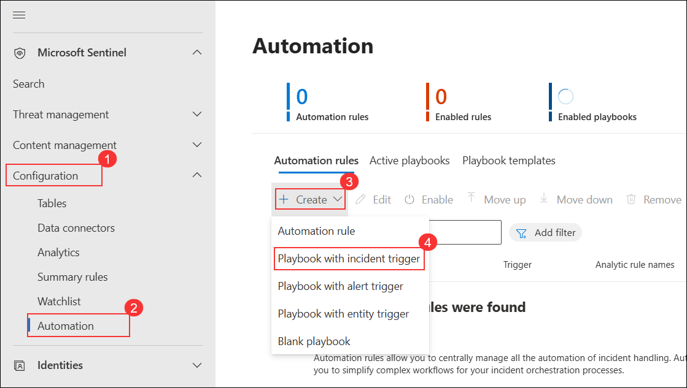

1. On the **Create playbook** pane, configure the following:
   - Select your **Subscription (1)**.
   - Choose **threadprotection-rg (2)** as the Resource group.
   - Enter **Notify-SOC-OnPowerShellIncident (3)** as the Playbook name.
   - Check the box to **Enable diagnostics logs in Log Analytics (4)**.
   - Select **LAW-Sentinel-Demo (5)** as the Log Analytics workspace.
   - Click **Next: Connections > (6)** to proceed.
      
      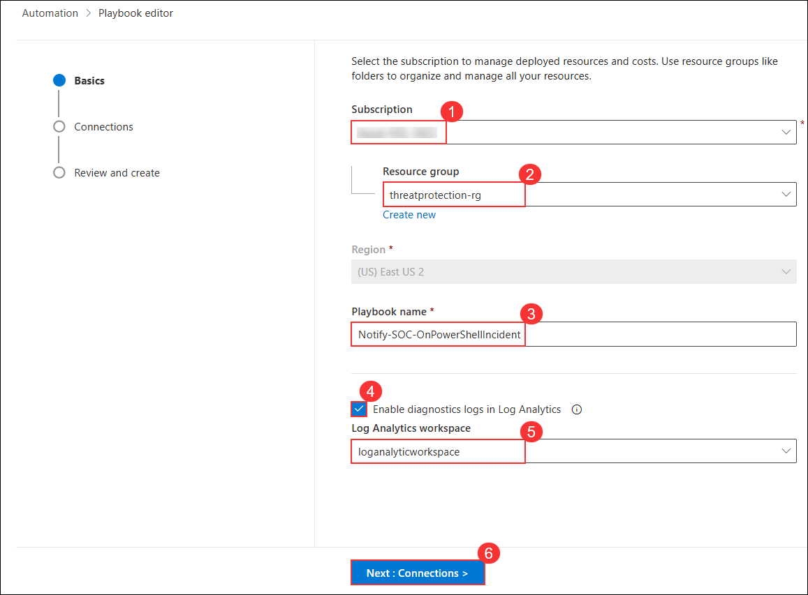

1. On the **Connections** tab, leave the default connection settings as-is and click **Next: Review and create >**.

   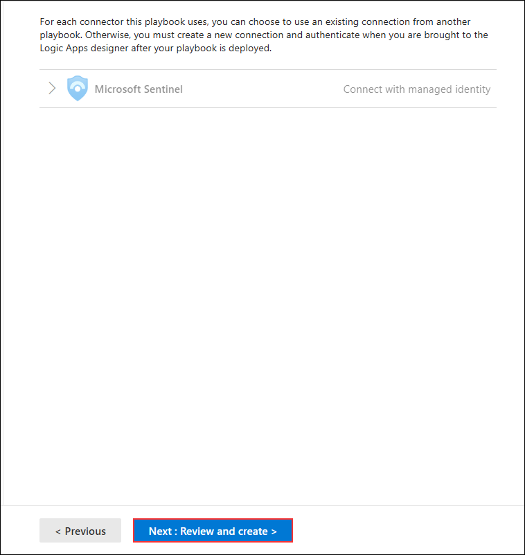

1. On the **Review and create** tab, verify the playbook details including subscription, resource group, name, and connection settings. Once confirmed, click **Create playbook** to deploy.

   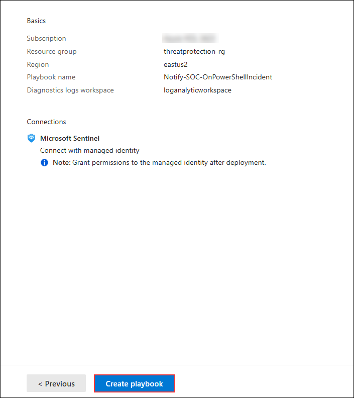

1. Review the playbook details and click **Close and go to playbook** to proceed.

   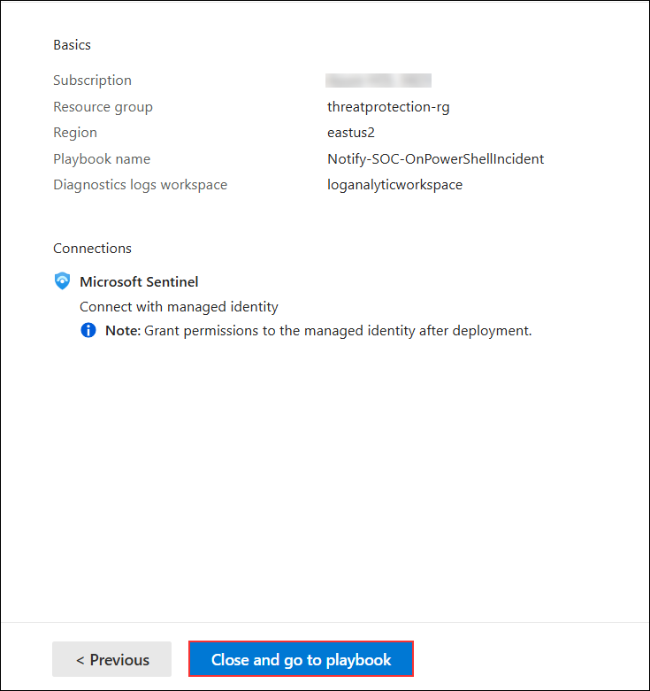

1. After the playbook is created, go to the **Logic app designer (1)** under **Development Tools** in the left-hand menu.  In the designer view, click **Add an action (2)** below the **Microsoft Sentinel incident** trigger.

   

1. On the **Add an action** pane, search for **Send an email (V2) (1)**. Under **Office 365 Outlook**, click **Send an email (V2) (2)** to select the action.

   

1. When prompted to create a new connection, click **Sign in** to authenticate with Office 365 Outlook.

   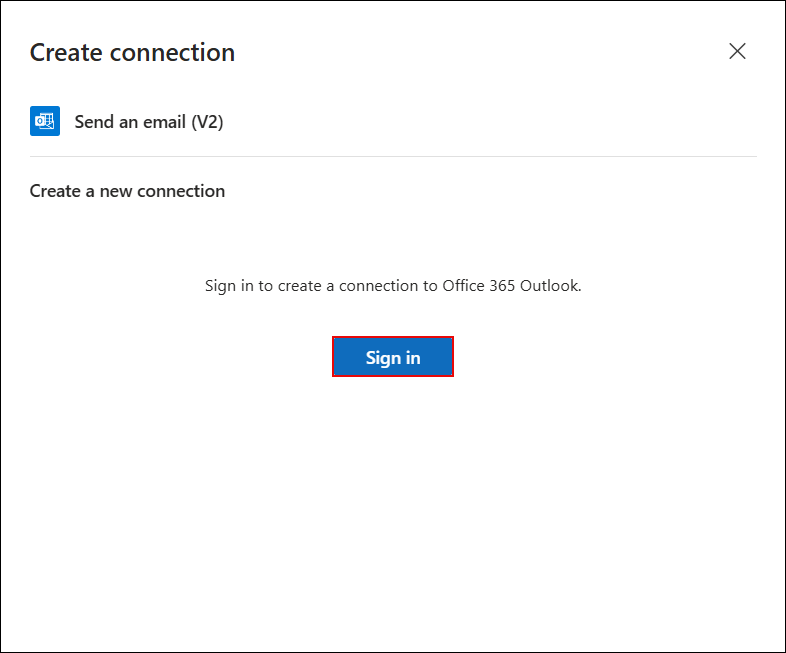

1. On the **Pick an account** screen, select the **ODL_User** account that matches the email used in the playbook.

   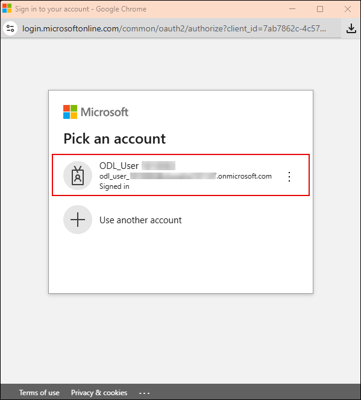

1. In the **Body** field, begin entering the incident metadata using the following format:
   
   - In the **To** **(1)** field, enter the ODL user email (`odl_user_xxxonmicrosoft.com`).
   - In the **Subject** **(2)** field, enter:  
     ```
     [Sentinel] Incident: <Incident Title> - Severity: <Severity>
     ```

      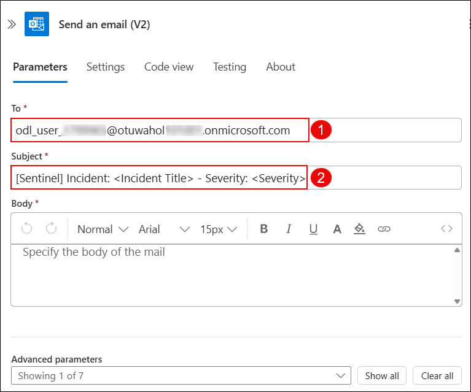

1. In the **Subject** field, select the placeholder text **Incident Title (1)**. Then, click the **dynamic content icon (2)** to open the list of available variables.

   

1. In the dynamic content popup, search for **Incident Title (1)**. From the list under **Microsoft Sentinel incident**, click **Incident Title (2)** to insert it into the Subject field.

   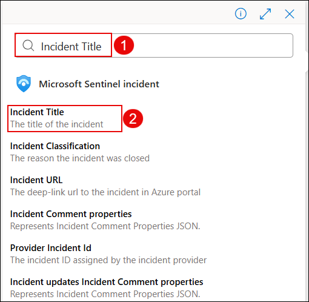

1. Next, in the **Subject** field, select the placeholder **Severity** **(1)** and click the **dynamic content icon (2)** to open the variable list.

   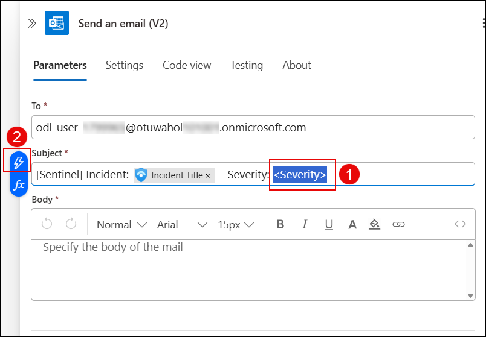

1. In the dynamic content popup, search for **Incident Severity (1)** and select **Incident Severity (2)** from the Microsoft Sentinel incident list to insert it into the Subject field.

    

1. In the **Body** field, enter the following labels and insert the matching dynamic content values next to each:

    ```
    Alert: Incident Title
    Severity: Incident Severity
    Status: Incident Status
    Entities: Entities
    Link: Incident URL
    ```
   Then insert each of the corresponding dynamic content values.

   

   > **Note:** Your final result should look like this, with all dynamic fields added.   

1. On the **Logic App Designer** toolbar, click **Save** to save the playbook.

    

1. The playbook named **Notify-SOC-OnPowerShellIncident** is now configured to notify SOC teams via email whenever a Sentinel incident is triggered.

    > **Note:** You can now link this playbook to an analytics rule as an automated response to PowerShell-based attacks or similar alerts.


## Task 3: Create Analytics Rule and Trigger Playbook using Microsoft Sentinel

In this task, you'll configure an analytics rule in Microsoft Sentinel to detect suspicious PowerShell activity and trigger an automated playbook when an incident is created.

1. In the **Microsoft Sentinel** in the Defender Portal, go to **Configuration (1)** > **Analytics (2)** and click **+ Create (3)** > **Scheduled query rule (4)**.

   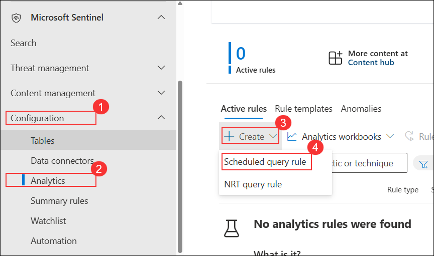

1. On the **Analytics rule wizard**, configure the General settings:
   - Enter **Suspicious PowerShell Execution (1)** as the rule name.
   - Set **Severity (2)** to `High`.
   - Select **Lateral Movement (3)** under MITRE ATT&CK.
   - Ensure **Status (4)** is set to `Enabled`.
   - Click **Next: Set rule logic (5)**.

      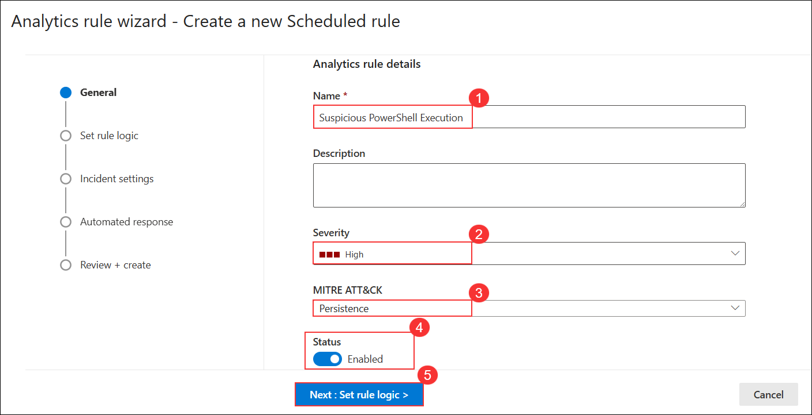

1. On the **Set rule logic** tab:
   - Paste the following KQL under **Rule query (1)**:
     ```
     SecurityAlert
     | where TimeGenerated > ago(5m)
     | where AlertName has "Suspicious Powershell commandline"
     | where ProductName == "Microsoft Defender Advanced Threat Protection"
     | where AlertSeverity != "Informational"
         or (AlertSeverity == "Informational" and DisplayName startswith "[Test Alert]")
     ```
   - Under **Alert enhancement**, set **Entity mapping (2)**:
     - Entity type: `Host`
     - Identifier: `HostName` → `CompromisedEntity`

         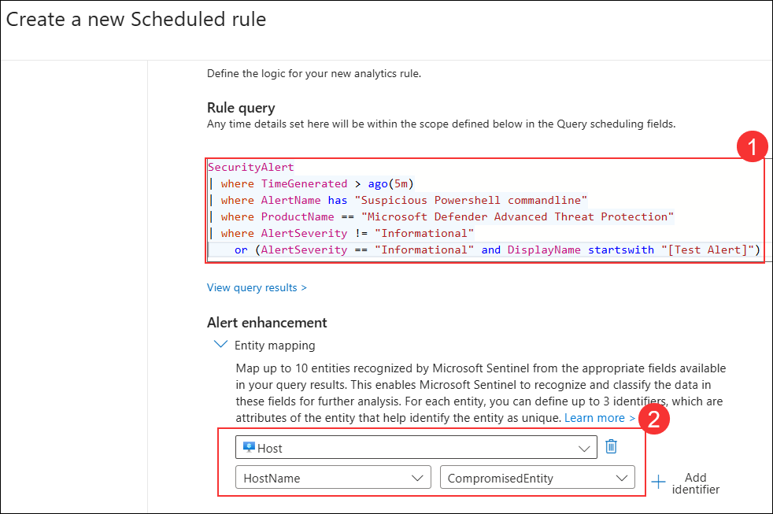

1. Scroll down to **Query scheduling**:
   - Set **Run query every (3)**: `5` Minutes
   - Set **Lookup data from the last (4)**: `6` Minutes
   - Choose **Automatically (5)** for start running
   - Click **Next: Incident settings (6)**

      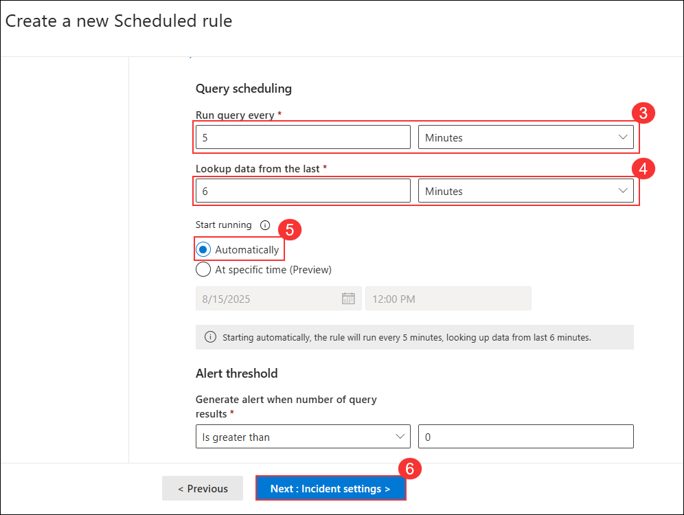

1. On the **Incident Settings** tab, click **Automated response**.

      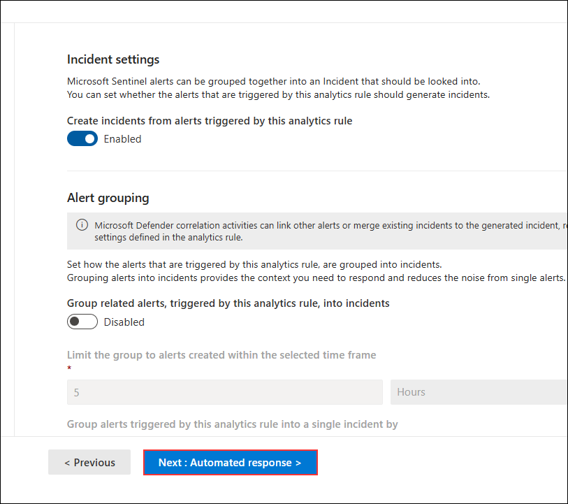

1. On the **Automated response** tab, click **+ Add new** to create a new automation rule.

      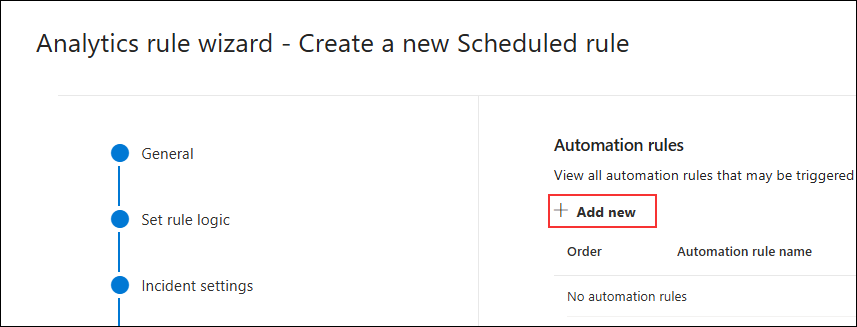

1. In the **Create new automation rule** window:
   - Set **Automation rule name (1)**: `Run Notify-SOC-OnPowerShellIncident Playbook`
   - Under **Trigger (2)**: Select `When incident is created`
   - Click **+ Add (3)** and select **Condition (And) (4)**

      

1. Configure the condition and action:
   - Set condition:
     - Property: `Title (1)`
     - Operation: `Contains (2)`
     - Value: `PowerShell (3)`
   - Under **Actions**, select **Run playbook (4)** and choose:
     - `Notify-SOC-OnPowerShellIncident (5)` from your `threadprotection-rg` resource group.
   - Click **Apply (6)**

      

1. In the Windows search bar of the virtual machine, type **CMD**, and choose **Run as Administrator** from the right pane for the Command Prompt app.

1. When the "User Account Control" window appears, select **Yes** to allow the app to run. 

1. Paste the script by right-clicking in the **Administrator: Command Prompt** window and press **Enter** to run it. **Note:** The window closes automatically after running the script.

1. The configured automation rule will now run the playbook when an incident title contains `PowerShell`. Once triggered, an email notification is sent with incident details including severity, entities, and incident link.

   

   > **Note:** Wait for 5–6 minutes for the playbook to trigger after the condition is met.


### Task 4: Create a Power Automate Flow to Log Flagged Emails into SharePoint

In this task, you'll create a flow in Power Automate that triggers when an email is flagged in Outlook and logs its details (subject, sender, body, etc.) into the SharePoint list you created earlier.

1. On the **Power Automate portal**, click **Create (1)** in the left menu and select **Automated cloud flow (2)**.

   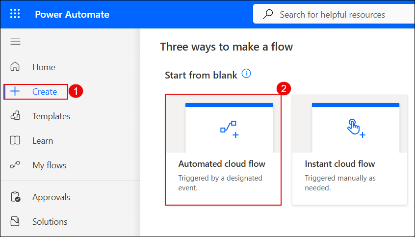

1. In the **Build an automated cloud flow** window:
   - Enter **Automate Flagged Mail** as the **Flow name (1)**.
   - Search and select **When an email is flagged (V3)** as the trigger **(2, 3)**.
   - Click **Create (4)** to proceed.

      

1. On the flow canvas, click the **+** icon below the trigger to add a new action.

   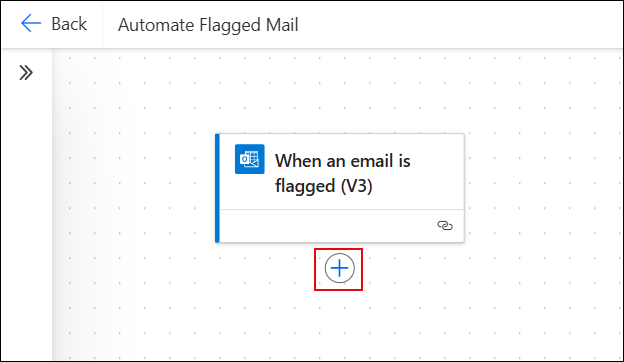

1. In the **Add an action** pane:
   - Search for **Get email (V2)** **(1)**.
   - Select **Get email (V2)** from **Office 365 Outlook** **(2)**.

      

1. In the **Get email (V2)** action, under **Message Id**, click the field **(1)** and select **Insert dynamic content (2)**.

   

1. In the dynamic content pane, search for **Message Id (1)** and select the field from **When an email is flagged (V3)** **(2)**.

   

1. Verify that **Message Id** is now populated dynamically. Leave the other default values as-is.

   

1. Click the **+ (1)** icon below the **Get email (V2)** step to add another action.

   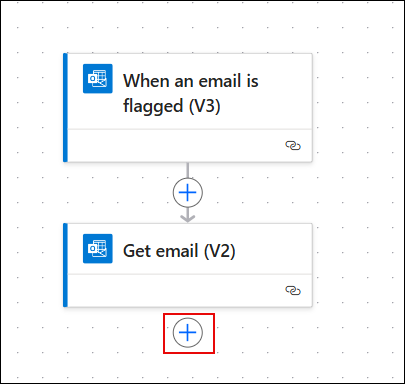

1. Search for **Create item (1)** and select it under **SharePoint (2)**.

   

1. In the **Create item** action:
    - Set **Site Address** to your SharePoint site (e.g., `Incident_Logs`) **(1)**.
    - Set **List Name** to `Powershell_Logs_list` **(2)**.
    - Expand **Advanced parameters** to view list columns **(3)**.

      

1. Select the following fields to display: **Title**, **Flagged by**, **Email Body**, **Message ID**, and **Flagged Date**.

   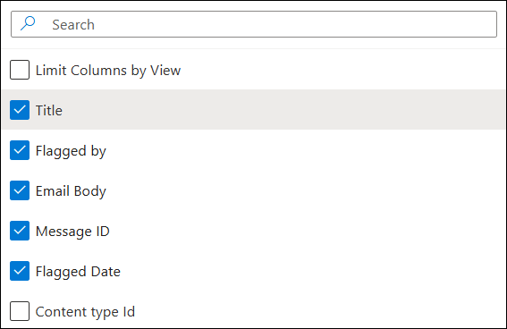

1. In the **Title** field, click inside and select **Insert dynamic content (2)**.

   

1. From the dynamic content pane, search for **Subject** and select it from either trigger or action.

   

1. Fill in the remaining fields as follows:
    - **Title**: `Subject`
    - **Flagged by**: `From`
    - **Email Body**: `Body`
    - **Message ID**: `Internet Message Id`
    - **Flagged Date**: `Received Time`

      

   > **Note:** Use the dynamic content from **Get email (V2)** wherever possible for more complete data.  
   > **Important:** The **Body** field might store raw HTML — use additional processing if formatting is needed.

1. Once the flow is complete, click **Save** in the top-right corner.

   

1. In the Windows search bar of the virtual machine, type **CMD**, and choose **Run as Administrator** from the right pane for the Command Prompt app.

1. When the "User Account Control" window appears, select **Yes** to allow the app to run. 

1. Paste the script by right-clicking in the **Administrator: Command Prompt** window and press **Enter** to run it. **Note:** The window closes automatically after running the script.

1. Now go to your Outlook mailbox and flag an email you want to test the flow with.

   

   > **Note:** Wait for 5–6 minutes for the playbook to trigger after the condition is met.

1. Go to the **Powershell_Logs_list** on your SharePoint site and verify that the email entry appears with all details logged.

   

   > **Tip:** You can further extend this flow by notifying the SOC via Teams or email, or even triggering an Azure Logic App or Defender investigation.

> **Congratulations** on completing the task! Now, it's time to validate it. Here are the steps:
> - Hit the Validate button for the corresponding task. If you receive a success message, you can proceed to the next task. 
> - If not, carefully read the error message and retry the step, following the instructions in the lab guide.
> - If you need any assistance, please contact us at cloudlabs-support@spektrasystems.com. We are available 24/7 to help you out.
<validation step="94eca9d3-0a24-4b20-8a82-95818f1fac73" />

## Review

In this exercise, you completed a comprehensive automated incident response setup using Microsoft Defender XDR, Microsoft Sentinel, Power Automate, and SharePoint:
 
- Created a SharePoint communication site and a custom list to store metadata from flagged Outlook emails.  
- Built a Power Automate flow to log flagged email details into the SharePoint list in real-time.  
- Designed and configured a Microsoft Sentinel playbook using Logic Apps to notify SOC teams via email when incidents are triggered.  
- Created a custom analytics rule in Sentinel to detect suspicious PowerShell executions and trigger the response playbook automatically.

You now have a fully operational, low-touch detection-to-response workflow that logs, notifies, and remediates threats across Microsoft’s security stack.

### You have successfully completed the lab.
